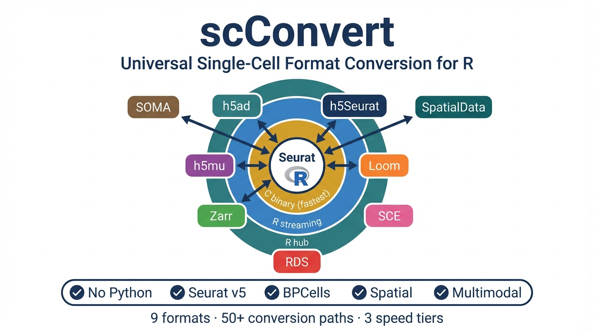

<!-- README.md is generated from README.Rmd. Please edit that file -->

# scConvert 

<!-- badges: start -->

[](https://CRAN.R-project.org/package=scConvert)
[](https://github.com/mianaz/scConvert)
[](https://github.com/mianaz/scConvert/actions/workflows/r-cmd-check.yaml)
[](https://codecov.io/gh/mianaz/scConvert)
<!-- badges: end -->

**Universal single-cell format conversion for R. No Python required.**

scConvert converts between **9 single-cell data formats** through a hub
architecture using Seurat as a universal intermediate, providing **50+
conversion paths** from a single `scConvert()` interface.

## Supported Formats

| Format               | Extension   | Ecosystem          | Read | Write |
|----------------------|-------------|--------------------|:----:|:-----:|
| AnnData              | `.h5ad`     | scanpy / CELLxGENE | yes  |  yes  |
| h5Seurat             | `.h5Seurat` | Seurat             | yes  |  yes  |
| MuData               | `.h5mu`     | muon / multimodal  | yes  |  yes  |
| Loom                 | `.loom`     | loompy / HCA       | yes  |  yes  |
| Zarr                 | `.zarr`     | cloud AnnData      | yes  |  yes  |
| TileDB-SOMA          | `soma://`   | CELLxGENE Census   | yes  |  yes  |
| SpatialData          | `.zarr`     | scverse spatial    | yes  |  yes  |
| RDS                  | `.rds`      | R native           | yes  |  yes  |
| SingleCellExperiment | in-memory   | Bioconductor       | yes  |   –   |

## Installation

``` r
# Install from GitHub
devtools::install_github("mianaz/scConvert")
```

## Quick Start

``` r
library(scConvert)

# One-line conversion between any format pair
scConvert("data.h5ad", dest = "h5seurat")
scConvert("data.h5mu", dest = "rds")
scConvert(seurat_obj, dest = "output.h5ad")

# Direct h5ad loading with full metadata preservation
obj <- readH5AD("data.h5ad")

# Memory-efficient atlas-scale loading via BPCells
obj <- readH5AD("atlas_1M_cells.h5ad", use.bpcells = TRUE)

# Multimodal (CITE-seq, ATAC+RNA) support
obj <- readH5MU("citeseq.h5mu")   # auto-maps rna->RNA, prot->ADT
writeH5MU(obj, "output.h5mu")

# TileDB-SOMA (CELLxGENE Census)
obj <- readSOMA("soma://collection/measurement")
writeSOMA(obj, "output.soma")

# SpatialData zarr stores
obj <- readSpatialData("experiment.spatialdata.zarr")
writeSpatialData(obj, "output.spatialdata.zarr")
```

## Hub Architecture

Three conversion tiers provide optimal speed for each format pair:

                      ┌─── h5ad ───┐
                      │      ╎     │
                      ├─── h5Seurat│
                      │      ╎     ├── C CLI (fastest, streaming)
       ┌────────┐     ├─── h5mu ───┤
       │ Seurat │─────┤      ╎     │
       └────────┘     ├─── Loom ───┘
                      │
                      ├─── Zarr ········ R streaming (no Seurat)
                      │
                      ├─── TileDB-SOMA
                      │
                      ├─── SpatialData
                      │
                      ├─── RDS
                      │
                      └─── SCE (Bioconductor)

       ─── hub path (via Seurat)
       ╎╎╎ direct HDF5 streaming (no intermediate)
       ··· R streaming via temp h5seurat

- **C CLI**: All HDF5 pairs (h5ad, h5Seurat, h5mu, Loom) – streaming,
  constant memory
- **R streaming**: Direct format-to-format without materializing a
  Seurat object
- **Hub path**: Load → Seurat → Save for RDS, SCE, and cross-tier pairs

## Key Features

| Feature | Description |
|----|----|
| **No Python** | Pure R via hdf5r. No reticulate, no conda environments. |
| **Seurat v5** | Full Assay5 support with layered counts/data/scale.data. |
| **Spatial** | Visium roundtrip with image reconstruction and scale factors. |
| **SpatialData** | Read/write scverse SpatialData zarr stores with OME-NGFF images. |
| **Multimodal** | Native h5mu read/write for CITE-seq, ATAC+RNA, etc. |
| **TileDB-SOMA** | Read/write SOMA for CELLxGENE Census interoperability. |
| **BPCells** | On-disk matrix loading – 87% memory reduction at atlas scale. |
| **C CLI** | Standalone binary for streaming on-disk HDF5 conversion. |

## Performance

Synthetic sparse h5ad (20K genes, 5% density), median of 3 runs:

| Operation              | 100K cells | 500K cells | Comparison                    |
|------------------------|------------|------------|-------------------------------|
| Read h5ad              | 2.56 s     | 12.68 s    | Native C reader + Seurat      |
| Write h5ad (gzip=0)    | 0.61 s     | 3.29 s     | C writer, 17× faster          |
| Write h5ad (gzip=1)    | 6.03 s     | 30.66 s    | C writer, compressed          |
| Write h5ad (old R)     | 10.49 s    | 52.32 s    | R/hdf5r, gzip=4              |
| CLI (h5ad ↔ h5seurat)  | 0.19 s     | 0.63 s     | Streaming, constant memory    |

The C writer writes h5ad directly via `.Call()`, using the zero-copy
CSC↔CSR reinterpretation (no sparse transpose needed). Use `gzip = 0` for
local/temporary files (6× faster), `gzip = 1` for a good speed/size balance
(252 MB vs 1.2 GB at 100K cells). BPCells on-disk loading (`use.bpcells`)
reduces memory by ~87% at atlas scale. Benchmarked on Apple M4 Max, 128 GB
RAM.

## Command-Line Interface

A standalone C binary for HDF5-based conversions (h5ad, h5Seurat, h5mu,
Loom) without R or Python:

``` bash
# Build (requires HDF5 headers)
cd src && make -f Makefile.cli

# Optional: install into the R package tree so `library(scConvert)` picks it up
make -f Makefile.cli install-bin   # copies to ../inst/bin/scconvert

# Convert between any HDF5 format pair
./scconvert data.h5ad data.h5seurat
./scconvert data.h5seurat data.h5ad --assay RNA
./scconvert multimodal.h5mu multimodal.h5seurat
./scconvert data.h5ad data.loom
./scconvert data.loom data.h5seurat
```

Options: `--assay <name>`, `--gzip <0-9>`, `--overwrite`, `--quiet`,
`--version`, `--help`

## Documentation

- [Conversions: h5Seurat and
  AnnData](https://mianaz.github.io/scConvert/articles/convert-anndata.html)
- [Getting
  Started](https://mianaz.github.io/scConvert/articles/getting-started.html)
- [Multimodal
  H5MU](https://mianaz.github.io/scConvert/articles/multimodal-h5mu.html)
- [Loom
  Format](https://mianaz.github.io/scConvert/articles/convert-loom.html)
- [Zarr
  Format](https://mianaz.github.io/scConvert/articles/convert-zarr.html)
- [Spatial
  Technologies](https://mianaz.github.io/scConvert/articles/spatial-technologies.html)
- [CLI
  Usage](https://mianaz.github.io/scConvert/articles/cli-usage.html)
- [h5Seurat
  Specification](https://mianaz.github.io/scConvert/articles/h5Seurat-spec.html)

## Citation

If you use scConvert in your research, please cite:

> Zeng Z. scConvert: a pure R, universal converter for single-cell data
> formats. *bioRxiv* (2026).

## License

GPL-3
