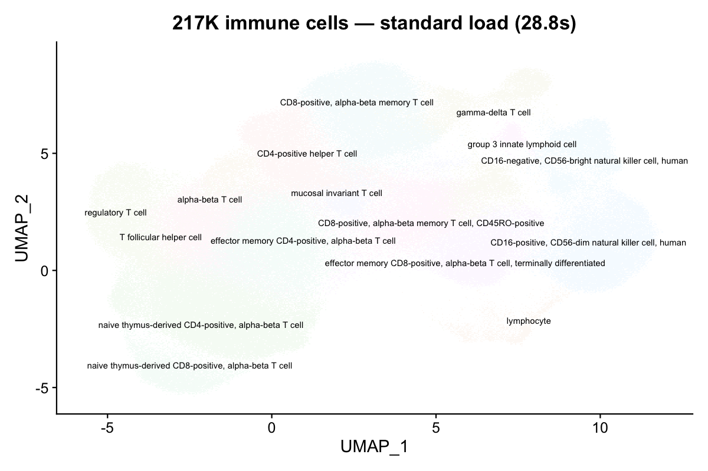
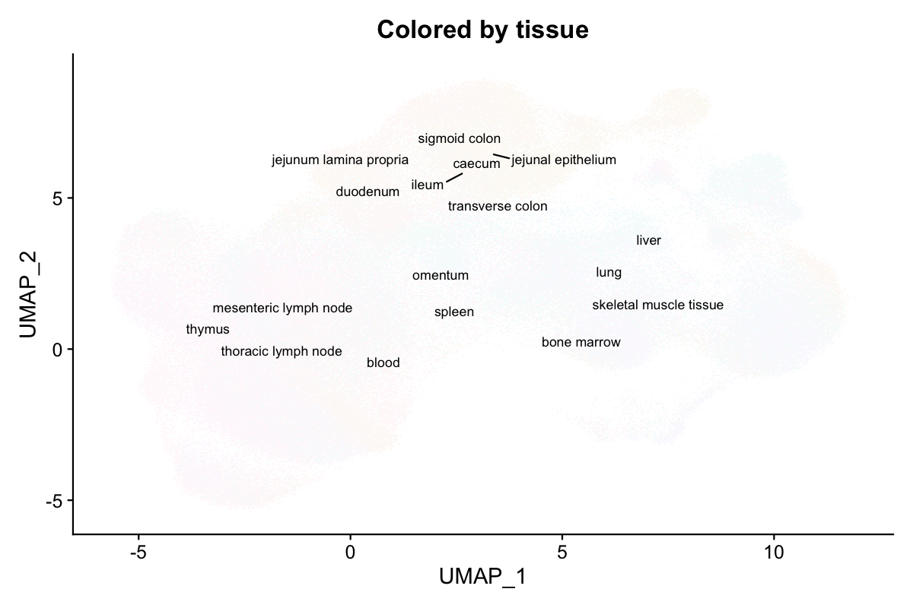
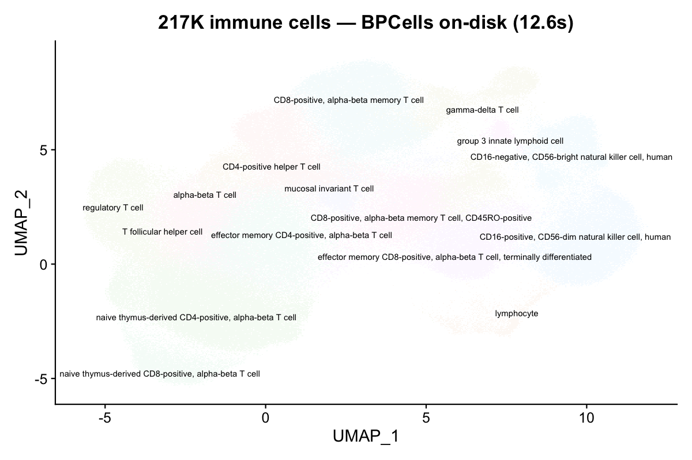
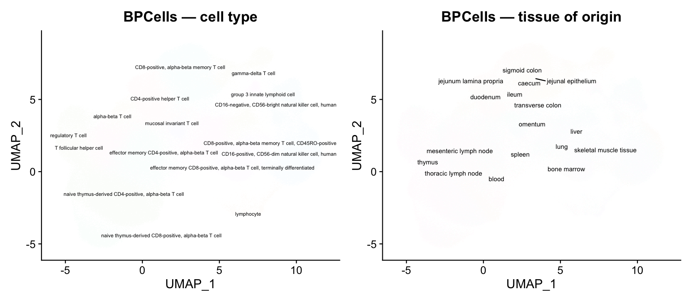
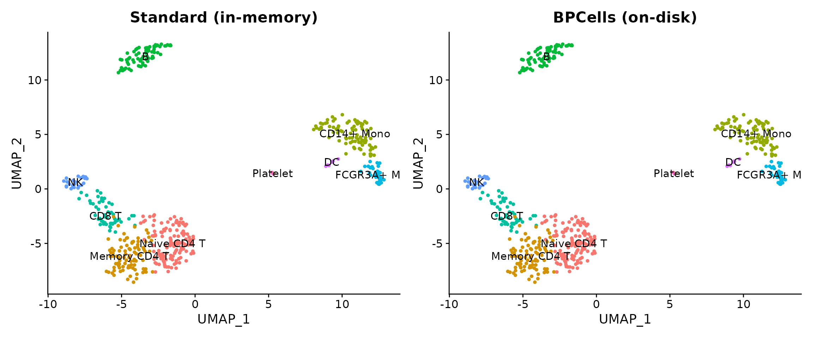

# Atlas-Scale Datasets with BPCells

``` r

library(scConvert)
library(Seurat)
library(ggplot2)
```

When datasets grow beyond 100K cells, in-memory loading can exhaust
available RAM. scConvert integrates with
[BPCells](https://github.com/bnprks/BPCells) to keep expression matrices
on disk while still enabling full Seurat workflows. This vignette
demonstrates loading a real atlas-scale dataset from [CELLxGENE
Discover](https://cellxgene.cziscience.com/) with and without BPCells.

## Download a CELLxGENE dataset

We use the **Cross-tissue immune cell atlas** (Domínguez Conde et al.,
*Science* 2022), T & innate lymphoid cell subset — 216,611 cells ×
35,469 genes across 12 tissues (1.6 GB h5ad).

``` r

# Download T & innate lymphoid cells subset (~1.6 GB)
url <- "https://datasets.cellxgene.cziscience.com/6cd641fe-5ee8-47b4-92dc-26816e270d5e.h5ad"
atlas_path <- "immune_tcells.h5ad"
options(timeout = 600)
download.file(url, atlas_path, mode = "wb")
```

Other candidates on CELLxGENE:

| Dataset                       | Cells | Size   |
|-------------------------------|-------|--------|
| Cross-tissue immune (Global)  | 329K  | 3.0 GB |
| Cross-tissue immune (T cells) | 217K  | 1.6 GB |
| Cross-tissue immune (B cells) | 55K   | 498 MB |
| ScaleBio Human PBMCs          | 685K  | ~5 GB  |

## Standard loading (in-memory)

Without BPCells, the full expression matrix is loaded into RAM as a
sparse matrix. For 217K cells × 35K genes, this requires **~8.5 GB** of
RAM.

``` r

system.time(atlas <- readH5AD("immune_tcells.h5ad"))
#>   Cells: 216611
#>   Features: 35469
#>   elapsed: 28.8 s

format(object.size(atlas), units = "GB")
#> "8.5 Gb"
```

``` r

DimPlot(atlas, group.by = "cell_type", label = TRUE, repel = TRUE,
        label.size = 2.5, pt.size = 0.05) +
  NoLegend() + ggtitle("217K immune cells — standard load (28.8s)")
```



217K immune cells — standard load

16 distinct immune cell types are clearly resolved on the UMAP.

``` r

DimPlot(atlas, group.by = "tissue", label = TRUE, repel = TRUE,
        label.size = 3, pt.size = 0.05) +
  NoLegend() + ggtitle("Colored by tissue of origin")
```



Colored by tissue of origin

Cells from 12 tissues (blood, spleen, bone marrow, thymus, lymph nodes,
etc.) intermingle on the UMAP, confirming shared immune cell identities
across tissues.

## BPCells loading (on-disk)

With `use.bpcells`, the expression matrix stays on disk. Only metadata,
embeddings, and graphs are loaded into RAM.

### Mode 1: HDF5-backed (zero copy)

Pass `use.bpcells = TRUE` to keep the matrix backed by the original h5ad
file. No data is copied.

``` r

system.time(atlas_bp <- readH5AD("immune_tcells.h5ad", use.bpcells = TRUE))
#>   elapsed: 12.6 s  (2.3x faster)

format(object.size(atlas_bp), units = "MB")
#> "169.2 Mb"  (vs 8.5 GB — 98% reduction)
```

``` r

DimPlot(atlas_bp, group.by = "cell_type", label = TRUE, repel = TRUE,
        label.size = 2.5, pt.size = 0.05) +
  NoLegend() + ggtitle("217K cells — BPCells on-disk (12.6s)")
```



217K cells — BPCells on-disk

The UMAP is identical — BPCells changes storage, not values.

### Mode 2: BPCells directory (cached on disk)

Pass a directory path to convert into BPCells’ optimized bitpacked
format.

``` r

# First load writes the cache
system.time(atlas_bp2 <- readH5AD("immune_tcells.h5ad", use.bpcells = "bp_cache"))
#>   elapsed: 13.5 s

# Subsequent loads reuse the cache
system.time(atlas_bp2 <- readH5AD("immune_tcells.h5ad", use.bpcells = "bp_cache"))
#>   elapsed: 13.2 s
```

## Benchmark results

Measured on the 217K-cell cross-tissue immune atlas (35K genes, 1.6 GB
h5ad). Apple M4 Max, 128 GB RAM.

| Mode                     | Load time | Object size | Memory reduction |
|--------------------------|-----------|-------------|------------------|
| Standard (in-memory)     | 28.8 s    | 8.5 GB      | —                |
| BPCells HDF5 (`TRUE`)    | 12.6 s    | 169 MB      | **98%**          |
| BPCells directory (path) | 13.5 s    | 169 MB      | **98%**          |
| CLI conversion (no R)    | 55.5 s    | —           | 100% (no object) |

BPCells reduces memory by **98%** because the expression matrix (which
dominates object size at ~8.3 GB) is never materialized in R’s memory.
Only metadata (~25 columns × 217K rows) and the UMAP embedding (217K ×
2) are loaded.



Side-by-side: cell type and tissue

## Demo with shipped data

Verify BPCells mode works on your system with the small shipped demo.

``` r

has_bp <- requireNamespace("BPCells", quietly = TRUE)
```

``` r

h5ad_file <- system.file("extdata", "pbmc_demo.h5ad", package = "scConvert")

if (has_bp) {
  bp_dir <- file.path(tempdir(), "bpcells_demo")

  obj_bp <- readH5AD(h5ad_file, use.bpcells = bp_dir, verbose = FALSE)
  obj_std <- readH5AD(h5ad_file, verbose = FALSE)

  cat("Standard object size:", format(object.size(obj_std), units = "KB"), "\n")
  cat("BPCells object size: ", format(object.size(obj_bp), units = "KB"), "\n")
  cat("Matrix class (standard):", class(GetAssayData(obj_std, layer = "counts"))[1], "\n")
  cat("Matrix class (BPCells): ", class(GetAssayData(obj_bp, layer = "counts"))[1], "\n")

  unlink(bp_dir, recursive = TRUE)
} else {
  cat("BPCells not installed. Install with:\n")
  cat('  remotes::install_github("bnprks/BPCells/r")\n')
}
#> Warning: Matrix compression performs poorly with non-integers.
#> • Consider calling convert_matrix_type if a compressed integer matrix is intended.
#> This message is displayed once every 8 hours.
#> Standard object size: 3377.9 Kb 
#> BPCells object size:  1362.7 Kb 
#> Matrix class (standard): dgCMatrix 
#> Matrix class (BPCells):  RenameDims
```

``` r

if (has_bp) {
  library(patchwork)
  p1 <- DimPlot(obj_std, group.by = "seurat_annotations", label = TRUE, pt.size = 1) +
    ggtitle("Standard (in-memory)") + NoLegend()
  p2 <- DimPlot(obj_bp, group.by = "seurat_annotations", label = TRUE, pt.size = 1) +
    ggtitle("BPCells (on-disk)") + NoLegend()
  p1 + p2
}
```



## Converting atlas-scale data

### On-disk conversion (no loading needed)

For HDF5 format pairs, the C binary converts directly without loading
into R:

``` r

# Convert the 217K-cell atlas without loading into R
scConvert_cli("immune_tcells.h5ad", "immune_tcells.h5seurat")
#>   elapsed: 55.5 s  (1.6 GB file)

# Or use the one-liner (auto-detects the fastest path)
scConvert("immune_tcells.h5ad", dest = "h5seurat")
```

### Subset and export after BPCells loading

Load with BPCells, filter to a cell type of interest, then save:

``` r

atlas <- readH5AD("immune_tcells.h5ad", use.bpcells = TRUE)

# Subset to regulatory T cells only
tregs <- subset(atlas, cell_type == "regulatory T cell")
cat("Tregs:", ncol(tregs), "cells\n")
#> Tregs: 6842 cells

writeH5AD(tregs, "tregs_only.h5ad")
saveRDS(tregs, "tregs_only.rds")
```

## When to use BPCells

| Scenario | Recommendation |
|----|----|
| \< 50K cells | Standard loading (fast, simple) |
| 50K – 500K cells | BPCells optional (saves RAM) |
| \> 500K cells | BPCells strongly recommended |
| Repeated access to same file | `use.bpcells = "/path"` (directory cache) |
| One-time format conversion | C binary (`scConvert_cli`) — no loading at all |
| Subsetting before analysis | BPCells + [`subset()`](https://rdrr.io/r/base/subset.html) + save |

## Clean up
