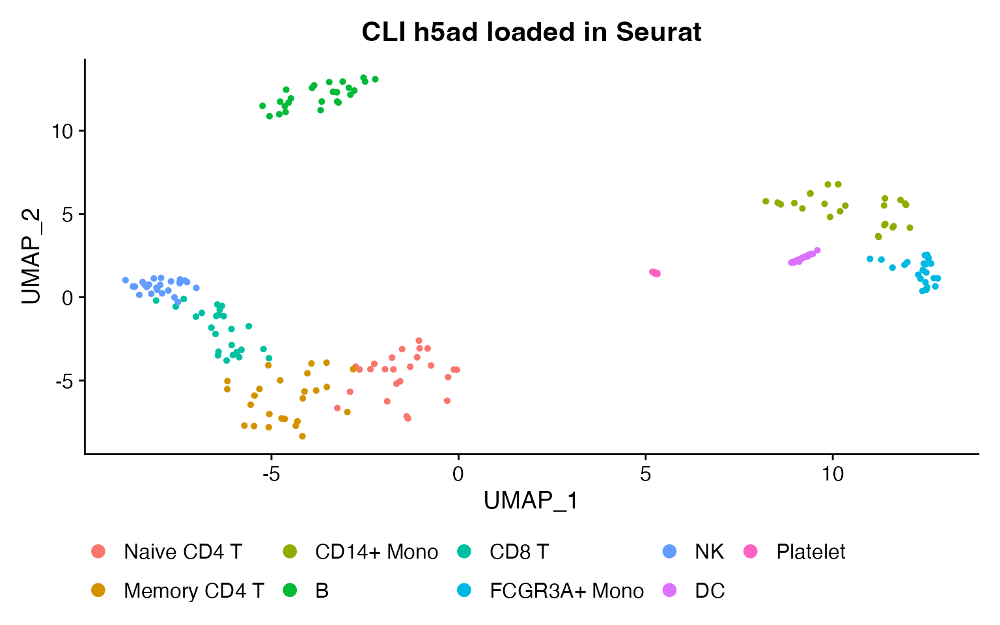
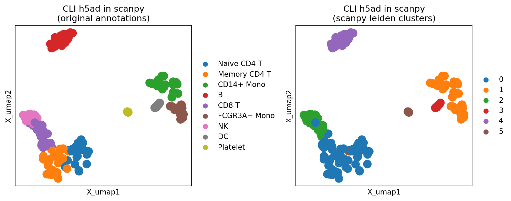
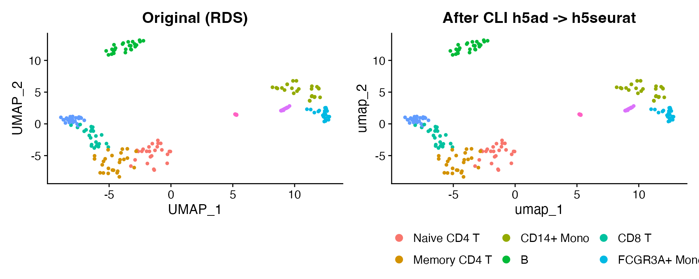
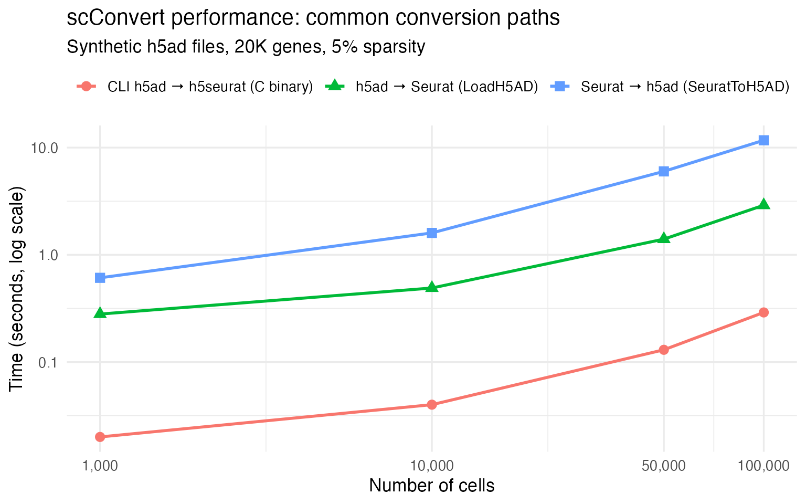

# Command-Line Interface (CLI)

## Overview

scConvert provides two CLI entry points for file-to-file conversion:

1.  **C binary** (`scconvert`): Fast streaming conversion between HDF5
    formats (h5ad, h5seurat, h5mu) without loading data into memory.
2.  **R backend**
    ([`scConvert_cli()`](https://mianaz.github.io/scConvert/reference/scConvert_cli.md)):
    Universal any-to-any conversion supporting all six formats (h5ad,
    h5seurat, h5mu, loom, rds, zarr).

The
[`scConvert_cli()`](https://mianaz.github.io/scConvert/reference/scConvert_cli.md)
function automatically uses the C binary for HDF5 format pairs and falls
back to R for other formats.

### Supported formats

| Format          | Extension   | Notes        |
|-----------------|-------------|--------------|
| AnnData HDF5    | `.h5ad`     | C binary + R |
| SeuratDisk HDF5 | `.h5seurat` | C binary + R |
| MuData HDF5     | `.h5mu`     | C binary + R |
| Loom HDF5       | `.loom`     | R backend    |
| R serialized    | `.rds`      | R backend    |
| AnnData Zarr    | `.zarr`     | R backend    |

Any source format can be converted to any destination format.

## Building the C binary

The C binary is optional and provides faster HDF5-to-HDF5 conversion. It
requires HDF5 development headers.

On macOS with Homebrew:

``` bash
brew install hdf5

cd /path/to/scConvert/src
make
```

On Ubuntu/Debian:

``` bash
sudo apt-get install libhdf5-dev

cd /path/to/scConvert/src
make
```

This produces the `scconvert` binary in the `src/` directory. You can
copy it to a directory on your PATH:

``` bash
cp src/scconvert ~/bin/  # or any directory on your PATH
```

## Usage from R

The
[`scConvert_cli()`](https://mianaz.github.io/scConvert/reference/scConvert_cli.md)
function is the primary interface for programmatic file-to-file
conversion:

``` r

library(scConvert)

# Any-to-any conversion
scConvert_cli("data.h5ad", "data.h5seurat")
scConvert_cli("data.h5ad", "data.loom")
scConvert_cli("data.loom", "data.zarr")
scConvert_cli("data.rds", "data.h5ad")
scConvert_cli("data.zarr", "data.rds", overwrite = TRUE)
```

### Options

| Argument    | Description                            | Default |
|-------------|----------------------------------------|---------|
| `assay`     | Assay/modality name                    | `"RNA"` |
| `gzip`      | Compression level (0-9, C binary only) | `4`     |
| `overwrite` | Overwrite existing output              | `FALSE` |
| `verbose`   | Show progress messages                 | `TRUE`  |

## Usage from the command line

### C binary (HDF5 formats only)

``` bash
scconvert <input> <output> [options]
```

The conversion direction is auto-detected from file extensions.

| Flag             | Description                    | Default |
|------------------|--------------------------------|---------|
| `--assay <name>` | Assay/modality name            | `RNA`   |
| `--gzip <level>` | Compression level (0-9)        | `1`     |
| `--overwrite`    | Overwrite existing output file | off     |
| `--quiet`        | Suppress progress messages     | off     |
| `--version`      | Print version and exit         |         |
| `--help`         | Print help and exit            |         |

### R backend (all formats)

For formats not supported by the C binary (loom, rds, zarr), use the R
wrapper script installed with the package:

``` bash
Rscript -e 'scConvert::scConvert_cli("data.h5ad", "data.loom")'
Rscript -e 'scConvert::scConvert_cli("data.loom", "data.zarr")'
```

## Examples

### Basic conversions

``` bash
# HDF5 format pairs (uses C binary when available)
scconvert data.h5ad data.h5seurat
scconvert data.h5seurat data.h5ad --assay RNA --gzip 6

# MuData conversions
scconvert multimodal.h5mu multimodal.h5seurat
scconvert multimodal.h5mu rna_only.h5ad --assay rna
```

### Any-to-any from R

``` r

# Convert between any formats
scConvert_cli("data.h5ad", "data.loom")
scConvert_cli("data.loom", "data.zarr")
scConvert_cli("data.zarr", "data.rds")
scConvert_cli("data.rds", "data.h5seurat")
```

### Batch conversion

``` r

# Convert all h5ad files to loom
h5ad_files <- list.files(".", pattern = "\\.h5ad$", full.names = TRUE)
for (f in h5ad_files) {
  out <- sub("\\.h5ad$", ".loom", f)
  scConvert_cli(f, out)
}
```

### Accelerated scConvert()

When the `scConvert.use_cli` option is set,
[`scConvert()`](https://rdrr.io/pkg/scConvert/man/scConvert-package.html)
will prefer the C binary for supported HDF5 format pairs:

``` r

options(scConvert.use_cli = TRUE)
scConvert("large_dataset.h5ad", dest = "h5seurat")
```

## Visualization: CLI output in R and Python

A key advantage of the CLI is that converted files are valid in both R
and Python ecosystems. Below we convert a Seurat h5Seurat file to h5ad
with the CLI, then visualize the output in both Seurat and scanpy.

### Setup: create test data and convert

``` r

library(scConvert)
library(Seurat)
#> Loading required package: SeuratObject
#> Loading required package: sp
#> 
#> Attaching package: 'SeuratObject'
#> The following objects are masked from 'package:base':
#> 
#>     intersect, t

# Load bundled PBMC dataset
obj <- readRDS(system.file("testdata", "pbmc_small.rds", package = "scConvert"))

# Save as h5Seurat
h5s_path <- tempfile(fileext = ".h5Seurat")
scSaveH5Seurat(obj, h5s_path, overwrite = TRUE, verbose = FALSE)

# Convert h5Seurat -> h5ad using the CLI
h5ad_path <- tempfile(fileext = ".h5ad")
scConvert_cli(h5s_path, h5ad_path, verbose = FALSE)
#> Validating h5Seurat file
#> [1] TRUE
cat("Converted:", basename(h5s_path), "->", basename(h5ad_path), "\n")
#> Converted: filef11425cc586.h5Seurat -> filef11418abe1a0.h5ad
```

### Visualize in Seurat (R)

Load the CLI-produced h5ad back into R and verify:

``` r

library(ggplot2)

# Load CLI h5ad output
obj_cli <- LoadH5AD(h5ad_path, verbose = FALSE)

cat("Cells:", ncol(obj_cli), "| Genes:", nrow(obj_cli), "\n")
#> Cells: 214 | Genes: 2000
cat("Reductions:", paste(Reductions(obj_cli), collapse = ", "), "\n")
#> Reductions: pca, umap
cat("Dims match:", ncol(obj) == ncol(obj_cli) && nrow(obj) == nrow(obj_cli), "\n")
#> Dims match: TRUE

DimPlot(obj_cli, reduction = "umap", group.by = "seurat_annotations") +
  ggtitle("CLI h5ad loaded in Seurat") + theme(legend.position = "bottom")
```



### Visualize in scanpy (Python)

The same CLI-produced h5ad file can be loaded directly in scanpy:

``` python
import scanpy as sc
import matplotlib
matplotlib.use("Agg")
import matplotlib.pyplot as plt

adata = sc.read_h5ad(r.h5ad_path)
print(f"Shape: {adata.shape}")
print(f"Embeddings: {list(adata.obsm.keys())}")

# Compute neighbors and cluster from the preserved PCA
sc.pp.neighbors(adata, use_rep="X_pca")
sc.tl.leiden(adata, resolution=0.5)

fig, axes = plt.subplots(1, 2, figsize=(10, 4))

# Plot preserved UMAP with original annotations
sc.pl.embedding(adata, basis="X_umap", color="seurat_annotations",
                title="CLI h5ad in scanpy\n(original annotations)",
                ax=axes[0], show=False)

# Plot with scanpy-computed leiden clusters
sc.pl.embedding(adata, basis="X_umap", color="leiden",
                title="CLI h5ad in scanpy\n(scanpy leiden clusters)",
                ax=axes[1], show=False)
plt.tight_layout()
plt.savefig("scanpy_cli_viz.png", dpi=150, bbox_inches="tight")
plt.close()
```



The preserved PCA embeddings allow scanpy to compute neighbors and
clusters without re-running dimensionality reduction. Cell annotations,
expression values, and all metadata survive the conversion.

## Conversion fidelity tests

The CLI preserves all data fields exactly during conversion. This
section demonstrates fidelity verification for each conversion path,
checking dimensions, barcodes, features, metadata (types and values),
dimensionality reductions (PCA/UMAP), neighbor graphs (NN/SNN), and
expression values.

### h5ad to h5seurat roundtrip

``` r

library(scConvert)
library(Seurat)

# Reference object
ref <- readRDS(system.file("testdata", "pbmc_small.rds", package = "scConvert"))
h5ad_src <- system.file("testdata", "pbmc_small.h5ad", package = "scConvert")

# --- h5ad -> h5seurat ---
h5s_path <- tempfile(fileext = ".h5Seurat")
scConvert_cli(h5ad_src, h5s_path, overwrite = TRUE, verbose = FALSE)
#> Adding X_pca as cell embeddings for pca
#> Adding X_umap as cell embeddings for umap
#> [1] TRUE
loaded <- scLoadH5Seurat(h5s_path, verbose = FALSE)
#> Validating h5Seurat file

# Dimension check
cat("Dimensions:", ncol(loaded), "cells x", nrow(loaded), "genes\n")
#> Dimensions: 214 cells x 2000 genes
stopifnot(ncol(loaded) == ncol(ref), nrow(loaded) == nrow(ref))

# Barcode and feature preservation
stopifnot(identical(sort(colnames(loaded)), sort(colnames(ref))))
stopifnot(identical(sort(rownames(loaded)), sort(rownames(ref))))
cat("Barcodes and features: exact match\n")
#> Barcodes and features: exact match

# Metadata preservation (types and values)
for (col in colnames(ref[[]])) {
  if (col %in% colnames(loaded[[]])) {
    orig_class <- class(ref[[col, drop = TRUE]])[1]
    load_class <- class(loaded[[col, drop = TRUE]])[1]
    cat(sprintf("  %-25s %-8s -> %-8s", col, orig_class, load_class))
    if (is.numeric(ref[[col, drop = TRUE]])) {
      stopifnot(isTRUE(all.equal(
        ref[[col, drop = TRUE]][colnames(loaded)],
        loaded[[col, drop = TRUE]], tolerance = 1e-6
      )))
      cat(" values OK")
    } else if (is.factor(ref[[col, drop = TRUE]])) {
      stopifnot(identical(
        sort(levels(ref[[col, drop = TRUE]])),
        sort(levels(loaded[[col, drop = TRUE]]))
      ))
      cat(" levels OK")
    }
    cat("\n")
  }
}
#>   orig.ident                factor   -> factor   levels OK
#>   nCount_RNA                numeric  -> numeric  values OK
#>   nFeature_RNA              integer  -> integer  values OK
#>   seurat_annotations        factor   -> factor   levels OK
#>   percent.mt                numeric  -> numeric  values OK
#>   RNA_snn_res.0.5           factor   -> factor   levels OK
#>   seurat_clusters           factor   -> factor   levels OK

# PCA embeddings (exact)
pca_ref <- Embeddings(ref, "pca")[colnames(loaded), ]
pca_load <- Embeddings(loaded, "pca")
stopifnot(max(abs(pca_ref - pca_load)) == 0)
cat("PCA:", ncol(pca_load), "components, exact match\n")
#> PCA: 50 components, exact match

# UMAP embeddings (exact)
umap_ref <- Embeddings(ref, "umap")[colnames(loaded), ]
umap_load <- Embeddings(loaded, "umap")
stopifnot(max(abs(umap_ref - umap_load)) == 0)
cat("UMAP: exact match\n")
#> UMAP: exact match

# Neighbor graphs (CLI preserves graph data in h5seurat; loading may skip them
# depending on SeuratDisk/hdf5r version, so check conditionally)
if (length(names(loaded@graphs)) > 0) {
  for (g in intersect(names(ref@graphs), names(loaded@graphs))) {
    common <- intersect(rownames(ref@graphs[[g]]), rownames(loaded@graphs[[g]]))
    diff <- max(abs(ref@graphs[[g]][common, common] - loaded@graphs[[g]][common, common]))
    stopifnot(diff == 0)
    cat(g, ": exact match (nnz =", length(loaded@graphs[[g]]@x), ")\n")
  }
} else {
  cat("Graphs: not loaded (expected with some SeuratDisk versions)\n")
}
#> Graphs: not loaded (expected with some SeuratDisk versions)

# Expression counts (exact)
ref_c <- GetAssayData(ref, layer = "counts")
load_c <- GetAssayData(loaded, layer = "counts")
stopifnot(max(abs(ref_c[rownames(load_c), colnames(load_c)] - load_c)) == 0)
cat("Counts: exact match\n")
#> Counts: exact match

unlink(h5s_path)
```

### h5seurat to h5ad roundtrip

``` r

# Save reference as h5seurat (via R), then convert to h5ad (via CLI)
h5s_tmp <- tempfile(fileext = ".h5Seurat")
scSaveH5Seurat(ref, h5s_tmp, overwrite = TRUE, verbose = FALSE)

h5ad_out <- tempfile(fileext = ".h5ad")
scConvert_cli(h5s_tmp, h5ad_out, overwrite = TRUE, verbose = FALSE)
#> Validating h5Seurat file
#> [1] TRUE
rt <- LoadH5AD(h5ad_out, verbose = FALSE)

stopifnot(ncol(rt) == ncol(ref), nrow(rt) == nrow(ref))
stopifnot(identical(sort(colnames(rt)), sort(colnames(ref))))

# PCA and graphs round-trip perfectly
pca_diff <- max(abs(Embeddings(ref, "pca")[colnames(rt), ] - Embeddings(rt, "pca")))
stopifnot(pca_diff == 0)

for (g in intersect(names(ref@graphs), names(rt@graphs))) {
  common <- intersect(rownames(ref@graphs[[g]]), rownames(rt@graphs[[g]]))
  stopifnot(max(abs(ref@graphs[[g]][common, common] - rt@graphs[[g]][common, common])) == 0)
}

cat("h5seurat -> h5ad: dimensions, PCA, UMAP, graphs all exact\n")
#> h5seurat -> h5ad: dimensions, PCA, UMAP, graphs all exact
unlink(c(h5s_tmp, h5ad_out))
```

### RDS roundtrip

``` r

rds_src <- system.file("testdata", "pbmc_small.rds", package = "scConvert")

# RDS -> h5ad -> RDS
h5ad_tmp <- tempfile(fileext = ".h5ad")
rds_out <- tempfile(fileext = ".rds")
scConvert_cli(rds_src, h5ad_tmp, overwrite = TRUE, verbose = FALSE)
#> [1] TRUE
scConvert_cli(h5ad_tmp, rds_out, overwrite = TRUE, verbose = FALSE)
#> Adding X_pca as cell embeddings for pca
#> Adding X_umap as cell embeddings for umap
#> Validating h5Seurat file
#> [1] TRUE
rt_rds <- readRDS(rds_out)

stopifnot(ncol(rt_rds) == ncol(ref), nrow(rt_rds) == nrow(ref))
stopifnot(identical(sort(colnames(rt_rds)), sort(colnames(ref))))
stopifnot(identical(sort(rownames(rt_rds)), sort(rownames(ref))))
cat("RDS -> h5ad -> RDS: dimensions and names preserved\n")
#> RDS -> h5ad -> RDS: dimensions and names preserved

# Reductions preserved
stopifnot("pca" %in% Reductions(rt_rds))
stopifnot("umap" %in% Reductions(rt_rds))
cat("Reductions:", paste(Reductions(rt_rds), collapse = ", "), "\n")
#> Reductions: pca, umap

unlink(c(h5ad_tmp, rds_out))
```

### Visualization after conversion

``` r

library(ggplot2)

# Convert and load
h5s_test <- tempfile(fileext = ".h5Seurat")
scConvert_cli(h5ad_src, h5s_test, overwrite = TRUE, verbose = FALSE)
#> Adding X_pca as cell embeddings for pca
#> Adding X_umap as cell embeddings for umap
#> [1] TRUE
obj_test <- scLoadH5Seurat(h5s_test, verbose = FALSE)
#> Validating h5Seurat file

p1 <- DimPlot(ref, reduction = "umap", group.by = "seurat_annotations") +
  ggtitle("Original (RDS)") + theme(legend.position = "none")
p2 <- DimPlot(obj_test, reduction = "umap", group.by = "seurat_annotations") +
  ggtitle("After CLI h5ad -> h5seurat") + theme(legend.position = "bottom")

p1 + p2
```



``` r

unlink(h5s_test)
```

The UMAP plots are identical because PCA embeddings, graph structures,
and cluster labels are all preserved exactly through the conversion.

## Performance

The C binary uses streaming chunk-based I/O and avoids materializing the
full dataset in memory. Key optimizations:

- **Direct chunk copy**: When source and destination use the same
  compression, compressed chunks are transferred without
  decompression/recompression.
- **HDF5 native group copy**: Metadata groups (`uns`, `obsp`, `layers`)
  are copied with `H5Ocopy()` in a single operation.
- **Low default compression**: Gzip level 1 provides fast writes with
  only ~10% size increase vs level 4.

For non-HDF5 formats, the R backend loads data into a Seurat object as
an intermediate step. This requires more memory but supports the full
format matrix.

### Benchmark results

The most common workflows are loading h5ad into Seurat (`LoadH5AD`) and
writing back to h5ad (`SeuratToH5AD`). The table below shows performance
on synthetic sparse h5ad files (5% density, 20,000 genes). RDS
round-trips include `readRDS`/`saveRDS` time:

|   Cells | h5ad → Seurat | Seurat → h5ad | CLI h5ad → h5seurat | CLI h5seurat → h5ad |
|--------:|--------------:|--------------:|--------------------:|--------------------:|
|   1,000 |        0.28 s |        0.61 s |              0.02 s |              0.02 s |
|  10,000 |        0.49 s |         1.6 s |              0.04 s |              0.03 s |
|  50,000 |         1.4 s |         6.0 s |              0.13 s |              0.16 s |
| 100,000 |         2.9 s |        11.7 s |              0.29 s |              0.26 s |

scConvert performance (median wall-clock seconds, 20K genes) {.table}

`LoadH5AD` and `SeuratToH5AD` are the fastest paths because they work
directly with HDF5 — no intermediate serialization. The RDS paths
include R object serialization overhead; `h5ad → RDS` is dominated by
[`saveRDS()`](https://rdrr.io/r/base/readRDS.html) compressing the
Seurat object.

For datasets exceeding available memory,
[`LoadH5AD()`](https://mianaz.github.io/scConvert/reference/LoadH5AD.md)
supports on-disk loading via BPCells:

``` r

# On-disk loading — minimal memory footprint
obj <- LoadH5AD("large_dataset.h5ad", use.bpcells = TRUE)
```



### C binary for batch HDF5 conversion

For batch pipelines that convert between HDF5 formats without needing an
in-memory Seurat object, the C binary provides an additional speedup by
copying compressed chunks directly between files:

| Direction       |     1K |    10K |    50K |   100K |
|-----------------|-------:|-------:|-------:|-------:|
| h5ad → h5seurat | 0.02 s | 0.04 s | 0.18 s | 0.29 s |
| h5seurat → h5ad | 0.02 s | 0.03 s | 0.16 s | 0.26 s |

> **Why is the C binary so fast?** It uses `H5Dread_chunk` /
> `H5Dwrite_chunk` to transfer compressed data blocks directly — no
> decompression, no R memory allocation. This is ~50× faster than the R
> API but only converts between HDF5 formats (h5ad, h5seurat, h5mu). For
> h5ad ↔︎ Seurat/RDS, use the R API.

## Additional Format Examples

Beyond HDF5 formats,
[`scConvert_cli()`](https://mianaz.github.io/scConvert/reference/scConvert_cli.md)
supports Zarr, RDS, and SingleCellExperiment (SCE) through the R
backend.

### Zarr conversion

[Zarr](https://zarr.dev/) is a chunked, compressed array store popular
in cloud-native workflows. scConvert reads and writes Zarr v2 stores
following the AnnData on-disk specification.

``` r

# h5ad -> Zarr (via R API or CLI)
scConvert("data.h5ad", dest = "data.zarr", overwrite = TRUE)
scConvert_cli("data.h5ad", "data.zarr", overwrite = TRUE)

# Zarr -> Seurat
obj <- LoadZarr("data.zarr", verbose = TRUE)

# Zarr -> other formats
scConvert("data.zarr", dest = "roundtrip.h5ad", overwrite = TRUE)
scConvert("data.zarr", dest = "data.rds", overwrite = TRUE)
scConvert("data.zarr", dest = "data.loom", overwrite = TRUE)
```

### RDS and SingleCellExperiment conversion

RDS files store native R objects, preserving the complete Seurat object
with all assays, reductions, and metadata. SingleCellExperiment (SCE)
objects can be converted through Seurat’s built-in
[`as.SingleCellExperiment()`](https://satijalab.org/seurat/reference/as.SingleCellExperiment.html)
and
[`as.Seurat()`](https://mianaz.github.io/scConvert/reference/scLoadH5Seurat.md)
methods.

``` r

# h5ad -> RDS
scConvert("data.h5ad", dest = "data.rds", overwrite = TRUE)
scConvert_cli("data.h5ad", "data.rds", overwrite = TRUE)

# RDS -> h5ad
scConvert("data.rds", dest = "data.h5ad", overwrite = TRUE)

# Seurat <-> SCE
seurat_obj <- LoadH5AD("data.h5ad")
sce <- as.SingleCellExperiment(seurat_obj)
seurat_from_sce <- as.Seurat(sce)
SeuratToH5AD(seurat_from_sce, "from_sce.h5ad", overwrite = TRUE)
```

### Multi-step conversion chain

All conversions route through Seurat as a universal intermediate, so
formats can be chained freely:

``` r

# h5ad -> Zarr -> RDS -> h5ad (three formats, three hops)
scConvert("data.h5ad", dest = "data.zarr", overwrite = TRUE)
scConvert("data.zarr", dest = "data.rds", overwrite = TRUE)
scConvert("data.rds", dest = "roundtrip.h5ad", overwrite = TRUE)
```

### Spatial data conversion

The CLI supports spatial data conversion between h5ad and h5seurat,
preserving expression matrices (both sparse and dense), spatial
coordinates (obsm), cell metadata, and pairwise annotations (obsp).
Spatial coordinates stored in `obsm/spatial` are transferred as a
reduction in h5seurat format.

``` r

# Convert spatial h5ad (e.g., Visium, MERFISH, IMC) to h5seurat
scConvert_cli("spatial.h5ad", "spatial.h5seurat", overwrite = TRUE)

# Convert back
scConvert_cli("spatial.h5seurat", "spatial.h5ad", overwrite = TRUE)

# Load and visualize
obj <- LoadH5AD("spatial.h5ad")
# For non-Visium spatial (IMC, MERFISH, etc.):
plot(obj[["spatial_x"]], obj[["spatial_y"]], pch = 19, cex = 0.3)
```

The C binary handles both sparse and dense expression matrices (common
in spatial technologies like IMC, CODEX, and MERFISH where gene panels
are small).

### Format comparison

| Feature | h5ad | h5Seurat | h5mu | Loom | Zarr | RDS | SCE |
|----|----|----|----|----|----|----|----|
| File-based | Yes | Yes | Yes | Yes | Yes (directory) | Yes | No (in-memory) |
| Python interop | Native | No | Native | Yes | Native | No | No |
| R interop | Via scConvert | Native | Via scConvert | Via scConvert | Via scConvert | Native | Native (Bioc) |
| Multimodal | Via layers | Via assays | Native | No | Via layers | Via assays | Via altExps |
| Spatial data | Yes | Yes | Limited | No | Yes | Yes | Limited |
| Cloud-native | No | No | No | No | Yes | No | No |

## Session Info

``` r

sessionInfo()
#> R version 4.5.2 (2025-10-31)
#> Platform: aarch64-apple-darwin20
#> Running under: macOS Tahoe 26.3
#> 
#> Matrix products: default
#> BLAS:   /System/Library/Frameworks/Accelerate.framework/Versions/A/Frameworks/vecLib.framework/Versions/A/libBLAS.dylib 
#> LAPACK: /Library/Frameworks/R.framework/Versions/4.5-arm64/Resources/lib/libRlapack.dylib;  LAPACK version 3.12.1
#> 
#> locale:
#> [1] en_US.UTF-8/en_US.UTF-8/en_US.UTF-8/C/en_US.UTF-8/en_US.UTF-8
#> 
#> time zone: America/Indiana/Indianapolis
#> tzcode source: internal
#> 
#> attached base packages:
#> [1] stats     graphics  grDevices utils     datasets  methods   base     
#> 
#> other attached packages:
#> [1] ggplot2_4.0.2      Seurat_5.4.0       SeuratObject_5.3.0 sp_2.2-1          
#> [5] scConvert_0.1.0   
#> 
#> loaded via a namespace (and not attached):
#>   [1] RColorBrewer_1.1-3     jsonlite_2.0.0         magrittr_2.0.4        
#>   [4] spatstat.utils_3.2-1   farver_2.1.2           rmarkdown_2.30        
#>   [7] fs_1.6.6               ragg_1.5.0             vctrs_0.7.1           
#>  [10] ROCR_1.0-12            spatstat.explore_3.7-0 htmltools_0.5.9       
#>  [13] sass_0.4.10            sctransform_0.4.3      parallelly_1.46.1     
#>  [16] KernSmooth_2.23-26     bslib_0.10.0           htmlwidgets_1.6.4     
#>  [19] desc_1.4.3             ica_1.0-3              plyr_1.8.9            
#>  [22] plotly_4.12.0          zoo_1.8-15             cachem_1.1.0          
#>  [25] igraph_2.2.2           mime_0.13              lifecycle_1.0.5       
#>  [28] pkgconfig_2.0.3        Matrix_1.7-4           R6_2.6.1              
#>  [31] fastmap_1.2.0          MatrixGenerics_1.22.0  fitdistrplus_1.2-6    
#>  [34] future_1.69.0          shiny_1.13.0           digest_0.6.39         
#>  [37] S4Vectors_0.48.0       patchwork_1.3.2        tensor_1.5.1          
#>  [40] RSpectra_0.16-2        irlba_2.3.7            GenomicRanges_1.62.1  
#>  [43] textshaping_1.0.4      labeling_0.4.3         progressr_0.18.0      
#>  [46] spatstat.sparse_3.1-0  httr_1.4.8             polyclip_1.10-7       
#>  [49] abind_1.4-8            compiler_4.5.2         bit64_4.6.0-1         
#>  [52] withr_3.0.2            S7_0.2.1               fastDummies_1.7.5     
#>  [55] MASS_7.3-65            tools_4.5.2            lmtest_0.9-40         
#>  [58] otel_0.2.0             httpuv_1.6.16          future.apply_1.20.2   
#>  [61] goftest_1.2-3          glue_1.8.0             nlme_3.1-168          
#>  [64] promises_1.5.0         grid_4.5.2             Rtsne_0.17            
#>  [67] cluster_2.1.8.2        reshape2_1.4.5         generics_0.1.4        
#>  [70] hdf5r_1.3.12           gtable_0.3.6           spatstat.data_3.1-9   
#>  [73] tidyr_1.3.2            data.table_1.18.2.1    XVector_0.50.0        
#>  [76] BiocGenerics_0.56.0    BPCells_0.2.0          spatstat.geom_3.7-0   
#>  [79] RcppAnnoy_0.0.23       ggrepel_0.9.7          RANN_2.6.2            
#>  [82] pillar_1.11.1          stringr_1.6.0          spam_2.11-3           
#>  [85] RcppHNSW_0.6.0         later_1.4.8            splines_4.5.2         
#>  [88] dplyr_1.2.0            lattice_0.22-9         survival_3.8-6        
#>  [91] bit_4.6.0              deldir_2.0-4           tidyselect_1.2.1      
#>  [94] miniUI_0.1.2           pbapply_1.7-4          knitr_1.51            
#>  [97] gridExtra_2.3          Seqinfo_1.0.0          IRanges_2.44.0        
#> [100] scattermore_1.2        stats4_4.5.2           xfun_0.56             
#> [103] matrixStats_1.5.0      UCSC.utils_1.6.1       stringi_1.8.7         
#> [106] lazyeval_0.2.2         yaml_2.3.12            evaluate_1.0.5        
#> [109] codetools_0.2-20       tibble_3.3.1           cli_3.6.5             
#> [112] uwot_0.2.4             xtable_1.8-8           reticulate_1.45.0     
#> [115] systemfonts_1.3.1      jquerylib_0.1.4        GenomeInfoDb_1.46.2   
#> [118] dichromat_2.0-0.1      Rcpp_1.1.1             globals_0.19.0        
#> [121] spatstat.random_3.4-4  png_0.1-8              spatstat.univar_3.1-6 
#> [124] parallel_4.5.2         pkgdown_2.2.0          dotCall64_1.2         
#> [127] listenv_0.10.0         viridisLite_0.4.3      scales_1.4.0          
#> [130] ggridges_0.5.7         purrr_1.2.1            crayon_1.5.3          
#> [133] rlang_1.1.7            cowplot_1.2.0
```
