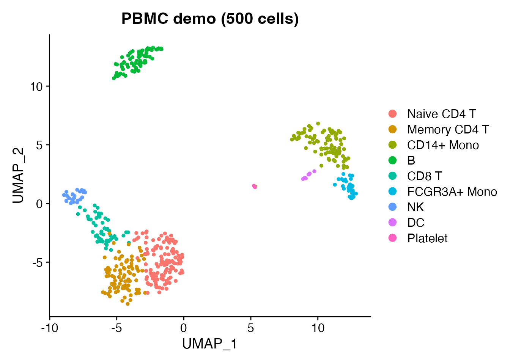
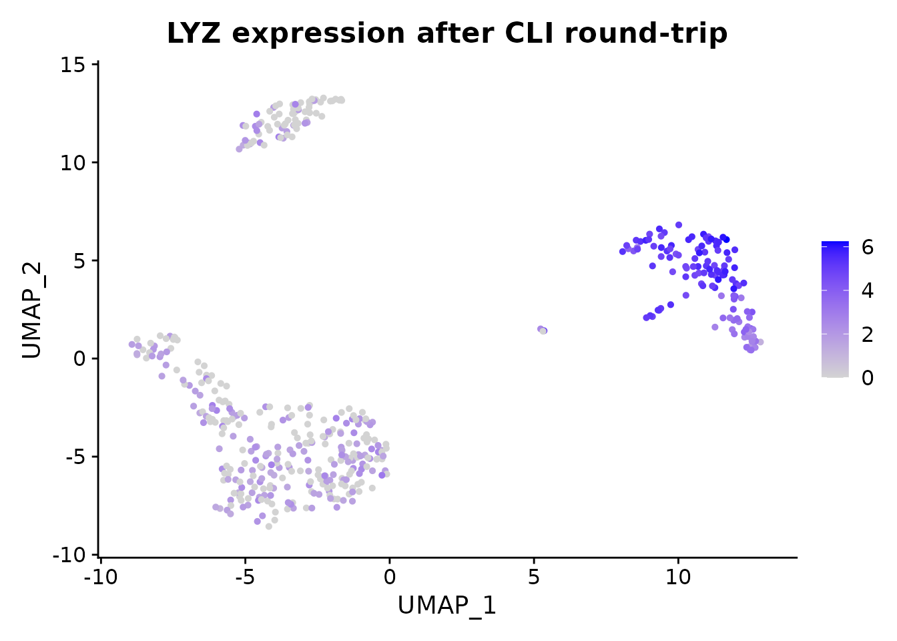

# Command-Line Interface

## Overview

scConvert includes a standalone C binary for streaming HDF5 conversions
between h5ad, h5Seurat, h5mu, and Loom – no R or Python runtime
required. For formats that need R (RDS, Zarr, SCE, SOMA), the
[`scConvert_cli()`](https://mianaz.github.io/scConvert/reference/scConvert_cli.md)
wrapper falls back to the R hub automatically.

## Quick start

Load the bundled PBMC demo data (500 cells, 9 cell types) and save it as
h5Seurat – the starting point for CLI conversion.

``` r

obj <- readRDS(system.file("extdata", "pbmc_demo.rds", package = "scConvert"))
DimPlot(obj, reduction = "umap", group.by = "seurat_annotations") +
  ggplot2::ggtitle("PBMC demo (500 cells)")
```



``` r

h5s_path <- tempfile(fileext = ".h5Seurat")
writeH5Seurat(obj, h5s_path, overwrite = TRUE, verbose = FALSE)
cat("Saved:", h5s_path, "\n")
#> Saved: /tmp/RtmpidhgWK/file467077f334a6.h5Seurat
```

## Using the C binary from the shell

The binary auto-detects conversion direction from file extensions.

``` bash
# Build (one time)
cd /path/to/scConvert/src && make

# Convert
scconvert data.h5seurat data.h5ad
scconvert data.h5ad data.h5seurat --assay RNA --gzip 6
scconvert multimodal.h5mu output.h5seurat
scconvert data.h5ad data.loom
```

**Options:**

| Flag             | Description                | Default |
|------------------|----------------------------|---------|
| `--assay <name>` | Assay/modality name        | `RNA`   |
| `--gzip <level>` | Compression level (0–9)    | `1`     |
| `--overwrite`    | Overwrite existing output  | off     |
| `--quiet`        | Suppress progress messages | off     |

## Using `scConvert_cli()` from R

The R wrapper tries the C binary first, then falls back to R streaming
or the Seurat hub. It works even if the binary is not compiled.

``` r

h5ad_path <- tempfile(fileext = ".h5ad")
scConvert_cli(h5s_path, h5ad_path, verbose = FALSE)
#> Validating h5Seurat file
#> [1] TRUE
cat("Converted to:", h5ad_path, "\n")
#> Converted to: /tmp/RtmpidhgWK/file46703bfe4db8.h5ad
```

Verify the round-tripped data is intact:

``` r

obj_rt <- readH5AD(h5ad_path, verbose = FALSE)
#> Warning: Layer 'data' is empty
cat("Cells:", ncol(obj_rt), "| Genes:", nrow(obj_rt), "\n")
#> Cells: 500 | Genes: 2000
cat("Reductions:", paste(names(obj_rt@reductions), collapse = ", "), "\n")
#> Reductions: pca, umap

FeaturePlot(obj_rt, features = "LYZ", reduction = "umap") +
  ggtitle("LYZ expression after CLI round-trip")
```



## Batch conversion

Convert all h5ad files in a directory:

``` r

h5ad_files <- list.files(".", pattern = "\\.h5ad$", full.names = TRUE)
for (f in h5ad_files) {
  out <- sub("\\.h5ad$", ".h5seurat", f)
  scConvert_cli(f, out)
}
```

For formats not supported by the C binary (RDS, Zarr, SCE), the same
function works via the R hub:

``` r

scConvert_cli("data.h5ad", "data.rds")
scConvert_cli("data.rds", "data.zarr")
scConvert_cli("data.h5ad", "data.zarr")
```

## Performance

The C binary uses direct chunk copy and sparse zero-copy to avoid
decompressing data. Median wall-clock seconds on synthetic sparse h5ad
(20K genes, 5% density, Apple M4 Max):

| Cells | R read (readH5AD) | R write (writeH5AD) | CLI h5ad to h5seurat | CLI h5seurat to h5ad |
|---:|---:|---:|---:|---:|
| 1,000 | 0.28 s | 0.61 s | 0.02 s | 0.02 s |
| 10,000 | 0.49 s | 1.6 s | 0.04 s | 0.03 s |
| 50,000 | 1.4 s | 6.0 s | 0.13 s | 0.16 s |
| 100,000 | 2.9 s | 11.7 s | 0.29 s | 0.26 s |

The CLI is 10–50x faster because it never constructs a Seurat object.
For loading data into R for analysis, use
[`readH5AD()`](https://mianaz.github.io/scConvert/reference/readH5AD.md)
or
[`readH5Seurat()`](https://mianaz.github.io/scConvert/reference/readH5Seurat.md).

## Building the C binary

The binary is optional –
[`scConvert_cli()`](https://mianaz.github.io/scConvert/reference/scConvert_cli.md)
works without it.

``` bash
# macOS (Homebrew)
brew install hdf5
cd /path/to/scConvert/src && make

# Ubuntu/Debian
sudo apt-get install libhdf5-dev
cd /path/to/scConvert/src && make

# Copy to PATH
cp src/scconvert ~/bin/
```

The binary links against libhdf5 and libz only. No other dependencies.

## Clean up
