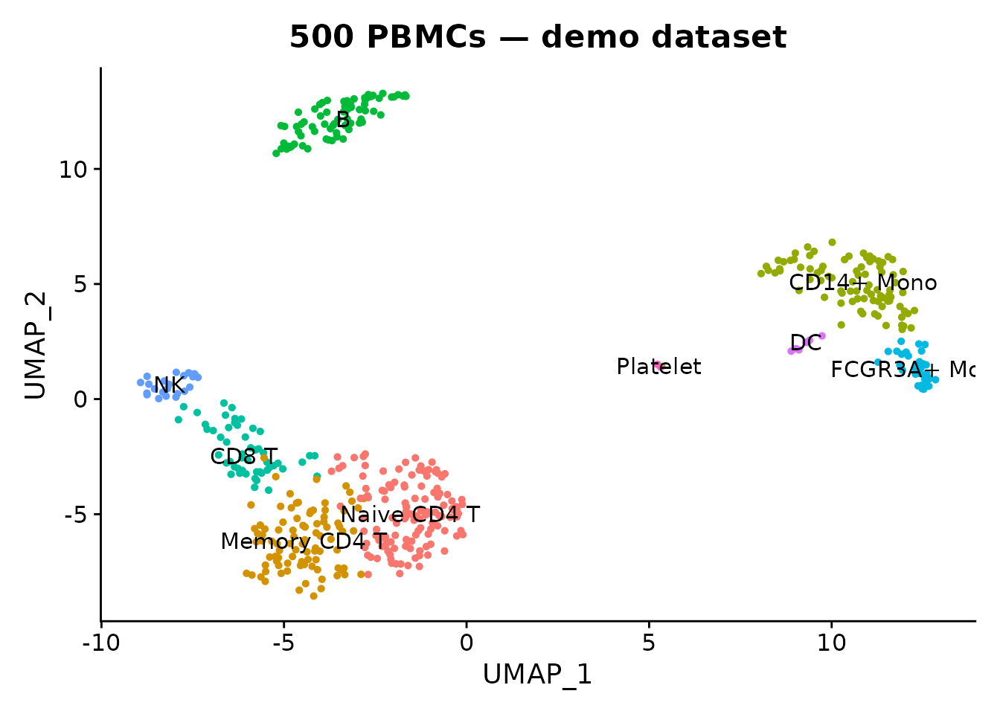

# In-Memory vs On-Disk Conversion

``` r

library(scConvert)
library(Seurat)
library(ggplot2)
```

scConvert provides three conversion modes with different speed and
memory trade-offs. This vignette explains when to use each, and compares
Seurat serialization formats for disk space.

## Three conversion modes

``` r

obj <- readRDS(system.file("extdata", "pbmc_demo.rds", package = "scConvert"))
DimPlot(obj, group.by = "seurat_annotations", label = TRUE, pt.size = 1) +
  ggtitle("500 PBMCs — demo dataset") + NoLegend()
```



### 1. In-memory (hub path)

The default mode loads data into a Seurat object, then saves to the
target format. This supports all format pairs but requires the full
dataset in RAM.

``` r

# Seurat object -> h5ad (in-memory)
h5ad_path <- file.path(tempdir(), "pbmc_hub.h5ad")
t1 <- system.time(writeH5AD(obj, h5ad_path, verbose = FALSE))
cat("In-memory write:", round(t1["elapsed"], 2), "s\n")
#> In-memory write: 3.11 s
```

Use in-memory conversion when you need to manipulate the data in R, or
when the source/destination formats don’t share the same on-disk layout.

### 2. On-disk streaming (R)

For Zarr conversions, scConvert can copy data field-by-field between
files without ever constructing a Seurat object. This keeps memory usage
constant regardless of dataset size.

``` r

# h5ad -> zarr (streaming, no Seurat object in memory)
zarr_path <- file.path(tempdir(), "pbmc_stream.zarr")
t2 <- system.time(H5ADToZarr(h5ad_path, zarr_path, stream = TRUE, verbose = FALSE))
cat("Streaming h5ad -> zarr:", round(t2["elapsed"], 2), "s\n")
#> Streaming h5ad -> zarr: 1.04 s
```

Available streaming converters:

| Function | Direction |
|----|----|
| [`H5ADToZarr()`](https://mianaz.github.io/scConvert/reference/H5ADToZarr.md) | h5ad → zarr |
| [`ZarrToH5AD()`](https://mianaz.github.io/scConvert/reference/ZarrToH5AD.md) | zarr → h5ad |
| [`H5SeuratToZarr()`](https://mianaz.github.io/scConvert/reference/H5SeuratToZarr.md) | h5Seurat → zarr |
| [`ZarrToH5Seurat()`](https://mianaz.github.io/scConvert/reference/ZarrToH5Seurat.md) | zarr → h5Seurat |

All accept `stream = TRUE` (the default) to bypass the Seurat
intermediate.

### 3. C binary (on-disk, fastest)

For HDF5-based format pairs (h5ad, h5Seurat, h5mu, Loom), the compiled C
binary copies datasets directly at the HDF5 level. It uses constant
memory and is typically 10–50x faster than the R path.

``` r

h5s_path <- file.path(tempdir(), "pbmc_cli.h5seurat")
writeH5Seurat(obj, h5s_path, overwrite = TRUE, verbose = FALSE)

h5ad_cli <- file.path(tempdir(), "pbmc_cli.h5ad")
t3 <- system.time(scConvert_cli(h5s_path, h5ad_cli, verbose = FALSE))
#> Validating h5Seurat file
cat("C binary h5seurat -> h5ad:", round(t3["elapsed"], 2), "s\n")
#> C binary h5seurat -> h5ad: 4.18 s
```

Build the binary with `cd src && make` (requires HDF5 headers).

### Performance at scale

On synthetic sparse h5ad files (20K genes, 5% density), median of 3 runs
on Apple M4 Max:

| Operation                         | 100K cells | 500K cells |
|-----------------------------------|------------|------------|
| **C binary** (h5ad ↔︎ h5seurat)    | 0.19 s     | 0.63 s     |
| **Streaming** (h5ad → zarr)       | ~1 s       | ~5 s       |
| **In-memory** read h5ad           | 2.56 s     | 12.68 s    |
| **In-memory** write h5ad (gzip=0) | 0.61 s     | 3.29 s     |

The C binary stays under 1 second even at 500K cells because it never
decompresses the expression matrix — it copies HDF5 chunks directly.

## Seurat serialization formats

A Seurat object can be saved in several R-native formats. All preserve
the full object structure (assays, reductions, graphs, metadata,
images).

``` r

rds_path <- file.path(tempdir(), "pbmc.rds")
h5s_path2 <- file.path(tempdir(), "pbmc.h5seurat")

saveRDS(obj, rds_path)
writeH5Seurat(obj, h5s_path2, overwrite = TRUE, verbose = FALSE)

sizes <- data.frame(
  Format = character(), Size_KB = numeric(), stringsAsFactors = FALSE
)
sizes <- rbind(sizes, data.frame(Format = "RDS (.rds)", Size_KB = file.size(rds_path) / 1024))
sizes <- rbind(sizes, data.frame(Format = "h5Seurat (.h5seurat)", Size_KB = file.size(h5s_path2) / 1024))

if (requireNamespace("qs2", quietly = TRUE)) {
  qs2_path <- file.path(tempdir(), "pbmc.qs2")
  qs2::qs_save(obj, qs2_path)
  sizes <- rbind(sizes, data.frame(Format = "qs2 (.qs2)", Size_KB = file.size(qs2_path) / 1024))
}

# Also save as RData
rdata_path <- file.path(tempdir(), "pbmc.RData")
save(obj, file = rdata_path)
sizes <- rbind(sizes, data.frame(Format = "RData (.RData)", Size_KB = file.size(rdata_path) / 1024))

sizes$Size_MB <- round(sizes$Size_KB / 1024, 2)
sizes$Size_KB <- round(sizes$Size_KB, 0)
knitr::kable(sizes[, c("Format", "Size_MB")], col.names = c("Format", "Size (MB)"))
```

| Format               | Size (MB) |
|:---------------------|----------:|
| RDS (.rds)           |      1.57 |
| h5Seurat (.h5seurat) |      2.16 |
| qs2 (.qs2)           |      1.52 |
| RData (.RData)       |      1.57 |

### Format comparison

| Format       | Compression | Random access        | Language |
|--------------|-------------|----------------------|----------|
| **RDS**      | gzip        | No (full load)       | R only   |
| **RData**    | gzip        | No (full load)       | R only   |
| **qs2**      | zstd        | No (full load)       | R only   |
| **h5Seurat** | gzip (HDF5) | Yes (selective load) | R, C     |

Key differences:

- **qs2** is among the fastest R serialization formats (2–5x faster than
  `saveRDS`), with similar or better compression. Use it for local
  caching. The original **qs** package was archived from CRAN in 2026
  and superseded by **qs2**.
- **h5Seurat** is the only format that supports **selective loading** —
  read just one assay or one reduction without loading the entire
  object.
- **RDS / RData** are universally available but slower for large
  objects.

### Exchange formats

For sharing data with Python or other tools, use cross-language formats:

``` r

h5ad_path2 <- file.path(tempdir(), "pbmc_exchange.h5ad")
writeH5AD(obj, h5ad_path2, verbose = FALSE)

loom_path <- file.path(tempdir(), "pbmc_exchange.loom")
writeLoom(obj, loom_path, verbose = FALSE)
#> Adding col attribute CellID
#> Adding col attribute orig.ident
#> Adding col attribute nCount_RNA
#> Adding col attribute nFeature_RNA
#> Adding col attribute seurat_annotations
#> Adding col attribute percent.mt
#> Adding col attribute RNA_snn_res.0.5
#> Adding col attribute seurat_clusters
#> Adding row attribute Gene
#> Adding row attribute vst.mean
#> Adding row attribute vst.variance
#> Adding row attribute vst.variance.expected
#> Adding row attribute vst.variance.standardized
#> Adding row attribute vst.variable

zarr_path2 <- file.path(tempdir(), "pbmc_exchange.zarr")
writeZarr(obj, zarr_path2, verbose = FALSE)

exchange <- data.frame(
  Format = c("h5ad (AnnData)", "Loom", "Zarr"),
  Size_MB = round(c(
    file.size(h5ad_path2),
    file.size(loom_path),
    sum(file.info(list.files(zarr_path2, recursive = TRUE, full.names = TRUE))$size)
  ) / 1024^2, 2),
  Ecosystem = c("scanpy, CELLxGENE", "loompy, velocyto", "cloud / AnnData")
)
knitr::kable(exchange)
```

| Format         | Size_MB | Ecosystem         |
|:---------------|--------:|:------------------|
| h5ad (AnnData) |    0.89 | scanpy, CELLxGENE |
| Loom           |    2.20 | loompy, velocyto  |
| Zarr           |    0.64 | cloud / AnnData   |

## When to use what

| Goal | Recommended |
|----|----|
| Fast local save/load in R | [`qs2::qs_save()`](https://rdrr.io/pkg/qs2/man/qs_save.html) / [`qs2::qs_read()`](https://rdrr.io/pkg/qs2/man/qs_read.html) |
| Selective loading (big data) | [`writeH5Seurat()`](https://mianaz.github.io/scConvert/reference/writeH5Seurat.md) / [`readH5Seurat()`](https://mianaz.github.io/scConvert/reference/readH5Seurat.md) |
| Share with Python | [`writeH5AD()`](https://mianaz.github.io/scConvert/reference/writeH5AD.md) or C binary |
| Batch convert many files | C binary (`scconvert`) |
| Cloud storage | [`writeZarr()`](https://mianaz.github.io/scConvert/reference/writeZarr.md) |
| Convert without loading | [`scConvert_cli()`](https://mianaz.github.io/scConvert/reference/scConvert_cli.md) or streaming converters |

## Clean up
