# Conversions: h5Seurat and AnnData

This vignette showcases how to convert between `Seurat` objects and
AnnData files via h5Seurat files. This allows interoperability between
Seurat and [Scanpy](https://scanpy.readthedocs.io/).

``` r

library(Seurat)
library(scConvert)
library(ggplot2)
library(patchwork)
```

## Converting from Seurat to AnnData via h5Seurat

To demonstrate conversion from a `Seurat` object to an AnnData file,
we’ll use the `pbmc3k.final` dataset from SeuratData - a processed PBMC
dataset with clustering and UMAP. If SeuratData is not available, you
can download an h5ad directly from [CZ CellxGene
Discover](https://cellxgene.cziscience.com/collections):

``` r

# Alternative: download from CellxGene (Tabula Microcebus lung, ~1.7K cells)
cxg_url <- "https://datasets.cellxgene.cziscience.com/582ffa61-1c54-4492-8763-2ecfa9efa070.h5ad"
download.file(cxg_url, destfile = "cxg_demo.h5ad", mode = "wb")
pbmc <- LoadH5AD("cxg_demo.h5ad")
```

``` r

library(SeuratData)
if (!"pbmc3k.final" %in% rownames(InstalledData())) {
  InstallData("pbmc3k")
}

data("pbmc3k.final", package = "pbmc3k.SeuratData")
pbmc <- UpdateSeuratObject(pbmc3k.final)
pbmc
#> An object of class Seurat 
#> 13714 features across 2638 samples within 1 assay 
#> Active assay: RNA (13714 features, 2000 variable features)
#>  3 layers present: counts, data, scale.data
#>  2 dimensional reductions calculated: pca, umap
```

This is a fully processed Seurat object with clustering and dimensional
reductions:

``` r

DimPlot(pbmc, reduction = "umap", label = TRUE, pt.size = 0.5) + NoLegend()
```

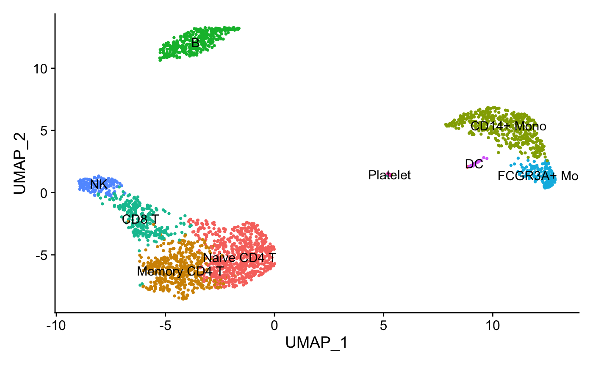

``` r

FeaturePlot(pbmc, features = "CD14", pt.size = 0.5)
```


Converting the `Seurat` object to an AnnData file is a two-step process:

1.  Save the `Seurat` object as an h5Seurat file using
    [`scSaveH5Seurat()`](https://mianaz.github.io/scConvert/reference/scSaveH5Seurat.md)
2.  Convert to AnnData using
    [`scConvert()`](https://rdrr.io/pkg/scConvert/man/scConvert-package.html)

``` r

cat("Seurat layers:", paste(Layers(pbmc), collapse = ", "), "\n")
#> Seurat layers: counts, data, scale.data
scSaveH5Seurat(pbmc, filename = "pbmc3k.h5Seurat", overwrite = TRUE)
scConvert("pbmc3k.h5Seurat", dest = "h5ad", overwrite = TRUE)
```

We can view the AnnData file in Scanpy:

``` python
import scanpy as sc
adata = sc.read_h5ad("pbmc3k.h5ad")
print(adata)
#> AnnData object with n_obs × n_vars = 2638 × 13714
#>     obs: 'orig.ident', 'nCount_RNA', 'nFeature_RNA', 'seurat_annotations', 'percent.mt', 'RNA_snn_res.0.5', 'seurat_clusters'
#>     var: 'vst.mean', 'vst.variance', 'vst.variance.expected', 'vst.variance.standardized', 'vst.variable'
#>     uns: 'n_variable_features', 'neighbors', 'seurat'
#>     obsm: 'X_pca', 'X_umap'
#>     varm: 'PCs'
#>     obsp: 'connectivities', 'distances'
```

And visualize with cluster annotations:

``` python
sc.pl.umap(adata, color='seurat_annotations', legend_loc='on data', legend_fontsize=8)
```

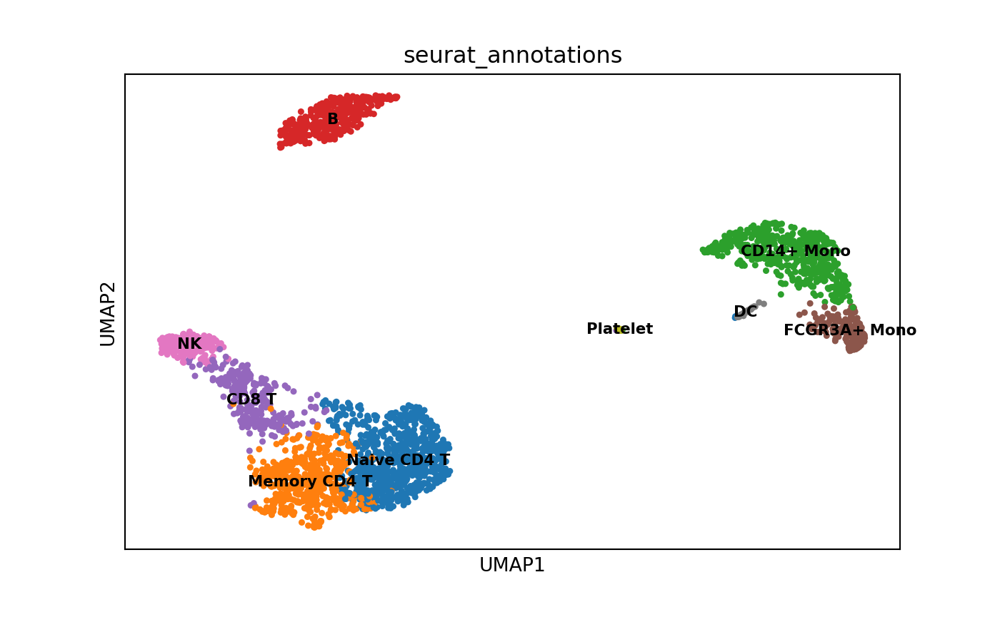

``` python
sc.pl.umap(adata, color='CD14', use_raw=False)
```

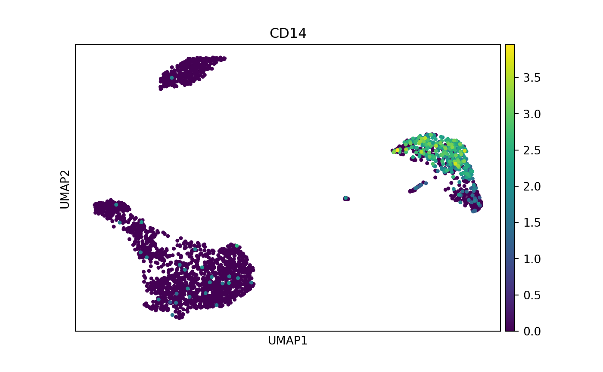

The conversion preserves expression patterns - CD14 shows consistent
distribution in both tools.

## Direct Loading with LoadH5AD

In addition to the two-step
[`scConvert()`](https://rdrr.io/pkg/scConvert/man/scConvert-package.html) +
[`scLoadH5Seurat()`](https://mianaz.github.io/scConvert/reference/scLoadH5Seurat.md)
workflow shown above, scConvert provides
[`LoadH5AD()`](https://mianaz.github.io/scConvert/reference/LoadH5AD.md)
for loading h5ad files directly into Seurat objects without creating an
intermediate h5Seurat file.

``` r

# One-step: load h5ad directly into a Seurat object
pbmc_direct <- LoadH5AD("pbmc3k.h5ad", verbose = TRUE)

# Compare with the two-step approach
cat("Direct cells:", ncol(pbmc_direct), "| Two-step cells:", ncol(pbmc), "\n")
#> Direct cells: 2638 | Two-step cells: 2638
cat("Direct reductions:", paste(names(pbmc_direct@reductions), collapse = ", "), "\n")
#> Direct reductions: pca, umap
```

[`LoadH5AD()`](https://mianaz.github.io/scConvert/reference/LoadH5AD.md)
reads the following from h5ad files:

| h5ad Location | Seurat Destination | Description |
|----|----|----|
| `X` | Default assay `data` layer | Expression matrix (sparse or dense) |
| `raw/X` | `counts` layer | Raw counts if present |
| `layers/*` | Additional layers | Named layers mapped to Seurat slots |
| `obs` | `meta.data` | Cell metadata (categorical preserved as factors) |
| `var` | Feature metadata | Gene-level annotations |
| `var['highly_variable']` | [`VariableFeatures()`](https://satijalab.github.io/seurat-object/reference/VariableFeatures.html) | Variable feature selection |
| `obsm/X_umap` | `reductions$umap` | UMAP coordinates |
| `obsm/X_pca` | `reductions$pca` | PCA embeddings |
| `obsm/X_tsne` | `reductions$tsne` | tSNE coordinates |
| `obsm/spatial` | Spatial coordinates | Via [`ConvertH5ADSpatialToSeurat()`](https://mianaz.github.io/scConvert/reference/ConvertH5ADSpatialToSeurat.md) |
| `obsp/connectivities` | `graphs$RNA_snn` | SNN graph |
| `obsp/distances` | `graphs$RNA_nn` | Distance graph |
| `uns/*` | `misc` | Unstructured annotations |

**When to use each approach:**

| Scenario | Recommended |
|----|----|
| Quick exploration of an h5ad file | [`LoadH5AD()`](https://mianaz.github.io/scConvert/reference/LoadH5AD.md) |
| Round-trip editing (load, modify, re-export) | [`scConvert()`](https://rdrr.io/pkg/scConvert/man/scConvert-package.html) + [`scLoadH5Seurat()`](https://mianaz.github.io/scConvert/reference/scLoadH5Seurat.md) |
| Need h5Seurat for other tools | [`scConvert()`](https://rdrr.io/pkg/scConvert/man/scConvert-package.html) |
| Loading scanpy-processed data for Seurat analysis | [`LoadH5AD()`](https://mianaz.github.io/scConvert/reference/LoadH5AD.md) |
| Working with spatial h5ad from CellxGene | [`LoadH5AD()`](https://mianaz.github.io/scConvert/reference/LoadH5AD.md) |

## Converting from AnnData to Seurat via h5Seurat

To demonstrate conversion from AnnData to Seurat, we’ll use a colorectal
cancer sample from [CellxGene](https://cellxgene.cziscience.com).

``` r

h5ad_path <- system.file("testdata", "crc_sample.h5ad", package = "scConvert")
if (file.exists(h5ad_path)) {
  file.copy(h5ad_path, "crc_sample.h5ad", overwrite = TRUE)
} else {
  download.file(
    "https://datasets.cellxgene.cziscience.com/91cf9a95-0b9a-4ece-b8eb-7b9e3409a0d3.h5ad",
    "crc_sample.h5ad", mode = "wb"
  )
}
```

View the h5ad file in Scanpy:

``` python
import scanpy as sc
adata_crc = sc.read_h5ad("crc_sample.h5ad")
print(adata_crc)
#> AnnData object with n_obs × n_vars = 935 × 25344
#>     obs: 'total_counts', 'log1p_total_counts', 'Sample ID', 'PhenoGraph_clusters', 'Patient', 'Primary Site', 'Sample Type', 'Site', 'DC 1', 'DC 2', 'DC 3', 'DC 4', 'Module Absorptive Intestine Score', 'Module EMT Score', 'Module Injury Repair Score', 'Module Squamous Score', 'Module Neuroendocrine Score', 'Module Endoderm Development Score', 'Module Tumor ISC-like Score', 'Module Secretory Intestine Score', 'Module Intestine Score', 'palantir_pseudotime', 'palantir_neuroendocrine_branch_probability', 'palantir_squamous_branch_probability', 'Fetal, Conserved', 'Module Osteoblast Score', 'Treatment', 'donor_id', 'development_stage_ontology_term_id', 'sex_ontology_term_id', 'self_reported_ethnicity_ontology_term_id', 'disease_ontology_term_id', 'tissue_type', 'tissue_ontology_term_id', 'cell_type_ontology_term_id', 'assay_ontology_term_id', 'suspension_type', 'Tumor Status', 'is_primary_data', 'cell_type', 'assay', 'disease', 'sex', 'tissue', 'self_reported_ethnicity', 'development_stage', 'observation_joinid'
#>     var: 'total_counts', 'highly_variable', 'gene', 'feature_is_filtered', 'feature_name', 'feature_reference', 'feature_biotype', 'feature_length', 'feature_type'
#>     uns: 'citation', 'default_embedding', 'neighbors', 'organism', 'organism_ontology_term_id', 'schema_reference', 'schema_version', 'title'
#>     obsm: 'X_umap'
```

CellxGene datasets use Ensembl IDs as `var_names` by default. The
`feature_name` column contains gene symbols. During conversion,
scConvert automatically uses gene symbols when `feature_name` is
available.

> **Note on data layers**: During conversion, AnnData’s `X` matrix
> (typically log-normalized data indicated by `log1p_total_counts` in
> obs) is stored in Seurat’s `data` layer. If `raw/X` exists, it becomes
> the `counts` layer.

Visualize with scanpy before conversion:

``` python
sc.pl.umap(adata_crc, color='tissue')
```

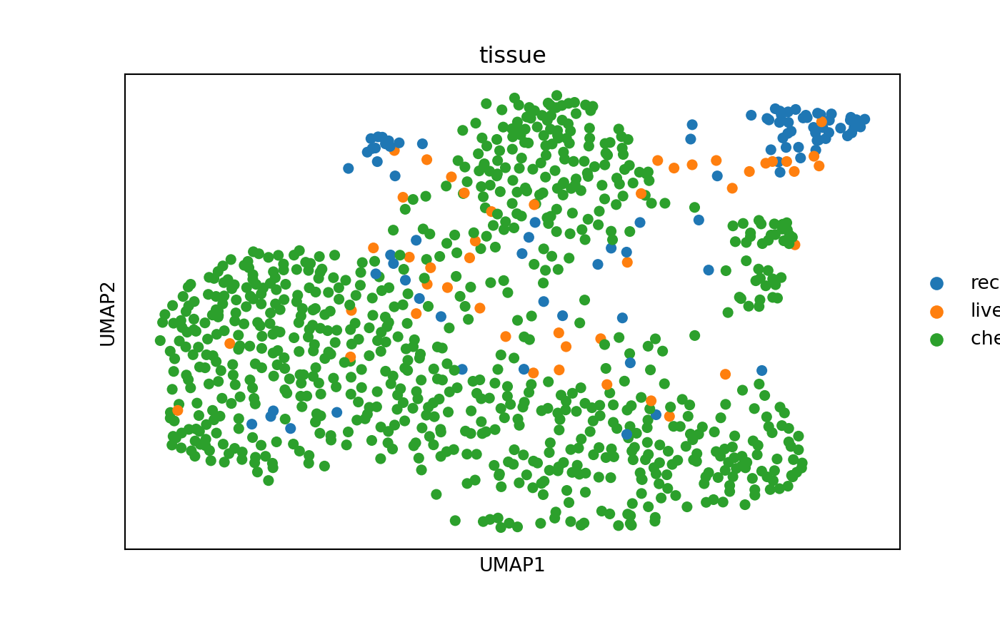

``` python
import pandas as pd

sc.pp.normalize_total(adata_crc, target_sum=1e4)
sc.pp.log1p(adata_crc)

# Set gene symbols as var_names (force string conversion from Categorical)
adata_crc.var_names = pd.Index(adata_crc.var['feature_name'].astype(str).values)
adata_crc.var_names_make_unique()

adata_crc.write_h5ad("crc_normalized.h5ad")

sc.pl.umap(adata_crc, color='EPCAM', use_raw=False, title='EPCAM')
```

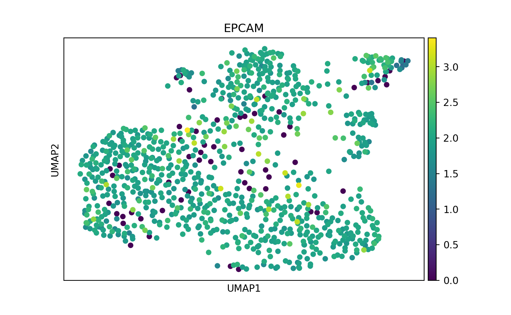

Convert to Seurat:

``` r

scConvert("crc_normalized.h5ad", dest = "h5seurat", overwrite = TRUE)
crc <- scLoadH5Seurat("crc_normalized.h5seurat")

# Verify layer mapping: X -> data (log-normalized), raw/X -> counts (if exists)
cat("Layers:", paste(Layers(crc), collapse = ", "), "\n")
#> Layers: counts, data
cat("Data layer range:", round(range(GetAssayData(crc, layer = "data")[1:100, 1:10]), 2), "\n")
#> Data layer range: 0 2.77
crc
#> An object of class Seurat 
#> 25344 features across 935 samples within 1 assay 
#> Active assay: RNA (25344 features, 3466 variable features)
#>  2 layers present: counts, data
#>  1 dimensional reduction calculated: umap
```

### Visualize Converted Data

The UMAP coordinates and normalized expression from scanpy are
preserved:

``` r

DimPlot(crc, reduction = "umap", group.by = "tissue", pt.size = 0.5)
```

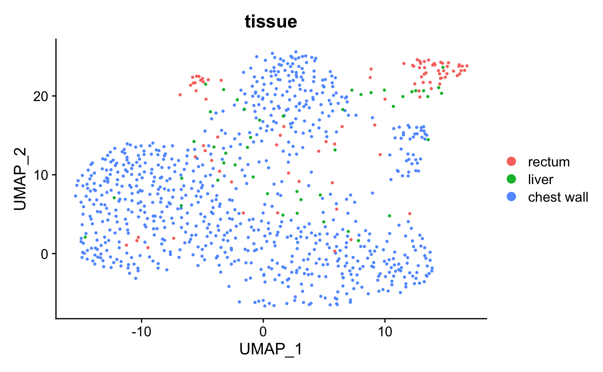

``` r

FeaturePlot(crc, features = "EPCAM", pt.size = 0.5)
```

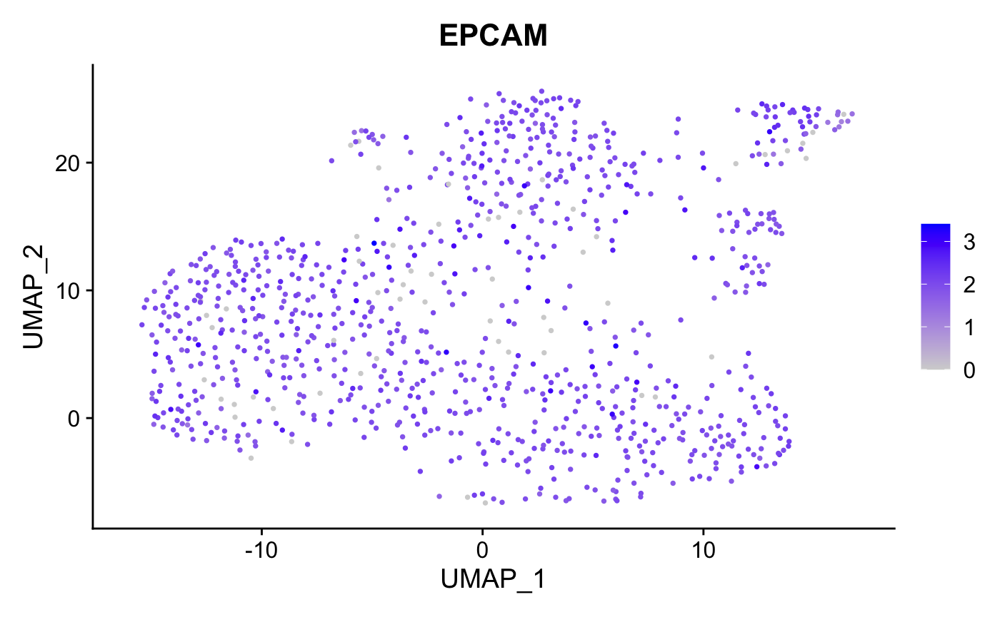

The conversion preserves expression patterns - EPCAM shows consistent
distribution in both tools.

## Visium Spatial Data Conversion

For spatial transcriptomics data, we use the stxBrain dataset from
SeuratData (Visium v2 format):

``` r

library(SeuratData)
if (!"stxBrain" %in% rownames(InstalledData())) {
  InstallData("stxBrain")
}

brain <- UpdateSeuratObject(LoadData("stxBrain", type = "anterior1"))
brain <- NormalizeData(brain)
cat("Layers:", paste(Layers(brain), collapse = ", "), "\n")
#> Layers: counts, data

SpatialFeaturePlot(brain, features = "Hpca")
```

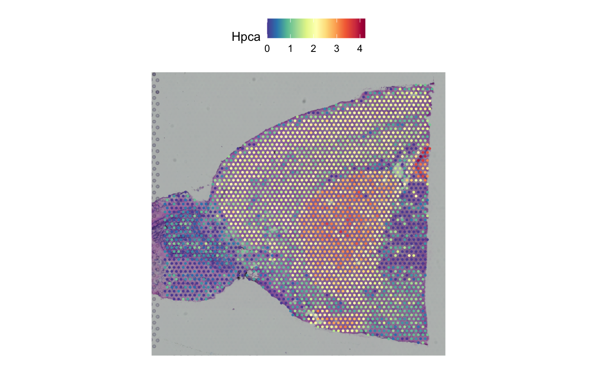

Convert to h5ad using the direct pipeline:

``` r

SeuratToH5AD(brain, "stxBrain.h5ad", overwrite = TRUE)
```

View in Python with Squidpy:

``` python
import squidpy as sq
import scanpy as sc

adata_spatial = sc.read_h5ad("stxBrain.h5ad")
print(adata_spatial)
#> AnnData object with n_obs × n_vars = 2696 × 31053
#>     obs: 'orig.ident', 'nCount_Spatial', 'nFeature_Spatial', 'slice', 'region'
#>     uns: 'spatial'
#>     obsm: 'spatial'

sq.pl.spatial_scatter(adata_spatial, color="Hpca", library_id="anterior1",
                      img_res_key="lowres", size=1, alpha=0.5, use_raw=False)
```

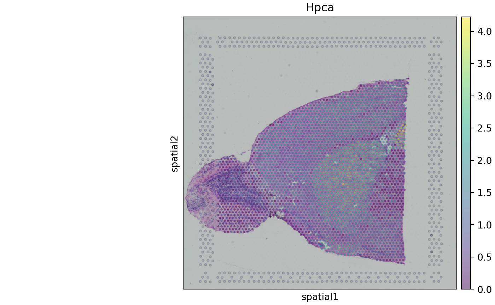

## Multi-assay Conversion (CITE-seq)

For multi-modal data like CITE-seq, each assay must be converted
separately since h5ad format only supports a single matrix per file.

**Conversion behavior:**

- **No assay specified**: Only the default assay is converted
- **Single assay specified**: That specific assay is converted
- **Multiple assays**: Must call the function multiple times, once per
  assay

This example uses the `cbmc` dataset from SeuratData:

``` r

library(SeuratData)
if (!"cbmc" %in% rownames(InstalledData())) {
  InstallData("cbmc")
}
data("cbmc", package = "cbmc.SeuratData")
cbmc <- UpdateSeuratObject(cbmc)

cat("Assays:", paste(Assays(cbmc), collapse = ", "), "\n")
#> Assays: RNA, ADT

# Process RNA for visualization
DefaultAssay(cbmc) <- "RNA"
cbmc <- NormalizeData(cbmc, verbose = FALSE)
cbmc <- FindVariableFeatures(cbmc, verbose = FALSE)
cbmc <- ScaleData(cbmc, verbose = FALSE)
cbmc <- RunPCA(cbmc, verbose = FALSE)
cbmc <- RunUMAP(cbmc, dims = 1:30, verbose = FALSE)

# Normalize ADT with CLR
cbmc <- NormalizeData(cbmc, assay = "ADT", normalization.method = "CLR", verbose = FALSE)
```

Visualize RNA and ADT markers before conversion:

``` r

library(patchwork)
p1 <- FeaturePlot(cbmc, features = "CD3D", pt.size = 0.3) + ggtitle("CD3D (RNA)")
DefaultAssay(cbmc) <- "ADT"
p2 <- FeaturePlot(cbmc, features = "adt_CD3", pt.size = 0.3) + ggtitle("CD3 protein (ADT)")
p1 + p2
```

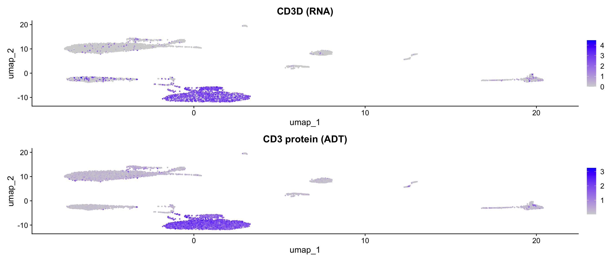

Convert RNA assay to h5ad:

``` r

DefaultAssay(cbmc) <- "RNA"
scSaveH5Seurat(cbmc, "cbmc_rna.h5seurat", overwrite = TRUE)
scConvert("cbmc_rna.h5seurat", dest = "h5ad", overwrite = TRUE)
```

Verify and visualize the converted file in scanpy:

``` python
import scanpy as sc
adata_rna = sc.read_h5ad("cbmc_rna.h5ad")
print(adata_rna)
#> AnnData object with n_obs × n_vars = 8617 × 20501
#>     obs: 'orig.ident', 'nCount_RNA', 'nFeature_RNA', 'nCount_ADT', 'nFeature_ADT', 'rna_annotations', 'protein_annotations'
#>     var: 'vst.mean', 'vst.variance', 'vst.variance.expected', 'vst.variance.standardized', 'vst.variable'
#>     uns: 'n_variable_features', 'seurat'
#>     obsm: 'X_pca', 'X_umap'
#>     varm: 'PCs'

sc.pl.umap(adata_rna, color='CD3D', use_raw=False, title='CD3D (RNA, from h5ad)')
```

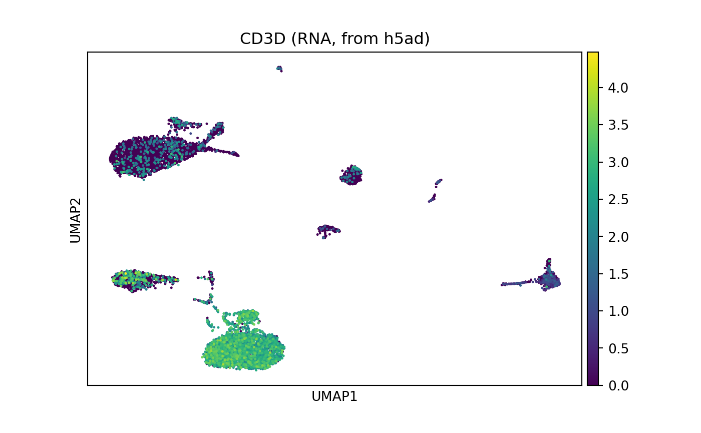

The h5ad file preserves the full structure: expression matrix (X), cell
metadata (obs), gene info (var), and UMAP coordinates.

Convert the ADT assay separately:

``` r

# Convert ADT assay
DefaultAssay(cbmc) <- "ADT"
scSaveH5Seurat(cbmc, "cbmc_adt.h5seurat", overwrite = TRUE)
scConvert("cbmc_adt.h5seurat", dest = "h5ad", overwrite = TRUE)
```

``` python
import scanpy as sc
adata_adt = sc.read_h5ad("cbmc_adt.h5ad")
print(adata_adt)
#> AnnData object with n_obs × n_vars = 8617 × 10
#>     obs: 'orig.ident', 'nCount_RNA', 'nFeature_RNA', 'nCount_ADT', 'nFeature_ADT', 'rna_annotations', 'protein_annotations'
#>     var: 'features'
#>     uns: 'seurat'
#>     obsm: 'X_umap'
print("ADT features:", list(adata_adt.var_names)[:10])
#> ADT features: ['CD3', 'CD4', 'CD8', 'CD45RA', 'CD56', 'CD16', 'CD11c', 'CD14', 'CD19', 'CD34']
```

Each assay produces a separate h5ad file with the same cell metadata but
different features.

> **Note on multi-modal formats**: For true multi-modal
> interoperability, consider the [MuData/h5mu
> format](https://muon.scverse.org/) from the scverse ecosystem.
> scConvert provides native
> [`SaveH5MU()`](https://mianaz.github.io/scConvert/reference/SaveH5MU.md)
> and
> [`LoadH5MU()`](https://mianaz.github.io/scConvert/reference/LoadH5MU.md)
> functions for reading and writing h5mu files with no external
> dependencies. See
> [`vignette("multimodal-h5mu")`](https://mianaz.github.io/scConvert/articles/multimodal-h5mu.md)
> for details.

## Spatial h5ad to Seurat

Converting native spatial h5ad files to Seurat is fully supported. We
use a Visium colon sample from
[CellxGene](https://cellxgene.cziscience.com) that was processed with
scanpy/squidpy standard workflows:

``` r

cache_dir <- tools::R_user_dir("scConvert", which = "cache")
cache_path <- file.path(cache_dir, "visium_colon.h5ad")

if (!file.exists(cache_path)) {
  dir.create(cache_dir, recursive = TRUE, showWarnings = FALSE)
  message("Downloading Visium colon dataset (~1.7GB)...")
  download.file(
    "https://datasets.cellxgene.cziscience.com/ab9f4860-c0e3-444b-a982-38c13f0be6f5.h5ad",
    cache_path, mode = "wb"
  )
}
file.copy(cache_path, "visium_colon.h5ad", overwrite = TRUE)
#> [1] TRUE
```

View the native spatial h5ad in Python:

``` python
import scanpy as sc
adata_spatial = sc.read_h5ad("visium_colon.h5ad")
print(adata_spatial)
#> AnnData object with n_obs × n_vars = 4992 × 32397
#>     obs: 'in_tissue', 'array_row', 'array_col', 'n_genes_by_counts', 'log1p_n_genes_by_counts', 'total_counts', 'log1p_total_counts', 'sangerID', 'region', 'donor_type', 'age', 'facility', 'flushed', 'annotation_final', 'Adip1', 'Adip2', 'Adip3', 'B', 'B_plasma', 'CD14+Mo', 'CD16+Mo', 'CD4+T_act', 'CD4+T_naive', 'CD8+T_cytox', 'CD8+T_em', 'CD8+T_te', 'CD8+T_trans', 'DC', 'EC10_CMC-like', 'EC1_cap', 'EC2_cap', 'EC3_cap', 'EC4_immune', 'EC5_art', 'EC6_ven', 'EC7_endocardial', 'EC8_ln', 'FB1', 'FB2', 'FB3', 'FB4_activated', 'FB5', 'FB6', 'ILC', 'LYVE1+IGF1+MP', 'LYVE1+MP_cycling', 'LYVE1+TIMD4+MP', 'MAIT-like', 'Mast', 'Meso', 'MoMP', 'NC1_glial', 'NC2_glial_NGF+', 'NK_CD16hi', 'NK_CD56hi', 'Neut', 'PC1_vent', 'PC2_atria', 'PC3_str', 'SAN_P_cell', 'SMC1_basic', 'SMC2_art', 'T/NK_cycling', 'aCM1', 'aCM2', 'aCM3', 'aCM4', 'AVN_bundle_cell', 'PC4_CMC-like', 'vCM1', 'vCM2', 'vCM3_stressed', 'vCM4', 'vCM5', 'AVN_P_cell', 'CD4+T_Tfh', 'CD4+T_Th1', 'CD4+T_Th2', 'CD4+T_reg', 'NC5_glial', 'aCM5', 'Adip4', 'NC3_glial', 'NC6_schwann', 'EC9_FB-like', 'gdT', 'Adip1_abundance', 'Adip2_abundance', 'Adip3_abundance', 'B_abundance', 'B_plasma_abundance', 'CD14+Mo_abundance', 'CD16+Mo_abundance', 'CD4+T_act_abundance', 'CD4+T_naive_abundance', 'CD8+T_cytox_abundance', 'CD8+T_em_abundance', 'CD8+T_te_abundance', 'CD8+T_trans_abundance', 'DC_abundance', 'EC10_CMC-like_abundance', 'EC1_cap_abundance', 'EC2_cap_abundance', 'EC3_cap_abundance', 'EC4_immune_abundance', 'EC5_art_abundance', 'EC6_ven_abundance', 'EC7_endocardial_abundance', 'EC8_ln_abundance', 'FB1_abundance', 'FB2_abundance', 'FB3_abundance', 'FB4_activated_abundance', 'FB5_abundance', 'FB6_abundance', 'ILC_abundance', 'LYVE1+IGF1+MP_abundance', 'LYVE1+MP_cycling_abundance', 'LYVE1+TIMD4+MP_abundance', 'MAIT-like_abundance', 'Mast_abundance', 'Meso_abundance', 'MoMP_abundance', 'NC1_glial_abundance', 'NC2_glial_NGF+_abundance', 'NK_CD16hi_abundance', 'NK_CD56hi_abundance', 'Neut_abundance', 'PC1_vent_abundance', 'PC2_atria_abundance', 'PC3_str_abundance', 'SAN_P_cell_abundance', 'SMC1_basic_abundance', 'SMC2_art_abundance', 'T/NK_cycling_abundance', 'aCM1_abundance', 'aCM2_abundance', 'aCM3_abundance', 'aCM4_abundance', 'AVN_bundle_cell_abundance', 'PC4_CMC-like_abundance', 'vCM1_abundance', 'vCM2_abundance', 'vCM3_stressed_abundance', 'vCM4_abundance', 'vCM5_abundance', 'AVN_P_cell_abundance', 'CD4+T_Tfh_abundance', 'CD4+T_Th1_abundance', 'CD4+T_Th2_abundance', 'CD4+T_reg_abundance', 'NC5_glial_abundance', 'aCM5_abundance', 'Adip4_abundance', 'NC3_glial_abundance', 'NC6_schwann_abundance', 'EC9_FB-like_abundance', 'gdT_abundance', 'assay_ontology_term_id', 'cell_type_ontology_term_id', 'donor_id', 'development_stage_ontology_term_id', 'disease_ontology_term_id', 'is_primary_data', 'self_reported_ethnicity_ontology_term_id', 'sex_ontology_term_id', 'suspension_type', 'tissue_ontology_term_id', 'tissue_type', 'cell_type', 'assay', 'disease', 'sex', 'tissue', 'self_reported_ethnicity', 'development_stage', 'observation_joinid'
#>     var: 'feature_is_filtered', 'feature_name', 'feature_reference', 'feature_biotype', 'feature_length', 'feature_type'
#>     uns: 'cell_type_ontology_term_id_colors', 'citation', 'fullres_xml_metadata', 'organism', 'organism_ontology_term_id', 'schema_reference', 'schema_version', 'spatial', 'spatial_metadata', 'title'
#>     obsm: 'X_means_cell_abundance_w_sf', 'X_prop', 'X_q05_cell_abundance_w_sf', 'X_q95_cell_abundance_w_sf', 'X_stds_cell_abundance_w_sf', 'spatial'

lib_id = list(adata_spatial.uns['spatial'].keys())[0]
spatial_data = adata_spatial.uns['spatial'][lib_id]
print("\nSpatial library:", lib_id)
#> 
#> Spatial library: HCAHeartST13228106
print("Image keys:", list(spatial_data.get('images', {}).keys()))
#> Image keys: ['fullres', 'hires']
print("in_tissue column:", 'in_tissue' in adata_spatial.obs.columns)
#> in_tissue column: True
```

Normalize, set gene symbols, and save for conversion:

``` python
import squidpy as sq
import scanpy as sc
import pandas as pd

adata_spatial = sc.read_h5ad("visium_colon.h5ad")

# Filter to tissue spots only
adata_spatial = adata_spatial[adata_spatial.obs['in_tissue'] == 1].copy()

sc.pp.normalize_total(adata_spatial, target_sum=1e4)
sc.pp.log1p(adata_spatial)

adata_spatial.var_names = pd.Index(adata_spatial.var['feature_name'].astype(str).values)
adata_spatial.var_names_make_unique()

adata_spatial.write_h5ad("visium_normalized.h5ad")

lib_id = list(adata_spatial.uns['spatial'].keys())[0]
sq.pl.spatial_scatter(adata_spatial, color='ACTC1', library_id=lib_id,
                      size=1, alpha=0.5, use_raw=False, title='ACTC1')
```

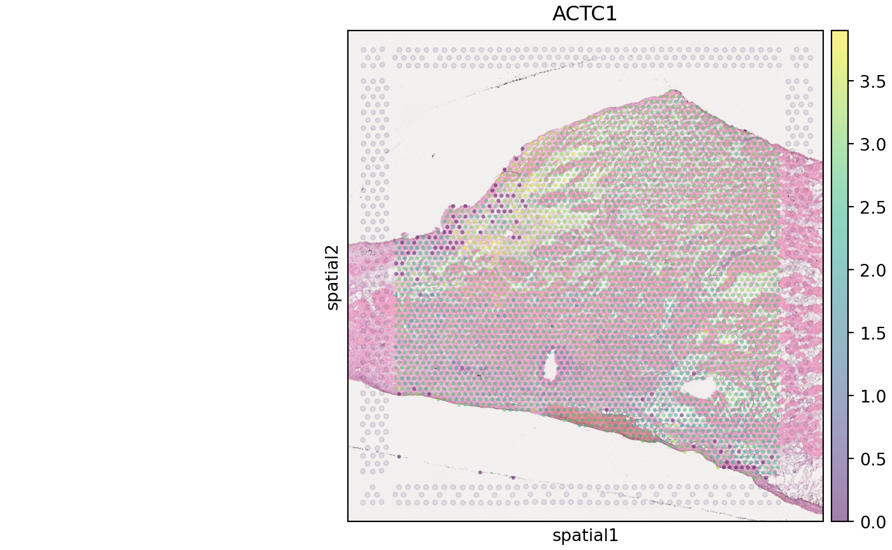

Convert to Seurat:

``` r

scConvert("visium_normalized.h5ad", dest = "h5seurat", overwrite = TRUE)
visium <- scLoadH5Seurat("visium_normalized.h5seurat")

# Verify layer mapping: X -> data (log-normalized)
cat("Layers:", paste(Layers(visium), collapse = ", "), "\n")
#> Layers: counts, data
visium
#> An object of class Seurat 
#> 32397 features across 3452 samples within 1 assay 
#> Active assay: RNA (32397 features, 0 variable features)
#>  2 layers present: counts, data
#>  5 dimensional reductions calculated: means_cell_abundance_w_sf, prop, q05_cell_abundance_w_sf, q95_cell_abundance_w_sf, stds_cell_abundance_w_sf
#>  1 spatial field of view present: HCAHeartST13228106
```

Verify spatial data was preserved:

``` r

SpatialFeaturePlot(visium, features = "ACTC1", pt.size.factor = 3, alpha = 1)
```

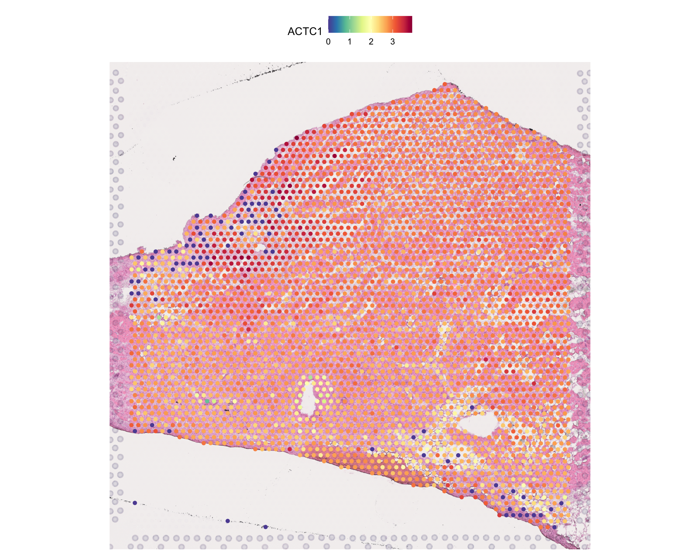

> **Note**: Spatial images and coordinates are preserved during
> conversion. Some scanpy-specific structures (like neighbor graphs in
> `obsp`) may need to be recomputed in Seurat using
> [`FindNeighbors()`](https://satijalab.org/seurat/reference/FindNeighbors.html).

## Data Mapping Reference

This section provides comprehensive mapping tables showing how data is
converted between Seurat and AnnData formats.

### Core Data Slots

**Layer mapping during Seurat -\> h5ad conversion (via h5Seurat):**

| Seurat Slot | h5ad Destination | Notes |
|----|----|----|
| `data` (normalized) | `X` | All genes; used as primary matrix |
| `counts` (raw) | `raw/X` | All genes; if available |
| `scale.data` | *(skipped)* | Only ~2,000 variable features; recompute with `sc.pp.scale()` |
| [`VariableFeatures()`](https://satijalab.github.io/seurat-object/reference/VariableFeatures.html) | `var['highly_variable']` | Boolean column in `var` |

> **Note**: scConvert prioritizes `data` (all genes) over `scale.data`
> (variable features only) when writing `X`. This ensures `var` contains
> the full gene set. Variable features are preserved as a boolean
> `highly_variable` column in `var`. `scale.data` is only used as a
> fallback if neither `data` nor `counts` are available.

**Layer mapping during h5ad -\> Seurat conversion:**

| Seurat Slot | h5ad Source | Condition |
|----|----|----|
| `data` | `X` | Always mapped |
| `counts` | `raw/X` | If `raw` group exists |
| `counts` | `X` | Fallback if no `raw` group |
| `scale.data` | N/A | Not stored in h5ad; recompute with [`ScaleData()`](https://satijalab.org/seurat/reference/ScaleData.html) |

> **Note**: The `data` slot always receives `X` (which typically
> contains log-normalized values in scanpy workflows). If the h5ad file
> has a `raw` group, its `X` matrix becomes `counts`. This matches the
> scanpy convention where `adata.X` holds processed data and
> `adata.raw.X` holds raw counts. Scaled data (z-scores for ~2000
> variable features) is not stored in standard h5ad files and should be
> recomputed in Seurat using
> [`ScaleData()`](https://satijalab.org/seurat/reference/ScaleData.html)
> after conversion.

**Other data structures:**

| Data Type | Seurat Location | AnnData Location |
|----|----|----|
| Cell metadata | `meta.data` | `obs` |
| Feature metadata | `meta.features` | `var` |
| UMAP coords | `reductions$umap` | `obsm['X_umap']` |
| PCA coords | `reductions$pca` | `obsm['X_pca']` |
| Variable features | [`VariableFeatures()`](https://satijalab.github.io/seurat-object/reference/VariableFeatures.html) | `var['highly_variable']` |
| Spatial coords | [`GetTissueCoordinates()`](https://satijalab.github.io/seurat-object/reference/GetTissueCoordinates.html) | `obsm['spatial']` |
| Spatial images | [`Images()`](https://satijalab.github.io/seurat-object/reference/Images.html) | `uns['spatial'][lib]['images']` |
| Neighbor graphs | [`Graphs()`](https://satijalab.github.io/seurat-object/reference/ObjectAccess.html) | `obsp['distances'/'connectivities']` |

### Metadata Column Mapping

Common column name conventions differ between Seurat and scanpy
workflows:

| Seurat (`meta.data`) | AnnData (`obs`) | Description |
|----|----|----|
| `seurat_clusters` | `leiden` / `louvain` | Cluster assignments |
| `orig.ident` | `batch` / `sample` | Sample identifier |
| `nCount_RNA` | `n_counts` / `total_counts` | Total UMI per cell |
| `nFeature_RNA` | `n_genes` / `n_genes_by_counts` | Genes detected per cell |
| `percent.mt` | `pct_counts_mt` / `percent_mito` | Mitochondrial fraction |
| `cell_type` | `cell_type` / `celltype` | Cell type annotations |
| `Phase` | `phase` / `cell_cycle_phase` | Cell cycle phase |

### Column Name Standardization Option

By default, column names are preserved exactly. Use `standardize = TRUE`
for automatic name conversion to scanpy conventions:

| Seurat Name       | scanpy Name (with `standardize=TRUE`) |
|-------------------|---------------------------------------|
| `seurat_clusters` | `clusters`                            |
| `nCount_RNA`      | `n_counts`                            |
| `nFeature_RNA`    | `n_genes`                             |
| `percent.mt`      | `percent_mito`                        |

``` r

# Preserve original names (default)
scConvert("data.h5Seurat", dest = "h5ad")

# Convert to scanpy naming conventions
scConvert("data.h5Seurat", dest = "h5ad", standardize = TRUE)
```

### Expression Scale Handling

**Automatic Layer Detection**: scConvert maps layers based on h5ad
structure:

| h5ad Source | Seurat Destination | Condition             |
|-------------|--------------------|-----------------------|
| `X`         | `data`             | Always                |
| `raw/X`     | `counts`           | If `raw` group exists |
| `X`         | `counts`           | Fallback if no `raw`  |

**When Scales Match**: If h5ad follows scanpy conventions (`X` =
log-normalized, `raw.X` = counts), no additional processing needed after
conversion.

**When Scales Differ**: If `X` contains raw counts instead of normalized
data:

``` r

# Normalize after conversion
seurat_obj <- NormalizeData(seurat_obj)
```

> **Warning**: Do NOT normalize in both Python and R - this
> double-normalizes data.

### Indexing Conventions

Python uses 0-based indexing; R uses 1-based. scConvert handles this
automatically:

| Data Type             | h5ad (Python)     | Seurat (R)          |
|-----------------------|-------------------|---------------------|
| Categorical codes     | 0-indexed         | 1-indexed factors   |
| Cluster labels        | Unchanged         | Unchanged           |
| Sparse matrix indices | 0-based (CSR/CSC) | 0-based (dgCMatrix) |

**Example**: Cluster 0 in scanpy remains labeled “0” in Seurat, but
internally stored as factor level 1.

### Structure Verification

After conversion, verify data integrity:

**h5ad -\> Seurat:**

``` r

# Check layers and dimensions
cat("Layers:", paste(Layers(seurat_obj), collapse = ", "), "\n")
cat("Cells:", ncol(seurat_obj), "Genes:", nrow(seurat_obj), "\n")

# Verify data ranges (log-normalized data typically 0-6)
cat("Data range:", range(GetAssayData(seurat_obj, layer = "data")[1:100, 1:10]), "\n")

# Check metadata preserved
head(seurat_obj[[]])
```

**Seurat -\> h5ad:**

``` python
import scanpy as sc
adata = sc.read_h5ad("converted.h5ad")
print(adata)
print("obs columns:", list(adata.obs.columns))
print("X range:", adata.X.min(), "-", adata.X.max())
```

## Session Info

``` r

sessionInfo()
```
