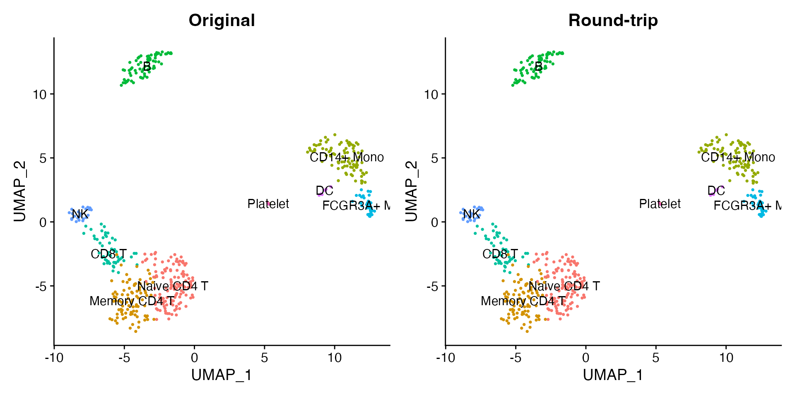
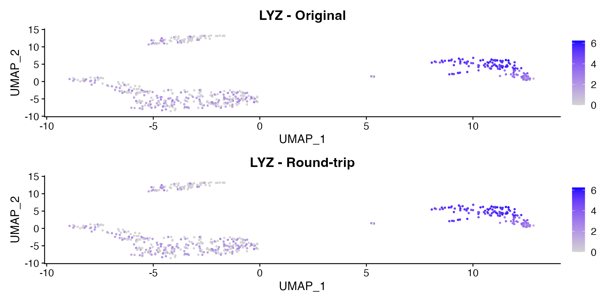

# Convert Between Seurat and AnnData (h5ad)

The h5ad format is the standard file format for the Python single-cell
ecosystem (scanpy, scvi-tools, CellxGene). scConvert provides
[`writeH5AD()`](https://mianaz.github.io/scConvert/reference/writeH5AD.md)
and
[`readH5AD()`](https://mianaz.github.io/scConvert/reference/readH5AD.md)
for round-trip conversion between Seurat objects and h5ad files with no
Python dependency.

## Load the demo data

scConvert ships a 500-cell PBMC dataset with PCA, UMAP, clusters, and
nine annotated cell types. We will use this dataset throughout the
vignette to demonstrate the conversion workflow.

``` r

pbmc <- readRDS(system.file("extdata", "pbmc_demo.rds", package = "scConvert"))
pbmc
#> An object of class Seurat 
#> 2000 features across 500 samples within 1 assay 
#> Active assay: RNA (2000 features, 2000 variable features)
#>  2 layers present: counts, data
#>  2 dimensional reductions calculated: pca, umap
```

The dataset has been fully processed with clustering and dimensional
reductions:

``` r

DimPlot(pbmc, reduction = "umap", group.by = "seurat_annotations",
        label = TRUE, pt.size = 0.5) + NoLegend()
```


We can also look at a marker gene. LYZ is highly expressed in monocytes:

``` r

FeaturePlot(pbmc, features = "LYZ", pt.size = 0.5)
```


## Write to h5ad

[`writeH5AD()`](https://mianaz.github.io/scConvert/reference/writeH5AD.md)
saves the Seurat object as an h5ad file. The normalized data matrix goes
to `X`, raw counts go to `raw/X`, and all metadata, reductions, and
graphs are preserved.

``` r

h5ad_path <- tempfile(fileext = ".h5ad")
writeH5AD(pbmc, h5ad_path, overwrite = TRUE)
cat("h5ad file size:", round(file.size(h5ad_path) / 1e6, 1), "MB\n")
#> h5ad file size: 1 MB
```

## Read it back

[`readH5AD()`](https://mianaz.github.io/scConvert/reference/readH5AD.md)
loads the h5ad file directly into a Seurat object. No intermediate
h5Seurat file is needed.

``` r

pbmc_rt <- readH5AD(h5ad_path)
pbmc_rt
#> An object of class Seurat 
#> 2000 features across 500 samples within 1 assay 
#> Active assay: RNA (2000 features, 2000 variable features)
#>  2 layers present: counts, data
#>  2 dimensional reductions calculated: pca, umap
```

We can confirm that the key components were preserved:

``` r

cat("Cells:", ncol(pbmc_rt), "\n")
#> Cells: 500
cat("Genes:", nrow(pbmc_rt), "\n")
#> Genes: 2000
cat("Reductions:", paste(Reductions(pbmc_rt), collapse = ", "), "\n")
#> Reductions: pca, umap
cat("Metadata cols:", paste(colnames(pbmc_rt[[]]), collapse = ", "), "\n")
#> Metadata cols: orig.ident, nCount_RNA, nFeature_RNA, seurat_annotations, percent.mt, RNA_snn_res.0.5, seurat_clusters
```

## Compare original and round-trip

The UMAP coordinates, cluster labels, and expression values are
preserved through the conversion.

``` r

library(patchwork)
p1 <- DimPlot(pbmc, reduction = "umap", group.by = "seurat_annotations",
              label = TRUE, pt.size = 0.5) + NoLegend() + ggtitle("Original")
p2 <- DimPlot(pbmc_rt, reduction = "umap", group.by = "seurat_annotations",
              label = TRUE, pt.size = 0.5) + NoLegend() + ggtitle("Round-trip")
p1 + p2
```



The expression pattern for LYZ is identical before and after conversion:

``` r

p1 <- FeaturePlot(pbmc, features = "LYZ", pt.size = 0.5) + ggtitle("LYZ - Original")
p2 <- FeaturePlot(pbmc_rt, features = "LYZ", pt.size = 0.5) + ggtitle("LYZ - Round-trip")
p1 + p2
```



We can also confirm that the violin plot distribution matches:

``` r

VlnPlot(pbmc_rt, features = "LYZ", group.by = "seurat_annotations", pt.size = 0) +
  NoLegend()
```


## One-liner with scConvert()

For quick format conversion without loading into R, use the
[`scConvert()`](https://mianaz.github.io/scConvert/reference/scConvert-package.html)
dispatcher. It handles any supported pair of formats automatically:

``` r

h5seurat_path <- tempfile(fileext = ".h5seurat")
scConvert(h5ad_path, dest = h5seurat_path, overwrite = TRUE)
cat("Converted to h5Seurat:", round(file.size(h5seurat_path) / 1e6, 1), "MB\n")
#> Converted to h5Seurat: 1 MB
```

The dispatcher detects the source and destination formats from file
extensions and picks the most efficient conversion path.

## Layer mapping

During conversion, scConvert maps data between Seurat and h5ad as
follows:

| Seurat | h5ad | Description |
|----|----|----|
| `data` layer | `X` | Normalized expression matrix |
| `counts` layer | `raw/X` | Raw counts |
| `meta.data` | `obs` | Cell metadata (categoricals become factors) |
| Feature metadata | `var` | Gene-level annotations |
| `Reductions(obj)` | `obsm/X_pca`, `obsm/X_umap` | Dimensional reductions |
| `Graphs(obj)` | `obsp/connectivities`, `obsp/distances` | Neighbor graphs |
| `misc` | `uns` | Unstructured annotations |

## Python interop (optional)

If you have Python with scanpy installed, you can read the h5ad file
directly. The file produced by
[`writeH5AD()`](https://mianaz.github.io/scConvert/reference/writeH5AD.md)
is fully compatible with scanpy, scvi-tools, and CellxGene.

``` python
# Requires Python with scanpy installed
import scanpy as sc

adata = sc.read_h5ad("pbmc.h5ad")
print(adata)

# Visualize with cluster annotations
sc.pl.umap(adata, color="seurat_annotations")

# Expression patterns are preserved
sc.pl.umap(adata, color="LYZ", use_raw=False)
```

## Clean up

``` r

unlink(h5ad_path)
unlink(h5seurat_path)
```
