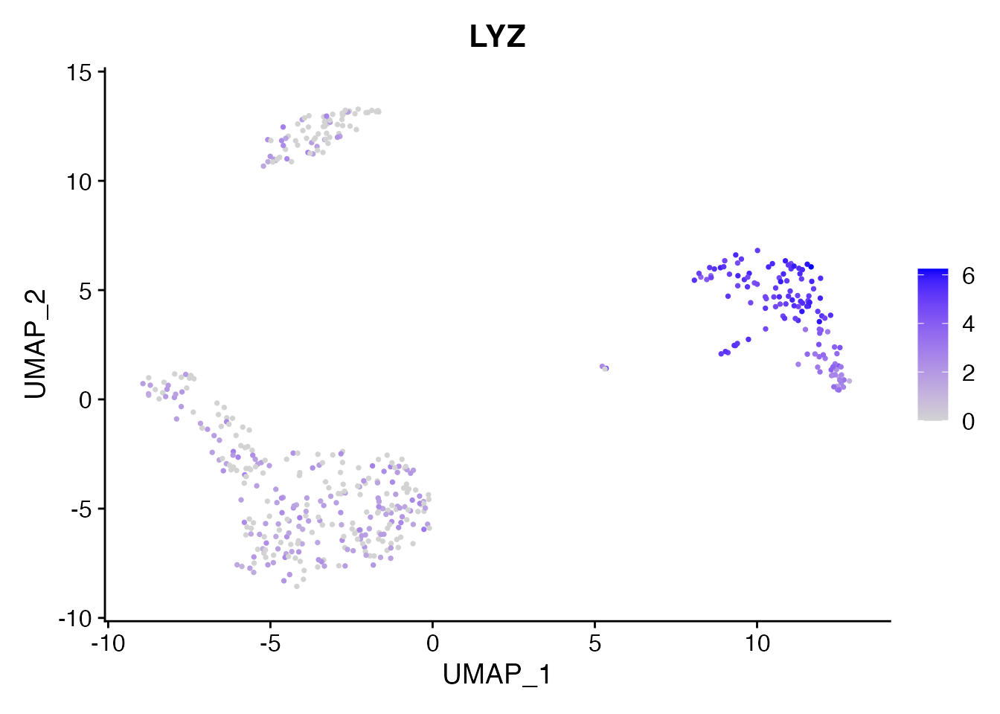
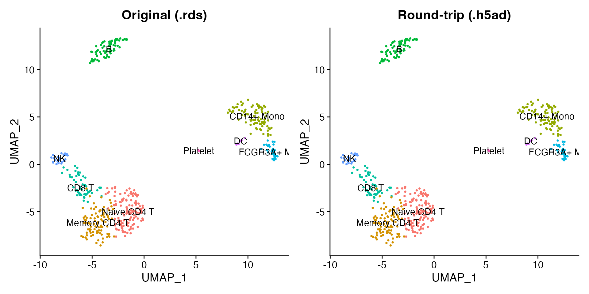

# Convert Between Seurat and AnnData (h5ad)

The h5ad format is the standard file format for the Python single-cell
ecosystem (scanpy, scvi-tools, CELLxGENE). scConvert reads and writes
h5ad natively in R with no Python dependency, making it easy to move
data between Seurat and the entire scverse stack.

## Read an h5ad file

scConvert ships a 500-cell PBMC dataset in h5ad format.
[`readH5AD()`](https://mianaz.github.io/scConvert/reference/readH5AD.md)
loads it directly into a Seurat object – no intermediate conversion step
is needed.

``` r

h5ad_file <- system.file("extdata", "pbmc_demo.h5ad", package = "scConvert")
pbmc <- readH5AD(h5ad_file)
pbmc
#> An object of class Seurat 
#> 2000 features across 500 samples within 1 assay 
#> Active assay: RNA (2000 features, 2000 variable features)
#>  2 layers present: counts, data
#>  2 dimensional reductions calculated: pca, umap
```

## Inspect the loaded object

The reader reconstructs the full Seurat object from the h5ad contents,
including metadata, dimensional reductions, and neighbor graphs.

``` r

cat("Cells:", ncol(pbmc), "\n")
#> Cells: 500
cat("Genes:", nrow(pbmc), "\n")
#> Genes: 2000
cat("Reductions:", paste(Reductions(pbmc), collapse = ", "), "\n")
#> Reductions: pca, umap
cat("Metadata columns:", paste(colnames(pbmc[[]]), collapse = ", "), "\n")
#> Metadata columns: orig.ident, nCount_RNA, nFeature_RNA, seurat_annotations, percent.mt, RNA_snn_res.0.5, seurat_clusters
```

The nine annotated cell types are preserved as a factor column:

``` r

DimPlot(pbmc, reduction = "umap", group.by = "seurat_annotations",
        label = TRUE, pt.size = 0.5) + NoLegend()
```


We can also visualize a marker gene. LYZ is highly expressed in
monocytes:

``` r

FeaturePlot(pbmc, features = "LYZ", pt.size = 0.5)
```



## Write a Seurat object to h5ad

To go in the other direction, load a Seurat object and write it out as
h5ad. The normalized data matrix goes to `X`, raw counts go to `raw/X`,
and all metadata, reductions, and graphs are preserved.

``` r

pbmc_seurat <- readRDS(system.file("extdata", "pbmc_demo.rds", package = "scConvert"))
h5ad_path <- tempfile(fileext = ".h5ad")
writeH5AD(pbmc_seurat, h5ad_path, overwrite = TRUE)
cat("h5ad file size:", round(file.size(h5ad_path) / 1e6, 1), "MB\n")
#> h5ad file size: 1 MB
```

## Verify the round-trip

Read the newly written h5ad back and confirm that expression values,
cluster labels, and UMAP coordinates are preserved.

``` r

pbmc_rt <- readH5AD(h5ad_path)
```

``` r

library(patchwork)
p1 <- DimPlot(pbmc_seurat, reduction = "umap", group.by = "seurat_annotations",
              label = TRUE, pt.size = 0.5) + NoLegend() + ggtitle("Original (.rds)")
p2 <- DimPlot(pbmc_rt, reduction = "umap", group.by = "seurat_annotations",
              label = TRUE, pt.size = 0.5) + NoLegend() + ggtitle("Round-trip (.h5ad)")
p1 + p2
```



## One-liner format conversion

For quick format conversion without loading data into R, use the
[`scConvert()`](https://mianaz.github.io/scConvert/reference/scConvert-package.html)
dispatcher. It detects source and destination formats from file
extensions and picks the most efficient conversion path:

``` r

h5seurat_path <- tempfile(fileext = ".h5seurat")
scConvert(h5ad_path, dest = h5seurat_path, overwrite = TRUE)
cat("Converted h5ad to h5Seurat:", round(file.size(h5seurat_path) / 1e6, 1), "MB\n")
#> Converted h5ad to h5Seurat: 1 MB
```

## Layer mapping reference

During conversion, scConvert maps data between Seurat and h5ad as
follows:

| Seurat | h5ad | Description |
|----|----|----|
| `data` layer | `X` | Normalized expression matrix |
| `counts` layer | `raw/X` | Raw counts |
| `meta.data` | `obs` | Cell metadata (categoricals become factors) |
| Feature metadata | `var` | Gene-level annotations |
| `Reductions(obj)` | `obsm/X_pca`, `obsm/X_umap` | Dimensional reductions |
| `Graphs(obj)` | `obsp/connectivities`, `obsp/distances` | Neighbor graphs |
| `misc` | `uns` | Unstructured annotations |

## Python interop (optional)

The h5ad files produced by
[`writeH5AD()`](https://mianaz.github.io/scConvert/reference/writeH5AD.md)
are fully compatible with scanpy, scvi-tools, and CELLxGENE. If you have
Python with scanpy installed:

``` python
import scanpy as sc

adata = sc.read_h5ad("pbmc_demo.h5ad")
print(adata)

# Visualize with cluster annotations
sc.pl.umap(adata, color="seurat_annotations")

# Expression patterns are preserved
sc.pl.umap(adata, color="LYZ", use_raw=False)
```

## Clean up

``` r

unlink(h5ad_path)
unlink(h5seurat_path)
```
