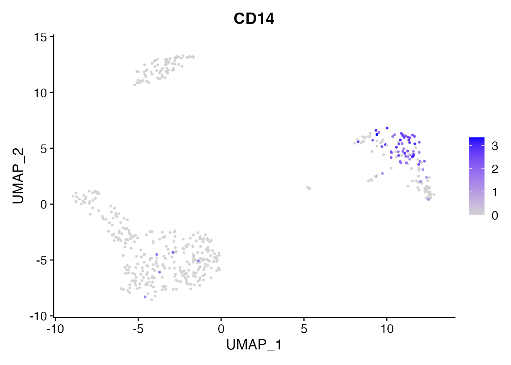
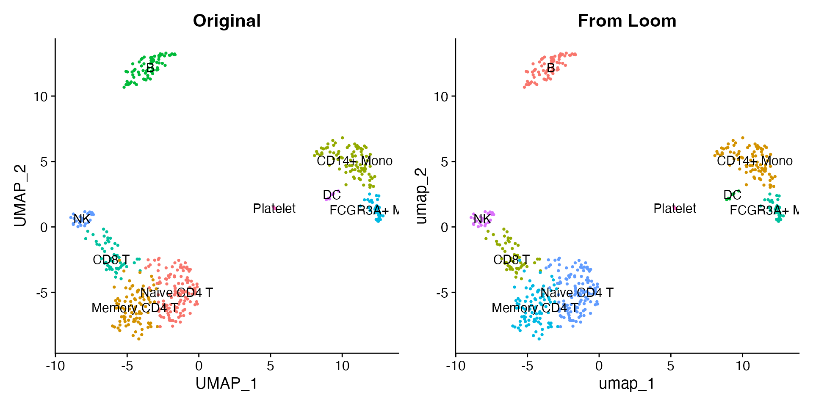
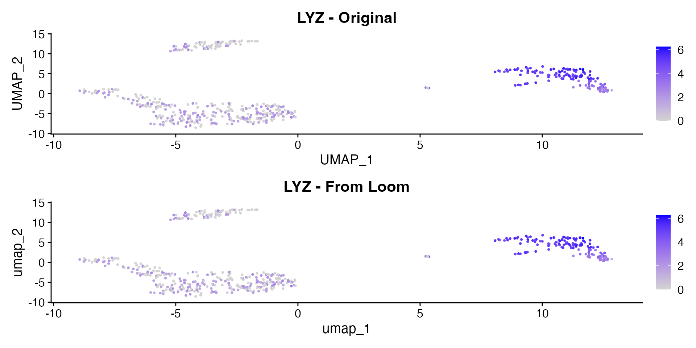

# Convert to Loom Format

The [Loom format](http://loompy.org/) is an HDF5-based file format used
by loompy and velocyto/scVelo for RNA velocity workflows. scConvert
provides
[`writeLoom()`](https://mianaz.github.io/scConvert/reference/writeLoom.md)
and
[`readLoom()`](https://mianaz.github.io/scConvert/reference/readLoom.md)
for converting Seurat objects to and from Loom with no external
dependencies.

## Load the demo data

We use the shipped 500-cell PBMC demo dataset with PCA, UMAP, clusters,
and nine annotated cell types.

``` r

pbmc <- readRDS(system.file("extdata", "pbmc_demo.rds", package = "scConvert"))
pbmc
#> An object of class Seurat 
#> 2000 features across 500 samples within 1 assay 
#> Active assay: RNA (2000 features, 2000 variable features)
#>  2 layers present: counts, data
#>  2 dimensional reductions calculated: pca, umap
```

``` r

DimPlot(pbmc, reduction = "umap", group.by = "seurat_annotations",
        label = TRUE, pt.size = 0.5) + NoLegend()
```


Let us also look at CD14, a marker for monocytes, before conversion:

``` r

FeaturePlot(pbmc, features = "CD14", pt.size = 0.5)
```



## Write to Loom

[`writeLoom()`](https://mianaz.github.io/scConvert/reference/writeLoom.md)
saves the default assay’s expression data as the main matrix, with cell
metadata as column attributes and gene metadata as row attributes.
Dimensional reductions are stored as additional column attributes.

``` r

loom_path <- tempfile(fileext = ".loom")
writeLoom(pbmc, filename = loom_path, overwrite = TRUE)
cat("Loom file size:", round(file.size(loom_path) / 1e6, 1), "MB\n")
#> Loom file size: 2.3 MB
```

## Read it back

[`readLoom()`](https://mianaz.github.io/scConvert/reference/readLoom.md)
loads the Loom file as a Seurat object. The `cells` and `features`
parameters control which column/row attributes are used for cell and
gene names (defaults: `"CellID"` and `"Gene"`).

``` r

pbmc_rt <- readLoom(loom_path)
pbmc_rt
#> An object of class Seurat 
#> 2000 features across 500 samples within 1 assay 
#> Active assay: RNA (2000 features, 0 variable features)
#>  2 layers present: counts, data
#>  1 dimensional reduction calculated: umap
```

``` r

cat("Original:", ncol(pbmc), "cells,", nrow(pbmc), "genes\n")
#> Original: 500 cells, 2000 genes
cat("Loaded:  ", ncol(pbmc_rt), "cells,", nrow(pbmc_rt), "genes\n")
#> Loaded:   500 cells, 2000 genes
cat("Metadata preserved:", paste(
  intersect(colnames(pbmc[[]]), colnames(pbmc_rt[[]])), collapse = ", "), "\n")
#> Metadata preserved: orig.ident, nCount_RNA, nFeature_RNA, seurat_annotations, percent.mt, RNA_snn_res.0.5, seurat_clusters
```

## Compare expression

Expression values and cell metadata are preserved through the
round-trip. Loom stores dimensional reductions as column attributes, so
UMAP and PCA coordinates are available after loading.

``` r

library(patchwork)
p1 <- DimPlot(pbmc, reduction = "umap", group.by = "seurat_annotations",
              label = TRUE, pt.size = 0.5) + NoLegend() + ggtitle("Original")
p2 <- DimPlot(pbmc_rt, reduction = "umap", group.by = "seurat_annotations",
              label = TRUE, pt.size = 0.5) + NoLegend() + ggtitle("From Loom")
p1 + p2
```



The LYZ expression pattern (a monocyte marker) is identical before and
after conversion:

``` r

p1 <- FeaturePlot(pbmc, features = "LYZ", pt.size = 0.5) + ggtitle("LYZ - Original")
p2 <- FeaturePlot(pbmc_rt, features = "LYZ", pt.size = 0.5) + ggtitle("LYZ - From Loom")
p1 + p2
```



A violin plot confirms the per-cluster distribution is preserved:

``` r

VlnPlot(pbmc_rt, features = "CD14", group.by = "seurat_annotations", pt.size = 0) +
  NoLegend()
```


## What is preserved

Loom is a simpler format than h5ad or h5Seurat. Here is a summary of
what round-trips and what does not:

| Component | Preserved? | Notes |
|----|:--:|----|
| Expression matrix | Yes | Stored as `/matrix` |
| Raw counts | Yes | Stored in `/layers/counts` |
| Cell metadata | Yes | Each column becomes a `/col_attrs` entry |
| Gene metadata | Yes | Each column becomes a `/row_attrs` entry |
| PCA / UMAP embeddings | Yes | Stored as column attributes |
| Nearest-neighbor graphs | No | Not native to Loom; recompute with `FindNeighbors()` |

## Using scConvert() for format conversion

You can also convert Loom files to other formats using the
[`scConvert()`](https://mianaz.github.io/scConvert/reference/scConvert-package.html)
dispatcher without loading into R:

``` r

h5ad_path <- tempfile(fileext = ".h5ad")
scConvert(loom_path, dest = h5ad_path, overwrite = TRUE)
cat("Converted Loom to h5ad:", round(file.size(h5ad_path) / 1e6, 1), "MB\n")
#> Converted Loom to h5ad: 0.9 MB
unlink(h5ad_path)
```

## Python interop (optional)

If you have Python with loompy installed, you can read the Loom file
directly.

``` python
# Requires Python with loompy installed
import loompy

with loompy.connect("pbmc.loom") as ds:
    print(f"Shape: {ds.shape[0]} genes x {ds.shape[1]} cells")
    print(f"Row attributes: {list(ds.ra.keys())}")
    print(f"Column attributes: {list(ds.ca.keys())[:10]}")
    print(f"Layers: {list(ds.layers.keys())}")
```

You can also load Loom files into scanpy as AnnData objects:

``` python
# Requires Python with scanpy installed
import scanpy as sc

adata = sc.read_loom("pbmc.loom", sparse=True, cleanup=False)
print(adata)
```

## Clean up

``` r

unlink(loom_path)
```
