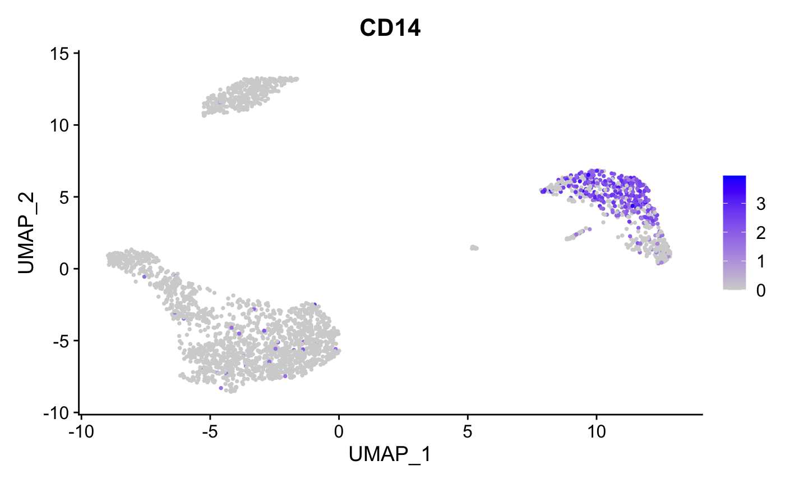
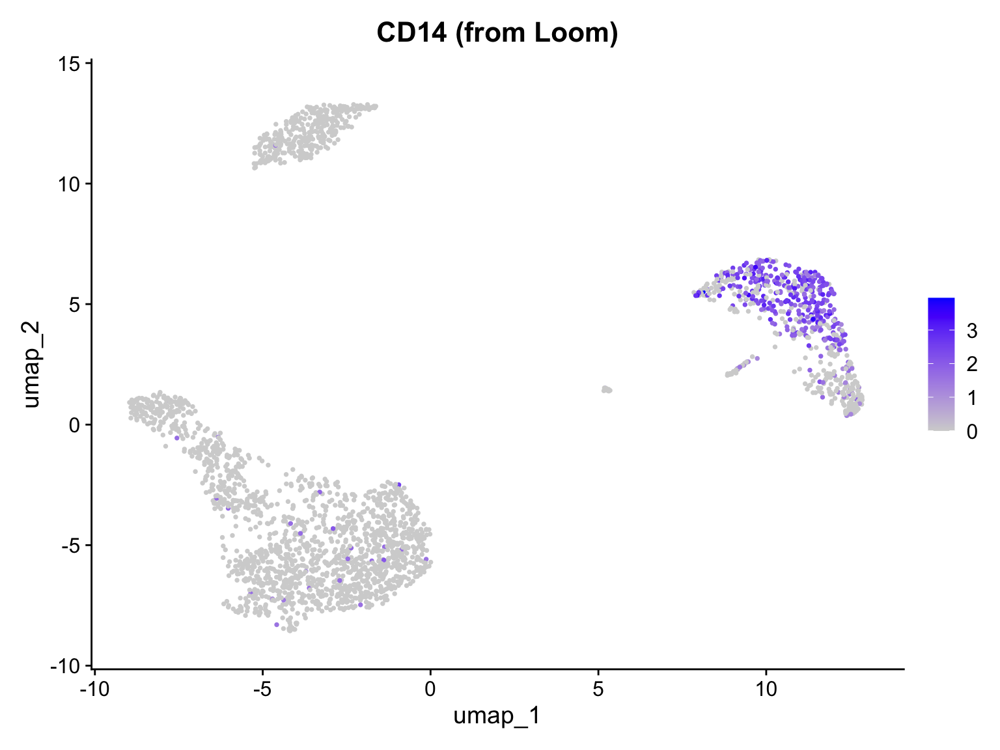

# Conversions: Seurat and Loom

This vignette demonstrates how to convert between Seurat objects and
Loom files using scConvert. The [Loom format](http://loompy.org/) is an
HDF5-based file format commonly used for storing single-cell RNA-seq
data, particularly in RNA velocity workflows with tools like
[velocyto](http://velocyto.org/) and
[scVelo](https://scvelo.readthedocs.io/).

``` r

library(Seurat)
library(scConvert)
library(ggplot2)
```

## Loom File Format Overview

Loom files organize single-cell data in a specific HDF5 structure:

- `/matrix`: Main expression matrix (genes × cells, transposed from
  Seurat convention)
- `/row_attrs`: Gene/feature-level metadata (gene names, coordinates,
  etc.)
- `/col_attrs`: Cell/sample-level metadata (cell IDs, cluster labels,
  etc.)
- `/layers`: Additional expression layers (counts, normalized data,
  spliced/unspliced for velocity)

This format is particularly useful for:

- **RNA velocity analysis**: velocyto and scVelo store spliced/unspliced
  counts in layers
- **Python interoperability**: loompy package provides fast access in
  Python
- **Archival storage**: Self-contained format with all annotations

## Converting from Seurat to Loom

### Basic Conversion

To save a Seurat object as a Loom file, use
[`writeLoom()`](https://mianaz.github.io/scConvert/reference/writeLoom.md):

``` r

library(SeuratData)
if (!"pbmc3k.final" %in% rownames(InstalledData())) {
  InstallData("pbmc3k")
}

data("pbmc3k.final", package = "pbmc3k.SeuratData")
pbmc <- UpdateSeuratObject(pbmc3k.final)
pbmc
#> An object of class Seurat 
#> 13714 features across 2638 samples within 1 assay 
#> Active assay: RNA (13714 features, 2000 variable features)
#>  3 layers present: counts, data, scale.data
#>  2 dimensional reductions calculated: pca, umap
```

``` r

DimPlot(pbmc, reduction = "umap", label = TRUE, pt.size = 0.5) + NoLegend()
```


``` r

FeaturePlot(pbmc, features = "CD14", pt.size = 0.5)
```



Now save to Loom format:

``` r

writeLoom(pbmc, filename = "pbmc3k.loom", overwrite = TRUE, verbose = TRUE)
```

### What Gets Saved

When saving a Seurat object to Loom:

| Seurat Data | Loom Location | Notes |
|----|----|----|
| Default assay data | `/matrix` | Normalized expression |
| Counts layer | `/layers/counts` | Raw counts if different from data |
| Scale.data | `/layers/scale.data` | Scaled data if present |
| Cell names | `/col_attrs/CellID` | Cell barcodes |
| Gene names | `/row_attrs/Gene` | Feature names |
| Cell metadata | `/col_attrs/*` | All columns from `meta.data` |
| Feature metadata | `/row_attrs/*` | All columns from assay meta.features |
| Dimensional reductions | `/reductions/*` | PCA, UMAP embeddings, etc. |
| Graphs | `/col_graphs/*` | SNN graphs if present |

## Viewing Loom Files in Python

The saved Loom file can be opened with loompy or scanpy in Python:

``` python
import loompy

# Connect to the loom file
with loompy.connect("pbmc3k.loom") as ds:
    print(f"Shape: {ds.shape[0]} genes x {ds.shape[1]} cells")
    print(f"\nRow attributes (genes): {list(ds.ra.keys())}")
    print(f"\nColumn attributes (cells): {list(ds.ca.keys())[:10]}...")  # First 10
    print(f"\nLayers: {list(ds.layers.keys())}")
#> Shape: 13714 genes x 2638 cells
#> 
#> Row attributes (genes): ['Gene', 'vst.mean', 'vst.variable', 'vst.variance', 'vst.variance.expected', 'vst.variance.standardized']
#> 
#> Column attributes (cells): ['CellID', 'RNA_snn_res.0.5', 'nCount_RNA', 'nFeature_RNA', 'orig.ident', 'percent.mt', 'seurat_annotations', 'seurat_clusters']...
#> 
#> Layers: ['', 'counts', 'scale.data']
```

With scanpy:

``` python
import scanpy as sc

# Read loom file as AnnData
adata = sc.read_loom("pbmc3k.loom", sparse=True, cleanup=False)
print(adata)
#> AnnData object with n_obs × n_vars = 2638 × 13714
#>     obs: 'RNA_snn_res.0.5', 'nCount_RNA', 'nFeature_RNA', 'orig.ident', 'percent.mt', 'seurat_annotations', 'seurat_clusters'
#>     var: 'vst.mean', 'vst.variable', 'vst.variance', 'vst.variance.expected', 'vst.variance.standardized'
#>     layers: 'counts', 'scale.data'
print("\nColumn attributes:", list(adata.obs.columns)[:10])
#> 
#> Column attributes: ['RNA_snn_res.0.5', 'nCount_RNA', 'nFeature_RNA', 'orig.ident', 'percent.mt', 'seurat_annotations', 'seurat_clusters']
```

## Converting from Loom to Seurat

### Loading Loom Files

Use
[`readLoom()`](https://mianaz.github.io/scConvert/reference/readLoom.md)
to read a Loom file as a Seurat object:

``` r

# Load the loom file we just created
loaded_pbmc <- readLoom("pbmc3k.loom", verbose = TRUE)
loaded_pbmc
#> An object of class Seurat 
#> 13714 features across 2638 samples within 1 assay 
#> Active assay: RNA (13714 features, 0 variable features)
#>  2 layers present: counts, data
#>  1 dimensional reduction calculated: umap
```

``` r

# Verify dimensions match
cat("Original:", ncol(pbmc), "cells,", nrow(pbmc), "genes\n")
#> Original: 2638 cells, 13714 genes
cat("Loaded:  ", ncol(loaded_pbmc), "cells,", nrow(loaded_pbmc), "genes\n")
#> Loaded:   2638 cells, 13714 genes

# Check metadata was preserved
cat("\nMetadata columns preserved:\n")
#> 
#> Metadata columns preserved:
print(intersect(colnames(pbmc[[]]), colnames(loaded_pbmc[[]])))
#> [1] "orig.ident"         "nCount_RNA"         "nFeature_RNA"      
#> [4] "seurat_annotations" "percent.mt"         "RNA_snn_res.0.5"   
#> [7] "seurat_clusters"
```

### Visualize loaded data

``` r

# Loom does not preserve UMAP embeddings, so we show expression data
FeaturePlot(loaded_pbmc, features = "CD14", pt.size = 0.5) + ggtitle("CD14 (from Loom)")
```



### readLoom Parameters

[`readLoom()`](https://mianaz.github.io/scConvert/reference/readLoom.md)
provides several options for customizing the import:

``` r

readLoom(
  file,                    # Path to loom file

  assay = NULL,            # Name for the assay (default: "RNA" or from file)
  cells = "CellID",        # Column attribute containing cell names
  features = "Gene",       # Row attribute containing gene names
  normalized = NULL,       # Layer to load as normalized data
  scaled = NULL,           # Layer to load as scaled data
  filter = "none",         # Filter cells/features by Valid attributes
  verbose = TRUE           # Show progress messages
)
```

### Loading Specific Layers

If your Loom file has additional layers (e.g., from velocyto):

``` r

# Load with specific layers
seurat_obj <- readLoom(
  "velocity_data.loom",
  normalized = "spliced",      # Use spliced counts as normalized
  scaled = "ambiguous"         # Optional scaled layer
)
```

### Loading velocyto Output

Loom files from velocyto contain spliced, unspliced, and ambiguous count
matrices:

``` r

# Load velocyto loom file
# The main matrix typically contains spliced counts
velocity_obj <- readLoom(
  "sample.loom",
  cells = "CellID",
  features = "Gene"
)

# The spliced/unspliced/ambiguous layers can be accessed after loading
# or you may need to load them separately depending on your analysis needs
```

## Round-Trip Conversion

scConvert preserves data integrity during Seurat ↔︎ Loom conversion:

``` r

# Create a simple test object
set.seed(42)
test_obj <- CreateSeuratObject(
  counts = pbmc[["RNA"]]$counts[1:100, 1:50],
  project = "RoundTrip"
)
test_obj$custom_cluster <- sample(c("A", "B", "C"), 50, replace = TRUE)
test_obj$numeric_value <- rnorm(50)

# Save and reload
writeLoom(test_obj, "test_roundtrip.loom", overwrite = TRUE, verbose = FALSE)
reloaded <- readLoom("test_roundtrip.loom", verbose = FALSE)

# Compare
cat("Cell names match:", all(colnames(test_obj) == colnames(reloaded)), "\n")
#> Cell names match: TRUE
cat("Gene names match:", all(rownames(test_obj) == rownames(reloaded)), "\n")
#> Gene names match: TRUE
cat("Metadata columns:", paste(colnames(reloaded[[]]), collapse = ", "), "\n")
#> Metadata columns: orig.ident, nCount_RNA, nFeature_RNA, custom_cluster, numeric_value
```

Verify expression data is preserved:

``` r

original_data <- GetAssayData(test_obj, layer = "data")
reloaded_data <- GetAssayData(reloaded, layer = "data")[
  rownames(original_data),
  colnames(original_data)
]

max_diff <- max(abs(as.matrix(original_data) - as.matrix(reloaded_data)))
cat("Maximum expression difference:", max_diff, "\n")
#> Maximum expression difference: -Inf
```

## Working with RNA Velocity Data

A common use case for Loom files is RNA velocity analysis. Here’s a
typical workflow:

### 1. Generate Loom with velocyto

``` bash
# Run velocyto on Cell Ranger output (command line)
velocyto run10x -m repeat_mask.gtf sample_dir genes.gtf
```

This creates a `.loom` file with spliced/unspliced counts.

### 2. Load in R for QC and Annotation

``` r

# Load velocyto output
velocity_data <- readLoom("sample.loom")

# Perform standard Seurat QC and clustering
velocity_data <- NormalizeData(velocity_data)
velocity_data <- FindVariableFeatures(velocity_data)
velocity_data <- ScaleData(velocity_data)
velocity_data <- RunPCA(velocity_data)
velocity_data <- FindNeighbors(velocity_data)
velocity_data <- FindClusters(velocity_data)
velocity_data <- RunUMAP(velocity_data, dims = 1:30)

# Add cell type annotations
velocity_data$cell_type <- ...  # Your annotation method

# Save back to loom with annotations
writeLoom(velocity_data, "sample_annotated.loom", overwrite = TRUE)
```

### 3. Continue Velocity Analysis in Python

``` python
import scvelo as scv

# Load annotated loom file
adata = scv.read("sample_annotated.loom")

# Run velocity analysis
scv.pp.filter_and_normalize(adata)
scv.pp.moments(adata)
scv.tl.velocity(adata)
scv.tl.velocity_graph(adata)

# Visualize with Seurat annotations
scv.pl.velocity_embedding_stream(adata, color='cell_type')
```

## Data Mapping Reference

### Seurat to Loom

| Seurat Location | Loom Location | Notes |
|----|----|----|
| `GetAssayData(layer = "data")` | `/matrix` | Main expression matrix |
| `GetAssayData(layer = "counts")` | `/layers/counts` | If different from data |
| `GetAssayData(layer = "scale.data")` | `/layers/scale.data` | If present |
| `colnames(obj)` | `/col_attrs/CellID` | Cell barcodes |
| `rownames(obj)` | `/row_attrs/Gene` | Gene names |
| `obj[[]]` (meta.data) | `/col_attrs/*` | Each column as attribute |
| `obj[[assay]][[]]` | `/row_attrs/*` | Feature metadata |
| `Embeddings(obj, "pca")` | `/reductions/pca/embeddings` | Transposed |
| `Loadings(obj, "pca")` | `/reductions/pca/loadings` | If present |
| `Stdev(obj, "pca")` | `/reductions/pca/stdev` | If present |

### Loom to Seurat

| Loom Location | Seurat Destination | Notes |
|----|----|----|
| `/matrix` | `data` layer | Stored as counts if no normalization detected |
| `/layers/*` | Additional layers | Via `normalized`/`scaled` parameters |
| `/col_attrs/CellID` | Cell names | Configurable via `cells` parameter |
| `/row_attrs/Gene` | Feature names | Configurable via `features` parameter |
| `/col_attrs/*` | `meta.data` | All except CellID and Valid |
| `/row_attrs/*` | `meta.features` | All except Gene and Valid |
| `/reductions/*/embeddings` | [`Reductions()`](https://satijalab.github.io/seurat-object/reference/ObjectAccess.html) | If present |
| `/col_graphs/*` | [`Graphs()`](https://satijalab.github.io/seurat-object/reference/ObjectAccess.html) | SNN/KNN graphs |

## Comparison with Other Formats

| Feature           | Loom             | h5Seurat       | h5ad            |
|-------------------|------------------|----------------|-----------------|
| Primary ecosystem | velocyto, loompy | Seurat         | scanpy          |
| Multiple assays   | Via layers       | Native support | Single X matrix |
| Spatial data      | Limited          | Full support   | Full support    |
| RNA velocity      | Native           | Not standard   | Via layers      |
| Graph storage     | Native           | Native         | In obsp         |
| Python access     | loompy, scanpy   | Limited        | scanpy          |
| R access          | scConvert        | scConvert      | scConvert       |

**When to use Loom:**

- RNA velocity analysis with velocyto/scVelo
- Workflows requiring loompy compatibility
- Simpler single-assay datasets

**When to use h5Seurat:**

- Seurat-native workflows
- Multi-modal data (CITE-seq)
- Full Seurat object preservation

**When to use h5ad:**

- scanpy-based workflows
- Spatial transcriptomics with squidpy
- CellxGene data sharing

## Troubleshooting

### Common Issues

**“Cannot find feature names dataset”**

The Loom file uses non-standard attribute names. Specify them
explicitly:

``` r

# Check what attributes exist
h5 <- hdf5r::H5File$new("data.loom", mode = "r")
print(names(h5[["row_attrs"]]))
h5$close_all()

# Use the correct attribute name
obj <- readLoom("data.loom", features = "gene_name")
```

**“Cannot find cell names dataset”**

Similar to above, check column attributes:

``` r

h5 <- hdf5r::H5File$new("data.loom", mode = "r")
print(names(h5[["col_attrs"]]))
h5$close_all()

# Use the correct attribute name
obj <- readLoom("data.loom", cells = "obs_names")
```

**Duplicate feature names**

Loom files sometimes have duplicate gene names. scConvert will make them
unique with a warning:

``` r

# Warning: Duplicate feature names found, making unique
obj <- readLoom("data.loom")

# The names will be Gene, Gene.1, Gene.2, etc.
```

## Direct Streaming Converters

In addition to
[`readLoom()`](https://mianaz.github.io/scConvert/reference/readLoom.md)
and
[`writeLoom()`](https://mianaz.github.io/scConvert/reference/writeLoom.md),
scConvert provides direct streaming converters that bypass Seurat object
construction. These are faster for format-to-format conversion because
they operate directly on the HDF5 files:

``` r

# Loom <-> h5Seurat (direct HDF5 streaming)
LoomToH5Seurat("data.loom", "data.h5seurat")
H5SeuratToLoom("data.h5seurat", "data.loom")

# Loom <-> h5ad (via temp h5seurat, no Seurat object)
LoomToH5AD("data.loom", "data.h5ad")
H5ADToLoom("data.h5ad", "data.loom")

# Loom <-> Zarr
LoomToZarr("data.loom", "data.zarr")
ZarrToLoom("data.zarr", "data.loom")

# Loom <-> h5mu
LoomToH5MU("data.loom", "data.h5mu")
H5MUToLoom("data.h5mu", "data.loom")
```

The C CLI binary also supports Loom for maximum speed:

``` bash
scconvert data.h5ad data.loom
scconvert data.loom data.h5seurat
```

## Session Info

``` r

sessionInfo()
```
