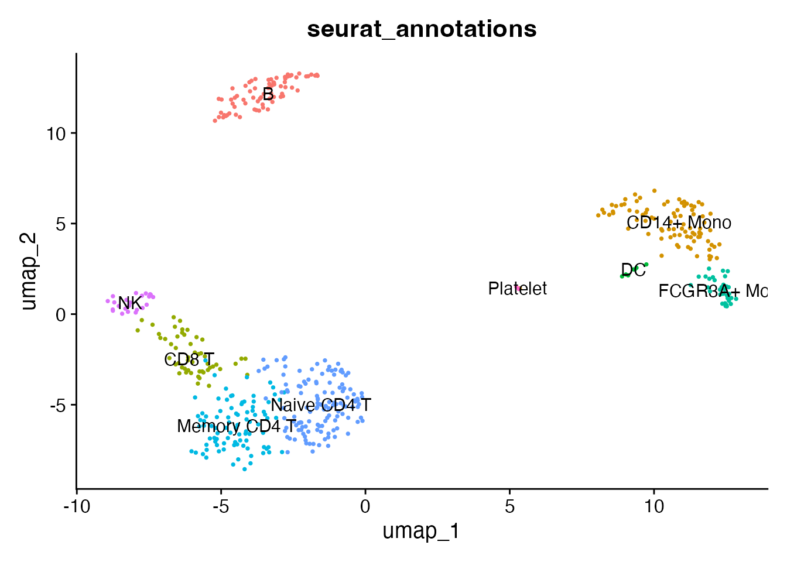
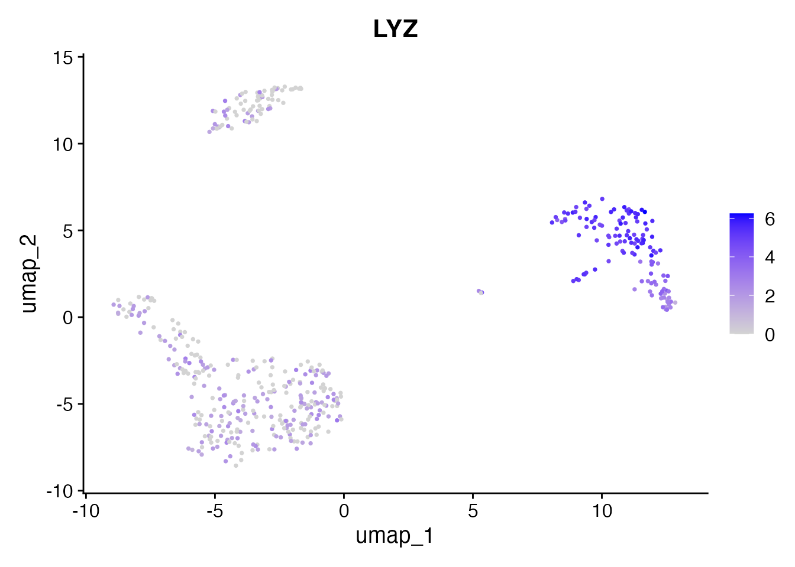
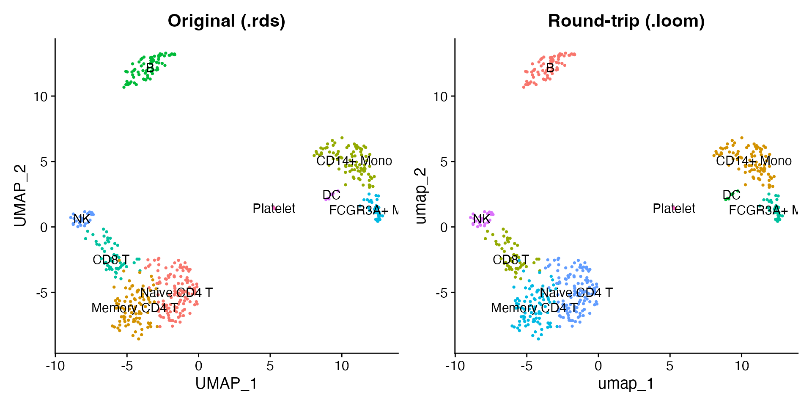
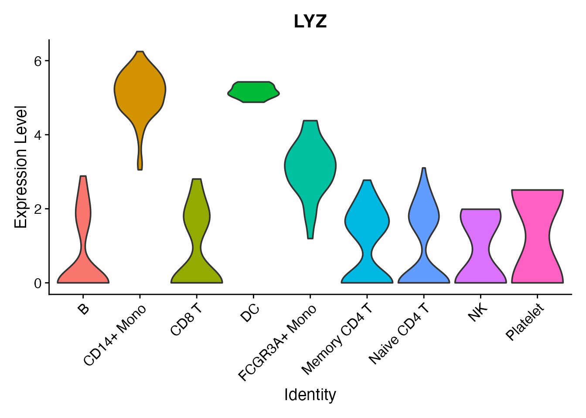

# Convert to Loom Format

The [Loom format](http://loompy.org/) is an HDF5-based file format used
by loompy and RNA velocity tools (velocyto, scVelo). scConvert provides
[`readLoom()`](https://mianaz.github.io/scConvert/reference/readLoom.md)
and
[`writeLoom()`](https://mianaz.github.io/scConvert/reference/writeLoom.md)
for round-trip conversion between Seurat objects and Loom files with no
external dependencies.

## Read a Loom file

scConvert ships a 500-cell PBMC dataset in Loom format.
[`readLoom()`](https://mianaz.github.io/scConvert/reference/readLoom.md)
loads it directly into a Seurat object.

``` r

loom_file <- system.file("extdata", "pbmc_demo.loom", package = "scConvert")
pbmc <- readLoom(loom_file)
pbmc
#> An object of class Seurat 
#> 2000 features across 500 samples within 1 assay 
#> Active assay: RNA (2000 features, 0 variable features)
#>  2 layers present: counts, data
#>  1 dimensional reduction calculated: umap
```

The reader reconstructs cell metadata, gene metadata, and dimensional
reductions from the Loom column and row attributes:

``` r

cat("Cells:", ncol(pbmc), "\n")
#> Cells: 500
cat("Genes:", nrow(pbmc), "\n")
#> Genes: 2000
cat("Reductions:", paste(Reductions(pbmc), collapse = ", "), "\n")
#> Reductions: umap
cat("Metadata columns:", paste(colnames(pbmc[[]]), collapse = ", "), "\n")
#> Metadata columns: orig.ident, nCount_RNA, nFeature_RNA, RNA_snn_res.0.5, percent.mt, seurat_annotations, seurat_clusters, pca
```

The nine annotated cell types are preserved:

``` r

DimPlot(pbmc, reduction = "umap", group.by = "seurat_annotations",
        label = TRUE, pt.size = 0.5) + NoLegend()
```



Expression data is fully available. LYZ is a monocyte marker:

``` r

FeaturePlot(pbmc, features = "LYZ", pt.size = 0.5)
```



## Write a Seurat object to Loom

[`writeLoom()`](https://mianaz.github.io/scConvert/reference/writeLoom.md)
saves the default assay’s expression data as the main matrix, with cell
metadata as column attributes and gene metadata as row attributes.
Dimensional reductions are stored as additional column attributes.

``` r

pbmc_seurat <- readRDS(system.file("extdata", "pbmc_demo.rds", package = "scConvert"))
loom_path <- tempfile(fileext = ".loom")
writeLoom(pbmc_seurat, filename = loom_path, overwrite = TRUE)
cat("Loom file size:", round(file.size(loom_path) / 1e6, 1), "MB\n")
#> Loom file size: 2.3 MB
```

## Verify the round-trip

Read the written Loom file back and compare the UMAP projections.

``` r

pbmc_rt <- readLoom(loom_path)
```

``` r

library(patchwork)
p1 <- DimPlot(pbmc_seurat, reduction = "umap", group.by = "seurat_annotations",
              label = TRUE, pt.size = 0.5) + NoLegend() + ggtitle("Original (.rds)")
p2 <- DimPlot(pbmc_rt, reduction = "umap", group.by = "seurat_annotations",
              label = TRUE, pt.size = 0.5) + NoLegend() + ggtitle("Round-trip (.loom)")
p1 + p2
```



## What is preserved

Loom is a simpler format than h5ad or h5Seurat. Here is a summary of
what round-trips and what does not:

| Component | Preserved? | Notes |
|----|:--:|----|
| Expression matrix | Yes | Stored as `/matrix` |
| Raw counts | Yes | Stored in `/layers/counts` |
| Cell metadata | Yes | Each column becomes a `/col_attrs` entry |
| Gene metadata | Yes | Each column becomes a `/row_attrs` entry |
| PCA / UMAP embeddings | Yes | Stored as column attributes |
| Nearest-neighbor graphs | No | Not native to Loom; recompute with `FindNeighbors()` |

## Per-cluster expression

A violin plot confirms that per-cluster expression distributions are
preserved through Loom conversion:

``` r

VlnPlot(pbmc_rt, features = "LYZ", group.by = "seurat_annotations", pt.size = 0) +
  NoLegend()
```



## Python interop (optional)

The Loom files produced by
[`writeLoom()`](https://mianaz.github.io/scConvert/reference/writeLoom.md)
are compatible with loompy, scanpy, and scVelo.

``` python
import loompy

with loompy.connect("pbmc_demo.loom") as ds:
    print(f"Shape: {ds.shape[0]} genes x {ds.shape[1]} cells")
    print(f"Row attributes: {list(ds.ra.keys())}")
    print(f"Column attributes: {list(ds.ca.keys())[:10]}")
    print(f"Layers: {list(ds.layers.keys())}")
```

``` python
import scanpy as sc

adata = sc.read_loom("pbmc_demo.loom", sparse=True, cleanup=False)
print(adata)
```

## Clean up

``` r

unlink(loom_path)
```
