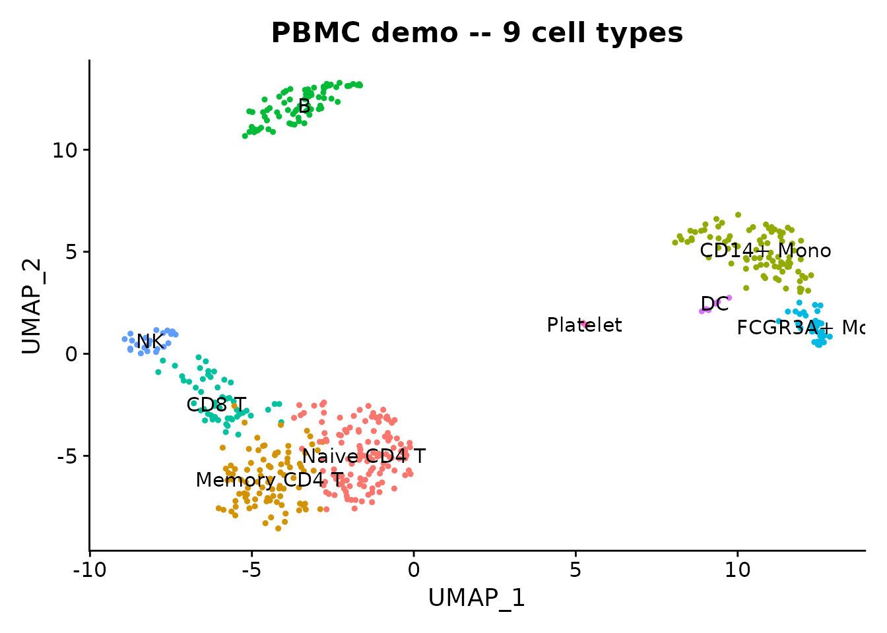
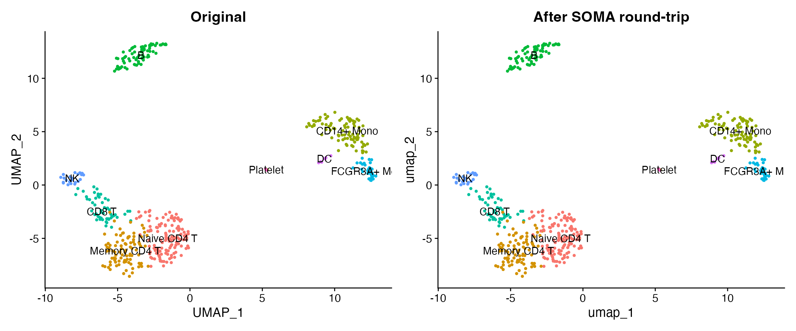
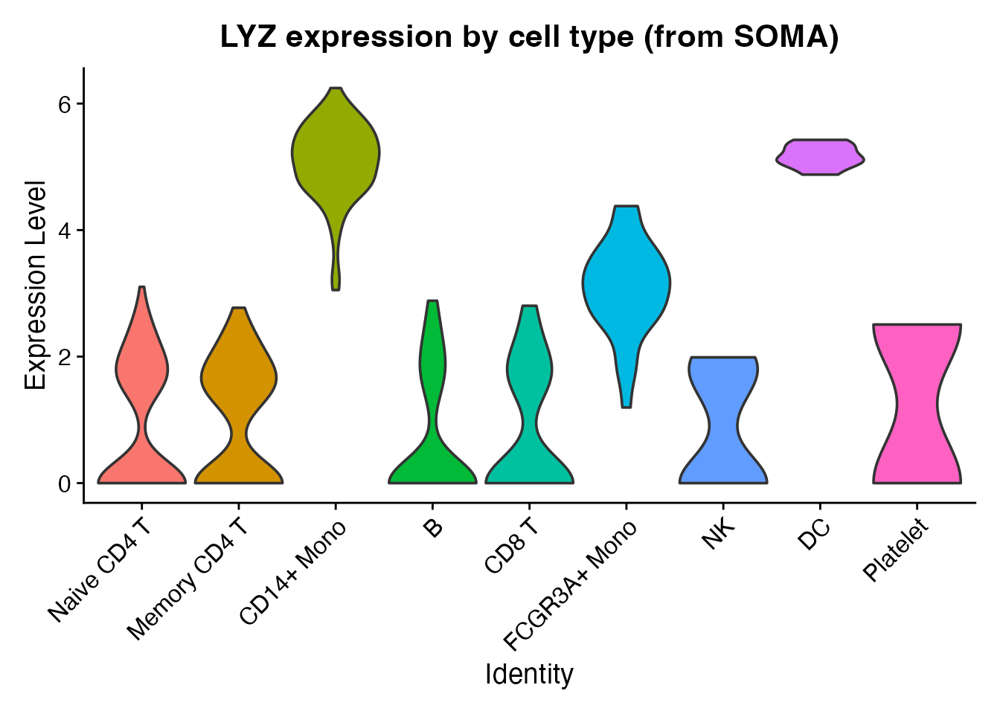

# TileDB-SOMA and CELLxGENE Census

## Introduction

[TileDB-SOMA](https://github.com/single-cell-data/TileDB-SOMA) is a
cloud-native, array-based format for single-cell data. It is the storage
backend behind [CELLxGENE
Census](https://chanzuckerberg.github.io/cellxgene-census/), which hosts
61M+ cells across 900+ datasets. SOMA supports efficient slicing by
cells or features without loading the full dataset, making it ideal for
working with large atlases.

scConvert provides
[`writeSOMA()`](https://mianaz.github.io/scConvert/reference/writeSOMA.md)
and
[`readSOMA()`](https://mianaz.github.io/scConvert/reference/readSOMA.md)
for Seurat interoperability. Both functions require the
[tiledbsoma](https://github.com/single-cell-data/TileDB-SOMA) R package.
SOMA experiments are database-like stores rather than single files, so
they cannot easily be shipped as package demo data. Instead, we start
from the shipped RDS and demonstrate the round-trip.

## Load demo data

We use a 500-cell PBMC dataset that ships with scConvert. It has 9
annotated cell types, PCA/UMAP embeddings, and neighbor graphs.

``` r

pbmc <- readRDS(system.file("extdata", "pbmc_demo.rds", package = "scConvert"))
pbmc
#> An object of class Seurat 
#> 2000 features across 500 samples within 1 assay 
#> Active assay: RNA (2000 features, 2000 variable features)
#>  2 layers present: counts, data
#>  2 dimensional reductions calculated: pca, umap
```

``` r

DimPlot(pbmc, reduction = "umap", group.by = "seurat_annotations",
        label = TRUE, pt.size = 0.8) +
  ggtitle("PBMC demo -- 9 cell types") + NoLegend()
```



## Write to SOMA

Save the Seurat object as a SOMA experiment. If tiledbsoma is not
installed, this section shows the code without running it.

``` r

soma_uri <- file.path(tempdir(), "pbmc_demo.soma")

# Ensure graphs have a valid DefaultAssay (required by tiledbsoma)
for (gn in names(pbmc@graphs)) {
  if (length(DefaultAssay(pbmc@graphs[[gn]])) == 0) {
    DefaultAssay(pbmc@graphs[[gn]]) <- DefaultAssay(pbmc)
  }
}

writeSOMA(pbmc, uri = soma_uri, overwrite = TRUE)
cat("SOMA experiment written to:", soma_uri, "\n")
#> SOMA experiment written to: /var/folders/9l/bl67cpdj3rzgkx2pfk0flmhc0000gn/T//RtmpQHNr1a/pbmc_demo.soma
```

## Read back from SOMA

``` r

pbmc_rt <- readSOMA(soma_uri)
cat("Cells:", ncol(pbmc_rt), "| Genes:", nrow(pbmc_rt), "\n")
#> Cells: 500 | Genes: 2000
cat("Metadata columns:", paste(colnames(pbmc_rt[[]]), collapse = ", "), "\n")
#> Metadata columns: orig.ident, nCount_RNA, nFeature_RNA, seurat_annotations, percent.mt, RNA_snn_res.0.5, seurat_clusters, obs_id
```

## Compare original and round-trip

Side-by-side UMAP plots confirm that cluster labels and coordinates
survive the SOMA round-trip.

``` r

library(patchwork)

p1 <- DimPlot(pbmc, reduction = "umap", group.by = "seurat_annotations",
              label = TRUE, pt.size = 0.8) +
  ggtitle("Original") + NoLegend()

p2 <- DimPlot(pbmc_rt, reduction = "umap", group.by = "seurat_annotations",
              label = TRUE, pt.size = 0.8) +
  ggtitle("After SOMA round-trip") + NoLegend()

p1 + p2
```



### Violin plot

LYZ is a strong monocyte marker – the violin plot below shows its
expression distribution across all 9 cell types loaded from the SOMA
store.

``` r

Idents(pbmc_rt) <- "seurat_annotations"
VlnPlot(pbmc_rt, features = "LYZ", pt.size = 0) +
  ggtitle("LYZ expression by cell type (from SOMA)") + NoLegend()
```



### Fidelity check

``` r

stopifnot(ncol(pbmc_rt) == ncol(pbmc))
stopifnot(nrow(pbmc_rt) == nrow(pbmc))
cat("Dimensions match:", ncol(pbmc_rt), "cells x", nrow(pbmc_rt), "genes\n")
#> Dimensions match: 500 cells x 2000 genes

shared_meta <- intersect(colnames(pbmc[[]]), colnames(pbmc_rt[[]]))
cat("Shared metadata columns:", length(shared_meta), "\n")
#> Shared metadata columns: 7
```

## CELLxGENE Census access

CELLxGENE Census stores the largest public atlas of single-cell data as
a single SOMA experiment. You can query it with
[`readSOMA()`](https://mianaz.github.io/scConvert/reference/readSOMA.md)
and then convert the result to any format.

``` r

library(cellxgene.census)

census <- open_soma(census_version = "stable")
human_uri <- census$get("census_data")$get("homo_sapiens")$uri

# Read a subset directly as a Seurat object
tcells <- readSOMA(
  uri = human_uri,
  measurement = "RNA",
  obs_query = "cell_type == 'T cell' & tissue_general == 'blood'"
)

# Save locally in any format
writeH5AD(tcells, "census_tcells.h5ad")
saveRDS(tcells, "census_tcells.rds")
```

## Pair converters

Direct conversion functions are available for all supported format
pairs:

``` r

# SOMA <-> h5ad
H5ADToSOMA("data.h5ad", "data.soma")
SOMAToH5AD("data.soma", "data.h5ad")

# SOMA <-> Zarr
ZarrToSOMA("data.zarr", "data.soma")
SOMAToZarr("data.soma", "data.zarr")

# Or use the universal dispatcher
scConvert("data.h5ad", dest = "data.soma", overwrite = TRUE)
```

## Session Info

``` r

sessionInfo()
#> R version 4.5.2 (2025-10-31)
#> Platform: aarch64-apple-darwin20
#> Running under: macOS Tahoe 26.3
#> 
#> Matrix products: default
#> BLAS:   /System/Library/Frameworks/Accelerate.framework/Versions/A/Frameworks/vecLib.framework/Versions/A/libBLAS.dylib 
#> LAPACK: /Library/Frameworks/R.framework/Versions/4.5-arm64/Resources/lib/libRlapack.dylib;  LAPACK version 3.12.1
#> 
#> locale:
#> [1] en_US.UTF-8/en_US.UTF-8/en_US.UTF-8/C/en_US.UTF-8/en_US.UTF-8
#> 
#> time zone: America/Indiana/Indianapolis
#> tzcode source: internal
#> 
#> attached base packages:
#> [1] stats     graphics  grDevices utils     datasets  methods   base     
#> 
#> other attached packages:
#> [1] patchwork_1.3.2    ggplot2_4.0.2      Seurat_5.4.0       SeuratObject_5.3.0
#> [5] sp_2.2-1           scConvert_0.1.0   
#> 
#> loaded via a namespace (and not attached):
#>   [1] RColorBrewer_1.1-3     jsonlite_2.0.0         magrittr_2.0.4        
#>   [4] ggbeeswarm_0.7.3       spatstat.utils_3.2-2   farver_2.1.2          
#>   [7] rmarkdown_2.30         fs_1.6.7               ragg_1.5.0            
#>  [10] vctrs_0.7.1            ROCR_1.0-12            spatstat.explore_3.7-0
#>  [13] htmltools_0.5.9        sass_0.4.10            sctransform_0.4.3     
#>  [16] parallelly_1.46.1      KernSmooth_2.23-26     bslib_0.10.0          
#>  [19] htmlwidgets_1.6.4      desc_1.4.3             ica_1.0-3             
#>  [22] plyr_1.8.9             plotly_4.12.0          zoo_1.8-15            
#>  [25] cachem_1.1.0           igraph_2.2.2           mime_0.13             
#>  [28] lifecycle_1.0.5        pkgconfig_2.0.3        Matrix_1.7-4          
#>  [31] R6_2.6.1               fastmap_1.2.0          fitdistrplus_1.2-6    
#>  [34] future_1.69.0          shiny_1.13.0           digest_0.6.39         
#>  [37] tiledb_0.34.0          tensor_1.5.1           RSpectra_0.16-2       
#>  [40] irlba_2.3.7            textshaping_1.0.4      labeling_0.4.3        
#>  [43] progressr_0.18.0       spatstat.sparse_3.1-0  httr_1.4.8            
#>  [46] polyclip_1.10-7        abind_1.4-8            compiler_4.5.2        
#>  [49] bit64_4.6.0-1          withr_3.0.2            S7_0.2.1              
#>  [52] fastDummies_1.7.5      MASS_7.3-65            tiledbsoma_2.3.0      
#>  [55] tools_4.5.2            vipor_0.4.7            lmtest_0.9-40         
#>  [58] otel_0.2.0             beeswarm_0.4.0         httpuv_1.6.16         
#>  [61] future.apply_1.20.2    goftest_1.2-3          glue_1.8.0            
#>  [64] nlme_3.1-168           promises_1.5.0         grid_4.5.2            
#>  [67] Rtsne_0.17             cluster_2.1.8.2        reshape2_1.4.5        
#>  [70] generics_0.1.4         hdf5r_1.3.12           gtable_0.3.6          
#>  [73] spatstat.data_3.1-9    tidyr_1.3.2            data.table_1.18.2.1   
#>  [76] spatstat.geom_3.7-0    RcppAnnoy_0.0.23       ggrepel_0.9.7         
#>  [79] RANN_2.6.2             pillar_1.11.1          stringr_1.6.0         
#>  [82] nanoarrow_0.8.0        spam_2.11-3            RcppHNSW_0.6.0        
#>  [85] later_1.4.8            splines_4.5.2          dplyr_1.2.0           
#>  [88] lattice_0.22-9         survival_3.8-6         bit_4.6.0             
#>  [91] deldir_2.0-4           tidyselect_1.2.1       miniUI_0.1.2          
#>  [94] pbapply_1.7-4          knitr_1.51             gridExtra_2.3         
#>  [97] RcppCCTZ_0.2.14        scattermore_1.2        xfun_0.56             
#> [100] matrixStats_1.5.0      stringi_1.8.7          lazyeval_0.2.2        
#> [103] yaml_2.3.12            evaluate_1.0.5         codetools_0.2-20      
#> [106] tibble_3.3.1           cli_3.6.5              uwot_0.2.4            
#> [109] arrow_23.0.1.1         xtable_1.8-8           reticulate_1.45.0     
#> [112] systemfonts_1.3.1      jquerylib_0.1.4        dichromat_2.0-0.1     
#> [115] Rcpp_1.1.1             globals_0.19.1         spatstat.random_3.4-4 
#> [118] RcppSpdlog_0.0.27      png_0.1-8              ggrastr_1.0.2         
#> [121] spatstat.univar_3.1-6  parallel_4.5.2         assertthat_0.2.1      
#> [124] pkgdown_2.2.0          dotCall64_1.2          spdl_0.0.5            
#> [127] listenv_0.10.1         viridisLite_0.4.3      scales_1.4.0          
#> [130] ggridges_0.5.7         purrr_1.2.1            crayon_1.5.3          
#> [133] rlang_1.1.7            cowplot_1.2.0          nanotime_0.3.13
```
