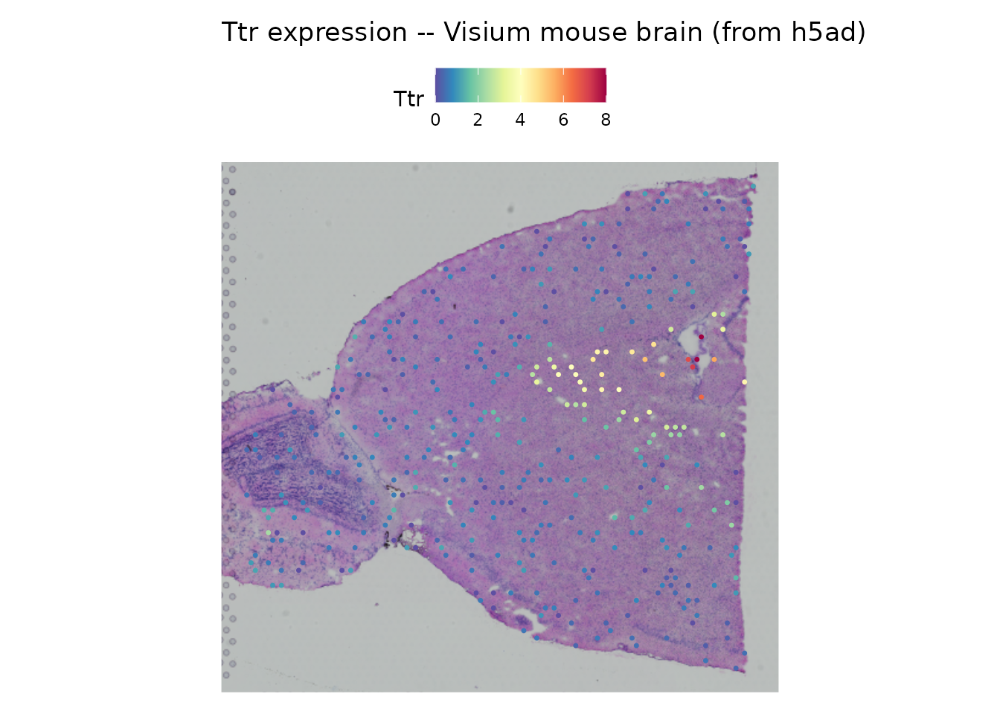
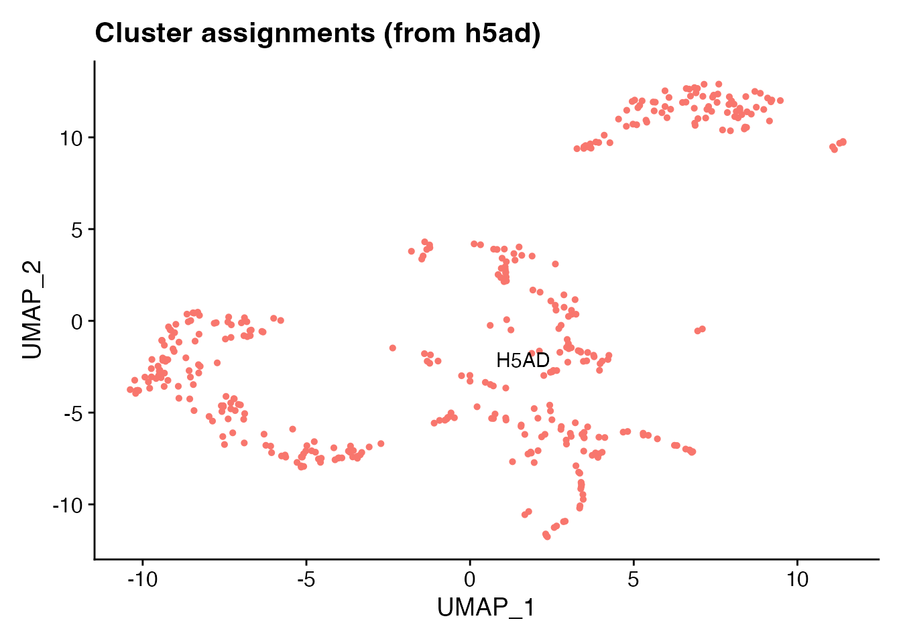
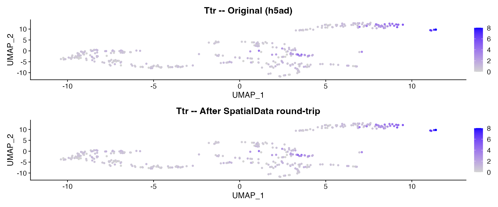

# SpatialData Zarr Stores

## Introduction

[SpatialData](https://spatialdata.scverse.org/) is the scverse standard
for spatial omics data. A `.spatialdata.zarr` store combines expression
tables, spatial coordinates, shapes, and tissue images in a single Zarr
directory. Technologies like Visium, MERFISH, Xenium, Slide-seq, and
CODEX all have SpatialData representations, making it a unifying format
for the spatial transcriptomics ecosystem.

scConvert provides
[`readSpatialData()`](https://mianaz.github.io/scConvert/reference/readSpatialData.md)
and
[`writeSpatialData()`](https://mianaz.github.io/scConvert/reference/writeSpatialData.md)
to move between SpatialData stores and Seurat objects, with no Python
dependency.

## Read spatial data from h5ad

We start by reading a 400-spot Visium mouse brain dataset shipped with
scConvert as an h5ad file. This dataset includes spatial coordinates, a
tissue image, PCA/UMAP embeddings, and 15 clusters across 1500 genes.

``` r

h5ad_path <- system.file("extdata", "spatial_demo.h5ad", package = "scConvert")
brain <- readH5AD(h5ad_path, verbose = FALSE)
brain
#> An object of class Seurat 
#> 1500 features across 400 samples within 1 assay 
#> Active assay: RNA (1500 features, 1500 variable features)
#>  2 layers present: counts, data
#>  2 dimensional reductions calculated: pca, umap
#>  1 spatial field of view present: anterior1
```

``` r

SpatialFeaturePlot(brain, features = "Ttr") +
  ggtitle("Ttr expression -- Visium mouse brain (from h5ad)")
```



Ttr (transthyretin) marks the choroid plexus. The spatial expression
pattern confirms the data was loaded correctly from the h5ad file.

``` r

DimPlot(brain, reduction = "umap", label = TRUE, pt.size = 1) +
  ggtitle("Cluster assignments (from h5ad)") + NoLegend()
```



## Write to SpatialData and read back

SpatialData stores have a complex directory structure with separate
groups for tables, shapes, images, and coordinate systems. We write the
Seurat object to a SpatialData Zarr store and read it back to verify the
round-trip.

``` r

sd_path <- file.path(tempdir(), "brain.spatialdata.zarr")
writeSpatialData(brain, sd_path, overwrite = TRUE, verbose = FALSE)
cat("SpatialData store written to:", sd_path, "\n")
#> SpatialData store written to: /tmp/RtmpXmWeZL/brain.spatialdata.zarr
```

``` r

brain_rt <- readSpatialData(sd_path, verbose = FALSE)
cat("Cells:", ncol(brain_rt), "| Genes:", nrow(brain_rt), "\n")
#> Cells: 400 | Genes: 1500
cat("Reductions:", paste(names(brain_rt@reductions), collapse = ", "), "\n")
#> Reductions: pca, umap
cat("Images:", paste(names(brain_rt@images), collapse = ", "), "\n")
#> Images: anterior1
```

## Compare original and round-trip

``` r

library(patchwork)

p1 <- FeaturePlot(brain, features = "Ttr", pt.size = 1) +
  ggtitle("Ttr -- Original (h5ad)")
p2 <- FeaturePlot(brain_rt, features = "Ttr", pt.size = 1) +
  ggtitle("Ttr -- After SpatialData round-trip")
p1 + p2
```



### Fidelity check

``` r

stopifnot(ncol(brain_rt) == ncol(brain))
stopifnot(nrow(brain_rt) == nrow(brain))
stopifnot(identical(sort(colnames(brain_rt)), sort(colnames(brain))))
cat("All checks passed:", ncol(brain_rt), "spots x", nrow(brain_rt), "genes.\n")
#> All checks passed: 400 spots x 1500 genes.
```

## Direct pair converters

Convert between SpatialData and other formats in a single call:

``` r

# SpatialData <-> h5ad
SpatialDataToH5AD("sample.spatialdata.zarr", "sample.h5ad")
H5ADToSpatialData("sample.h5ad", "sample.spatialdata.zarr")

# SpatialData <-> h5Seurat
SpatialDataToH5Seurat("sample.spatialdata.zarr", "sample.h5seurat")
H5SeuratToSpatialData("sample.h5seurat", "sample.spatialdata.zarr")

# Or use the universal dispatcher
scConvert("sample.spatialdata.zarr", dest = "sample.h5ad", overwrite = TRUE)
```

## Limitations

- **Images**: Large OME-NGFF images (\>100M pixels) are skipped to avoid
  memory issues. Use `images = FALSE` to read coordinates only.
- **Coordinate transforms**: SpatialData supports affine transformations
  between elements. These are not currently applied during reading;
  coordinates are used as-is.
- **Labels/segmentation**: Cell and nucleus segmentation masks are
  recorded by name but not loaded (they have no natural Seurat
  representation).
- **Multiple tables**: Only one table is read per call. Use the `table`
  argument to select which one.

## Python interoperability

SpatialData stores written by scConvert are readable by the Python
[spatialdata](https://spatialdata.scverse.org/) library. Requires Python
with spatialdata installed.

``` python
import spatialdata as sd

sdata = sd.read_zarr("brain.spatialdata.zarr")
print(sdata)
sdata.pl.render_shapes().pl.show()
```

## Session Info

``` r

sessionInfo()
#> R version 4.6.0 (2026-04-24)
#> Platform: x86_64-pc-linux-gnu
#> Running under: Ubuntu 24.04.4 LTS
#> 
#> Matrix products: default
#> BLAS:   /usr/lib/x86_64-linux-gnu/openblas-pthread/libblas.so.3 
#> LAPACK: /usr/lib/x86_64-linux-gnu/openblas-pthread/libopenblasp-r0.3.26.so;  LAPACK version 3.12.0
#> 
#> locale:
#>  [1] LC_CTYPE=C.UTF-8       LC_NUMERIC=C           LC_TIME=C.UTF-8       
#>  [4] LC_COLLATE=C.UTF-8     LC_MONETARY=C.UTF-8    LC_MESSAGES=C.UTF-8   
#>  [7] LC_PAPER=C.UTF-8       LC_NAME=C              LC_ADDRESS=C          
#> [10] LC_TELEPHONE=C         LC_MEASUREMENT=C.UTF-8 LC_IDENTIFICATION=C   
#> 
#> time zone: UTC
#> tzcode source: system (glibc)
#> 
#> attached base packages:
#> [1] stats     graphics  grDevices utils     datasets  methods   base     
#> 
#> other attached packages:
#> [1] patchwork_1.3.2    ggplot2_4.0.3      Seurat_5.5.0       SeuratObject_5.4.0
#> [5] sp_2.2-1           scConvert_0.2.0   
#> 
#> loaded via a namespace (and not attached):
#>   [1] deldir_2.0-4           pbapply_1.7-4          gridExtra_2.3         
#>   [4] rlang_1.2.0            magrittr_2.0.5         RcppAnnoy_0.0.23      
#>   [7] otel_0.2.0             spatstat.geom_3.7-3    matrixStats_1.5.0     
#>  [10] ggridges_0.5.7         compiler_4.6.0         png_0.1-9             
#>  [13] systemfonts_1.3.2      vctrs_0.7.3            reshape2_1.4.5        
#>  [16] hdf5r_1.3.12           stringr_1.6.0          crayon_1.5.3          
#>  [19] pkgconfig_2.0.3        fastmap_1.2.0          labeling_0.4.3        
#>  [22] promises_1.5.0         rmarkdown_2.31         ragg_1.5.2            
#>  [25] bit_4.6.0              purrr_1.2.2            xfun_0.57             
#>  [28] cachem_1.1.0           jsonlite_2.0.0         goftest_1.2-3         
#>  [31] later_1.4.8            spatstat.utils_3.2-2   irlba_2.3.7           
#>  [34] parallel_4.6.0         cluster_2.1.8.2        R6_2.6.1              
#>  [37] ica_1.0-3              spatstat.data_3.1-9    bslib_0.10.0          
#>  [40] stringi_1.8.7          RColorBrewer_1.1-3     reticulate_1.46.0     
#>  [43] spatstat.univar_3.1-7  parallelly_1.47.0      lmtest_0.9-40         
#>  [46] jquerylib_0.1.4        scattermore_1.2        Rcpp_1.1.1-1.1        
#>  [49] knitr_1.51             tensor_1.5.1           future.apply_1.20.2   
#>  [52] zoo_1.8-15             sctransform_0.4.3      httpuv_1.6.17         
#>  [55] Matrix_1.7-5           splines_4.6.0          igraph_2.3.0          
#>  [58] tidyselect_1.2.1       abind_1.4-8            yaml_2.3.12           
#>  [61] spatstat.random_3.4-5  spatstat.explore_3.8-0 codetools_0.2-20      
#>  [64] miniUI_0.1.2           listenv_0.10.1         plyr_1.8.9            
#>  [67] lattice_0.22-9         tibble_3.3.1           withr_3.0.2           
#>  [70] shiny_1.13.0           S7_0.2.2               ROCR_1.0-12           
#>  [73] evaluate_1.0.5         Rtsne_0.17             future_1.70.0         
#>  [76] fastDummies_1.7.6      desc_1.4.3             survival_3.8-6        
#>  [79] polyclip_1.10-7        fitdistrplus_1.2-6     pillar_1.11.1         
#>  [82] KernSmooth_2.23-26     plotly_4.12.0          generics_0.1.4        
#>  [85] RcppHNSW_0.6.0         scales_1.4.0           globals_0.19.1        
#>  [88] xtable_1.8-8           glue_1.8.1             lazyeval_0.2.3        
#>  [91] tools_4.6.0            data.table_1.18.2.1    RSpectra_0.16-2       
#>  [94] RANN_2.6.2             fs_2.1.0               dotCall64_1.2         
#>  [97] cowplot_1.2.0          grid_4.6.0             tidyr_1.3.2           
#> [100] nlme_3.1-169           cli_3.6.6              spatstat.sparse_3.1-0 
#> [103] textshaping_1.0.5      spam_2.11-3            viridisLite_0.4.3     
#> [106] dplyr_1.2.1            uwot_0.2.4             gtable_0.3.6          
#> [109] sass_0.4.10            digest_0.6.39          progressr_0.19.0      
#> [112] ggrepel_0.9.8          htmlwidgets_1.6.4      farver_2.1.2          
#> [115] htmltools_0.5.9        pkgdown_2.2.0          lifecycle_1.0.5       
#> [118] httr_1.4.8             mime_0.13              bit64_4.8.0           
#> [121] MASS_7.3-65
```
