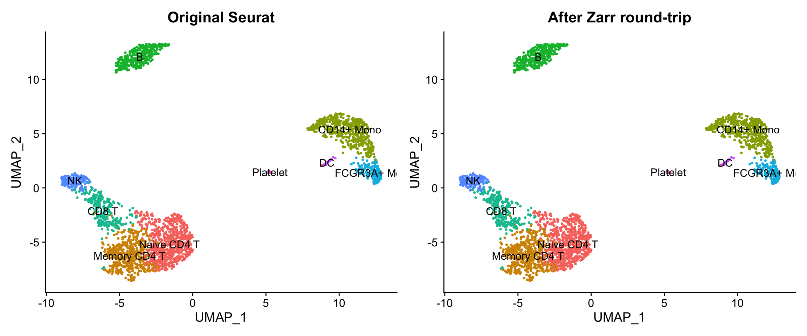
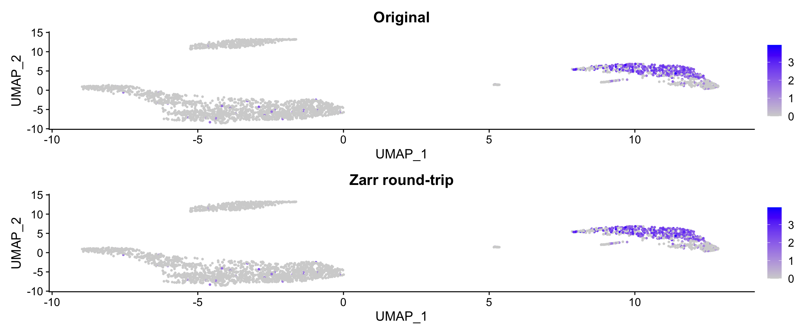
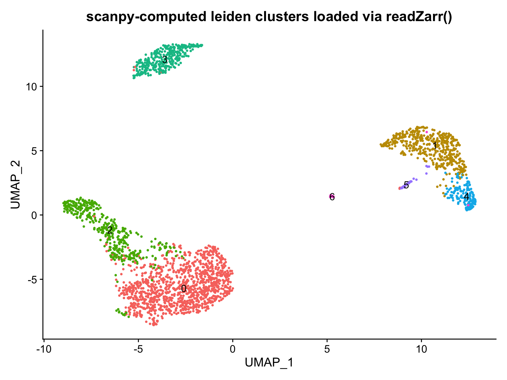
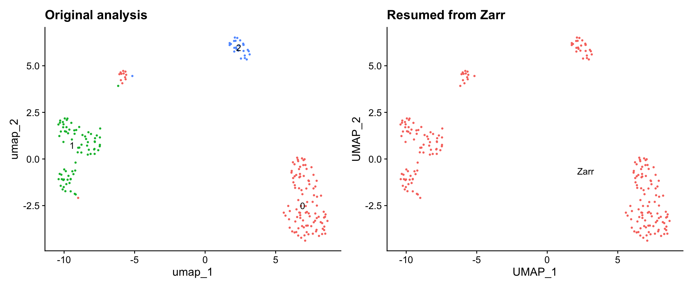
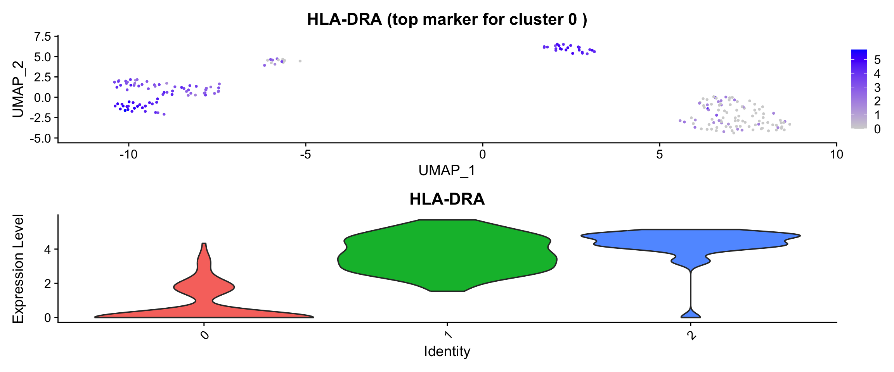
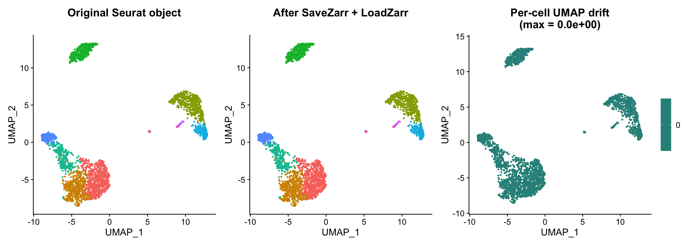
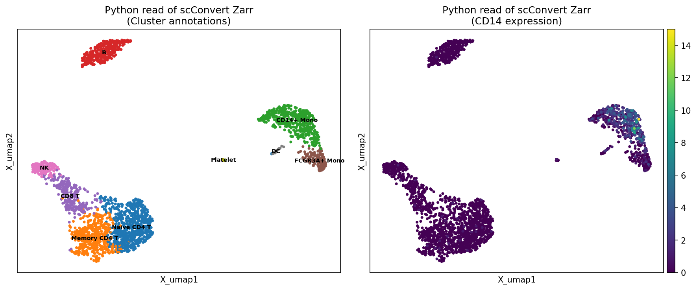

# Conversions: Seurat and Zarr

This vignette demonstrates how to convert between Seurat objects and
[Zarr](https://zarr.dev/) stores using scConvert. Zarr is a chunked,
compressed N-dimensional array format commonly used in cloud-native
single-cell workflows, including [CELLxGENE
Census](https://chanzuckerberg.github.io/cellxgene-census/),
[SpatialData](https://spatialdata.scverse.org/), and the [Human Cell
Atlas](https://data.humancellatlas.org/).

scConvert reads and writes Zarr v2 stores following the [AnnData on-disk
specification](https://anndata.readthedocs.io/en/latest/fileformat-prose.html),
with no Python dependency. Zarr stores produced by
[`writeZarr()`](https://mianaz.github.io/scConvert/reference/writeZarr.md)
are directly readable by Python `anndata.read_zarr()` and scanpy.

``` r

library(Seurat)
library(scConvert)
library(ggplot2)
library(patchwork)
```

## Seurat to Zarr

### Basic conversion

To save a Seurat object as a Zarr store, use
[`writeZarr()`](https://mianaz.github.io/scConvert/reference/writeZarr.md)
directly or
[`scConvert()`](https://mianaz.github.io/scConvert/reference/scConvert-package.html)
with the `.zarr` extension:

``` r

library(SeuratData)
if (!"pbmc3k.final" %in% rownames(InstalledData())) {
  InstallData("pbmc3k")
}

data("pbmc3k.final", package = "pbmc3k.SeuratData")
pbmc <- UpdateSeuratObject(pbmc3k.final)
cat("Input:", ncol(pbmc), "cells x", nrow(pbmc), "genes\n")
#> Input: 2638 cells x 13714 genes
cat("Reductions:", paste(Reductions(pbmc), collapse = ", "), "\n")
#> Reductions: pca, umap
cat("Layers:", paste(Layers(pbmc), collapse = ", "), "\n")
#> Layers: counts, data, scale.data
```

``` r

# Direct API
writeZarr(pbmc, "pbmc3k.zarr", overwrite = TRUE)

# Or via scConvert()
# scConvert(pbmc, dest = "pbmc3k.zarr", overwrite = TRUE)
```

[`writeZarr()`](https://mianaz.github.io/scConvert/reference/writeZarr.md)
writes the following components:

| Seurat Source | Zarr Destination | Description |
|----|----|----|
| `GetAssayData(layer = "counts")` | `X/` | Primary expression matrix (prefers counts) |
| `GetAssayData(layer = "data")` | `layers/data/` | Normalized data (if different from counts) |
| `meta.data` | `obs/` | Cell metadata with categorical encoding |
| Assay feature metadata | `var/` | Gene-level annotations |
| `Embeddings(, "pca")` | `obsm/X_pca/` | PCA coordinates |
| `Embeddings(, "umap")` | `obsm/X_umap/` | UMAP coordinates |
| `Graphs(, "RNA_snn")` | `obsp/connectivities/` | SNN graph (sparse CSR) |
| `Graphs(, "RNA_nn")` | `obsp/distances/` | NN distance graph |
| [`Misc()`](https://satijalab.github.io/seurat-object/reference/Misc.html) | `uns/` | Unstructured annotations |

### Zarr store structure

The Zarr store is a directory tree following AnnData v0.1.0 conventions:

    pbmc3k.zarr/
    ├── .zgroup            # Root group metadata
    ├── .zattrs            # encoding-type: anndata, encoding-version: 0.1.0
    ├── X/                 # Expression matrix (sparse CSR or dense)
    │   ├── .zattrs        # encoding-type: csr_matrix / array
    │   ├── data/          # Non-zero values
    │   ├── indices/       # Column indices (0-based)
    │   └── indptr/        # Row pointers
    ├── obs/               # Cell metadata
    │   ├── .zattrs        # encoding-type: dataframe, column-order
    │   ├── _index/        # Cell barcodes (string-array)
    │   ├── seurat_clusters/  # Categorical: codes/ + categories/
    │   └── nCount_RNA/    # Numeric array
    ├── var/               # Feature metadata
    │   ├── _index/        # Gene names
    │   └── ...
    ├── obsm/              # Dimensional reductions
    │   ├── X_pca/         # [n_cells, n_components] dense array
    │   └── X_umap/        # [n_cells, 2] dense array
    └── obsp/              # Pairwise cell annotations (graphs)
        ├── connectivities/  # SNN graph (sparse)
        └── distances/       # NN distance graph (sparse)

## Zarr to Seurat

### Loading a Zarr store

Use
[`readZarr()`](https://mianaz.github.io/scConvert/reference/readZarr.md)
to read a Zarr store into a Seurat object:

``` r

obj <- readZarr("pbmc3k.zarr", verbose = TRUE)
cat("Loaded:", ncol(obj), "cells x", nrow(obj), "genes\n")
#> Loaded: 2638 cells x 13714 genes
cat("Reductions:", paste(Reductions(obj), collapse = ", "), "\n")
#> Reductions: pca, umap
cat("Metadata columns:", paste(colnames(obj[[]]), collapse = ", "), "\n")
#> Metadata columns: orig.ident, nCount_RNA, nFeature_RNA, seurat_annotations, percent.mt, RNA_snn_res.0.5, seurat_clusters
```

[`readZarr()`](https://mianaz.github.io/scConvert/reference/readZarr.md)
maps AnnData fields to Seurat:

| Zarr Source | Seurat Destination | Notes |
|----|----|----|
| `X/` | Default assay counts/data | Sparse CSR or dense |
| `layers/*` | Additional assay layers | Via [`AnnDataLayerToSeurat()`](https://mianaz.github.io/scConvert/reference/AnnDataLayerToSeurat.md) mapping |
| `obs/` | `meta.data` | Categoricals become factors |
| `var/` | Feature metadata | `highly_variable` → [`VariableFeatures()`](https://satijalab.github.io/seurat-object/reference/VariableFeatures.html) |
| `obsm/X_pca` | `reductions$pca` | Smart transpose handling |
| `obsm/X_umap` | `reductions$umap` | Smart transpose handling |
| `obsp/connectivities` | `graphs$RNA_snn` | Sparse matrix |
| `obsp/distances` | `graphs$RNA_nn` | Sparse matrix |
| `varp/*` | `misc[["__varp__"]]` | Pairwise variable annotations |
| `uns/*` | `misc` | Best-effort for strings/numerics |

### Alternative: scConvert()

[`scConvert()`](https://mianaz.github.io/scConvert/reference/scConvert-package.html)
also works with Zarr — it auto-detects the format from the file
extension:

``` r

# Convert from other formats to zarr
scConvert("data.h5ad", dest = "data.zarr", overwrite = TRUE)
scConvert("data.rds", dest = "data.zarr", overwrite = TRUE)
scConvert("data.loom", dest = "data.zarr", overwrite = TRUE)

# Direct converters (streaming by default, no Seurat intermediate)
H5ADToZarr("data.h5ad", "data.zarr", overwrite = TRUE)
ZarrToH5AD("data.zarr", "output.h5ad", overwrite = TRUE)
H5SeuratToZarr("data.h5seurat", "data.zarr", overwrite = TRUE)
ZarrToH5Seurat("data.zarr", "data.h5seurat", overwrite = TRUE)

# Convert via Seurat hub (any format pair)
scConvert("data.zarr", dest = "data.rds", overwrite = TRUE)
scConvert("data.zarr", dest = "data.loom", overwrite = TRUE)

# scConvert_cli() auto-dispatches to the best path
scConvert_cli("data.h5ad", "data.zarr", overwrite = TRUE)
```

### Streaming conversion

The direct converters (`H5ADToZarr`, `ZarrToH5AD`, `H5SeuratToZarr`,
`ZarrToH5Seurat`) use **streaming** by default (`stream = TRUE`). This
copies AnnData fields (X, obs, var, obsm, obsp, layers, uns, varp, raw)
directly between backends without materializing a Seurat object in
memory.

Streaming conversion:

- **Avoids loading all data into R memory** — matrices are read and
  written one field at a time
- **Preserves the exact data layout** — no lossy conversion through
  Seurat
- **Handles all AnnData components** including `raw/` (pre-filtering
  data), `varp` (gene-gene matrices), and complex categorical metadata
- **Translates format conventions** automatically — h5seurat factor
  encoding (levels/values, 1-based) ↔︎ AnnData categoricals
  (categories/codes, 0-based), sparse matrix orientation (CSC
  genes×cells ↔︎ CSR cells×genes)

Set `stream = FALSE` to fall back to the Seurat hub path:

``` r

# Streaming (default): direct field-by-field copy
H5ADToZarr("large_dataset.h5ad", "large_dataset.zarr")

# Hub path: load as Seurat, then save (stream = FALSE)
H5ADToZarr("data.h5ad", "data.zarr", stream = FALSE)

# scConvert_cli uses streaming automatically for zarr pairs
scConvert_cli("data.h5seurat", "data.zarr")
scConvert_cli("data.zarr", "output.h5ad")
```

## Visualizing Zarr round-trip data

After converting to Zarr and loading back, the UMAP coordinates, cluster
labels, and expression values are preserved exactly:

``` r

p1 <- DimPlot(pbmc, reduction = "umap", group.by = "seurat_annotations",
              label = TRUE, pt.size = 0.5) +
  ggtitle("Original Seurat") + NoLegend()

p2 <- DimPlot(obj, reduction = "umap", group.by = "seurat_annotations",
              label = TRUE, pt.size = 0.5) +
  ggtitle("After Zarr round-trip") + NoLegend()

p1 + p2
```



Expression patterns are also preserved:

``` r

p1 <- FeaturePlot(pbmc, features = "CD14", pt.size = 0.5) +
  ggtitle("Original")
p2 <- FeaturePlot(obj, features = "CD14", pt.size = 0.5) +
  ggtitle("Zarr round-trip")
p1 + p2
```



## Python interoperability

Zarr stores written by
[`writeZarr()`](https://mianaz.github.io/scConvert/reference/writeZarr.md)
are directly readable by Python’s `anndata.read_zarr()` and scanpy. No
intermediate conversion needed.

### Reading scConvert Zarr in Python

``` python
import anndata as ad
import scanpy as sc

adata = ad.read_zarr("pbmc3k.zarr")
print(adata)
#> AnnData object with n_obs × n_vars = 2638 × 13714
#>     obs: 'orig.ident', 'nCount_RNA', 'nFeature_RNA', 'seurat_annotations', 'percent.mt', 'RNA_snn_res.0.5', 'seurat_clusters'
#>     var: 'vst.mean', 'vst.variance', 'vst.variance.expected', 'vst.variance.standardized', 'vst.variable'
#>     obsm: 'X_pca', 'X_umap'
#>     layers: 'scaled', 'data'
#>     obsp: 'connectivities', 'distances'
print(f"Embeddings: {list(adata.obsm.keys())}")
#> Embeddings: ['X_pca', 'X_umap']
print(f"Graphs: {list(adata.obsp.keys())}")
#> Graphs: ['connectivities', 'distances']
```

### Visualizing in scanpy

``` python
import scanpy as sc
import matplotlib.pyplot as plt
import anndata as ad

adata = ad.read_zarr("pbmc3k.zarr")

fig, axes = plt.subplots(1, 2, figsize=(12, 5))

sc.pl.embedding(adata, basis="X_umap", color="seurat_annotations",
                title="scConvert Zarr in scanpy\n(cluster annotations)",
                ax=axes[0], show=False, legend_loc="on data", legend_fontsize=7)

sc.pl.embedding(adata, basis="X_umap", color="CD14",
                title="scConvert Zarr in scanpy\n(CD14 expression)",
                ax=axes[1], show=False, use_raw=False)

plt.tight_layout()
plt.savefig("pbmc_zarr_scanpy.png", dpi=150, bbox_inches="tight")
plt.close()
```


### Reading Python-generated Zarr in R

Zarr stores created by scanpy or anndata are readable by
[`readZarr()`](https://mianaz.github.io/scConvert/reference/readZarr.md).
Note that Python’s default compressor is blosc (not zlib), so reading
Python-generated zarr stores requires the
[blosc](https://CRAN.R-project.org/package=blosc) R package:

``` python
import scanpy as sc
import anndata as ad

# Process a dataset in scanpy
adata = ad.read_zarr("pbmc3k.zarr")
sc.pp.neighbors(adata, use_rep="X_pca", n_neighbors=15)
sc.tl.leiden(adata, resolution=0.8)

# Write back to zarr
adata.write_zarr("from_scanpy.zarr")
print(f"Wrote zarr with leiden clusters: {adata.obs['leiden'].nunique()} clusters")
#> Wrote zarr with leiden clusters: 7 clusters
```

``` r

# Load the scanpy-generated zarr store in R
obj_scanpy <- readZarr("from_scanpy.zarr", verbose = TRUE)

cat("Cells:", ncol(obj_scanpy), "| Genes:", nrow(obj_scanpy), "\n")
#> Cells: 2638 | Genes: 13714
cat("Metadata:", paste(colnames(obj_scanpy[[]]), collapse = ", "), "\n")
#> Metadata: orig.ident, nCount_RNA, nFeature_RNA, seurat_annotations, percent.mt, RNA_snn_res.0.5, seurat_clusters, leiden
cat("Leiden clusters:", nlevels(obj_scanpy[["leiden", drop = TRUE]]), "\n")
#> Leiden clusters: 7

DimPlot(obj_scanpy, reduction = "umap", group.by = "leiden",
        label = TRUE, pt.size = 0.5) +
  ggtitle("scanpy-computed leiden clusters loaded via readZarr()") +
  NoLegend()
```



## Seurat analysis with Zarr storage

Zarr can serve as the persistent storage format for a Seurat analysis
workflow. This section demonstrates a complete pipeline: loading data,
running standard Seurat analysis, saving checkpoints to Zarr, and
resuming from saved state.

### Starting from an h5ad file

Many public datasets (CELLxGENE, HCA) distribute data as h5ad or zarr.
Here we start from the shipped test h5ad and run a standard Seurat
pipeline:

``` r

library(scConvert)
library(Seurat)

# Load from h5ad
h5ad_path <- system.file("testdata", "pbmc_small.h5ad", package = "scConvert")
pbmc_wf <- readH5AD(h5ad_path, verbose = FALSE)

cat("Loaded:", ncol(pbmc_wf), "cells x", nrow(pbmc_wf), "genes\n")
#> Loaded: 214 cells x 2000 genes
cat("Layers:", paste(Layers(pbmc_wf), collapse = ", "), "\n")
#> Layers: counts, data
cat("Reductions:", paste(Reductions(pbmc_wf), collapse = ", "), "\n")
#> Reductions: pca, umap
```

### Running Seurat analysis

The loaded object has counts and normalized data from scanpy. We can run
Seurat’s standard pipeline on top:

``` r

# Variable features, scaling, PCA
pbmc_wf <- FindVariableFeatures(pbmc_wf, verbose = FALSE)
pbmc_wf <- ScaleData(pbmc_wf, verbose = FALSE)
pbmc_wf <- RunPCA(pbmc_wf, verbose = FALSE)

# Clustering
pbmc_wf <- FindNeighbors(pbmc_wf, dims = 1:20, verbose = FALSE)
pbmc_wf <- FindClusters(pbmc_wf, resolution = 0.5, verbose = FALSE)

# UMAP
pbmc_wf <- RunUMAP(pbmc_wf, dims = 1:20, verbose = FALSE)

cat("Clusters:", nlevels(pbmc_wf$seurat_clusters), "\n")
#> Clusters: 3
cat("Reductions:", paste(Reductions(pbmc_wf), collapse = ", "), "\n")
#> Reductions: pca, umap
cat("Graphs:", paste(names(pbmc_wf@graphs), collapse = ", "), "\n")
#> Graphs: RNA_nn, RNA_snn
```

### Saving analysis state to Zarr

Save the full analysis state — expression data, metadata, PCA, UMAP,
clusters, and neighbor graphs — to a Zarr store:

``` r

writeZarr(pbmc_wf, "analysis_checkpoint.zarr", overwrite = TRUE, verbose = FALSE)

# Verify the store is valid
cat("Zarr store size:", sum(file.info(
  list.files("analysis_checkpoint.zarr", recursive = TRUE, full.names = TRUE)
)$size) / 1024, "KB\n")
#> Zarr store size: 1001.415 KB
```

### Resuming from Zarr checkpoint

Load the checkpoint and verify the full analysis state is preserved:

``` r

resumed <- readZarr("analysis_checkpoint.zarr", verbose = FALSE)

cat("Cells:", ncol(resumed), "| Genes:", nrow(resumed), "\n")
#> Cells: 214 | Genes: 2000
cat("Clusters:", nlevels(resumed$seurat_clusters), "\n")
#> Clusters: 3
cat("Reductions:", paste(Reductions(resumed), collapse = ", "), "\n")
#> Reductions: pca, umap
cat("Graphs:", paste(names(resumed@graphs), collapse = ", "), "\n")
#> Graphs: RNA_snn, RNA_nn

# Verify PCA is exact
stopifnot(max(abs(
  Embeddings(pbmc_wf, "pca")[colnames(resumed), ] -
  Embeddings(resumed, "pca")
)) < 1e-10)
cat("PCA: exact match\n")
#> PCA: exact match

# Verify clusters match
stopifnot(identical(
  as.character(pbmc_wf$seurat_clusters[colnames(resumed)]),
  as.character(resumed$seurat_clusters)
))
cat("Cluster assignments: exact match\n")
#> Cluster assignments: exact match
```

### Visualization from Zarr checkpoint

``` r

library(ggplot2)
library(patchwork)

p1 <- DimPlot(pbmc_wf, reduction = "umap", label = TRUE, pt.size = 0.5) +
  ggtitle("Original analysis") + NoLegend()
p2 <- DimPlot(resumed, reduction = "umap", label = TRUE, pt.size = 0.5) +
  ggtitle("Resumed from Zarr") + NoLegend()
p1 + p2
```



### Continued analysis from checkpoint

After loading from Zarr, you can continue the analysis — find markers,
subset clusters, or add new annotations. Note that cell identities need
to be set explicitly after loading (Zarr doesn’t store R’s active
identity class):

``` r

# Set cluster identities from saved metadata
Idents(resumed) <- "seurat_clusters"

# Find markers for the first cluster
first_cluster <- levels(Idents(resumed))[1]
markers_c0 <- FindMarkers(resumed, ident.1 = first_cluster, verbose = FALSE)
cat("Top 5 markers for cluster", first_cluster, ":\n")
#> Top 5 markers for cluster 0 :
print(head(markers_c0[order(markers_c0$p_val_adj), ], 5))
#>                 p_val avg_log2FC pct.1 pct.2    p_val_adj
#> HLA-DRA  5.184691e-34  -4.452142 0.295 0.990 1.036938e-30
#> HLA-DRB1 4.940796e-29  -3.841615 0.223 0.922 9.881592e-26
#> CD74     1.038005e-27  -3.299494 0.768 0.971 2.076009e-24
#> HLA-DPB1 3.384846e-26  -3.886235 0.312 0.902 6.769693e-23
#> HLA-DPA1 3.489910e-26  -4.184216 0.250 0.873 6.979819e-23

# Save updated object with marker results
resumed[["has_markers"]] <- TRUE
writeZarr(resumed, "analysis_with_markers.zarr", overwrite = TRUE, verbose = FALSE)
cat("\nSaved updated analysis to Zarr\n")
#> 
#> Saved updated analysis to Zarr
```

``` r

top_gene <- rownames(markers_c0)[which.min(markers_c0$p_val_adj)]
p1 <- FeaturePlot(resumed, features = top_gene, pt.size = 0.5) +
  ggtitle(paste(top_gene, "(top marker for cluster", first_cluster, ")"))
p2 <- VlnPlot(resumed, features = top_gene, pt.size = 0) +
  NoLegend()
p1 + p2
```



### Cross-ecosystem workflow

A common pattern is to process data in scanpy, save to Zarr, then load
in Seurat for downstream analysis (or vice versa):

``` r

# Step 1: Load scanpy-processed zarr from a collaborator
obj <- readZarr("scanpy_analysis.zarr")

# Step 2: Continue analysis in Seurat
obj <- FindVariableFeatures(obj, verbose = FALSE)
obj <- ScaleData(obj, verbose = FALSE)
obj <- RunPCA(obj, verbose = FALSE)
obj <- FindNeighbors(obj, dims = 1:30, verbose = FALSE)
obj <- FindClusters(obj, resolution = 0.8, verbose = FALSE)

# Step 3: Save back to zarr for the Python side
writeZarr(obj, "seurat_analysis.zarr", overwrite = TRUE)

# Or convert to h5ad for scanpy
scConvert("seurat_analysis.zarr", dest = "seurat_analysis.h5ad", overwrite = TRUE)
```

## Conversion fidelity

This section verifies exact data preservation through Zarr round-trips.

### Seurat to Zarr to Seurat

``` r

# --- Dimensions ---
stopifnot(ncol(obj) == ncol(pbmc))
stopifnot(nrow(obj) == nrow(pbmc))
cat("Dimensions:", ncol(obj), "cells x", nrow(obj), "genes -- OK\n")
#> Dimensions: 2638 cells x 13714 genes -- OK

# --- Barcodes and features ---
stopifnot(identical(sort(colnames(obj)), sort(colnames(pbmc))))
stopifnot(identical(sort(rownames(obj)), sort(rownames(pbmc))))
cat("Barcodes and features: exact match\n")
#> Barcodes and features: exact match

# --- Metadata preservation ---
cat("\nMetadata column checks:\n")
#> 
#> Metadata column checks:
for (col in colnames(pbmc[[]])) {
  if (!col %in% colnames(obj[[]])) {
    cat(sprintf("  %-25s MISSING\n", col))
    next
  }
  orig <- pbmc[[col, drop = TRUE]]
  loaded <- obj[[col, drop = TRUE]]
  orig_class <- class(orig)[1]
  load_class <- class(loaded)[1]

  status <- "OK"
  if (is.numeric(orig) && is.numeric(loaded)) {
    vals_match <- isTRUE(all.equal(
      orig[colnames(obj)], loaded, tolerance = 1e-6
    ))
    if (!vals_match) status <- "MISMATCH"
    stopifnot(vals_match)
  } else if (is.factor(orig) && is.factor(loaded)) {
    stopifnot(identical(sort(levels(orig)), sort(levels(loaded))))
  }
  cat(sprintf("  %-25s %-10s -> %-10s %s\n", col, orig_class, load_class, status))
}
#>   orig.ident                factor     -> factor     OK
#>   nCount_RNA                numeric    -> numeric    OK
#>   nFeature_RNA              integer    -> integer    OK
#>   seurat_annotations        factor     -> factor     OK
#>   percent.mt                numeric    -> numeric    OK
#>   RNA_snn_res.0.5           factor     -> factor     OK
#>   seurat_clusters           factor     -> factor     OK
```

### PCA and UMAP preservation

``` r

# PCA: exact component match
pca_orig <- Embeddings(pbmc, "pca")[colnames(obj), ]
pca_loaded <- Embeddings(obj, "pca")
pca_diff <- max(abs(pca_orig - pca_loaded))
stopifnot(pca_diff < 1e-10)
cat("PCA:", ncol(pca_loaded), "components, max diff =", pca_diff, "\n")
#> PCA: 50 components, max diff = 0

# UMAP: exact match
umap_orig <- Embeddings(pbmc, "umap")[colnames(obj), ]
umap_loaded <- Embeddings(obj, "umap")
umap_diff <- max(abs(umap_orig - umap_loaded))
stopifnot(umap_diff < 1e-10)
cat("UMAP: max diff =", umap_diff, "\n")
#> UMAP: max diff = 0
```

### Expression values

``` r

# Compare counts (exact)
counts_orig <- GetAssayData(pbmc, layer = "counts")
counts_loaded <- GetAssayData(obj, layer = "counts")

# Align by common barcodes/features
common_cells <- intersect(colnames(counts_orig), colnames(counts_loaded))
common_genes <- intersect(rownames(counts_orig), rownames(counts_loaded))
diff <- max(abs(
  counts_orig[common_genes, common_cells] -
  counts_loaded[common_genes, common_cells]
))
stopifnot(diff == 0)
cat("Counts: exact match (", length(common_genes), "genes x",
    length(common_cells), "cells)\n")
#> Counts: exact match ( 13714 genes x 2638 cells)

# Compare data layer if available
if ("data" %in% Layers(obj)) {
  data_orig <- GetAssayData(pbmc, layer = "data")
  data_loaded <- GetAssayData(obj, layer = "data")
  diff_data <- max(abs(
    data_orig[common_genes, common_cells] -
    data_loaded[common_genes, common_cells]
  ))
  stopifnot(diff_data < 1e-6)
  cat("Data layer: max diff =", diff_data, "\n")
}
#> Data layer: max diff = 0
```

### Neighbor graph preservation

``` r

for (g in names(pbmc@graphs)) {
  if (!g %in% names(obj@graphs)) {
    cat(g, ": not in zarr output (expected for some graph types)\n")
    next
  }
  g_orig <- pbmc@graphs[[g]]
  g_loaded <- obj@graphs[[g]]
  common <- intersect(rownames(g_orig), rownames(g_loaded))
  diff <- max(abs(g_orig[common, common] - g_loaded[common, common]))
  stopifnot(diff == 0)
  cat(g, ": exact match (nnz =", length(g_loaded@x), ")\n")
}
#> RNA_nn : exact match (nnz = 52760 )
#> RNA_snn : exact match (nnz = 194704 )
```

### Full round-trip: h5ad to Zarr to h5ad

``` r

# Start from the shipped test h5ad
h5ad_src <- system.file("testdata", "pbmc_small.h5ad", package = "scConvert")
ref <- readH5AD(h5ad_src, verbose = FALSE)

# h5ad -> Seurat -> Zarr
writeZarr(ref, "roundtrip.zarr", overwrite = TRUE, verbose = FALSE)

# Zarr -> Seurat
rt <- readZarr("roundtrip.zarr", verbose = FALSE)

# Verify
stopifnot(ncol(rt) == ncol(ref))
stopifnot(nrow(rt) == nrow(ref))
stopifnot(identical(sort(colnames(rt)), sort(colnames(ref))))
stopifnot(identical(sort(rownames(rt)), sort(rownames(ref))))

# PCA
pca_ref <- Embeddings(ref, "pca")[colnames(rt), ]
pca_rt <- Embeddings(rt, "pca")
stopifnot(max(abs(pca_ref - pca_rt)) < 1e-10)

cat("h5ad -> Zarr -> Seurat round-trip: all checks passed\n")
#> h5ad -> Zarr -> Seurat round-trip: all checks passed
cat("  Cells:", ncol(rt), "| Genes:", nrow(rt), "\n")
#>   Cells: 214 | Genes: 2000
cat("  Reductions:", paste(Reductions(rt), collapse = ", "), "\n")
#>   Reductions: pca, umap
```

### Zarr to h5ad (cross-format chain)

``` r

# Zarr -> h5ad via scConvert()
scConvert("roundtrip.zarr", dest = "roundtrip_from_zarr.h5ad", overwrite = TRUE)
rt_h5ad <- readH5AD("roundtrip_from_zarr.h5ad", verbose = FALSE)

stopifnot(ncol(rt_h5ad) == ncol(ref))
stopifnot(nrow(rt_h5ad) == nrow(ref))
stopifnot(identical(sort(colnames(rt_h5ad)), sort(colnames(ref))))

cat("Zarr -> h5ad cross-format chain: all checks passed\n")
#> Zarr -> h5ad cross-format chain: all checks passed
cat("  Cells:", ncol(rt_h5ad), "| Genes:", nrow(rt_h5ad), "\n")
#>   Cells: 214 | Genes: 2000
```

### Visual validation of round-trip

``` r

p1 <- DimPlot(pbmc, reduction = "umap", group.by = "seurat_annotations",
              pt.size = 0.5) +
  ggtitle("Original Seurat object") +
  theme(legend.position = "none")

p2 <- DimPlot(obj, reduction = "umap", group.by = "seurat_annotations",
              pt.size = 0.5) +
  ggtitle("After writeZarr + readZarr") +
  theme(legend.position = "none")

# Overlay: compute per-cell UMAP difference
umap_orig <- Embeddings(pbmc, "umap")[colnames(obj), ]
umap_rt <- Embeddings(obj, "umap")
cell_drift <- sqrt(rowSums((umap_orig - umap_rt)^2))
obj$umap_drift <- cell_drift

p3 <- FeaturePlot(obj, features = "umap_drift", pt.size = 0.5) +
  scale_color_viridis_c() +
  ggtitle(paste0("Per-cell UMAP drift\n(max = ",
                 formatC(max(cell_drift), format = "e", digits = 1), ")")) +
  theme(legend.position = "right")

p1 + p2 + p3
```



The per-cell UMAP drift plot confirms zero displacement — coordinates
are preserved exactly through the Zarr round-trip, not approximately.

## Python validation of Zarr round-trip

``` python
import anndata as ad
import numpy as np
import matplotlib.pyplot as plt

adata = ad.read_zarr("pbmc3k.zarr")

# Check PCA/UMAP preserved
assert "X_pca" in adata.obsm, "PCA missing"
assert "X_umap" in adata.obsm, "UMAP missing"
print(f"PCA shape: {adata.obsm['X_pca'].shape}")
#> PCA shape: (2638, 50)
print(f"UMAP shape: {adata.obsm['X_umap'].shape}")
#> UMAP shape: (2638, 2)

# Check metadata
cat_cols = [c for c in adata.obs.columns if adata.obs[c].dtype.name == "category"]
print(f"Categorical columns: {cat_cols}")
#> Categorical columns: ['orig.ident', 'seurat_annotations', 'RNA_snn_res.0.5', 'seurat_clusters']
print(f"Numeric columns: {[c for c in adata.obs.columns if c not in cat_cols and np.issubdtype(adata.obs[c].dtype, np.number)]}")
#> Numeric columns: ['nCount_RNA', 'nFeature_RNA', 'percent.mt']

# Verify expression matrix
print(f"\nExpression matrix: {adata.X.shape}, type={type(adata.X).__name__}")
#> 
#> Expression matrix: (2638, 13714), type=csr_matrix
if hasattr(adata.X, 'nnz'):
    sparsity = 1 - adata.X.nnz / np.prod(adata.X.shape)
    print(f"Sparsity: {sparsity:.1%}")
#> Sparsity: 93.8%

# Visual comparison: original vs re-read
fig, axes = plt.subplots(1, 2, figsize=(12, 5))

sc_colors = dict(zip(adata.obs["seurat_annotations"].cat.categories,
                      plt.cm.tab20.colors[:len(adata.obs["seurat_annotations"].cat.categories)]))

for ax, (title, color_col) in zip(axes, [
    ("Cluster annotations", "seurat_annotations"),
    ("CD14 expression", "CD14")
]):
    import scanpy as sc
    sc.pl.embedding(adata, basis="X_umap", color=color_col,
                    title=f"Python read of scConvert Zarr\n({title})",
                    ax=ax, show=False,
                    **({"use_raw": False} if color_col == "CD14" else
                       {"legend_loc": "on data", "legend_fontsize": 7}))

plt.tight_layout()
plt.savefig("pbmc_zarr_roundtrip.png", dpi=150, bbox_inches="tight")
plt.close()
print("\nAll Python validations passed")
#> 
#> All Python validations passed
```



## Zarr format details

### Compression

[`writeZarr()`](https://mianaz.github.io/scConvert/reference/writeZarr.md)
uses zlib compression by default (level 4). Compression is applied
per-chunk and stored in each array’s `.zarray` metadata. This matches
the scanpy/anndata default compressor:

``` r

# Default (zlib level 4)
writeZarr(obj, "data.zarr")

# The compression level can be set globally
options(scConvert.compression_level = 6)
writeZarr(obj, "data_compressed.zarr")
```

### Supported data types

| R Type | Zarr dtype | Encoding |
|----|----|----|
| `numeric` (double) | `<f8` | 64-bit float, little-endian |
| `integer` | `<i4` | 32-bit int, little-endian |
| `logical` | `\|b1` | Boolean (1 byte) |
| `character` | vlen-utf8 | Variable-length UTF-8 strings |
| `factor` | categorical | `codes/` (int8) + `categories/` (strings) |
| Sparse matrix (`dgCMatrix`) | CSR/CSC | `data/`, `indices/`, `indptr/` arrays |

### Chunking

Zarr stores data in chunks.
[`writeZarr()`](https://mianaz.github.io/scConvert/reference/writeZarr.md)
writes single-chunk arrays by default (the entire array is one chunk).
For multi-chunk zarr stores produced by other tools (e.g., cloud-hosted
CELLxGENE Census data),
[`readZarr()`](https://mianaz.github.io/scConvert/reference/readZarr.md)
automatically assembles chunks following the grid layout.

### Zarr v2 vs v3

scConvert supports Zarr **v2** format, which is the format used by:

- `anndata.read_zarr()` / `anndata.write_zarr()` (Python anndata)
- CELLxGENE Census
- SpatialData (scverse)
- Human Cell Atlas data portals

Zarr v3 detection exists but full read/write support is not yet
implemented.

## Comparison with h5ad

Both Zarr and h5ad store AnnData objects, but with different trade-offs:

| Feature | Zarr (.zarr) | h5ad (.h5ad) |
|----|----|----|
| Storage | Directory of files | Single HDF5 file |
| Cloud-native | Yes (S3, GCS) | No (must download) |
| Partial reads | Per-chunk | Requires HDF5 VFD |
| Parallel writes | Yes (separate chunks) | No (single file lock) |
| Tool support | anndata, scanpy, CELLxGENE | anndata, scanpy, squidpy |
| R dependency | jsonlite only | hdf5r |
| scConvert read | [`readZarr()`](https://mianaz.github.io/scConvert/reference/readZarr.md) | [`readH5AD()`](https://mianaz.github.io/scConvert/reference/readH5AD.md) |
| scConvert write | [`writeZarr()`](https://mianaz.github.io/scConvert/reference/writeZarr.md) | [`writeH5AD()`](https://mianaz.github.io/scConvert/reference/writeH5AD.md) |
| CLI (C binary) | No | Yes (fastest) |

Use Zarr when working with cloud storage or tools that expect
directory-based stores. Use h5ad for single-file portability and when
the C binary’s speed advantage matters.

## Session Info

``` r

sessionInfo()
#> R version 4.5.2 (2025-10-31)
#> Platform: aarch64-apple-darwin20
#> Running under: macOS Tahoe 26.3
#> 
#> Matrix products: default
#> BLAS:   /System/Library/Frameworks/Accelerate.framework/Versions/A/Frameworks/vecLib.framework/Versions/A/libBLAS.dylib 
#> LAPACK: /Library/Frameworks/R.framework/Versions/4.5-arm64/Resources/lib/libRlapack.dylib;  LAPACK version 3.12.1
#> 
#> locale:
#> [1] en_US.UTF-8/en_US.UTF-8/en_US.UTF-8/C/en_US.UTF-8/en_US.UTF-8
#> 
#> time zone: America/Indiana/Indianapolis
#> tzcode source: internal
#> 
#> attached base packages:
#> [1] stats     graphics  grDevices utils     datasets  methods   base     
#> 
#> other attached packages:
#>  [1] future_1.69.0                 patchwork_1.3.2              
#>  [3] ggplot2_4.0.2                 scConvert_0.1.0              
#>  [5] Seurat_5.4.0                  SeuratObject_5.3.0           
#>  [7] sp_2.2-1                      stxKidney.SeuratData_0.1.0   
#>  [9] stxBrain.SeuratData_0.1.2     ssHippo.SeuratData_3.1.4     
#> [11] pbmcref.SeuratData_1.0.0      pbmcMultiome.SeuratData_0.1.4
#> [13] pbmc3k.SeuratData_3.1.4       panc8.SeuratData_3.0.2       
#> [15] cbmc.SeuratData_3.1.4         SeuratData_0.2.2.9002        
#> 
#> loaded via a namespace (and not attached):
#>   [1] RcppAnnoy_0.0.23       splines_4.5.2          later_1.4.8           
#>   [4] tibble_3.3.1           BPCells_0.2.0          polyclip_1.10-7       
#>   [7] fastDummies_1.7.5      lifecycle_1.0.5        rprojroot_2.1.1       
#>  [10] globals_0.19.0         lattice_0.22-9         hdf5r_1.3.12          
#>  [13] MASS_7.3-65            magrittr_2.0.4         limma_3.66.0          
#>  [16] plotly_4.12.0          sass_0.4.10            rmarkdown_2.30        
#>  [19] jquerylib_0.1.4        yaml_2.3.12            httpuv_1.6.16         
#>  [22] otel_0.2.0             sctransform_0.4.3      spam_2.11-3           
#>  [25] spatstat.sparse_3.1-0  reticulate_1.45.0      cowplot_1.2.0         
#>  [28] pbapply_1.7-4          RColorBrewer_1.1-3     abind_1.4-8           
#>  [31] Rtsne_0.17             GenomicRanges_1.62.1   purrr_1.2.1           
#>  [34] presto_1.0.0           BiocGenerics_0.56.0    rappdirs_0.3.4        
#>  [37] IRanges_2.44.0         S4Vectors_0.48.0       ggrepel_0.9.7         
#>  [40] irlba_2.3.7            listenv_0.10.0         spatstat.utils_3.2-1  
#>  [43] goftest_1.2-3          RSpectra_0.16-2        spatstat.random_3.4-4 
#>  [46] fitdistrplus_1.2-6     parallelly_1.46.1      pkgdown_2.2.0         
#>  [49] codetools_0.2-20       tidyselect_1.2.1       UCSC.utils_1.6.1      
#>  [52] farver_2.1.2           matrixStats_1.5.0      stats4_4.5.2          
#>  [55] spatstat.explore_3.7-0 Seqinfo_1.0.0          jsonlite_2.0.0        
#>  [58] progressr_0.18.0       ggridges_0.5.7         survival_3.8-6        
#>  [61] systemfonts_1.3.1      tools_4.5.2            ragg_1.5.0            
#>  [64] ica_1.0-3              Rcpp_1.1.1             glue_1.8.0            
#>  [67] gridExtra_2.3          xfun_0.56              here_1.0.2            
#>  [70] MatrixGenerics_1.22.0  GenomeInfoDb_1.46.2    dplyr_1.2.0           
#>  [73] withr_3.0.2            fastmap_1.2.0          digest_0.6.39         
#>  [76] R6_2.6.1               mime_0.13              textshaping_1.0.4     
#>  [79] scattermore_1.2        tensor_1.5.1           dichromat_2.0-0.1     
#>  [82] spatstat.data_3.1-9    tidyr_1.3.2            generics_0.1.4        
#>  [85] data.table_1.18.2.1    httr_1.4.8             htmlwidgets_1.6.4     
#>  [88] uwot_0.2.4             pkgconfig_2.0.3        gtable_0.3.6          
#>  [91] lmtest_0.9-40          S7_0.2.1               XVector_0.50.0        
#>  [94] htmltools_0.5.9        dotCall64_1.2          scales_1.4.0          
#>  [97] blosc_0.1.2            png_0.1-8              spatstat.univar_3.1-6 
#> [100] knitr_1.51             reshape2_1.4.5         nlme_3.1-168          
#> [103] cachem_1.1.0           zoo_1.8-15             stringr_1.6.0         
#> [106] KernSmooth_2.23-26     parallel_4.5.2         miniUI_0.1.2          
#> [109] vipor_0.4.7            ggrastr_1.0.2          desc_1.4.3            
#> [112] pillar_1.11.1          grid_4.5.2             vctrs_0.7.1           
#> [115] RANN_2.6.2             promises_1.5.0         xtable_1.8-8          
#> [118] cluster_2.1.8.2        beeswarm_0.4.0         evaluate_1.0.5        
#> [121] cli_3.6.5              compiler_4.5.2         rlang_1.1.7           
#> [124] crayon_1.5.3           future.apply_1.20.2    labeling_0.4.3        
#> [127] plyr_1.8.9             fs_1.6.6               ggbeeswarm_0.7.3      
#> [130] stringi_1.8.7          viridisLite_0.4.3      deldir_2.0-4          
#> [133] lazyeval_0.2.2         spatstat.geom_3.7-0    Matrix_1.7-4          
#> [136] RcppHNSW_0.6.0         bit64_4.6.0-1          statmod_1.5.1         
#> [139] shiny_1.13.0           ROCR_1.0-12            igraph_2.2.2          
#> [142] bslib_0.10.0           bit_4.6.0
```
