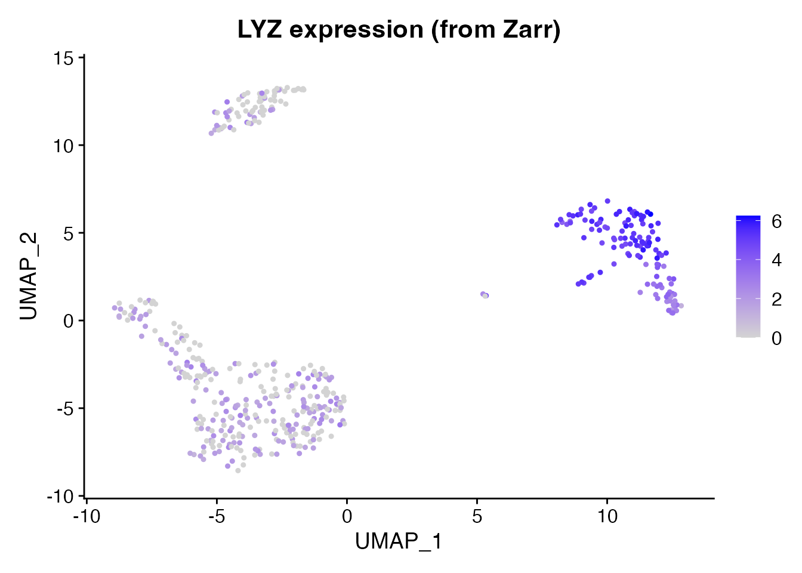
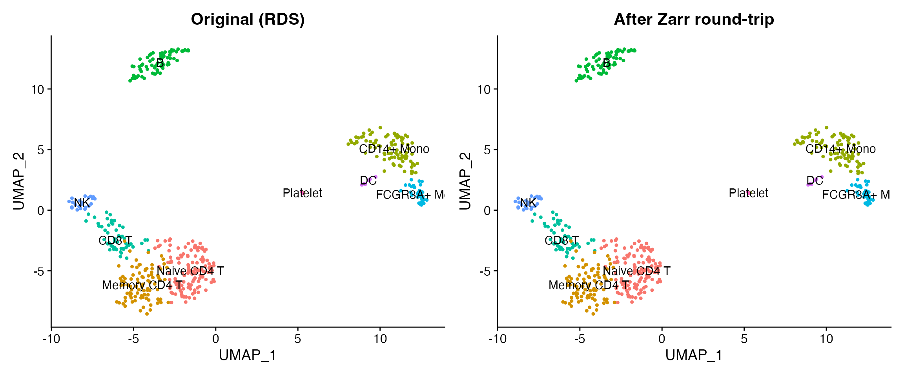

# Convert to Zarr Format

## Introduction

[Zarr](https://zarr.dev/) is a directory-based format for chunked,
compressed arrays. It is widely used in cloud-native single-cell
workflows – including [CELLxGENE
Census](https://chanzuckerberg.github.io/cellxgene-census/) and
[SpatialData](https://spatialdata.scverse.org/) – because each chunk is
an independent file that can be read in parallel from object stores like
S3 or GCS. scConvert reads and writes Zarr v2 stores following the
AnnData on-disk specification, with no Python dependency.

## Read a Zarr store

We start by reading a 500-cell PBMC dataset shipped as a Zarr store with
scConvert. This dataset has 2000 genes, PCA/UMAP embeddings, neighbor
graphs, and 9 annotated cell types.

``` r

zarr_path <- system.file("extdata", "pbmc_demo.zarr", package = "scConvert")
pbmc <- readZarr(zarr_path, verbose = FALSE)
pbmc
#> An object of class Seurat 
#> 2000 features across 500 samples within 1 assay 
#> Active assay: RNA (2000 features, 0 variable features)
#>  2 layers present: counts, data
#>  2 dimensional reductions calculated: pca, umap
```

``` r

DimPlot(pbmc, reduction = "umap", group.by = "seurat_annotations",
        label = TRUE, pt.size = 0.8) +
  ggtitle("PBMC data read from Zarr") + NoLegend()
```


LYZ is a strong monocyte marker. We can verify that expression values
were loaded correctly from the Zarr store.

``` r

FeaturePlot(pbmc, features = "LYZ", pt.size = 0.8) +
  ggtitle("LYZ expression (from Zarr)")
```



## Write to Zarr and read back

Now we load the same dataset from its RDS representation, write it to
Zarr, and read it back to verify round-trip fidelity.

``` r

pbmc_rds <- readRDS(system.file("extdata", "pbmc_demo.rds", package = "scConvert"))
rt_path <- file.path(tempdir(), "pbmc_roundtrip.zarr")
writeZarr(pbmc_rds, rt_path, overwrite = TRUE, verbose = FALSE)
pbmc_rt <- readZarr(rt_path, verbose = FALSE)
cat("Cells:", ncol(pbmc_rt), "| Genes:", nrow(pbmc_rt), "\n")
#> Cells: 500 | Genes: 2000
cat("Reductions:", paste(Reductions(pbmc_rt), collapse = ", "), "\n")
#> Reductions: pca, umap
```

### Compare original and round-trip

``` r

library(patchwork)

p1 <- DimPlot(pbmc_rds, reduction = "umap", group.by = "seurat_annotations",
              label = TRUE, pt.size = 0.8) +
  ggtitle("Original (RDS)") + NoLegend()

p2 <- DimPlot(pbmc_rt, reduction = "umap", group.by = "seurat_annotations",
              label = TRUE, pt.size = 0.8) +
  ggtitle("After Zarr round-trip") + NoLegend()

p1 + p2
```



### Fidelity check

``` r

# Dimensions match
stopifnot(ncol(pbmc_rt) == ncol(pbmc_rds))
stopifnot(nrow(pbmc_rt) == nrow(pbmc_rds))

# Barcodes and features match
stopifnot(identical(sort(colnames(pbmc_rt)), sort(colnames(pbmc_rds))))
stopifnot(identical(sort(rownames(pbmc_rt)), sort(rownames(pbmc_rds))))

# PCA coordinates are exact
pca_diff <- max(abs(
  Embeddings(pbmc_rds, "pca")[colnames(pbmc_rt), ] -
  Embeddings(pbmc_rt, "pca")
))
stopifnot(pca_diff < 1e-10)
cat("All checks passed: dimensions, barcodes, features, and PCA are exact.\n")
#> All checks passed: dimensions, barcodes, features, and PCA are exact.
```

## Streaming converters

For converting between file formats without loading data into R,
scConvert provides streaming converters that copy fields directly
between backends:

``` r

# h5ad <-> Zarr (no Seurat intermediate)
H5ADToZarr("data.h5ad", "data.zarr")
ZarrToH5AD("data.zarr", "data.h5ad")

# h5Seurat <-> Zarr
H5SeuratToZarr("data.h5seurat", "data.zarr")
ZarrToH5Seurat("data.zarr", "data.h5seurat")

# Or use the universal dispatcher
scConvert("data.h5ad", dest = "data.zarr", overwrite = TRUE)
```

These are particularly useful for large datasets where materializing the
full Seurat object would be expensive.

## Python interoperability

Zarr stores produced by
[`writeZarr()`](https://mianaz.github.io/scConvert/reference/writeZarr.md)
are directly readable by Python’s `anndata.read_zarr()` and scanpy.
Requires Python with anndata installed.

``` python
import anndata as ad
import scanpy as sc

adata = ad.read_zarr("pbmc.zarr")
print(adata)
sc.pl.umap(adata, color="seurat_annotations")
```

## Session Info

``` r

sessionInfo()
#> R version 4.5.2 (2025-10-31)
#> Platform: aarch64-apple-darwin20
#> Running under: macOS Tahoe 26.3
#> 
#> Matrix products: default
#> BLAS:   /System/Library/Frameworks/Accelerate.framework/Versions/A/Frameworks/vecLib.framework/Versions/A/libBLAS.dylib 
#> LAPACK: /Library/Frameworks/R.framework/Versions/4.5-arm64/Resources/lib/libRlapack.dylib;  LAPACK version 3.12.1
#> 
#> locale:
#> [1] en_US.UTF-8/en_US.UTF-8/en_US.UTF-8/C/en_US.UTF-8/en_US.UTF-8
#> 
#> time zone: America/Indiana/Indianapolis
#> tzcode source: internal
#> 
#> attached base packages:
#> [1] stats     graphics  grDevices utils     datasets  methods   base     
#> 
#> other attached packages:
#> [1] patchwork_1.3.2    ggplot2_4.0.2      Seurat_5.4.0       SeuratObject_5.3.0
#> [5] sp_2.2-1           scConvert_0.1.0   
#> 
#> loaded via a namespace (and not attached):
#>   [1] RColorBrewer_1.1-3     jsonlite_2.0.0         magrittr_2.0.4        
#>   [4] spatstat.utils_3.2-2   farver_2.1.2           rmarkdown_2.30        
#>   [7] fs_1.6.7               ragg_1.5.0             vctrs_0.7.1           
#>  [10] ROCR_1.0-12            spatstat.explore_3.7-0 htmltools_0.5.9       
#>  [13] sass_0.4.10            sctransform_0.4.3      parallelly_1.46.1     
#>  [16] KernSmooth_2.23-26     bslib_0.10.0           htmlwidgets_1.6.4     
#>  [19] desc_1.4.3             ica_1.0-3              plyr_1.8.9            
#>  [22] plotly_4.12.0          zoo_1.8-15             cachem_1.1.0          
#>  [25] igraph_2.2.2           mime_0.13              lifecycle_1.0.5       
#>  [28] pkgconfig_2.0.3        Matrix_1.7-4           R6_2.6.1              
#>  [31] fastmap_1.2.0          fitdistrplus_1.2-6     future_1.69.0         
#>  [34] shiny_1.13.0           digest_0.6.39          tensor_1.5.1          
#>  [37] RSpectra_0.16-2        irlba_2.3.7            textshaping_1.0.4     
#>  [40] labeling_0.4.3         progressr_0.18.0       spatstat.sparse_3.1-0 
#>  [43] httr_1.4.8             polyclip_1.10-7        abind_1.4-8           
#>  [46] compiler_4.5.2         bit64_4.6.0-1          withr_3.0.2           
#>  [49] S7_0.2.1               fastDummies_1.7.5      MASS_7.3-65           
#>  [52] tools_4.5.2            lmtest_0.9-40          otel_0.2.0            
#>  [55] httpuv_1.6.16          future.apply_1.20.2    goftest_1.2-3         
#>  [58] glue_1.8.0             nlme_3.1-168           promises_1.5.0        
#>  [61] grid_4.5.2             Rtsne_0.17             cluster_2.1.8.2       
#>  [64] reshape2_1.4.5         generics_0.1.4         hdf5r_1.3.12          
#>  [67] gtable_0.3.6           spatstat.data_3.1-9    tidyr_1.3.2           
#>  [70] data.table_1.18.2.1    spatstat.geom_3.7-0    RcppAnnoy_0.0.23      
#>  [73] ggrepel_0.9.7          RANN_2.6.2             pillar_1.11.1         
#>  [76] stringr_1.6.0          spam_2.11-3            RcppHNSW_0.6.0        
#>  [79] later_1.4.8            splines_4.5.2          dplyr_1.2.0           
#>  [82] lattice_0.22-9         survival_3.8-6         bit_4.6.0             
#>  [85] deldir_2.0-4           tidyselect_1.2.1       miniUI_0.1.2          
#>  [88] pbapply_1.7-4          knitr_1.51             gridExtra_2.3         
#>  [91] scattermore_1.2        xfun_0.56              matrixStats_1.5.0     
#>  [94] stringi_1.8.7          lazyeval_0.2.2         yaml_2.3.12           
#>  [97] evaluate_1.0.5         codetools_0.2-20       tibble_3.3.1          
#> [100] cli_3.6.5              uwot_0.2.4             xtable_1.8-8          
#> [103] reticulate_1.45.0      systemfonts_1.3.1      jquerylib_0.1.4       
#> [106] dichromat_2.0-0.1      Rcpp_1.1.1             globals_0.19.1        
#> [109] spatstat.random_3.4-4  png_0.1-8              spatstat.univar_3.1-6 
#> [112] parallel_4.5.2         pkgdown_2.2.0          dotCall64_1.2         
#> [115] listenv_0.10.1         viridisLite_0.4.3      scales_1.4.0          
#> [118] ggridges_0.5.7         purrr_1.2.1            crayon_1.5.3          
#> [121] rlang_1.1.7            cowplot_1.2.0
```
