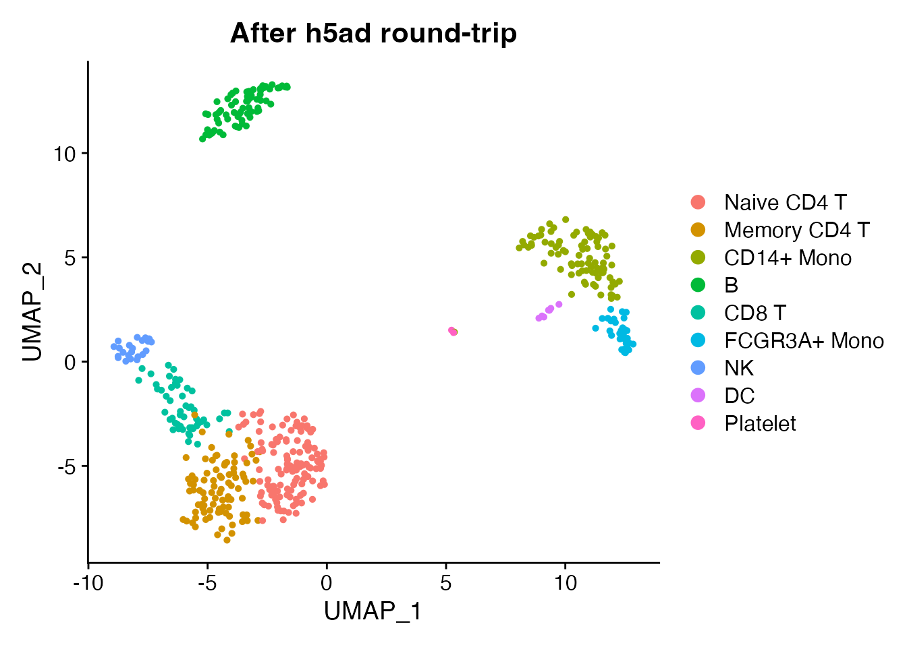

# Format Mapping Reference

## Overview

scConvert routes all conversions through Seurat as the universal
intermediate. This reference documents how Seurat components map to each
supported file format.

## Quick example

``` r

obj <- readRDS(system.file("extdata", "pbmc_demo.rds", package = "scConvert"))

# Convert to h5ad and back
h5ad_path <- tempfile(fileext = ".h5ad")
writeH5AD(obj, h5ad_path, overwrite = TRUE, verbose = FALSE)
obj_rt <- readH5AD(h5ad_path, verbose = FALSE)

cat("Original:", ncol(obj), "cells x", nrow(obj), "genes\n")
#> Original: 500 cells x 2000 genes
cat("Round-trip:", ncol(obj_rt), "cells x", nrow(obj_rt), "genes\n")
#> Round-trip: 500 cells x 2000 genes
cat("Reductions preserved:", paste(Reductions(obj_rt), collapse = ", "), "\n")
#> Reductions preserved: pca, umap

DimPlot(obj_rt, reduction = "umap", group.by = "seurat_annotations") +
  ggplot2::ggtitle("After h5ad round-trip")
```



## Preservation summary

What survives conversion across all formats:

| Component           | h5ad | h5Seurat | h5mu |  Loom   | Zarr | RDS |
|---------------------|:----:|:--------:|:----:|:-------:|:----:|:---:|
| Expression (counts) |  Y   |    Y     |  Y   |    Y    |  Y   |  Y  |
| Expression (data)   |  Y   |    Y     |  Y   |    Y    |  Y   |  Y  |
| Cell metadata       |  Y   |    Y     |  Y   |    Y    |  Y   |  Y  |
| Feature metadata    |  Y   |    Y     |  Y   | partial |  Y   |  Y  |
| PCA/UMAP/t-SNE      |  Y   |    Y     |  Y   |    Y    |  Y   |  Y  |
| Neighbor graphs     |  Y   |    Y     |  Y   |    Y    |  Y   |  Y  |
| Variable features   |  Y   |    Y     |  Y   |    –    |  Y   |  Y  |
| Spatial images      |  Y   |    Y     |  –   |    –    |  Y   |  Y  |
| Scale data          |  –   |    Y     |  –   |    Y    |  –   |  Y  |
| Command log         |  –   |    Y     |  –   |    –    |  –   |  Y  |

Y = preserved, – = not supported or lost in conversion.

## Seurat to h5ad

| Seurat Component | h5ad Location | Notes |
|----|----|----|
| `GetAssayData(layer = "data")` | `X` | Primary matrix (log-normalized) |
| `GetAssayData(layer = "counts")` | `raw/X` | Raw counts |
| `VariableFeatures()` | `var['highly_variable']` | Boolean column |
| `meta.data` | `obs` | Factors become categoricals |
| `meta.features` | `var` | Gene-level metadata |
| `Embeddings(, "pca")` | `obsm['X_pca']` | PCA coordinates |
| `Embeddings(, "umap")` | `obsm['X_umap']` | UMAP coordinates |
| `Graphs(, "RNA_snn")` | `obsp['connectivities']` | SNN graph |
| `Graphs(, "RNA_nn")` | `obsp['distances']` | KNN distances |
| Spatial coordinates | `obsm['spatial']` | Tissue positions |
| Spatial images | `uns['spatial'][lib]['images']` | H&E images |
| Scale factors | `uns['spatial'][lib]['scalefactors']` | Visium scaling |
| `misc` | `uns` | Unstructured metadata |

**Notes:** Scale data is not stored in h5ad (recompute with
`ScaleData()` or `sc.pp.scale()`). Data (all genes) is written to `X`;
scale.data (variable features only) is skipped.

## h5ad to Seurat

| h5ad Location | Seurat Destination | Notes |
|----|----|----|
| `X` | `data` layer | Log-normalized expression |
| `raw/X` | `counts` layer | Raw counts (if present) |
| `obs` | `meta.data` | Categoricals become R factors |
| `var` | Feature metadata | All columns preserved |
| `var['highly_variable']` | `VariableFeatures()` | Boolean TRUE = variable |
| `obsm/X_pca` | `reductions$pca` | Auto-detected by prefix |
| `obsm/X_umap` | `reductions$umap` | Auto-detected by prefix |
| `obsm/X_tsne` | `reductions$tsne` | Auto-detected by prefix |
| `obsm/spatial` | Spatial coordinates | Via spatial handler |
| `obsp/connectivities` | `graphs$RNA_snn` | SNN graph |
| `obsp/distances` | `graphs$RNA_nn` | KNN distances |
| `uns` | `misc` | Unstructured annotations |

## Seurat to h5Seurat

The mapping is 1:1 since h5Seurat is the native format:

| Seurat Component  | h5Seurat Path                      |
|-------------------|------------------------------------|
| Assay counts      | `/assays/RNA/counts` (sparse)      |
| Assay data        | `/assays/RNA/data` (sparse)        |
| Scale data        | `/assays/RNA/scale.data` (dense)   |
| Features          | `/assays/RNA/features`             |
| Variable features | `/assays/RNA/variable.features`    |
| Cell metadata     | `/meta.data`                       |
| PCA embeddings    | `/reductions/pca/cell.embeddings`  |
| UMAP embeddings   | `/reductions/umap/cell.embeddings` |
| SNN graph         | `/graphs/RNA_snn` (sparse)         |
| Spatial images    | `/images/{name}` (S4 object)       |
| Misc              | `/misc`                            |

Everything is preserved exactly, including command logs and tool
results.

## Seurat to h5mu (MuData)

Each Seurat assay becomes a separate modality:

| Seurat Component      | h5mu Location         |
|-----------------------|-----------------------|
| Each assay            | `/mod/{modality}/`    |
| Assay counts          | `/mod/{modality}/X`   |
| Assay features        | `/mod/{modality}/var` |
| Cell metadata         | `/obs` (global)       |
| Per-modality metadata | `/mod/{modality}/obs` |

**Modality name mapping:**

| Seurat Assay | h5mu Modality  |
|--------------|----------------|
| RNA          | rna            |
| ADT          | prot           |
| ATAC         | atac           |
| Spatial      | spatial        |
| SCT          | sct            |
| Other        | lowercase name |

The reverse mapping applies when reading h5mu files.

## Seurat to Loom

| Seurat Component    | Loom Location                         |
|---------------------|---------------------------------------|
| Default assay data  | `/matrix` (genes x cells, transposed) |
| Counts              | `/layers/counts`                      |
| Cell barcodes       | `/col_attrs/CellID`                   |
| Gene names          | `/row_attrs/Gene`                     |
| `meta.data` columns | `/col_attrs/*`                        |
| `meta.features`     | `/row_attrs/*`                        |
| Embeddings          | `/col_attrs/reduced_dims_*`           |
| Graphs              | `/col_graphs/*`                       |

**Limitations:** Variable features and PCA standard deviations are not
natively supported in Loom. Feature metadata columns are flattened to
row attributes.

## Seurat to Zarr

The Zarr format follows the AnnData/h5ad layout but uses Zarr storage:

| Seurat Component | Zarr Location                             |
|------------------|-------------------------------------------|
| Data layer       | `/X` (sparse group)                       |
| Counts           | `/raw/X`                                  |
| Cell metadata    | `/obs`                                    |
| Feature metadata | `/var`                                    |
| Embeddings       | `/obsm/X_pca`, `/obsm/X_umap`             |
| Graphs           | `/obsp/connectivities`, `/obsp/distances` |
| Misc             | `/uns`                                    |

Zarr uses the same slot mapping as h5ad. Direct streaming converters
([`H5ADToZarr()`](https://mianaz.github.io/scConvert/reference/H5ADToZarr.md),
[`ZarrToH5AD()`](https://mianaz.github.io/scConvert/reference/ZarrToH5AD.md),
etc.) transfer data without constructing a Seurat object in memory.

## Clean up
