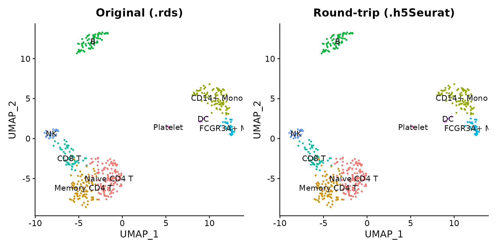

# Working with h5Seurat Files

The h5Seurat format is an HDF5-based file format designed specifically
for Seurat objects. It stores all assays, reductions, graphs, and
metadata in a single file and supports selective loading so you can read
only the components you need.

## Read an h5Seurat file

scConvert ships a 500-cell PBMC dataset in h5Seurat format.
[`readH5Seurat()`](https://mianaz.github.io/scConvert/reference/readH5Seurat.md)
loads it directly into a fully functional Seurat object.

``` r
h5seurat_file <- system.file("extdata", "pbmc_demo.h5seurat", package = "scConvert")
pbmc <- readH5Seurat(h5seurat_file)
pbmc
#> An object of class Seurat 
#> 2000 features across 500 samples within 1 assay 
#> Active assay: RNA (2000 features, 2000 variable features)
#>  2 layers present: counts, data
#>  2 dimensional reductions calculated: pca, umap
```

The loaded object contains all nine annotated cell types with PCA, UMAP,
and neighbor graphs:

``` r
DimPlot(pbmc, reduction = "umap", group.by = "seurat_annotations",
        label = TRUE, pt.size = 0.5) + NoLegend()
```


Expression data is fully available. LYZ is a monocyte marker:

``` r
FeaturePlot(pbmc, features = "LYZ", pt.size = 0.5)
```


## Write a Seurat object to h5Seurat

[`writeH5Seurat()`](https://mianaz.github.io/scConvert/reference/writeH5Seurat.md)
saves any Seurat object to h5Seurat format, preserving all assays,
dimensional reductions, graphs, and cell metadata.

``` r
pbmc_seurat <- readRDS(system.file("extdata", "pbmc_demo.rds", package = "scConvert"))
h5seurat_path <- tempfile(fileext = ".h5Seurat")
writeH5Seurat(pbmc_seurat, filename = h5seurat_path, overwrite = TRUE)
cat("File size:", round(file.size(h5seurat_path) / 1e6, 1), "MB\n")
#> File size: 2.3 MB
```

## Verify the round-trip

Read the written file back and confirm that the UMAP coordinates,
cluster labels, and expression values are identical to the original.

``` r
pbmc_rt <- readH5Seurat(h5seurat_path)
```

``` r
library(patchwork)
p1 <- DimPlot(pbmc_seurat, reduction = "umap", group.by = "seurat_annotations",
              label = TRUE, pt.size = 0.5) + NoLegend() + ggtitle("Original (.rds)")
p2 <- DimPlot(pbmc_rt, reduction = "umap", group.by = "seurat_annotations",
              label = TRUE, pt.size = 0.5) + NoLegend() + ggtitle("Round-trip (.h5Seurat)")
p1 + p2
```



## Selective loading

For large datasets, you can load only what you need. This is useful when
you have a multi-gigabyte h5Seurat file and only want to make a quick
UMAP plot.

Load only the RNA assay with UMAP, skipping PCA and all graphs:

``` r
pbmc_light <- readH5Seurat(h5seurat_file, assays = "RNA",
                           reductions = "umap", graphs = FALSE)
pbmc_light
#> An object of class Seurat 
#> 2000 features across 500 samples within 1 assay 
#> Active assay: RNA (2000 features, 2000 variable features)
#>  2 layers present: counts, data
#>  1 dimensional reduction calculated: umap
```

The light object still supports visualization since UMAP coordinates are
present:

``` r
DimPlot(pbmc_light, reduction = "umap", group.by = "seurat_annotations",
        label = TRUE, pt.size = 0.5) + NoLegend()
```


## Query file contents with scConnect()

Before loading any data, you can inspect what is stored in an h5Seurat
file using
[`scConnect()`](https://mianaz.github.io/scConvert/reference/scConnect.md).
This opens a lightweight connection and `.index()` summarizes the
contents – which assays, reductions, graphs, and images are available.

``` r
hfile <- scConnect(h5seurat_file)
hfile$index()
#> Data for assay RNA★ (default assay)
#>    counts      data    scale.data
#>      ✔          ✔          ✖     
#> Dimensional reductions:
#>         Embeddings  Loadings  Projected  JackStraw 
#>  pca:       ✔          ✔          ✖          ✖     
#>  umap:      ✔          ✖          ✖          ✖
hfile$close_all()
```

This is especially useful for large files where you want to decide what
to load before committing memory.

## Per-cluster expression

A violin plot shows the LYZ expression distribution across all nine cell
types:

``` r
VlnPlot(pbmc, features = "LYZ", group.by = "seurat_annotations", pt.size = 0) +
  NoLegend()
```


## Clean up

``` r
unlink(h5seurat_path)
```
