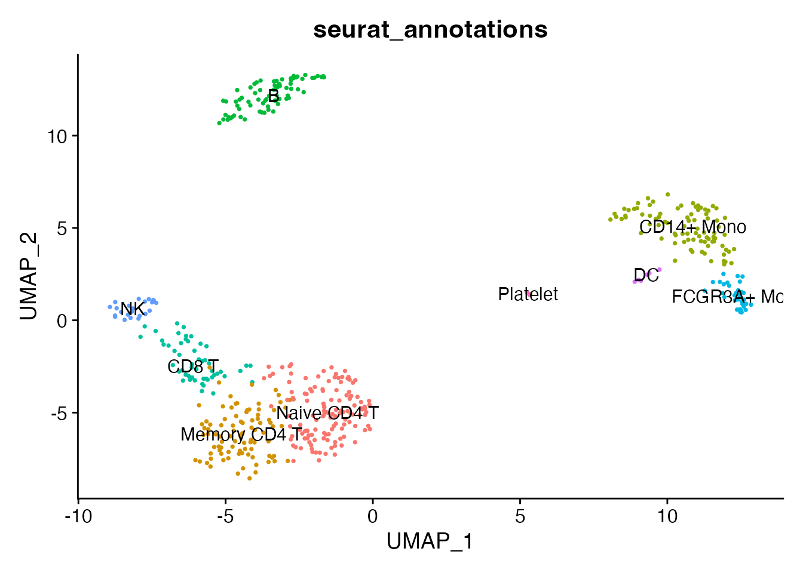
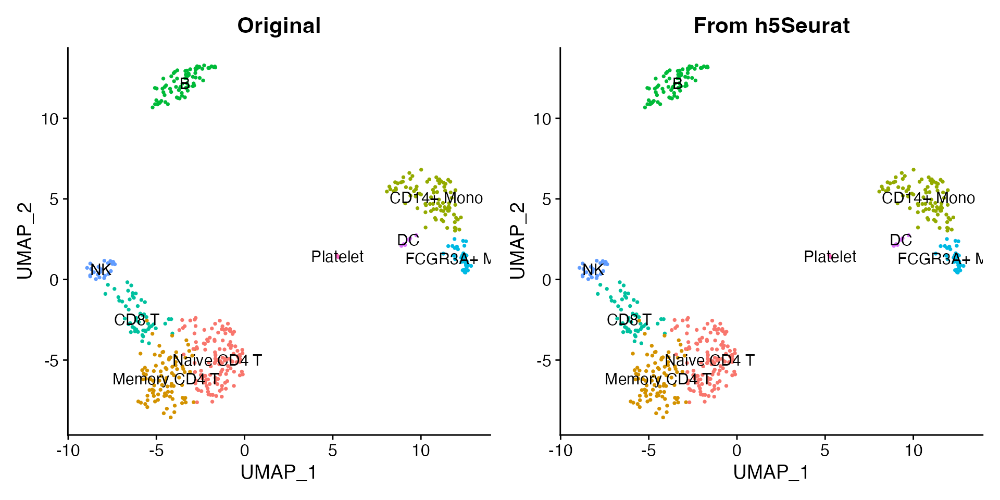
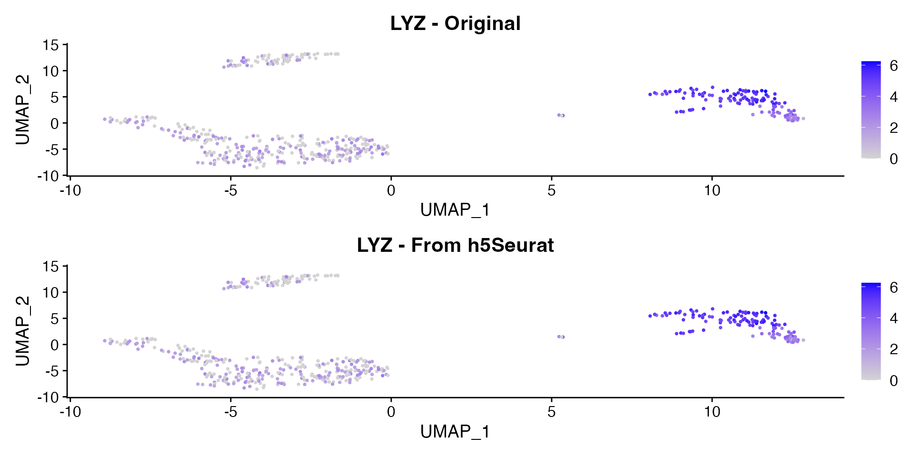
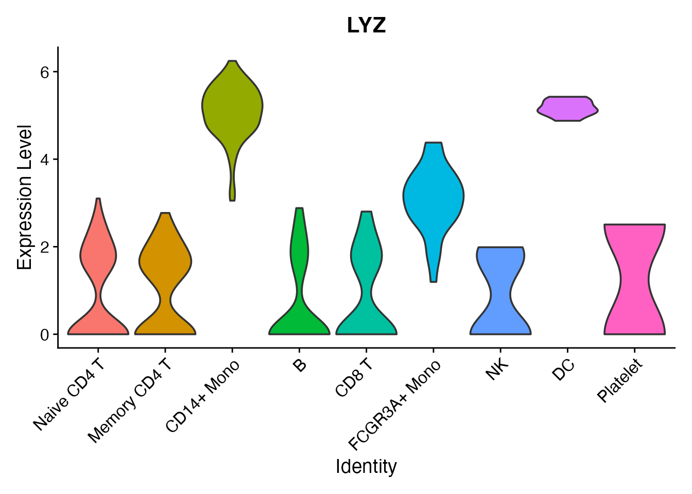

# Working with h5Seurat Files

The h5Seurat format is an HDF5-based file format designed for Seurat
objects. It stores all assays, reductions, graphs, and metadata in a
single file and supports selective loading so you can read only the
components you need.

## Save a Seurat object

We start with the shipped 500-cell PBMC demo dataset, which includes
PCA, UMAP, neighbor graphs, and nine annotated cell types.

``` r

pbmc <- readRDS(system.file("extdata", "pbmc_demo.rds", package = "scConvert"))
pbmc
#> An object of class Seurat 
#> 2000 features across 500 samples within 1 assay 
#> Active assay: RNA (2000 features, 2000 variable features)
#>  2 layers present: counts, data
#>  2 dimensional reductions calculated: pca, umap
```

``` r

DimPlot(pbmc, reduction = "umap", group.by = "seurat_annotations",
        label = TRUE, pt.size = 0.5) + NoLegend()
```



Write the object to an h5Seurat file with
[`writeH5Seurat()`](https://mianaz.github.io/scConvert/reference/writeH5Seurat.md).
All assays, dimensional reductions, graphs, and cell metadata are saved
automatically.

``` r

h5seurat_path <- tempfile(fileext = ".h5Seurat")
writeH5Seurat(pbmc, filename = h5seurat_path, overwrite = TRUE)
cat("File size:", round(file.size(h5seurat_path) / 1e6, 1), "MB\n")
#> File size: 2.3 MB
```

## Load it back

[`readH5Seurat()`](https://mianaz.github.io/scConvert/reference/readH5Seurat.md)
reads the full object back into memory by default:

``` r

pbmc2 <- readH5Seurat(h5seurat_path)
pbmc2
#> An object of class Seurat 
#> 2000 features across 500 samples within 1 assay 
#> Active assay: RNA (2000 features, 2000 variable features)
#>  2 layers present: counts, data
#>  2 dimensional reductions calculated: pca, umap
```

The loaded object preserves all components – clusters, reductions, and
expression data look identical to the original:

``` r

library(patchwork)
p1 <- DimPlot(pbmc, reduction = "umap", group.by = "seurat_annotations",
              label = TRUE, pt.size = 0.5) + NoLegend() + ggtitle("Original")
p2 <- DimPlot(pbmc2, reduction = "umap", group.by = "seurat_annotations",
              label = TRUE, pt.size = 0.5) + NoLegend() + ggtitle("From h5Seurat")
p1 + p2
```



## Selective loading

For large datasets, you can load only what you need. This is
particularly useful when you have a multi-gigabyte h5Seurat file and
only want to make a quick UMAP plot. The
[`readH5Seurat()`](https://mianaz.github.io/scConvert/reference/readH5Seurat.md)
function accepts four parameters for controlling what gets loaded:

- `assays`: which assays and layers to load
- `reductions`: which dimensional reductions to load
- `graphs`: which nearest-neighbor graphs to load
- `images`: which spatial images to load

Load only the RNA assay with UMAP, skipping PCA and all graphs:

``` r

pbmc_light <- readH5Seurat(h5seurat_path, assays = "RNA",
                           reductions = "umap", graphs = FALSE)
pbmc_light
#> An object of class Seurat 
#> 2000 features across 500 samples within 1 assay 
#> Active assay: RNA (2000 features, 2000 variable features)
#>  2 layers present: counts, data
#>  1 dimensional reduction calculated: umap
```

The loaded object still supports visualization since UMAP coordinates
are present:

``` r

DimPlot(pbmc_light, reduction = "umap", group.by = "seurat_annotations",
        label = TRUE, pt.size = 0.5) + NoLegend()
```


You can also control which layers of an assay to load. For example, to
load only the normalized data (skipping raw counts and scaled data):

``` r

pbmc_data_only <- readH5Seurat(h5seurat_path,
                               assays = list("RNA" = "data"),
                               reductions = "umap", graphs = FALSE)
cat("Layers loaded:", paste(Layers(pbmc_data_only), collapse = ", "), "\n")
#> Layers loaded: counts, data
```

## Query file contents with scConnect()

Before loading, you can inspect what is stored in an h5Seurat file
without reading any data into memory.
[`scConnect()`](https://mianaz.github.io/scConvert/reference/scConnect.md)
opens a lightweight connection to the file and `.index()` summarizes its
contents, showing which assays, reductions, graphs, and images are
available.

``` r

hfile <- scConnect(h5seurat_path)
hfile$index()
#> Data for assay RNA★ (default assay)
#>    counts      data    scale.data
#>      ✔          ✔          ✖     
#> Dimensional reductions:
#>         Embeddings  Loadings  Projected  JackStraw 
#>  pca:       ✔          ✔          ✖          ✖     
#>  umap:      ✔          ✖          ✖          ✖
hfile$close_all()
```

This is especially useful for large files where you want to decide what
to load before committing memory.

## Compare expression before and after

The expression values are preserved exactly through the h5Seurat
round-trip. Here we compare the LYZ gene (a monocyte marker) in the
original and reloaded objects:

``` r

p1 <- FeaturePlot(pbmc, features = "LYZ", pt.size = 0.5) + ggtitle("LYZ - Original")
p2 <- FeaturePlot(pbmc2, features = "LYZ", pt.size = 0.5) + ggtitle("LYZ - From h5Seurat")
p1 + p2
```



A violin plot confirms the per-cluster expression distribution is
identical:

``` r

VlnPlot(pbmc2, features = "LYZ", group.by = "seurat_annotations", pt.size = 0) +
  NoLegend()
```



## Incremental loading with scAppendData()

If you loaded a partial object and later need additional components, use
[`scAppendData()`](https://mianaz.github.io/scConvert/reference/scAppendData.md)
to add them without reloading from scratch:

``` r

# Start with a minimal load (data layer + UMAP only)
pbmc_partial <- readH5Seurat(h5seurat_path, assays = list("RNA" = "data"),
                             reductions = "umap", graphs = FALSE)
cat("Before append - Reductions:", paste(Reductions(pbmc_partial), collapse = ", "), "\n")
#> Before append - Reductions: umap

# Now add PCA
pbmc_partial <- scAppendData(h5seurat_path, pbmc_partial,
                             assays = FALSE, reductions = "pca",
                             graphs = FALSE, images = FALSE)
cat("After append  - Reductions:", paste(Reductions(pbmc_partial), collapse = ", "), "\n")
#> After append  - Reductions: umap, pca
```

## Clean up

``` r

unlink(h5seurat_path)
```
