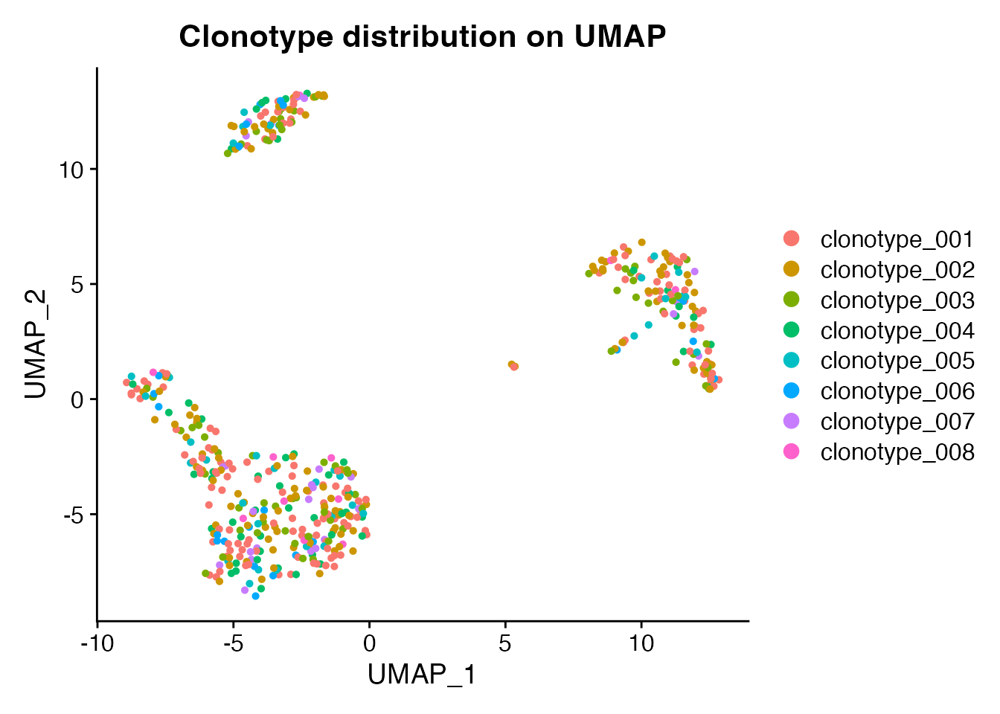
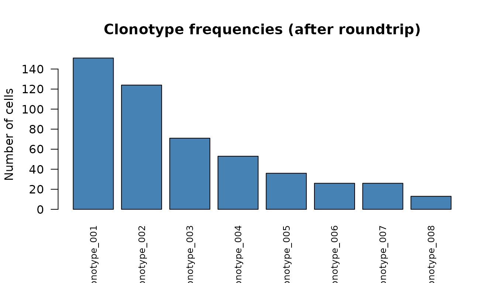
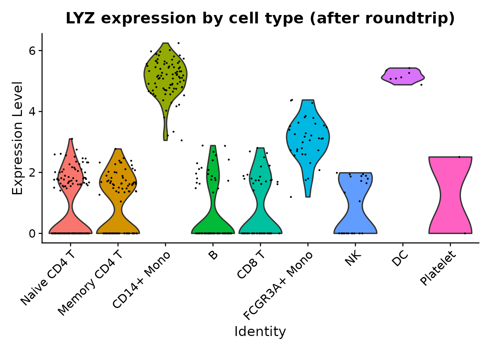

# Immune Repertoire Metadata Preservation

## Introduction

Single-cell immune profiling experiments often pair gene expression with
TCR/BCR sequencing. Tools like scRepertoire add clonotype annotations –
clonotype IDs, V/D/J gene usage, CDR3 sequences, and clone frequencies –
as cell-level metadata. scConvert preserves all of this metadata through
format conversions, so TCR/BCR annotations survive roundtrips between
Seurat and h5ad.

## Load PBMC data and add synthetic TCR metadata

We start with the shipped PBMC demo (500 cells, 9 cell types) and add
synthetic TCR annotations to demonstrate metadata preservation.

``` r

pbmc_path <- system.file("extdata", "pbmc_demo.rds", package = "scConvert")
obj <- readRDS(pbmc_path)

cat("Cells:", ncol(obj), "\n")
#> Cells: 500
cat("Genes:", nrow(obj), "\n")
#> Genes: 2000
cat("Cell types:", paste(levels(obj$seurat_annotations), collapse = ", "), "\n")
#> Cell types: Naive CD4 T, Memory CD4 T, CD14+ Mono, B, CD8 T, FCGR3A+ Mono, NK, DC, Platelet
```

### Add TCR annotations

In a real workflow, these columns would come from scRepertoire’s
`combineExpression()`. Here we create synthetic clonotype data to
illustrate the conversion.

``` r

set.seed(42)
n_cells <- ncol(obj)

# 8 clonotypes with power-law-like frequencies
clonotype_ids <- paste0("clonotype_", sprintf("%03d", 1:8))
weights <- c(30, 22, 16, 12, 8, 5, 4, 3)
assignments <- sample(seq_along(clonotype_ids), n_cells,
                       replace = TRUE, prob = weights)

obj$clonotype_id <- factor(clonotype_ids[assignments], levels = clonotype_ids)

# V/J gene usage
tra_genes <- c("TRAV1-2", "TRAV12-1", "TRAV38-2", "TRAV21",
               "TRAV8-6", "TRAV26-1", "TRAV13-1", "TRAV29")
trb_genes <- c("TRBV6-1", "TRBV28", "TRBV5-1", "TRBV7-2",
               "TRBV19", "TRBV12-3", "TRBV4-1", "TRBV20-1")
obj$tra_gene <- tra_genes[assignments]
obj$trb_gene <- trb_genes[assignments]

# Clone frequency
freq_tbl <- table(assignments)
obj$clone_frequency <- as.integer(freq_tbl[as.character(assignments)])

cat("TCR columns added:", paste(c("clonotype_id", "tra_gene",
    "trb_gene", "clone_frequency"), collapse = ", "), "\n")
#> TCR columns added: clonotype_id, tra_gene, trb_gene, clone_frequency
```

### Visualize clonotypes

``` r

DimPlot(obj, group.by = "clonotype_id", reduction = "umap",
        label = FALSE) +
  ggplot2::ggtitle("Clonotype distribution on UMAP")
```



## Convert to h5ad and read back

``` r

h5ad_file <- tempfile(fileext = ".h5ad")
writeH5AD(obj, h5ad_file, overwrite = TRUE)
obj_rt <- readH5AD(h5ad_file, verbose = FALSE)
```

### Verify TCR metadata preservation

``` r

tcr_cols <- c("clonotype_id", "tra_gene", "trb_gene", "clone_frequency")

cat("All TCR columns present:",
    all(tcr_cols %in% colnames(obj_rt[[]])), "\n")
#> All TCR columns present: TRUE
cat("clonotype_id match:",
    all(as.character(obj$clonotype_id) ==
        as.character(obj_rt$clonotype_id)), "\n")
#> clonotype_id match: TRUE
cat("tra_gene match:", all(obj$tra_gene == obj_rt$tra_gene), "\n")
#> tra_gene match: TRUE
cat("trb_gene match:", all(obj$trb_gene == obj_rt$trb_gene), "\n")
#> trb_gene match: TRUE
cat("clone_frequency match:",
    all(obj$clone_frequency == obj_rt$clone_frequency), "\n")
#> clone_frequency match: TRUE
```

All TCR metadata columns – factors, strings, and integers – are
preserved exactly through the h5ad roundtrip.

### Clonotype frequency barplot

``` r

freq_df <- as.data.frame(table(obj_rt$clonotype_id))
colnames(freq_df) <- c("Clonotype", "Cells")
freq_df <- freq_df[order(-freq_df$Cells), ]

barplot(freq_df$Cells, names.arg = freq_df$Clonotype,
        col = "steelblue", las = 2, cex.names = 0.8,
        main = "Clonotype frequencies (after roundtrip)",
        ylab = "Number of cells")
```



### Gene expression across cell types

Cell type annotations and expression values are also preserved alongside
the TCR metadata.

``` r

VlnPlot(obj_rt, features = "LYZ", group.by = "seurat_annotations",
        pt.size = 0.1) +
  ggplot2::ggtitle("LYZ expression by cell type (after roundtrip)") +
  ggplot2::theme(legend.position = "none")
```



## Python interop

``` python
# Requires Python with scanpy installed
import scanpy as sc

adata = sc.read_h5ad("tcr_pbmc.h5ad")
print(adata.obs[["clonotype_id", "tra_gene", "trb_gene"]].head(10))

# Clonotype distribution
adata.obs["clonotype_id"].value_counts().plot.bar()
```

## Cleanup

## Session Info

``` r

sessionInfo()
#> R version 4.6.0 (2026-04-24)
#> Platform: x86_64-pc-linux-gnu
#> Running under: Ubuntu 24.04.4 LTS
#> 
#> Matrix products: default
#> BLAS:   /usr/lib/x86_64-linux-gnu/openblas-pthread/libblas.so.3 
#> LAPACK: /usr/lib/x86_64-linux-gnu/openblas-pthread/libopenblasp-r0.3.26.so;  LAPACK version 3.12.0
#> 
#> locale:
#>  [1] LC_CTYPE=C.UTF-8       LC_NUMERIC=C           LC_TIME=C.UTF-8       
#>  [4] LC_COLLATE=C.UTF-8     LC_MONETARY=C.UTF-8    LC_MESSAGES=C.UTF-8   
#>  [7] LC_PAPER=C.UTF-8       LC_NAME=C              LC_ADDRESS=C          
#> [10] LC_TELEPHONE=C         LC_MEASUREMENT=C.UTF-8 LC_IDENTIFICATION=C   
#> 
#> time zone: UTC
#> tzcode source: system (glibc)
#> 
#> attached base packages:
#> [1] stats     graphics  grDevices utils     datasets  methods   base     
#> 
#> other attached packages:
#> [1] ggplot2_4.0.3      Seurat_5.5.0       SeuratObject_5.4.0 sp_2.2-1          
#> [5] scConvert_0.1.0   
#> 
#> loaded via a namespace (and not attached):
#>   [1] RColorBrewer_1.1-3     jsonlite_2.0.0         magrittr_2.0.5        
#>   [4] spatstat.utils_3.2-2   farver_2.1.2           rmarkdown_2.31        
#>   [7] fs_2.1.0               ragg_1.5.2             vctrs_0.7.3           
#>  [10] ROCR_1.0-12            spatstat.explore_3.8-0 htmltools_0.5.9       
#>  [13] sass_0.4.10            sctransform_0.4.3      parallelly_1.47.0     
#>  [16] KernSmooth_2.23-26     bslib_0.10.0           htmlwidgets_1.6.4     
#>  [19] desc_1.4.3             ica_1.0-3              plyr_1.8.9            
#>  [22] plotly_4.12.0          zoo_1.8-15             cachem_1.1.0          
#>  [25] igraph_2.3.0           mime_0.13              lifecycle_1.0.5       
#>  [28] pkgconfig_2.0.3        Matrix_1.7-5           R6_2.6.1              
#>  [31] fastmap_1.2.0          MatrixGenerics_1.24.0  fitdistrplus_1.2-6    
#>  [34] future_1.70.0          shiny_1.13.0           digest_0.6.39         
#>  [37] S4Vectors_0.50.0       patchwork_1.3.2        tensor_1.5.1          
#>  [40] RSpectra_0.16-2        irlba_2.3.7            GenomicRanges_1.64.0  
#>  [43] textshaping_1.0.5      labeling_0.4.3         progressr_0.19.0      
#>  [46] spatstat.sparse_3.1-0  httr_1.4.8             polyclip_1.10-7       
#>  [49] abind_1.4-8            compiler_4.6.0         bit64_4.8.0           
#>  [52] withr_3.0.2            S7_0.2.2               fastDummies_1.7.6     
#>  [55] MASS_7.3-65            tools_4.6.0            lmtest_0.9-40         
#>  [58] otel_0.2.0             httpuv_1.6.17          future.apply_1.20.2   
#>  [61] goftest_1.2-3          glue_1.8.1             nlme_3.1-169          
#>  [64] promises_1.5.0         grid_4.6.0             Rtsne_0.17            
#>  [67] cluster_2.1.8.2        reshape2_1.4.5         generics_0.1.4        
#>  [70] hdf5r_1.3.12           gtable_0.3.6           spatstat.data_3.1-9   
#>  [73] tidyr_1.3.2            data.table_1.18.2.1    BiocGenerics_0.58.0   
#>  [76] BPCells_0.3.1          spatstat.geom_3.7-3    RcppAnnoy_0.0.23      
#>  [79] ggrepel_0.9.8          RANN_2.6.2             pillar_1.11.1         
#>  [82] stringr_1.6.0          spam_2.11-3            RcppHNSW_0.6.0        
#>  [85] later_1.4.8            splines_4.6.0          dplyr_1.2.1           
#>  [88] lattice_0.22-9         survival_3.8-6         bit_4.6.0             
#>  [91] deldir_2.0-4           tidyselect_1.2.1       miniUI_0.1.2          
#>  [94] pbapply_1.7-4          knitr_1.51             gridExtra_2.3         
#>  [97] Seqinfo_1.2.0          IRanges_2.46.0         scattermore_1.2       
#> [100] stats4_4.6.0           xfun_0.57              matrixStats_1.5.0     
#> [103] stringi_1.8.7          lazyeval_0.2.3         yaml_2.3.12           
#> [106] evaluate_1.0.5         codetools_0.2-20       tibble_3.3.1          
#> [109] cli_3.6.6              uwot_0.2.4             xtable_1.8-8          
#> [112] reticulate_1.46.0      systemfonts_1.3.2      jquerylib_0.1.4       
#> [115] Rcpp_1.1.1-1.1         globals_0.19.1         spatstat.random_3.4-5 
#> [118] png_0.1-9              spatstat.univar_3.1-7  parallel_4.6.0        
#> [121] pkgdown_2.2.0          dotCall64_1.2          listenv_0.10.1        
#> [124] viridisLite_0.4.3      scales_1.4.0           ggridges_0.5.7        
#> [127] purrr_1.2.2            crayon_1.5.3           rlang_1.2.0           
#> [130] cowplot_1.2.0
```
