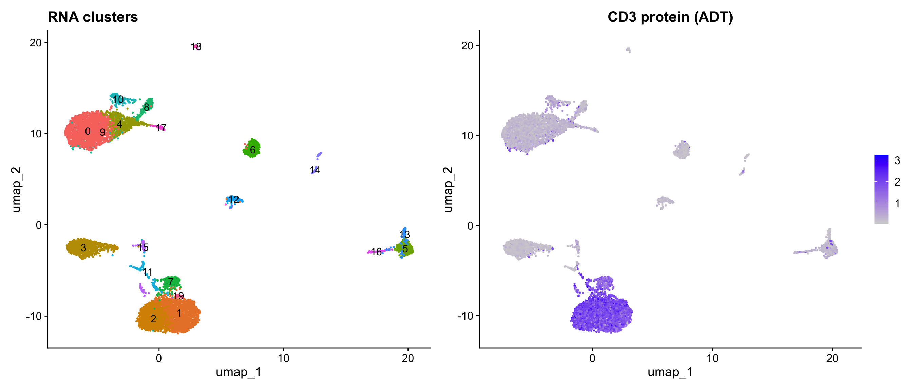
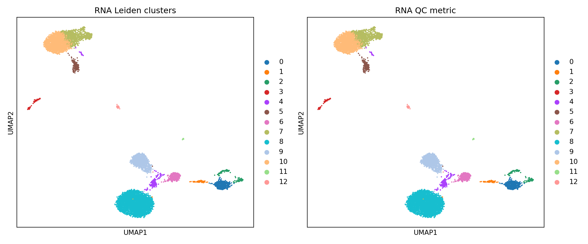

# Multimodal: CITE-seq and Multiome

## Overview

Multimodal single-cell experiments measure multiple data types from the
same cells. This vignette demonstrates scConvert’s handling of:

1.  **CITE-seq** (RNA + surface protein / ADT) via h5mu format
2.  **Multiome** (RNA + ATAC) via h5Seurat format

The **h5mu** (MuData) format is the standard for multimodal data in the
scverse ecosystem, storing each modality as a separate AnnData within a
single file.

``` r

library(Seurat)
library(scConvert)
library(ggplot2)
```

## CITE-seq: CBMC dataset

The CBMC (cord blood mononuclear cell) dataset contains RNA and ADT
(antibody-derived tag) measurements from CITE-seq:

``` r

library(SeuratData)
data("cbmc", package = "cbmc.SeuratData")
cbmc <- UpdateSeuratObject(cbmc)

cat("Cells:", ncol(cbmc), "\n")
#> Cells: 8617
cat("Assays:", paste(Assays(cbmc), collapse = ", "), "\n")
#> Assays: RNA, ADT
cat("RNA features:", nrow(cbmc[["RNA"]]), "\n")
#> RNA features: 20501
cat("ADT features:", nrow(cbmc[["ADT"]]), "\n")
#> ADT features: 10
```

### Process and cluster

``` r

cbmc <- NormalizeData(cbmc, verbose = FALSE)
cbmc <- FindVariableFeatures(cbmc, verbose = FALSE)
cbmc <- ScaleData(cbmc, verbose = FALSE)
cbmc <- RunPCA(cbmc, verbose = FALSE)
cbmc <- RunUMAP(cbmc, dims = 1:30, verbose = FALSE)
cbmc <- FindNeighbors(cbmc, dims = 1:30, verbose = FALSE)
cbmc <- FindClusters(cbmc, resolution = 0.8, verbose = FALSE)
```

### UMAP visualization

``` r

library(patchwork)

p1 <- DimPlot(cbmc, label = TRUE, pt.size = 0.3) + NoLegend() + ggtitle("RNA clusters")

# Normalize ADT
cbmc <- NormalizeData(cbmc, assay = "ADT", normalization.method = "CLR", verbose = FALSE)
p2 <- FeaturePlot(cbmc, features = "adt_CD3", pt.size = 0.3) + ggtitle("CD3 protein (ADT)")

p1 + p2
```



### Export to h5mu

``` r

# Remove overlapping features (h5mu requires unique names per modality)
overlap <- intersect(rownames(cbmc[["ADT"]]), rownames(cbmc[["RNA"]]))
if (length(overlap) > 0) {
  adt_keep <- setdiff(rownames(cbmc[["ADT"]]), overlap)
  cbmc[["ADT"]] <- subset(cbmc[["ADT"]], features = adt_keep)
  cat("Removed", length(overlap), "overlapping features from ADT\n")
}
#> Removed 4 overlapping features from ADT

h5mu_path <- tempfile(fileext = ".h5mu")
SaveH5MU(cbmc, h5mu_path, overwrite = TRUE)
cat("h5mu file size:", round(file.size(h5mu_path) / 1024^2, 1), "MB\n")
#> h5mu file size: 44.9 MB
```

### Validate h5mu in Python

The exported h5mu file is directly compatible with the Python
mudata/muon ecosystem:

``` python
import mudata as md

mdata = md.read_h5mu(r.h5mu_path)
print(mdata)
#> MuData object with n_obs × n_vars = 8617 × 20507
#>   obs:   'orig.ident', 'nCount_RNA', 'nFeature_RNA', 'nCount_ADT', 'nFeature_ADT', 'rna_annotations', 'protein_annotations', 'RNA_snn_res.0.8', 'seurat_clusters'
#>   2 modalities
#>     rna: 8617 x 20501
#>       var:   'vst.mean', 'vst.variance', 'vst.variance.expected', 'vst.variance.standardized', 'vst.variable'
#>       obsm:  'X_pca', 'X_umap'
#>       layers:    'counts'
#>       obsp:  'nn', 'snn'
#>     prot:    8617 x 6
#>       layers:    'counts'
print(f"\nModalities: {list(mdata.mod.keys())}")
#> 
#> Modalities: ['rna', 'prot']
for name, mod in mdata.mod.items():
    print(f"  {name}: {mod.n_obs} cells x {mod.n_vars} features")
    if mod.X is not None:
        import numpy as np
        x = mod.X.toarray() if hasattr(mod.X, 'toarray') else mod.X
        print(f"    X range: [{x.min():.2f}, {x.max():.2f}]")
#>   rna: 8617 cells x 20501 features
#>     X range: [0.00, 8.59]
#>   prot: 8617 cells x 6 features
#>     X range: [0.01, 5.03]
```

``` python
import scanpy as sc
import matplotlib.pyplot as plt

rna = mdata.mod["rna"].copy()
sc.pp.normalize_total(rna)
sc.pp.log1p(rna)
sc.pp.highly_variable_genes(rna, n_top_genes=2000)
sc.pp.pca(rna)
sc.pp.neighbors(rna)
sc.tl.umap(rna)
sc.tl.leiden(rna, flavor="igraph")

fig, axes = plt.subplots(1, 2, figsize=(12, 5))
sc.pl.umap(rna, color="leiden", ax=axes[0], show=False, title="RNA Leiden clusters")
sc.pl.umap(rna, color="n_counts" if "n_counts" in rna.obs else rna.obs.columns[0],
           ax=axes[1], show=False, title="RNA QC metric")
plt.tight_layout()
plt.show()
```



### Load h5mu back

``` r

cbmc_rt <- LoadH5MU(h5mu_path)

cat("Cells:", ncol(cbmc_rt), "\n")
#> Cells: 8617
cat("Assays:", paste(Assays(cbmc_rt), collapse = ", "), "\n")
#> Assays: ADT, RNA
cat("RNA features:", nrow(cbmc_rt[["RNA"]]), "\n")
#> RNA features: 20501
cat("ADT features:", nrow(cbmc_rt[["ADT"]]), "\n")
#> ADT features: 6
```

### Verify preservation

``` r

cat("=== Dimensions ===\n")
#> === Dimensions ===
cat("Original:", ncol(cbmc), "cells,", length(Assays(cbmc)), "assays\n")
#> Original: 8617 cells, 2 assays
cat("Loaded:  ", ncol(cbmc_rt), "cells,", length(Assays(cbmc_rt)), "assays\n")
#> Loaded:   8617 cells, 2 assays
cat("Assay match:", identical(sort(Assays(cbmc)), sort(Assays(cbmc_rt))), "\n")
#> Assay match: TRUE

common_c <- intersect(colnames(cbmc), colnames(cbmc_rt))
cat("\n=== Barcodes ===\n")
#> 
#> === Barcodes ===
cat("Shared:", length(common_c), "/", ncol(cbmc), "\n")
#> Shared: 8617 / 8617

cat("\n=== RNA preservation ===\n")
#> 
#> === RNA preservation ===
common_g <- intersect(rownames(cbmc[["RNA"]]), rownames(cbmc_rt[["RNA"]]))
cat("Features shared:", length(common_g), "/", nrow(cbmc[["RNA"]]), "\n")
#> Features shared: 20501 / 20501
set.seed(42)
sc <- sample(common_c, min(300, length(common_c)))
sg <- sample(common_g, min(100, length(common_g)))
rna_orig <- as.numeric(GetAssayData(cbmc, assay = "RNA", layer = "counts")[sg, sc])
rna_rt <- as.numeric(GetAssayData(cbmc_rt, assay = "RNA", layer = "counts")[sg, sc])
cat("Values identical:", identical(rna_orig, rna_rt), "\n")
#> Values identical: TRUE
cat("Max abs diff:", max(abs(rna_orig - rna_rt)), "\n")
#> Max abs diff: 0

cat("\n=== ADT preservation ===\n")
#> 
#> === ADT preservation ===
common_adt <- intersect(rownames(cbmc[["ADT"]]), rownames(cbmc_rt[["ADT"]]))
cat("Features shared:", length(common_adt), "/", nrow(cbmc[["ADT"]]), "\n")
#> Features shared: 6 / 6
if (length(common_adt) > 0) {
  adt_orig <- as.numeric(GetAssayData(cbmc, assay = "ADT", layer = "counts")[common_adt, sc])
  adt_rt <- as.numeric(GetAssayData(cbmc_rt, assay = "ADT", layer = "counts")[common_adt, sc])
  cat("Values identical:", identical(adt_orig, adt_rt), "\n")
  cat("Max abs diff:", max(abs(adt_orig - adt_rt)), "\n")
}
#> Values identical: TRUE 
#> Max abs diff: 0

cat("\n=== Metadata ===\n")
#> 
#> === Metadata ===
shared_meta <- intersect(colnames(cbmc[[]]), colnames(cbmc_rt[[]]))
cat("Columns preserved:", length(shared_meta), "/", ncol(cbmc[[]]), "\n")
#> Columns preserved: 9 / 9
```

## Multiome: RNA + ATAC

10x Genomics Multiome measures RNA and chromatin accessibility (ATAC)
from the same cells. scConvert supports roundtripping both modalities
via h5mu.

``` r

library(SeuratData)

# Load both RNA and ATAC from PBMC Multiome
pbmc.rna <- LoadData("pbmcMultiome", "pbmc.rna")
pbmc.atac <- LoadData("pbmcMultiome", "pbmc.atac")
pbmc.rna <- UpdateSeuratObject(pbmc.rna)
pbmc.atac <- UpdateSeuratObject(pbmc.atac)

cat("RNA cells:", ncol(pbmc.rna), "\n")
cat("RNA features:", nrow(pbmc.rna), "\n")
cat("ATAC cells:", ncol(pbmc.atac), "\n")
cat("ATAC features (peaks):", nrow(pbmc.atac), "\n")
```

### Combine RNA + ATAC into a single object

``` r

# Find shared cells
shared_cells <- intersect(colnames(pbmc.rna), colnames(pbmc.atac))
cat("Shared cells:", length(shared_cells), "\n")

# Create combined object
combined <- CreateSeuratObject(
  counts = GetAssayData(pbmc.rna, layer = "counts")[, shared_cells],
  assay = "RNA"
)
combined[["ATAC"]] <- CreateAssay5Object(
  counts = GetAssayData(pbmc.atac, layer = "counts")[, shared_cells]
)

cat("Combined object:\n")
cat("  Cells:", ncol(combined), "\n")
cat("  Assays:", paste(Assays(combined), collapse = ", "), "\n")
cat("  RNA features:", nrow(combined[["RNA"]]), "\n")
cat("  ATAC features:", nrow(combined[["ATAC"]]), "\n")
```

### Roundtrip via h5mu

The h5mu format stores each assay as a separate modality, making it
ideal for multimodal data:

``` r

h5mu_path <- tempfile(fileext = ".h5mu")
SaveH5MU(combined, h5mu_path, overwrite = TRUE)
cat("h5mu file size:", round(file.size(h5mu_path) / 1024^2, 1), "MB\n")

# Load back
combined_rt <- LoadH5MU(h5mu_path)
cat("Roundtrip assays:", paste(Assays(combined_rt), collapse = ", "), "\n")
cat("Roundtrip RNA features:", nrow(combined_rt[["RNA"]]), "\n")
cat("Roundtrip ATAC features:", nrow(combined_rt[["ATAC"]]), "\n")
```

### Verify preservation of both modalities

``` r

common_c <- intersect(colnames(combined), colnames(combined_rt))
cat("Cells preserved:", length(common_c), "/", ncol(combined), "\n")
set.seed(42)
sc <- sample(common_c, min(200, length(common_c)))

# RNA
rna_genes <- intersect(rownames(combined[["RNA"]]), rownames(combined_rt[["RNA"]]))
sg <- sample(rna_genes, min(100, length(rna_genes)))
rna_orig <- as.numeric(GetAssayData(combined, assay = "RNA", layer = "counts")[sg, sc])
rna_rt <- as.numeric(GetAssayData(combined_rt, assay = "RNA", layer = "counts")[sg, sc])
cat("RNA features preserved:", length(rna_genes), "/", nrow(combined[["RNA"]]), "\n")
cat("RNA values identical:", identical(rna_orig, rna_rt), "\n")

# ATAC
atac_peaks <- intersect(rownames(combined[["ATAC"]]), rownames(combined_rt[["ATAC"]]))
sp <- sample(atac_peaks, min(100, length(atac_peaks)))
atac_orig <- as.numeric(GetAssayData(combined, assay = "ATAC", layer = "counts")[sp, sc])
atac_rt <- as.numeric(GetAssayData(combined_rt, assay = "ATAC", layer = "counts")[sp, sc])
cat("ATAC features preserved:", length(atac_peaks), "/", nrow(combined[["ATAC"]]), "\n")
cat("ATAC values identical:", identical(atac_orig, atac_rt), "\n")
```

### Convert RNA component to h5ad

The RNA component can also be exported independently via h5ad:

``` r

h5ad_path <- tempfile(fileext = ".h5ad")
h5s_path <- tempfile(fileext = ".h5Seurat")

scSaveH5Seurat(pbmc.rna, h5s_path, overwrite = TRUE, verbose = FALSE)
scConvert(h5s_path, dest = "h5ad", overwrite = TRUE, verbose = FALSE)
h5ad_path <- sub("\\.h5Seurat$", ".h5ad", h5s_path)

rna_rt <- LoadH5AD(h5ad_path, verbose = FALSE)
cat("h5ad roundtrip cells:", ncol(rna_rt), "/", ncol(pbmc.rna), "\n")
```

## scATAC-seq notes

For standalone scATAC-seq data (not part of Multiome):

- **Peak matrices** are stored as standard sparse matrices and convert
  normally via h5ad/h5Seurat
- **Fragment files** (`.tsv.gz`) are not part of the h5ad/h5Seurat
  format and must be transferred separately
- **Signac ChromatinAssay** objects: The expression matrix (peaks x
  cells) is preserved; Signac-specific slots (fragments, motifs,
  annotations) require separate handling

``` r

# Convert ATAC peak matrix
atac_obj <- CreateSeuratObject(counts = peak_matrix, assay = "ATAC")
scSaveH5Seurat(atac_obj, "atac.h5Seurat")
scConvert("atac.h5Seurat", dest = "h5ad")

# Fragment files must be copied separately
file.copy("fragments.tsv.gz", "output_dir/fragments.tsv.gz")
file.copy("fragments.tsv.gz.tbi", "output_dir/fragments.tsv.gz.tbi")
```

## Data mapping for multimodal formats

### h5mu modality mapping

| Seurat Assay | h5mu Modality  | Standard for                |
|--------------|----------------|-----------------------------|
| RNA          | rna            | Gene expression             |
| ADT          | prot           | Surface proteins (CITE-seq) |
| ATAC         | atac           | Chromatin accessibility     |
| Spatial      | spatial        | Spatial gene expression     |
| SCT          | sct            | SCTransform-normalized      |
| Custom       | lowercase name | Any other assay             |

### What is preserved in h5mu roundtrip

| Component              | Preserved | Notes                     |
|------------------------|-----------|---------------------------|
| Expression matrices    | Yes       | Per-modality              |
| Cell metadata          | Yes       | Global obs + per-modality |
| Feature metadata       | Yes       | Per-modality var          |
| Dimensional reductions | Partial   | Stored in modality obsm   |
| Neighbor graphs        | Partial   | Stored in modality obsp   |

## Session Info

``` r

sessionInfo()
#> R version 4.5.2 (2025-10-31)
#> Platform: aarch64-apple-darwin20
#> Running under: macOS Tahoe 26.3
#> 
#> Matrix products: default
#> BLAS:   /System/Library/Frameworks/Accelerate.framework/Versions/A/Frameworks/vecLib.framework/Versions/A/libBLAS.dylib 
#> LAPACK: /Library/Frameworks/R.framework/Versions/4.5-arm64/Resources/lib/libRlapack.dylib;  LAPACK version 3.12.1
#> 
#> locale:
#> [1] en_US.UTF-8/en_US.UTF-8/en_US.UTF-8/C/en_US.UTF-8/en_US.UTF-8
#> 
#> time zone: America/Indiana/Indianapolis
#> tzcode source: internal
#> 
#> attached base packages:
#> [1] stats     graphics  grDevices utils     datasets  methods   base     
#> 
#> other attached packages:
#>  [1] patchwork_1.3.2               future_1.69.0                
#>  [3] ggplot2_4.0.2                 scConvert_0.1.0              
#>  [5] Seurat_5.4.0                  SeuratObject_5.3.0           
#>  [7] sp_2.2-1                      stxKidney.SeuratData_0.1.0   
#>  [9] stxBrain.SeuratData_0.1.2     ssHippo.SeuratData_3.1.4     
#> [11] pbmcref.SeuratData_1.0.0      pbmcMultiome.SeuratData_0.1.4
#> [13] pbmc3k.SeuratData_3.1.4       panc8.SeuratData_3.0.2       
#> [15] cbmc.SeuratData_3.1.4         SeuratData_0.2.2.9002        
#> 
#> loaded via a namespace (and not attached):
#>   [1] RColorBrewer_1.1-3     jsonlite_2.0.0         magrittr_2.0.4        
#>   [4] spatstat.utils_3.2-1   farver_2.1.2           rmarkdown_2.30        
#>   [7] fs_1.6.6               ragg_1.5.0             vctrs_0.7.1           
#>  [10] ROCR_1.0-12            spatstat.explore_3.7-0 htmltools_0.5.9       
#>  [13] sass_0.4.10            sctransform_0.4.3      parallelly_1.46.1     
#>  [16] KernSmooth_2.23-26     bslib_0.10.0           htmlwidgets_1.6.4     
#>  [19] desc_1.4.3             ica_1.0-3              plyr_1.8.9            
#>  [22] plotly_4.12.0          zoo_1.8-15             cachem_1.1.0          
#>  [25] igraph_2.2.2           mime_0.13              lifecycle_1.0.5       
#>  [28] pkgconfig_2.0.3        Matrix_1.7-4           R6_2.6.1              
#>  [31] fastmap_1.2.0          fitdistrplus_1.2-6     shiny_1.13.0          
#>  [34] digest_0.6.39          tensor_1.5.1           RSpectra_0.16-2       
#>  [37] irlba_2.3.7            textshaping_1.0.4      labeling_0.4.3        
#>  [40] progressr_0.18.0       spatstat.sparse_3.1-0  httr_1.4.8            
#>  [43] polyclip_1.10-7        abind_1.4-8            compiler_4.5.2        
#>  [46] bit64_4.6.0-1          withr_3.0.2            S7_0.2.1              
#>  [49] fastDummies_1.7.5      MASS_7.3-65            rappdirs_0.3.4        
#>  [52] tools_4.5.2            lmtest_0.9-40          otel_0.2.0            
#>  [55] httpuv_1.6.16          future.apply_1.20.2    goftest_1.2-3         
#>  [58] glue_1.8.0             nlme_3.1-168           promises_1.5.0        
#>  [61] grid_4.5.2             Rtsne_0.17             cluster_2.1.8.2       
#>  [64] reshape2_1.4.5         generics_0.1.4         hdf5r_1.3.12          
#>  [67] gtable_0.3.6           spatstat.data_3.1-9    tidyr_1.3.2           
#>  [70] data.table_1.18.2.1    spatstat.geom_3.7-0    RcppAnnoy_0.0.23      
#>  [73] ggrepel_0.9.7          RANN_2.6.2             pillar_1.11.1         
#>  [76] stringr_1.6.0          spam_2.11-3            RcppHNSW_0.6.0        
#>  [79] later_1.4.8            splines_4.5.2          dplyr_1.2.0           
#>  [82] lattice_0.22-9         bit_4.6.0              survival_3.8-6        
#>  [85] deldir_2.0-4           tidyselect_1.2.1       miniUI_0.1.2          
#>  [88] pbapply_1.7-4          knitr_1.51             gridExtra_2.3         
#>  [91] scattermore_1.2        xfun_0.56              matrixStats_1.5.0     
#>  [94] stringi_1.8.7          lazyeval_0.2.2         yaml_2.3.12           
#>  [97] evaluate_1.0.5         codetools_0.2-20       tibble_3.3.1          
#> [100] cli_3.6.5              uwot_0.2.4             xtable_1.8-8          
#> [103] reticulate_1.45.0      systemfonts_1.3.1      jquerylib_0.1.4       
#> [106] dichromat_2.0-0.1      Rcpp_1.1.1             globals_0.19.0        
#> [109] spatstat.random_3.4-4  png_0.1-8              spatstat.univar_3.1-6 
#> [112] parallel_4.5.2         pkgdown_2.2.0          dotCall64_1.2         
#> [115] listenv_0.10.0         viridisLite_0.4.3      scales_1.4.0          
#> [118] ggridges_0.5.7         purrr_1.2.1            crayon_1.5.3          
#> [121] rlang_1.1.7            cowplot_1.2.0
```
