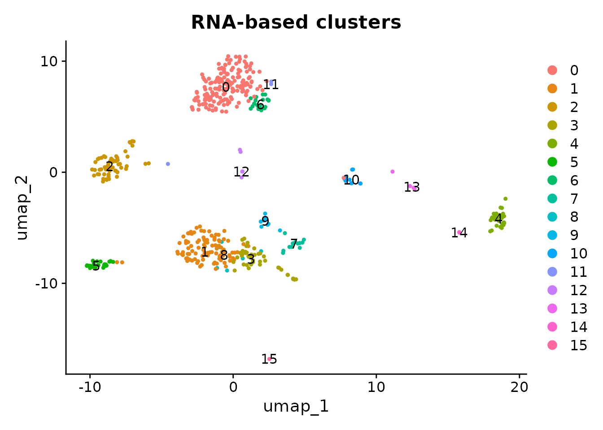
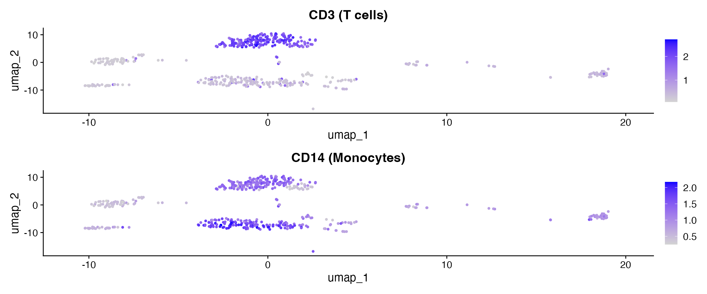
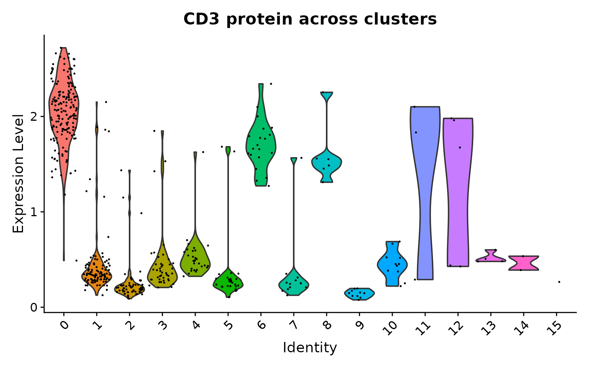

# CITE-seq Analysis Workflow

## Introduction

CITE-seq (Cellular Indexing of Transcriptomes and Epitopes by
Sequencing) measures RNA transcription and surface protein abundance
from the same cells. This produces two assays per cell: RNA gene
expression and ADT (antibody-derived tag) protein counts. The h5mu
format is ideal for storing both modalities in a single file. scConvert
handles both assays during format conversion, and provides two export
paths:

- **h5ad**: Exports a single assay (RNA or ADT) per file, for scanpy
  workflows
- **h5mu**: Exports all assays in one file, for muon/MuData workflows

## Read CITE-seq data from h5mu

The shipped `citeseq_demo.h5mu` contains 500 cells with RNA (2,000
genes) and ADT (10 antibodies: CD3, CD4, CD8, CD45RA, CD56, CD16, CD11c,
CD14, CD19, CD34), pre-processed with PCA, UMAP, and clustering.

``` r

h5mu_file <- system.file("extdata", "citeseq_demo.h5mu", package = "scConvert")
obj <- readH5MU(h5mu_file)

cat("Cells:", ncol(obj), "\n")
#> Cells: 500
cat("Assays:", paste(names(obj@assays), collapse = ", "), "\n")
#> Assays: ADT, RNA
cat("RNA features:", nrow(obj[["RNA"]]), "\n")
#> RNA features: 2000
cat("ADT features:", nrow(obj[["ADT"]]), "\n")
#> ADT features: 10
cat("ADT markers:", paste(rownames(obj[["ADT"]]), collapse = ", "), "\n")
#> ADT markers: CD3, CD4, CD8, CD45RA, CD56, CD16, CD11c, CD14, CD19, CD34
```

## Visualize RNA clusters

``` r

DimPlot(obj, group.by = "seurat_clusters", label = TRUE, pt.size = 0.8) +
  ggtitle("RNA-based clusters")
```



## Visualize protein expression

ADT markers reveal cell-surface protein levels that complement the
transcriptomic clusters. After reading h5mu, the ADT assay contains only
raw counts, so we normalize with CLR before plotting. CD3 marks T cells;
CD14 marks monocytes.

``` r

DefaultAssay(obj) <- "ADT"
obj <- NormalizeData(obj, normalization.method = "CLR", margin = 2, verbose = FALSE)
```

``` r

library(patchwork)

p1 <- FeaturePlot(obj, features = "CD3", pt.size = 0.8) + ggtitle("CD3 (T cells)")
p2 <- FeaturePlot(obj, features = "CD14", pt.size = 0.8) + ggtitle("CD14 (Monocytes)")
p1 + p2
```



### ADT expression across clusters

``` r

VlnPlot(obj, features = "CD3", group.by = "seurat_clusters", pt.size = 0.1) +
  ggtitle("CD3 protein across clusters") +
  NoLegend()
```



## Export: h5ad vs h5mu

### h5ad – single assay

[`writeH5AD()`](https://mianaz.github.io/scConvert/reference/writeH5AD.md)
writes one assay at a time. By default it writes the active assay (RNA).
This is the right choice for standard scanpy workflows.

``` r

h5ad_path <- file.path(tempdir(), "citeseq_rna.h5ad")
writeH5AD(obj, h5ad_path, overwrite = TRUE)
cat("Wrote RNA to:", basename(h5ad_path), "\n")
#> Wrote RNA to: citeseq_rna.h5ad
cat("File size:", round(file.size(h5ad_path) / 1024^2, 1), "MB\n")
#> File size: 0.7 MB
```

### h5mu – all assays

[`writeH5MU()`](https://mianaz.github.io/scConvert/reference/writeH5MU.md)
writes every assay as a separate modality, keeping RNA and ADT together
in a single file.

``` r

h5mu_path <- file.path(tempdir(), "citeseq_roundtrip.h5mu")
writeH5MU(obj, h5mu_path, overwrite = TRUE)
cat("Wrote RNA + ADT to:", basename(h5mu_path), "\n")
#> Wrote RNA + ADT to: citeseq_roundtrip.h5mu
cat("File size:", round(file.size(h5mu_path) / 1024^2, 1), "MB\n")
#> File size: 0.8 MB
```

## Reload and verify

### From h5ad (RNA only)

``` r

loaded_h5ad <- readH5AD(h5ad_path)
cat("h5ad loaded:", ncol(loaded_h5ad), "cells x", nrow(loaded_h5ad), "features\n")
#> h5ad loaded: 500 cells x 2000 features
cat("Assays:", paste(names(loaded_h5ad@assays), collapse = ", "), "\n")
#> Assays: RNA
```

### From h5mu (RNA + ADT)

``` r

loaded_h5mu <- readH5MU(h5mu_path)
cat("h5mu loaded:", ncol(loaded_h5mu), "cells\n")
#> h5mu loaded: 500 cells
cat("Assays:", paste(names(loaded_h5mu@assays), collapse = ", "), "\n")
#> Assays: ADT, RNA
cat("RNA features:", nrow(loaded_h5mu[["RNA"]]), "\n")
#> RNA features: 2000
cat("ADT features:", nrow(loaded_h5mu[["ADT"]]), "\n")
#> ADT features: 10
```

### Verify expression preservation

``` r

# Compare against the original h5mu-loaded object
orig <- readH5MU(h5mu_file)
common_cells <- intersect(colnames(orig), colnames(loaded_h5mu))

common_genes <- intersect(rownames(orig[["RNA"]]), rownames(loaded_h5mu[["RNA"]]))
orig_rna <- as.numeric(GetAssayData(orig, assay = "RNA", layer = "counts")[
  head(common_genes, 100), head(common_cells, 100)])
rt_rna <- as.numeric(GetAssayData(loaded_h5mu, assay = "RNA", layer = "counts")[
  head(common_genes, 100), head(common_cells, 100)])
cat("RNA counts identical:", identical(orig_rna, rt_rna), "\n")
#> RNA counts identical: TRUE

common_adt <- intersect(rownames(orig[["ADT"]]), rownames(loaded_h5mu[["ADT"]]))
orig_adt <- as.numeric(GetAssayData(orig, assay = "ADT", layer = "counts")[
  common_adt, head(common_cells, 100)])
rt_adt <- as.numeric(GetAssayData(loaded_h5mu, assay = "ADT", layer = "counts")[
  common_adt, head(common_cells, 100)])
cat("ADT counts identical:", identical(orig_adt, rt_adt), "\n")
#> ADT counts identical: TRUE
```

## When to use h5ad vs h5mu

| Scenario | Recommended format | Why |
|----|----|----|
| scanpy RNA analysis | h5ad | scanpy expects single-AnnData input |
| Share with Python collaborator (multi-assay) | h5mu | Keeps RNA + ADT together in one file |
| Archive a CITE-seq experiment | h5mu | Preserves all modalities |
| Feed into cellxgene | h5ad | cellxgene reads h5ad, not h5mu |
| Downstream muon/MOFA+ analysis | h5mu | muon operates on MuData objects |

## Python interoperability

Both exported files are directly readable in Python.

``` python
# Requires Python: pip install scanpy
import scanpy as sc

adata = sc.read_h5ad("citeseq_rna.h5ad")
print(adata)
sc.pl.umap(adata, color="seurat_clusters")
```

``` python
# Requires Python: pip install mudata
import mudata as md

mdata = md.read_h5mu("citeseq.h5mu")
print(mdata)
for name, mod in mdata.mod.items():
    print(f"  {name}: {mod.n_obs} cells x {mod.n_vars} features")
```

## Clean up

``` r

unlink(c(h5ad_path, h5mu_path))
```

## Session Info

``` r

sessionInfo()
#> R version 4.6.0 (2026-04-24)
#> Platform: x86_64-pc-linux-gnu
#> Running under: Ubuntu 24.04.4 LTS
#> 
#> Matrix products: default
#> BLAS:   /usr/lib/x86_64-linux-gnu/openblas-pthread/libblas.so.3 
#> LAPACK: /usr/lib/x86_64-linux-gnu/openblas-pthread/libopenblasp-r0.3.26.so;  LAPACK version 3.12.0
#> 
#> locale:
#>  [1] LC_CTYPE=C.UTF-8       LC_NUMERIC=C           LC_TIME=C.UTF-8       
#>  [4] LC_COLLATE=C.UTF-8     LC_MONETARY=C.UTF-8    LC_MESSAGES=C.UTF-8   
#>  [7] LC_PAPER=C.UTF-8       LC_NAME=C              LC_ADDRESS=C          
#> [10] LC_TELEPHONE=C         LC_MEASUREMENT=C.UTF-8 LC_IDENTIFICATION=C   
#> 
#> time zone: UTC
#> tzcode source: system (glibc)
#> 
#> attached base packages:
#> [1] stats     graphics  grDevices utils     datasets  methods   base     
#> 
#> other attached packages:
#> [1] patchwork_1.3.2    ggplot2_4.0.3      Seurat_5.5.0       SeuratObject_5.4.0
#> [5] sp_2.2-1           scConvert_0.1.0   
#> 
#> loaded via a namespace (and not attached):
#>   [1] RColorBrewer_1.1-3     jsonlite_2.0.0         magrittr_2.0.5        
#>   [4] spatstat.utils_3.2-2   farver_2.1.2           rmarkdown_2.31        
#>   [7] fs_2.1.0               ragg_1.5.2             vctrs_0.7.3           
#>  [10] ROCR_1.0-12            spatstat.explore_3.8-0 htmltools_0.5.9       
#>  [13] sass_0.4.10            sctransform_0.4.3      parallelly_1.47.0     
#>  [16] KernSmooth_2.23-26     bslib_0.10.0           htmlwidgets_1.6.4     
#>  [19] desc_1.4.3             ica_1.0-3              plyr_1.8.9            
#>  [22] plotly_4.12.0          zoo_1.8-15             cachem_1.1.0          
#>  [25] igraph_2.3.0           mime_0.13              lifecycle_1.0.5       
#>  [28] pkgconfig_2.0.3        Matrix_1.7-5           R6_2.6.1              
#>  [31] fastmap_1.2.0          MatrixGenerics_1.24.0  fitdistrplus_1.2-6    
#>  [34] future_1.70.0          shiny_1.13.0           digest_0.6.39         
#>  [37] S4Vectors_0.50.0       tensor_1.5.1           RSpectra_0.16-2       
#>  [40] irlba_2.3.7            GenomicRanges_1.64.0   textshaping_1.0.5     
#>  [43] labeling_0.4.3         progressr_0.19.0       spatstat.sparse_3.1-0 
#>  [46] httr_1.4.8             polyclip_1.10-7        abind_1.4-8           
#>  [49] compiler_4.6.0         bit64_4.8.0            withr_3.0.2           
#>  [52] S7_0.2.2               fastDummies_1.7.6      MASS_7.3-65           
#>  [55] tools_4.6.0            lmtest_0.9-40          otel_0.2.0            
#>  [58] httpuv_1.6.17          future.apply_1.20.2    goftest_1.2-3         
#>  [61] glue_1.8.1             nlme_3.1-169           promises_1.5.0        
#>  [64] grid_4.6.0             Rtsne_0.17             cluster_2.1.8.2       
#>  [67] reshape2_1.4.5         generics_0.1.4         hdf5r_1.3.12          
#>  [70] gtable_0.3.6           spatstat.data_3.1-9    tidyr_1.3.2           
#>  [73] data.table_1.18.2.1    BiocGenerics_0.58.0    BPCells_0.3.1         
#>  [76] spatstat.geom_3.7-3    RcppAnnoy_0.0.23       ggrepel_0.9.8         
#>  [79] RANN_2.6.2             pillar_1.11.1          stringr_1.6.0         
#>  [82] spam_2.11-3            RcppHNSW_0.6.0         later_1.4.8           
#>  [85] splines_4.6.0          dplyr_1.2.1            lattice_0.22-9        
#>  [88] survival_3.8-6         bit_4.6.0              deldir_2.0-4          
#>  [91] tidyselect_1.2.1       miniUI_0.1.2           pbapply_1.7-4         
#>  [94] knitr_1.51             gridExtra_2.3          Seqinfo_1.2.0         
#>  [97] IRanges_2.46.0         scattermore_1.2        stats4_4.6.0          
#> [100] xfun_0.57              matrixStats_1.5.0      stringi_1.8.7         
#> [103] lazyeval_0.2.3         yaml_2.3.12            evaluate_1.0.5        
#> [106] codetools_0.2-20       tibble_3.3.1           cli_3.6.6             
#> [109] uwot_0.2.4             xtable_1.8-8           reticulate_1.46.0     
#> [112] systemfonts_1.3.2      jquerylib_0.1.4        Rcpp_1.1.1-1.1        
#> [115] globals_0.19.1         spatstat.random_3.4-5  png_0.1-9             
#> [118] spatstat.univar_3.1-7  parallel_4.6.0         pkgdown_2.2.0         
#> [121] dotCall64_1.2          listenv_0.10.1         viridisLite_0.4.3     
#> [124] scales_1.4.0           ggridges_0.5.7         purrr_1.2.2           
#> [127] crayon_1.5.3           rlang_1.2.0            cowplot_1.2.0
```
