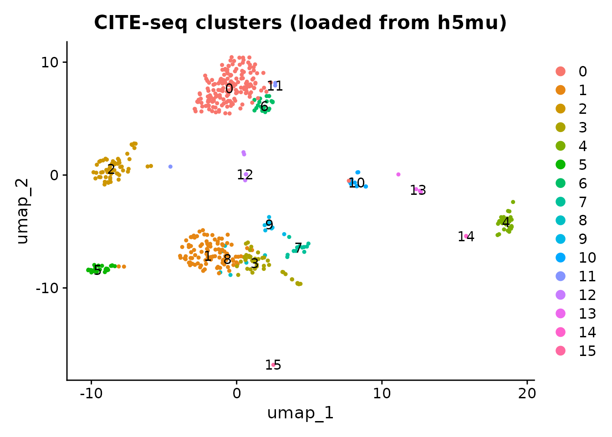
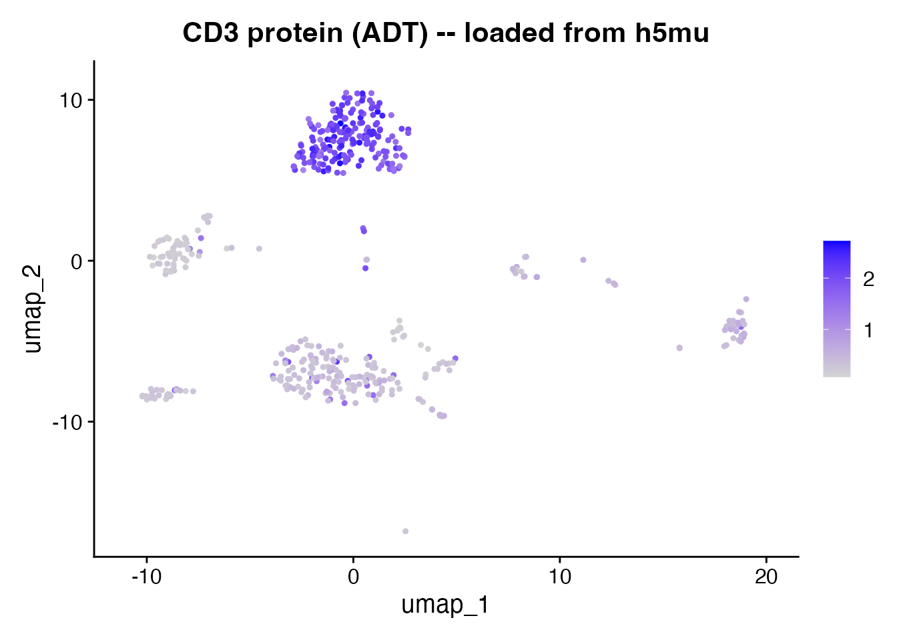
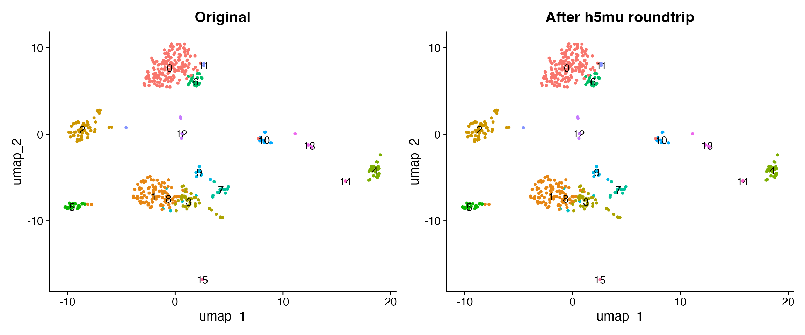

# Multimodal Data with MuData (h5mu)

## Introduction

The [MuData](https://muon.readthedocs.io/en/latest/io/mudata.html)
format (`.h5mu`) stores multimodal single-cell data in a single file.
Each modality (RNA, protein, ATAC) lives as a separate AnnData object,
sharing a common set of cell barcodes. This is the native format for
[muon](https://muon-tutorials.readthedocs.io/) in Python. scConvert
reads and writes h5mu natively – no Python or MuDataSeurat required.

| Format   | Best for                                  |
|----------|-------------------------------------------|
| **h5ad** | Single-modality (RNA only)                |
| **h5mu** | Multi-modal (RNA + ADT, RNA + ATAC, etc.) |

## Read h5mu directly

The shipped `citeseq_demo.h5mu` contains 500 CITE-seq cells with two
modalities: RNA (2,000 genes) and ADT (10 surface protein antibodies).
[`readH5MU()`](https://mianaz.github.io/scConvert/reference/readH5MU.md)
loads it into a Seurat object with both assays intact.

``` r

h5mu_file <- system.file("extdata", "citeseq_demo.h5mu", package = "scConvert")
obj <- readH5MU(h5mu_file)

cat("Cells:", ncol(obj), "\n")
#> Cells: 500
cat("Assays:", paste(names(obj@assays), collapse = ", "), "\n")
#> Assays: ADT, RNA
cat("RNA features:", nrow(obj[["RNA"]]), "\n")
#> RNA features: 2000
cat("ADT features:", nrow(obj[["ADT"]]), "\n")
#> ADT features: 10
```

### UMAP of RNA clusters

``` r

DimPlot(obj, group.by = "seurat_clusters", label = TRUE, pt.size = 0.8) +
  ggtitle("CITE-seq clusters (loaded from h5mu)")
```



### Protein expression

After reading h5mu, the ADT assay contains only raw counts. Normalize
with CLR (centered log-ratio) before plotting protein markers.

``` r

DefaultAssay(obj) <- "ADT"
obj <- NormalizeData(obj, normalization.method = "CLR", margin = 2, verbose = FALSE)
FeaturePlot(obj, features = "CD3", pt.size = 0.8) +
  ggtitle("CD3 protein (ADT) -- loaded from h5mu")
```



``` r

DefaultAssay(obj) <- "RNA"
```

## Write and roundtrip

Load the same dataset from its Seurat `.rds` form, write to h5mu, then
read back and compare. This demonstrates that scConvert preserves both
assays through a full write/read cycle.

### Modality name mapping

[`writeH5MU()`](https://mianaz.github.io/scConvert/reference/writeH5MU.md)
automatically maps Seurat assay names to standard MuData conventions:

| Seurat Assay | h5mu Modality  |
|--------------|----------------|
| RNA          | rna            |
| ADT          | prot           |
| ATAC         | atac           |
| Other        | lowercase name |

[`readH5MU()`](https://mianaz.github.io/scConvert/reference/readH5MU.md)
reverses the mapping when loading.

``` r

orig <- readRDS(system.file("extdata", "citeseq_demo.rds", package = "scConvert"))

h5mu_path <- file.path(tempdir(), "citeseq_roundtrip.h5mu")
writeH5MU(orig, h5mu_path, overwrite = TRUE)
cat("Wrote:", round(file.size(h5mu_path) / 1024^2, 1), "MB\n")
#> Wrote: 0.8 MB

loaded <- readH5MU(h5mu_path)
cat("Loaded:", ncol(loaded), "cells,", paste(names(loaded@assays), collapse = ", "), "\n")
#> Loaded: 500 cells, ADT, RNA
```

### Side-by-side comparison

``` r

library(patchwork)

p1 <- DimPlot(orig, group.by = "seurat_clusters", label = TRUE, pt.size = 0.8) +
  ggtitle("Original (.rds)") + NoLegend()
p2 <- DimPlot(loaded, group.by = "seurat_clusters", label = TRUE, pt.size = 0.8) +
  ggtitle("After h5mu roundtrip") + NoLegend()
p1 + p2
```



### Verify data integrity

``` r

cat("Cell count match:", ncol(orig) == ncol(loaded), "\n")
#> Cell count match: TRUE
cat("Assays match:", identical(sort(names(orig@assays)), sort(names(loaded@assays))), "\n")
#> Assays match: TRUE

common_cells <- intersect(colnames(orig), colnames(loaded))
common_genes <- intersect(rownames(orig[["RNA"]]), rownames(loaded[["RNA"]]))
orig_rna <- as.numeric(GetAssayData(orig, assay = "RNA", layer = "counts")[
  head(common_genes, 100), head(common_cells, 100)])
rt_rna <- as.numeric(GetAssayData(loaded, assay = "RNA", layer = "counts")[
  head(common_genes, 100), head(common_cells, 100)])
cat("RNA counts identical:", identical(orig_rna, rt_rna), "\n")
#> RNA counts identical: TRUE

common_adt <- intersect(rownames(orig[["ADT"]]), rownames(loaded[["ADT"]]))
orig_adt <- as.numeric(GetAssayData(orig, assay = "ADT", layer = "counts")[
  common_adt, head(common_cells, 100)])
rt_adt <- as.numeric(GetAssayData(loaded, assay = "ADT", layer = "counts")[
  common_adt, head(common_cells, 100)])
cat("ADT counts identical:", identical(orig_adt, rt_adt), "\n")
#> ADT counts identical: TRUE
```

## Custom modality name mapping

You can override the default mapping when reading with the `assay.names`
argument:

``` r

custom <- readH5MU(h5mu_file, assay.names = c(rna = "RNA", prot = "Protein"))
cat("Assays with custom mapping:", paste(names(custom@assays), collapse = ", "), "\n")
#> Assays with custom mapping: Protein, RNA
```

## Python interoperability

The h5mu file is directly compatible with muon in Python.

``` python
# Requires Python: pip install mudata
import mudata as md

mdata = md.read_h5mu("citeseq_demo.h5mu")
print(mdata)
print("Modalities:", list(mdata.mod.keys()))
for name, mod in mdata.mod.items():
    print(f"  {name}: {mod.n_obs} cells x {mod.n_vars} features")
```

## Clean up

``` r

unlink(h5mu_path)
```

## Session Info

``` r

sessionInfo()
#> R version 4.6.0 (2026-04-24)
#> Platform: x86_64-pc-linux-gnu
#> Running under: Ubuntu 24.04.4 LTS
#> 
#> Matrix products: default
#> BLAS:   /usr/lib/x86_64-linux-gnu/openblas-pthread/libblas.so.3 
#> LAPACK: /usr/lib/x86_64-linux-gnu/openblas-pthread/libopenblasp-r0.3.26.so;  LAPACK version 3.12.0
#> 
#> locale:
#>  [1] LC_CTYPE=C.UTF-8       LC_NUMERIC=C           LC_TIME=C.UTF-8       
#>  [4] LC_COLLATE=C.UTF-8     LC_MONETARY=C.UTF-8    LC_MESSAGES=C.UTF-8   
#>  [7] LC_PAPER=C.UTF-8       LC_NAME=C              LC_ADDRESS=C          
#> [10] LC_TELEPHONE=C         LC_MEASUREMENT=C.UTF-8 LC_IDENTIFICATION=C   
#> 
#> time zone: UTC
#> tzcode source: system (glibc)
#> 
#> attached base packages:
#> [1] stats     graphics  grDevices utils     datasets  methods   base     
#> 
#> other attached packages:
#> [1] patchwork_1.3.2    ggplot2_4.0.3      Seurat_5.5.0       SeuratObject_5.4.0
#> [5] sp_2.2-1           scConvert_0.1.0   
#> 
#> loaded via a namespace (and not attached):
#>   [1] deldir_2.0-4           pbapply_1.7-4          gridExtra_2.3         
#>   [4] rlang_1.2.0            magrittr_2.0.5         RcppAnnoy_0.0.23      
#>   [7] otel_0.2.0             spatstat.geom_3.7-3    matrixStats_1.5.0     
#>  [10] ggridges_0.5.7         compiler_4.6.0         png_0.1-9             
#>  [13] systemfonts_1.3.2      vctrs_0.7.3            reshape2_1.4.5        
#>  [16] hdf5r_1.3.12           stringr_1.6.0          crayon_1.5.3          
#>  [19] pkgconfig_2.0.3        fastmap_1.2.0          labeling_0.4.3        
#>  [22] promises_1.5.0         rmarkdown_2.31         ragg_1.5.2            
#>  [25] bit_4.6.0              purrr_1.2.2            xfun_0.57             
#>  [28] cachem_1.1.0           jsonlite_2.0.0         goftest_1.2-3         
#>  [31] later_1.4.8            spatstat.utils_3.2-2   irlba_2.3.7           
#>  [34] parallel_4.6.0         cluster_2.1.8.2        R6_2.6.1              
#>  [37] ica_1.0-3              spatstat.data_3.1-9    bslib_0.10.0          
#>  [40] stringi_1.8.7          RColorBrewer_1.1-3     reticulate_1.46.0     
#>  [43] spatstat.univar_3.1-7  parallelly_1.47.0      lmtest_0.9-40         
#>  [46] jquerylib_0.1.4        scattermore_1.2        Rcpp_1.1.1-1.1        
#>  [49] knitr_1.51             tensor_1.5.1           future.apply_1.20.2   
#>  [52] zoo_1.8-15             sctransform_0.4.3      httpuv_1.6.17         
#>  [55] Matrix_1.7-5           splines_4.6.0          igraph_2.3.0          
#>  [58] tidyselect_1.2.1       abind_1.4-8            yaml_2.3.12           
#>  [61] spatstat.random_3.4-5  spatstat.explore_3.8-0 codetools_0.2-20      
#>  [64] miniUI_0.1.2           listenv_0.10.1         plyr_1.8.9            
#>  [67] lattice_0.22-9         tibble_3.3.1           withr_3.0.2           
#>  [70] shiny_1.13.0           S7_0.2.2               ROCR_1.0-12           
#>  [73] evaluate_1.0.5         Rtsne_0.17             future_1.70.0         
#>  [76] fastDummies_1.7.6      desc_1.4.3             survival_3.8-6        
#>  [79] polyclip_1.10-7        fitdistrplus_1.2-6     pillar_1.11.1         
#>  [82] KernSmooth_2.23-26     plotly_4.12.0          generics_0.1.4        
#>  [85] RcppHNSW_0.6.0         scales_1.4.0           globals_0.19.1        
#>  [88] xtable_1.8-8           glue_1.8.1             lazyeval_0.2.3        
#>  [91] tools_4.6.0            data.table_1.18.2.1    RSpectra_0.16-2       
#>  [94] RANN_2.6.2             fs_2.1.0               dotCall64_1.2         
#>  [97] cowplot_1.2.0          grid_4.6.0             tidyr_1.3.2           
#> [100] nlme_3.1-169           cli_3.6.6              spatstat.sparse_3.1-0 
#> [103] textshaping_1.0.5      spam_2.11-3            viridisLite_0.4.3     
#> [106] dplyr_1.2.1            uwot_0.2.4             gtable_0.3.6          
#> [109] sass_0.4.10            digest_0.6.39          progressr_0.19.0      
#> [112] ggrepel_0.9.8          htmlwidgets_1.6.4      farver_2.1.2          
#> [115] htmltools_0.5.9        pkgdown_2.2.0          lifecycle_1.0.5       
#> [118] httr_1.4.8             mime_0.13              bit64_4.8.0           
#> [121] MASS_7.3-65
```
