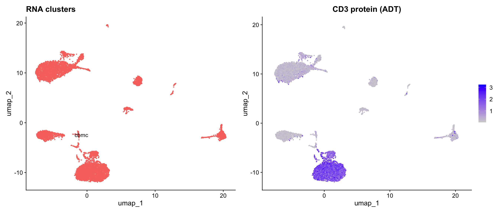
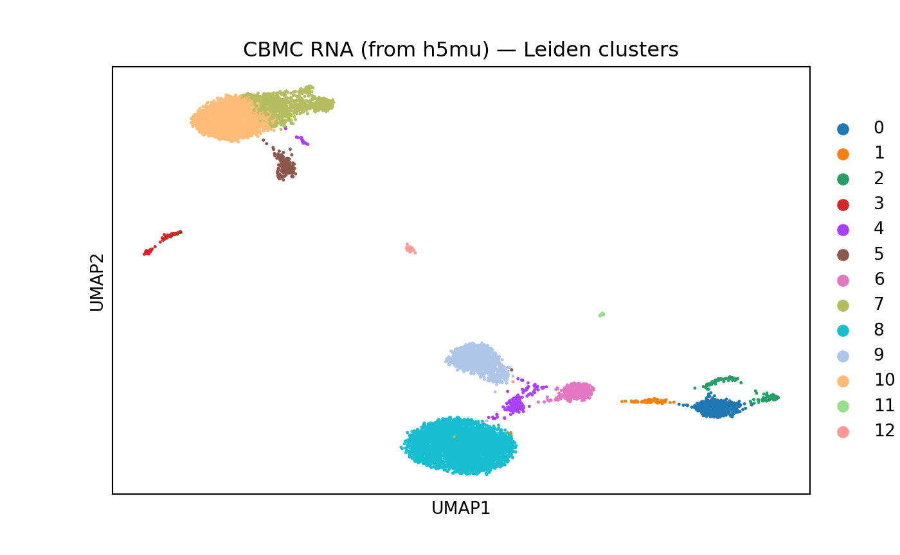

# Multimodal Data with MuData (h5mu)

## Introduction

The [MuData](https://muon.readthedocs.io/en/latest/io/mudata.html)
format (`.h5mu`) stores multimodal single-cell data — multiple
modalities (e.g., RNA + protein) in a single file with shared cell
annotations. This is the native format for
[muon](https://muon-tutorials.readthedocs.io/) in Python.

scConvert provides native h5mu read/write with no external dependencies
(no MuDataSeurat or Python required):

- **[`SaveH5MU()`](https://mianaz.github.io/scConvert/reference/SaveH5MU.md)**:
  Export a multi-assay Seurat object to h5mu, with automatic
  assay-to-modality name mapping. Works with Seurat V5 Assay5.
- **[`LoadH5MU()`](https://mianaz.github.io/scConvert/reference/LoadH5MU.md)**:
  Load an h5mu file as a Seurat object, with automatic modality-to-assay
  name mapping

### When to use h5mu vs h5ad

| Format   | Use case                                       |
|----------|------------------------------------------------|
| **h5ad** | Single-modality data (RNA only)                |
| **h5mu** | Multi-modal data (RNA + ADT, RNA + ATAC, etc.) |

``` r

library(Seurat)
library(scConvert)
library(ggplot2)
library(patchwork)
```

## Create a multimodal Seurat object

We use the `cbmc` dataset from SeuratData — a CITE-seq experiment with
RNA and ADT (antibody-derived tag) assays:

``` r

library(SeuratData)
if (!"cbmc" %in% rownames(InstalledData())) {
  InstallData("cbmc")
}
data("cbmc", package = "cbmc.SeuratData")
cbmc <- UpdateSeuratObject(cbmc)

# Remove ADT features that overlap with RNA (h5mu requires unique feature names per modality)
overlap <- intersect(rownames(cbmc[["ADT"]]), rownames(cbmc[["RNA"]]))
if (length(overlap) > 0) {
  adt_keep <- setdiff(rownames(cbmc[["ADT"]]), overlap)
  cbmc[["ADT"]] <- subset(cbmc[["ADT"]], features = adt_keep)
  cat("Removed", length(overlap), "overlapping features from ADT\n")
}
#> Removed 4 overlapping features from ADT

cat("Assays:", paste(Assays(cbmc), collapse = ", "), "\n")
#> Assays: RNA, ADT
cat("Cells:", ncol(cbmc), "\n")
#> Cells: 8617
cat("RNA features:", nrow(cbmc[["RNA"]]), "\n")
#> RNA features: 20501
cat("ADT features:", nrow(cbmc[["ADT"]]), "\n")
#> ADT features: 6
```

This object has two assays — RNA (gene expression) and ADT (surface
protein) — measured on the same cells, making it ideal for h5mu.

> **Note**: h5mu requires unique feature names across modalities. If
> your CITE-seq ADT panel has features that share names with RNA genes
> (e.g., CD3D), remove duplicates before saving.

### Process and visualize

``` r

DefaultAssay(cbmc) <- "RNA"
cbmc <- NormalizeData(cbmc, verbose = FALSE)
cbmc <- FindVariableFeatures(cbmc, verbose = FALSE)
cbmc <- ScaleData(cbmc, verbose = FALSE)
cbmc <- RunPCA(cbmc, verbose = FALSE)
cbmc <- RunUMAP(cbmc, dims = 1:30, verbose = FALSE)
cbmc <- NormalizeData(cbmc, assay = "ADT", normalization.method = "CLR", verbose = FALSE)
```

``` r

library(patchwork)

p1 <- DimPlot(cbmc, label = TRUE, pt.size = 0.3) + NoLegend() + ggtitle("RNA clusters")
DefaultAssay(cbmc) <- "ADT"
p2 <- FeaturePlot(cbmc, features = "adt_CD3", pt.size = 0.3) + ggtitle("CD3 protein (ADT)")
DefaultAssay(cbmc) <- "RNA"
p1 + p2
```



## Save with SaveH5MU / SeuratToH5MU

[`SaveH5MU()`](https://mianaz.github.io/scConvert/reference/SaveH5MU.md)
and
[`SeuratToH5MU()`](https://mianaz.github.io/scConvert/reference/SeuratToH5MU.md)
export all assays to a single h5mu file using scConvert’s native writer
(no MuDataSeurat required). Assay names are automatically mapped to
standard MuData modality names:

| Seurat Assay | h5mu Modality  |
|--------------|----------------|
| RNA          | rna            |
| ADT          | prot           |
| ATAC         | atac           |
| Spatial      | spatial        |
| Other        | lowercase name |

``` r

SaveH5MU(cbmc, "cbmc_multimodal.h5mu", overwrite = TRUE)
```

### Inspect in Python

If you have [muon](https://muon-tutorials.readthedocs.io/) installed,
you can inspect the h5mu file:

``` python
import mudata as md
mdata = md.read_h5mu("cbmc_multimodal.h5mu")
print(mdata)
#> MuData object with n_obs × n_vars = 8617 × 20507
#>   obs:   'orig.ident', 'nCount_RNA', 'nFeature_RNA', 'nCount_ADT', 'nFeature_ADT', 'rna_annotations', 'protein_annotations'
#>   2 modalities
#>     rna: 8617 x 20501
#>       var:   'vst.mean', 'vst.variance', 'vst.variance.expected', 'vst.variance.standardized', 'vst.variable'
#>       obsm:  'X_pca', 'X_umap'
#>       layers:    'counts'
#>     prot:    8617 x 6
#>       layers:    'counts'
print("\nModalities:", list(mdata.mod.keys()))
#> 
#> Modalities: ['rna', 'prot']
for mod_name, mod in mdata.mod.items():
    print(f"  {mod_name}: {mod.n_obs} cells x {mod.n_vars} features")
#>   rna: 8617 cells x 20501 features
#>   prot: 8617 cells x 6 features
```

### scanpy on RNA modality

We can run standard scanpy preprocessing on the RNA modality extracted
from the h5mu file:

``` python
import scanpy as sc

rna = mdata.mod["rna"].copy()
sc.pp.normalize_total(rna)
sc.pp.log1p(rna)
sc.pp.highly_variable_genes(rna, n_top_genes=2000)
sc.pp.pca(rna)
sc.pp.neighbors(rna)
sc.tl.umap(rna)
sc.tl.leiden(rna, flavor="igraph")

sc.pl.umap(rna, color="leiden", title="CBMC RNA (from h5mu) — Leiden clusters")
```



## Load with LoadH5MU

[`LoadH5MU()`](https://mianaz.github.io/scConvert/reference/LoadH5MU.md)
reads the h5mu file back into a Seurat object, reversing the modality
name mapping:

| h5mu Modality | Seurat Assay |
|---------------|--------------|
| rna           | RNA          |
| prot          | ADT          |
| atac          | ATAC         |
| spatial       | Spatial      |
| Other         | preserved    |

``` r

cbmc_loaded <- LoadH5MU("cbmc_multimodal.h5mu")
cbmc_loaded
#> An object of class Seurat 
#> 20507 features across 8617 samples within 2 assays 
#> Active assay: RNA (20501 features, 0 variable features)
#>  2 layers present: counts, data
#>  1 other assay present: ADT
#>  2 dimensional reductions calculated: pca, umap
```

[`LoadH5MU()`](https://mianaz.github.io/scConvert/reference/LoadH5MU.md)
uses scConvert’s native reader — no MuDataSeurat or Python required.

## Verify round-trip preservation

``` r

cat("=== Original ===\n")
#> === Original ===
cat("Assays:", paste(Assays(cbmc), collapse = ", "), "\n")
#> Assays: RNA, ADT
cat("Cells:", ncol(cbmc), "\n")
#> Cells: 8617

cat("\n=== Loaded ===\n")
#> 
#> === Loaded ===
cat("Assays:", paste(Assays(cbmc_loaded), collapse = ", "), "\n")
#> Assays: ADT, RNA
cat("Cells:", ncol(cbmc_loaded), "\n")
#> Cells: 8617

# Check metadata
cat("\nMetadata columns (original):", ncol(cbmc[[]]), "\n")
#> 
#> Metadata columns (original): 7
cat("Metadata columns (loaded):", ncol(cbmc_loaded[[]]), "\n")
#> Metadata columns (loaded): 7
```

### Verify expression values

``` r

common_c <- intersect(colnames(cbmc), colnames(cbmc_loaded))
common_g <- intersect(rownames(cbmc[["RNA"]]), rownames(cbmc_loaded[["RNA"]]))
set.seed(42)
sc <- sample(common_c, min(200, length(common_c)))
sg <- sample(common_g, min(100, length(common_g)))

orig_vals <- as.numeric(GetAssayData(cbmc, assay = "RNA", layer = "counts")[sg, sc])
rt_vals <- as.numeric(GetAssayData(cbmc_loaded, assay = "RNA", layer = "counts")[sg, sc])
cat("RNA values identical:", identical(orig_vals, rt_vals), "\n")
#> RNA values identical: TRUE
cat("Max abs diff:", max(abs(orig_vals - rt_vals)), "\n")
#> Max abs diff: 0

# Check ADT assay too
adt_genes <- intersect(rownames(cbmc[["ADT"]]), rownames(cbmc_loaded[["ADT"]]))
if (length(adt_genes) > 0) {
  adt_orig <- as.numeric(GetAssayData(cbmc, assay = "ADT", layer = "counts")[adt_genes, sc])
  adt_rt <- as.numeric(GetAssayData(cbmc_loaded, assay = "ADT", layer = "counts")[adt_genes, sc])
  cat("ADT values identical:", identical(adt_orig, adt_rt), "\n")
}
#> ADT values identical: TRUE
```

## Custom modality name mapping

You can override the default mapping with `assays` (for
[`SaveH5MU()`](https://mianaz.github.io/scConvert/reference/SaveH5MU.md)
/
[`SeuratToH5MU()`](https://mianaz.github.io/scConvert/reference/SeuratToH5MU.md))
or `assay.names` (for
[`LoadH5MU()`](https://mianaz.github.io/scConvert/reference/LoadH5MU.md)):

``` r

# Save with custom modality names (native writer)
SeuratToH5MU(cbmc, filename = "cbmc_roundtrip.h5mu", overwrite = TRUE)

# Load with custom assay names
cbmc_custom <- LoadH5MU(
  "cbmc_roundtrip.h5mu",
  assay.names = c(rna = "RNA", prot = "Protein")
)

cat("Assays:", paste(Assays(cbmc_custom), collapse = ", "), "\n")
#> Assays: Protein, RNA
```

## Conflict resolution

When a Seurat object has multiple assays that would map to the same
modality name,
[`SaveH5MU()`](https://mianaz.github.io/scConvert/reference/SaveH5MU.md)
automatically resolves the conflict. For example, if you have both RNA
and SCT assays (both map to “rna” by default), SCT is remapped to “sct”:

| Seurat Assays | Modality Mapping              |
|---------------|-------------------------------|
| RNA, ADT      | rna, prot (no conflict)       |
| RNA, SCT, ADT | rna, sct, prot (SCT remapped) |

This ensures each modality has a unique name in the h5mu file.

## Data mapping reference

### SaveH5MU: Seurat to h5mu

| Seurat Component | h5mu Location                   | Notes                    |
|------------------|---------------------------------|--------------------------|
| Each assay       | `/mod/{modality}/`              | One AnnData per modality |
| Assay counts     | `/mod/{modality}/X`             | Expression matrix        |
| Assay metadata   | `/mod/{modality}/var`           | Feature metadata         |
| Cell metadata    | `/obs`                          | Global cell annotations  |
| Reductions       | `/mod/{modality}/obsm/X_{name}` | Per-modality             |
| Graphs           | `/mod/{modality}/obsp/{name}`   | Per-modality             |

### LoadH5MU: h5mu to Seurat

| h5mu Location | Seurat Component | Notes |
|----|----|----|
| `/mod/{modality}/` | Assay (renamed) | Modality -\> assay name mapping |
| `/mod/{modality}/X` | Assay data | Expression matrix |
| `/obs` | `meta.data` | Global cell metadata merged |
| `/mod/{modality}/obsm/spatial` | Spatial coordinates | If present |

## Session Info

``` r

sessionInfo()
```
