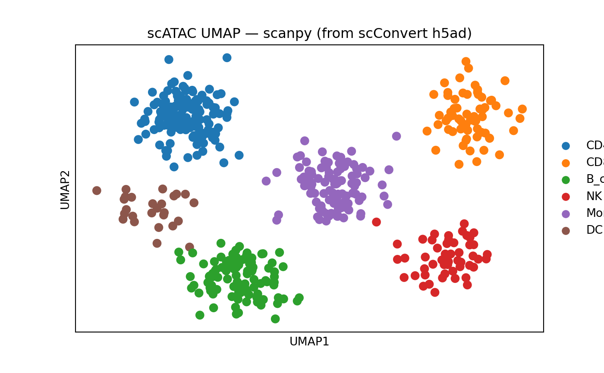

# scATAC-seq Data Conversion with Signac

## Introduction

Single-cell ATAC-seq (scATAC-seq) measures chromatin accessibility at
single-cell resolution. The primary data structure is a **peak-by-cell
count matrix**, where each row represents a genomic region (peak) and
each value indicates how many Tn5 insertion events were observed in that
region for a given cell.

### scATAC-seq data components

| Component | Description | Format |
|----|----|----|
| Peak matrix | Peaks x cells count matrix | Sparse matrix (HDF5, MEX) |
| Fragment file | Per-read genomic coordinates | `fragments.tsv.gz` + `.tbi` index |
| Cell metadata | Per-cell QC and annotations | Data frame |
| Gene annotations | Genomic coordinates for genes | GRanges (GTF/GFF) |
| Motif matrix | TF binding motif enrichment | Matrix in ChromatinAssay |

In R, the [Signac](https://stuartlab.org/signac/) package extends Seurat
with the `ChromatinAssay` class, which wraps the peak matrix alongside
fragment file paths, gene annotations, and motif information. In Python,
scATAC-seq data is typically stored as an AnnData object (h5ad) with
peaks as `var` and cells as `obs`, following the same conventions as
scRNA-seq.

### What scConvert handles

scConvert converts the **peak count matrix** and associated **cell
metadata** and **embeddings** between R and Python formats.
Signac-specific annotations (fragment files, motif matrices, gene
annotations) are not part of the h5ad specification and require separate
handling.

``` r

library(Seurat)
library(Signac)
library(scConvert)
library(Matrix)
```

## Create synthetic scATAC-seq data

We generate a realistic synthetic scATAC-seq dataset with 500 cells and
2000 peaks. Peak names follow the standard `chr-start-end` genomic
coordinate format. The count matrix is 95% sparse, reflecting the
typical sparsity of real scATAC-seq data.

``` r

set.seed(42)

n_cells <- 500
n_peaks <- 2000
sparsity <- 0.95

# --- Generate realistic peak names across chromosomes ---
chrom_sizes <- c(
  chr1 = 249e6, chr2 = 243e6, chr3 = 198e6, chr4 = 191e6, chr5 = 181e6,
  chr6 = 171e6, chr7 = 159e6, chr8 = 145e6, chr9 = 138e6, chr10 = 134e6,
  chr11 = 135e6, chr12 = 133e6, chr13 = 114e6, chr14 = 107e6, chr15 = 102e6,
  chr16 = 90e6, chr17 = 83e6, chr18 = 80e6, chr19 = 59e6, chr20 = 64e6,
  chr21 = 47e6, chr22 = 51e6
)

# Distribute peaks proportionally across chromosomes
peaks_per_chrom <- round(n_peaks * chrom_sizes / sum(chrom_sizes))
peaks_per_chrom[1] <- peaks_per_chrom[1] + (n_peaks - sum(peaks_per_chrom))

peak_names <- character(0)
for (i in seq_along(peaks_per_chrom)) {
  chr <- names(peaks_per_chrom)[i]
  n <- peaks_per_chrom[i]
  if (n <= 0) next
  starts <- sort(sample(seq(10000, chrom_sizes[i] - 2000, by = 1000), n))
  widths <- sample(500:1500, n, replace = TRUE)
  peak_names <- c(peak_names, paste0(chr, "-", starts, "-", starts + widths))
}
peak_names <- peak_names[seq_len(n_peaks)]

# --- Generate cell barcodes ---
barcodes <- paste0("CELL_", sprintf("%04d", seq_len(n_cells)), "-1")

# --- Generate sparse count matrix (95% sparsity) ---
n_nonzero <- round(n_peaks * n_cells * (1 - sparsity))
rows <- sample(n_peaks, n_nonzero, replace = TRUE)
cols <- sample(n_cells, n_nonzero, replace = TRUE)
vals <- rpois(n_nonzero, lambda = 2) + 1L  # counts >= 1

counts <- sparseMatrix(
  i = rows, j = cols, x = vals,
  dims = c(n_peaks, n_cells),
  dimnames = list(peak_names, barcodes)
)

cat("Matrix dimensions:", nrow(counts), "peaks x", ncol(counts), "cells\n")
#> Matrix dimensions: 2000 peaks x 500 cells
cat("Sparsity:", round(1 - nnzero(counts) / (nrow(counts) * ncol(counts)), 3), "\n")
#> Sparsity: 0.951
```

## Load into Signac ChromatinAssay

We create a `ChromatinAssay` and wrap it in a Seurat object, then add
metadata and embeddings to produce a complete scATAC-seq object.

``` r

# Create a ChromatinAssay (without fragment file or annotations for portability)
chrom_assay <- CreateChromatinAssay(
  counts = counts,
  sep = c("-", "-"),
  min.cells = 0,
  min.features = 0
)

# Create Seurat object
pbmc_atac <- CreateSeuratObject(
  counts = chrom_assay,
  assay = "ATAC"
)

cat("Cells:", ncol(pbmc_atac), "\n")
#> Cells: 500
cat("Peaks:", nrow(pbmc_atac), "\n")
#> Peaks: 2000
cat("Assay class:", class(pbmc_atac[["ATAC"]])[1], "\n")
#> Assay class: ChromatinAssay

# Inspect peak names (genomic coordinates)
head(rownames(pbmc_atac), 5)
#> [1] "chr1-25000-26394"     "chr1-112000-113418"   "chr1-1916000-1917357"
#> [4] "chr1-1954000-1954614" "chr1-2141000-2142372"
```

### Add QC metadata and cell annotations

``` r

set.seed(123)

# QC-like metadata
pbmc_atac$nCount_peaks <- colSums(GetAssayData(pbmc_atac, layer = "counts"))
pbmc_atac$nucleosome_signal <- runif(n_cells, 0.2, 2.0)
pbmc_atac$TSS_enrichment <- runif(n_cells, 2, 15)
pbmc_atac$pct_reads_in_peaks <- runif(n_cells, 0.3, 0.9)

# Cell-type annotations (as factor)
cell_types <- factor(
  sample(c("CD4_T", "CD8_T", "B_cell", "NK", "Monocyte", "DC"),
         n_cells, replace = TRUE,
         prob = c(0.30, 0.15, 0.20, 0.10, 0.20, 0.05)),
  levels = c("CD4_T", "CD8_T", "B_cell", "NK", "Monocyte", "DC")
)
pbmc_atac$cell_type <- cell_types
pbmc_atac$seurat_clusters <- factor(as.integer(cell_types) - 1L)

# Add fake UMAP coordinates (cluster-structured for visualization)
umap_centers <- matrix(c(
  -5, 3,   # CD4_T
   5, 3,   # CD8_T
  -3, -4,  # B_cell
   4, -3,  # NK
   0, 0,   # Monocyte
  -6, -1   # DC
), ncol = 2, byrow = TRUE)

umap_coords <- matrix(0, nrow = n_cells, ncol = 2)
for (i in seq_len(n_cells)) {
  ct <- as.integer(cell_types[i])
  umap_coords[i, ] <- umap_centers[ct, ] + rnorm(2, sd = 0.8)
}
colnames(umap_coords) <- c("umap_1", "umap_2")
rownames(umap_coords) <- barcodes

pbmc_atac[["umap"]] <- CreateDimReducObject(
  embeddings = umap_coords,
  key = "umap_",
  assay = "ATAC"
)

cat("Metadata columns:", paste(colnames(pbmc_atac[[]]), collapse = ", "), "\n")
#> Metadata columns: orig.ident, nCount_ATAC, nFeature_ATAC, nCount_peaks, nucleosome_signal, TSS_enrichment, pct_reads_in_peaks, cell_type, seurat_clusters
cat("Reductions:", paste(Reductions(pbmc_atac), collapse = ", "), "\n")
#> Reductions: umap
```

## Convert Signac to h5ad

The
[`writeH5AD()`](https://mianaz.github.io/scConvert/reference/writeH5AD.md)
function writes the peak matrix, cell metadata, and embeddings directly
to h5ad format. The `ChromatinAssay` peak matrix is extracted as a
standard sparse matrix during conversion.

``` r

writeH5AD(pbmc_atac, filename = "pbmc_atac.h5ad", overwrite = TRUE)
cat("h5ad file size:", round(file.size("pbmc_atac.h5ad") / 1024^2, 1), "MB\n")
#> h5ad file size: 0.5 MB
```

The resulting h5ad file can be loaded in Python with scanpy or
episcanpy:

``` python
import scanpy as sc

adata = sc.read_h5ad("pbmc_atac.h5ad")
print(adata)
#> AnnData object with n_obs × n_vars = 500 × 2000
#>     obs: 'orig.ident', 'nCount_ATAC', 'nFeature_ATAC', 'nCount_peaks', 'nucleosome_signal', 'TSS_enrichment', 'pct_reads_in_peaks', 'cell_type', 'seurat_clusters'
#>     obsm: 'X_umap'
print(f"\nPeak names (first 5): {list(adata.var_names[:5])}")
#> 
#> Peak names (first 5): ['chr1-25000-26394', 'chr1-112000-113418', 'chr1-1916000-1917357', 'chr1-1954000-1954614', 'chr1-2141000-2142372']
print(f"obsm keys: {list(adata.obsm.keys())}")
#> obsm keys: ['X_umap']
print(f"obs columns: {list(adata.obs.columns)[:10]}")
#> obs columns: ['orig.ident', 'nCount_ATAC', 'nFeature_ATAC', 'nCount_peaks', 'nucleosome_signal', 'TSS_enrichment', 'pct_reads_in_peaks', 'cell_type', 'seurat_clusters']

if "X_umap" in adata.obsm:
    sc.pl.umap(adata, color="cell_type", title="scATAC UMAP — scanpy (from scConvert h5ad)")
```



### CLI equivalent

The following examples show how to invoke scConvert from the command
line. These use placeholder filenames and are not executed here.

``` r

scConvert_cli("pbmc_atac.rds", "pbmc_atac_cli.h5ad")
```

Or from the command line:

``` bash
scconvert pbmc_atac.rds pbmc_atac_cli.h5ad
```

## Convert h5ad back to Seurat with Signac

When loading an h5ad file that contains a peak matrix,
[`readH5AD()`](https://mianaz.github.io/scConvert/reference/readH5AD.md)
returns a standard Seurat object. You can then upgrade the assay to a
Signac `ChromatinAssay` if needed.

``` r

# Load the h5ad as a standard Seurat object
atac_loaded <- readH5AD("pbmc_atac.h5ad")

cat("Cells:", ncol(atac_loaded), "\n")
#> Cells: 500
cat("Peaks:", nrow(atac_loaded), "\n")
#> Peaks: 2000
cat("Default assay:", DefaultAssay(atac_loaded), "\n")
#> Default assay: RNA

# Inspect: peak names should be chr-start-end format
head(rownames(atac_loaded), 5)
#> [1] "chr1-25000-26394"     "chr1-112000-113418"   "chr1-1916000-1917357"
#> [4] "chr1-1954000-1954614" "chr1-2141000-2142372"
```

### Upgrade to ChromatinAssay

If you need Signac functionality (e.g., motif analysis, coverage plots),
upgrade the loaded assay to a `ChromatinAssay`. This requires
re-attaching any Signac-specific annotations.

``` r

# Extract the counts matrix from the loaded object
peak_counts <- GetAssayData(atac_loaded, layer = "counts")

# Create a ChromatinAssay from the loaded data
chrom_assay_rt <- CreateChromatinAssay(
  counts = peak_counts,
  sep = c("-", "-"),
  min.cells = 0,
  min.features = 0
)

# Replace the assay in the loaded object
atac_loaded[["ATAC"]] <- chrom_assay_rt
cat("Upgraded assay class:", class(atac_loaded[["ATAC"]])[1], "\n")
#> Upgraded assay class: ChromatinAssay

# Optional: re-attach fragment file if available locally
# Fragments(atac_loaded) <- CreateFragmentObject("fragments.tsv.gz")

# Optional: add gene annotations
# library(EnsDb.Hsapiens.v86)
# annotations <- GetGRangesFromEnsDb(ensdb = EnsDb.Hsapiens.v86)
# Annotation(atac_loaded) <- annotations
```

### CLI equivalent

``` r

scConvert_cli("pbmc_atac.h5ad", "pbmc_atac_roundtrip.rds")
```

## Round-trip fidelity verification

After converting Signac -\> h5ad -\> Seurat, we verify that key data
structures are preserved.

``` r

# Reload from h5ad
atac_rt <- readH5AD("pbmc_atac.h5ad")

# --- Dimension check ---
cat("=== Dimensions ===\n")
#> === Dimensions ===
cat("Original:  ", ncol(pbmc_atac), "cells x", nrow(pbmc_atac), "peaks\n")
#> Original:   500 cells x 2000 peaks
cat("Roundtrip: ", ncol(atac_rt), "cells x", nrow(atac_rt), "peaks\n")
#> Roundtrip:  500 cells x 2000 peaks
stopifnot(ncol(pbmc_atac) == ncol(atac_rt))
stopifnot(nrow(pbmc_atac) == nrow(atac_rt))
cat("Dimension check PASSED\n\n")
#> Dimension check PASSED

# --- Peak name preservation ---
cat("=== Peak Names ===\n")
#> === Peak Names ===
orig_peaks <- sort(rownames(pbmc_atac))
rt_peaks <- sort(rownames(atac_rt))
cat("Peaks match:", identical(orig_peaks, rt_peaks), "\n")
#> Peaks match: TRUE
stopifnot(identical(orig_peaks, rt_peaks))
cat("Peak name check PASSED\n\n")
#> Peak name check PASSED

# --- Cell barcode preservation ---
cat("=== Cell Barcodes ===\n")
#> === Cell Barcodes ===
orig_cells <- sort(colnames(pbmc_atac))
rt_cells <- sort(colnames(atac_rt))
cat("Barcodes match:", identical(orig_cells, rt_cells), "\n")
#> Barcodes match: TRUE
stopifnot(identical(orig_cells, rt_cells))
cat("Barcode check PASSED\n\n")
#> Barcode check PASSED

# --- Count matrix identity ---
cat("=== Count Matrix Fidelity ===\n")
#> === Count Matrix Fidelity ===
orig_counts <- GetAssayData(pbmc_atac, layer = "counts")
rt_counts <- GetAssayData(atac_rt, layer = "counts")
# Reorder to match
rt_counts <- rt_counts[rownames(orig_counts), colnames(orig_counts)]
cat("Count matrices identical:", identical(as(orig_counts, "dgCMatrix"),
                                          as(rt_counts, "dgCMatrix")), "\n")
#> Count matrices identical: TRUE
stopifnot(all.equal(as.matrix(orig_counts), as.matrix(rt_counts),
                    check.attributes = FALSE))
cat("Count matrix check PASSED\n\n")
#> Count matrix check PASSED

# --- Metadata preservation ---
cat("=== Cell Metadata ===\n")
#> === Cell Metadata ===
orig_meta_cols <- sort(colnames(pbmc_atac[[]]))
rt_meta_cols <- sort(colnames(atac_rt[[]]))
shared_cols <- intersect(orig_meta_cols, rt_meta_cols)
cat("Original metadata columns:", length(orig_meta_cols), "\n")
#> Original metadata columns: 9
cat("Roundtrip metadata columns:", length(rt_meta_cols), "\n")
#> Roundtrip metadata columns: 11
cat("Shared columns:", length(shared_cols), "\n")
#> Shared columns: 9

# Verify cell_type factor survived
if ("cell_type" %in% shared_cols) {
  orig_ct <- as.character(pbmc_atac$cell_type)
  names(orig_ct) <- colnames(pbmc_atac)
  rt_ct <- as.character(atac_rt$cell_type)
  names(rt_ct) <- colnames(atac_rt)
  cat("cell_type match:", identical(orig_ct[sort(names(orig_ct))],
                                    rt_ct[sort(names(rt_ct))]), "\n")
}
#> cell_type match: TRUE

# --- Embedding preservation ---
cat("\n=== Embeddings ===\n")
#> 
#> === Embeddings ===
if ("umap" %in% Reductions(atac_rt)) {
  orig_umap <- Embeddings(pbmc_atac, "umap")
  rt_umap <- Embeddings(atac_rt, "umap")
  rt_umap <- rt_umap[rownames(orig_umap), ]
  umap_rmse <- sqrt(mean((orig_umap - rt_umap)^2))
  cat("UMAP RMSE:", umap_rmse, "\n")
  stopifnot(umap_rmse < 1e-6)
  cat("UMAP check PASSED\n")
} else {
  cat("UMAP not found in roundtrip object (may need recomputation)\n")
}
#> UMAP RMSE: 0 
#> UMAP check PASSED
```

## Multiome: RNA + ATAC to h5mu

For 10x Multiome experiments (simultaneous RNA + ATAC from the same
cells), the h5mu format stores both modalities in a single file. Each
assay becomes a separate modality.

``` r

set.seed(42)

# --- Generate synthetic RNA data for the same 500 cells ---
n_genes <- 200
n_rna_peaks <- 500  # smaller ATAC assay for the multiome demo

# RNA counts (sparse)
rna_nonzero <- round(n_genes * n_cells * 0.10)  # 90% sparse
rna_counts <- sparseMatrix(
  i = sample(n_genes, rna_nonzero, replace = TRUE),
  j = sample(n_cells, rna_nonzero, replace = TRUE),
  x = rpois(rna_nonzero, lambda = 3) + 1L,
  dims = c(n_genes, n_cells),
  dimnames = list(
    paste0("Gene", seq_len(n_genes)),
    barcodes
  )
)

# Smaller ATAC counts for multiome demo
atac_multiome_counts <- counts[seq_len(n_rna_peaks), ]

# Build a multimodal Seurat object
multiome <- CreateSeuratObject(
  counts = CreateChromatinAssay(
    counts = atac_multiome_counts,
    sep = c("-", "-"),
    min.cells = 0,
    min.features = 0
  ),
  assay = "ATAC"
)
multiome[["RNA"]] <- CreateAssay5Object(counts = rna_counts)
multiome$cell_type <- cell_types

cat("Assays:", paste(Assays(multiome), collapse = ", "), "\n")
#> Assays: ATAC, RNA
cat("ATAC peaks:", nrow(multiome[["ATAC"]]), "\n")
#> ATAC peaks: 500
cat("RNA genes:", nrow(multiome[["RNA"]]), "\n")
#> RNA genes: 200
cat("Cells:", ncol(multiome), "\n")
#> Cells: 500

# Export both modalities to h5mu
writeH5MU(multiome, filename = "pbmc_atac_multiome.h5mu", overwrite = TRUE)
cat("h5mu file size:", round(file.size("pbmc_atac_multiome.h5mu") / 1024^2, 1), "MB\n")
#> h5mu file size: 0.2 MB
```

### Load h5mu back

``` r

multiome_rt <- readH5MU("pbmc_atac_multiome.h5mu")

cat("Assays:", paste(Assays(multiome_rt), collapse = ", "), "\n")
#> Assays: ATAC, RNA
cat("ATAC peaks:", nrow(multiome_rt[["ATAC"]]), "\n")
#> ATAC peaks: 500
cat("RNA genes:", nrow(multiome_rt[["RNA"]]), "\n")
#> RNA genes: 200
cat("Cells:", ncol(multiome_rt), "\n")
#> Cells: 500
```

### CLI equivalent

``` r

scConvert_cli("multiome.rds", "multiome.h5mu")
```

## What is and is not preserved

### Preserved during conversion

| Component | Seurat/Signac | h5ad/h5mu | Notes |
|----|----|----|----|
| Peak count matrix | `counts` layer | `X` | Sparse matrix, lossless |
| Normalized matrix | `data` layer | `X` or `layers` | TF-IDF values |
| Cell metadata | `meta.data` | `obs` | All columns preserved |
| Peak metadata | `meta.features` | `var` | Feature-level annotations |
| LSI embeddings | `reductions$lsi` | `obsm['X_lsi']` | Latent semantic indexing |
| UMAP coordinates | `reductions$umap` | `obsm['X_umap']` | Visualization coords |
| Variable features | [`VariableFeatures()`](https://satijalab.github.io/seurat-object/reference/VariableFeatures.html) | `var['highly_variable']` | Top accessible peaks |
| Cluster assignments | `meta.data$seurat_clusters` | `obs['seurat_clusters']` | Cell labels |

### NOT preserved (Signac-specific)

| Component | Why | Workaround |
|----|----|----|
| Fragment file paths | Local filesystem reference, not data | Copy `fragments.tsv.gz` + `.tbi` separately; re-attach with [`CreateFragmentObject()`](https://stuartlab.org/signac/reference/CreateFragmentObject.html) |
| Gene annotations | GRanges object, no h5ad equivalent | Re-add with [`Annotation()`](https://stuartlab.org/signac/reference/Annotation.html) after loading (e.g., from EnsDb.Hsapiens.v86) |
| Motif matrices | Signac-specific slot | Re-compute with [`AddMotifs()`](https://stuartlab.org/signac/reference/AddMotifs.html) using a PWM database (e.g., JASPAR) |
| ChromatinAssay class | R-specific S4 class | Upgrade with [`CreateChromatinAssay()`](https://stuartlab.org/signac/reference/CreateChromatinAssay.html) after loading (see above) |
| Links (peak-gene) | Signac-specific slot | Re-compute with [`LinkPeaks()`](https://stuartlab.org/signac/reference/LinkPeaks.html) after re-attaching annotations |

### Practical recommendations

1.  **Always transfer fragment files separately.** They are large (often
    \>10 GB) and are not embedded in h5ad. Copy both `fragments.tsv.gz`
    and `fragments.tsv.gz.tbi`.

2.  **Re-attach annotations after loading.** Gene annotations and motif
    databases are organism-specific and best loaded from canonical
    sources (Ensembl, JASPAR) rather than serialized.

3.  **Peak names encode genomic coordinates.** The `chr:start-end`
    format is preserved as `var_names` in h5ad, so peak identity
    survives round-trip without loss.

4.  **For Multiome data, prefer h5mu.** It keeps RNA and ATAC in
    separate modalities within a single file, matching the muon/MuData
    convention in Python.

## See Also

- [Multimodal: CITE-seq and
  Multiome](https://mianaz.github.io/scConvert/articles/multimodal-citeseq.md)
  – combining RNA + ATAC or RNA + ADT in a single object

## Session Info

``` r

sessionInfo()
#> R version 4.5.2 (2025-10-31)
#> Platform: aarch64-apple-darwin20
#> Running under: macOS Tahoe 26.3
#> 
#> Matrix products: default
#> BLAS:   /System/Library/Frameworks/Accelerate.framework/Versions/A/Frameworks/vecLib.framework/Versions/A/libBLAS.dylib 
#> LAPACK: /Library/Frameworks/R.framework/Versions/4.5-arm64/Resources/lib/libRlapack.dylib;  LAPACK version 3.12.1
#> 
#> locale:
#> [1] en_US.UTF-8/en_US.UTF-8/en_US.UTF-8/C/en_US.UTF-8/en_US.UTF-8
#> 
#> time zone: America/Indiana/Indianapolis
#> tzcode source: internal
#> 
#> attached base packages:
#> [1] stats     graphics  grDevices utils     datasets  methods   base     
#> 
#> other attached packages:
#> [1] Matrix_1.7-4       scConvert_0.1.0    Signac_1.16.0      Seurat_5.4.0      
#> [5] SeuratObject_5.3.0 sp_2.2-1          
#> 
#> loaded via a namespace (and not attached):
#>   [1] RColorBrewer_1.1-3     jsonlite_2.0.0         magrittr_2.0.4        
#>   [4] spatstat.utils_3.2-2   farver_2.1.2           rmarkdown_2.30        
#>   [7] fs_1.6.7               ragg_1.5.0             vctrs_0.7.1           
#>  [10] ROCR_1.0-12            Rsamtools_2.26.0       spatstat.explore_3.7-0
#>  [13] RcppRoll_0.3.1         htmltools_0.5.9        sass_0.4.10           
#>  [16] sctransform_0.4.3      parallelly_1.46.1      KernSmooth_2.23-26    
#>  [19] bslib_0.10.0           htmlwidgets_1.6.4      desc_1.4.3            
#>  [22] ica_1.0-3              plyr_1.8.9             plotly_4.12.0         
#>  [25] zoo_1.8-15             cachem_1.1.0           igraph_2.2.2          
#>  [28] mime_0.13              lifecycle_1.0.5        pkgconfig_2.0.3       
#>  [31] R6_2.6.1               fastmap_1.2.0          MatrixGenerics_1.22.0 
#>  [34] fitdistrplus_1.2-6     future_1.69.0          shiny_1.13.0          
#>  [37] digest_0.6.39          patchwork_1.3.2        S4Vectors_0.48.0      
#>  [40] tensor_1.5.1           RSpectra_0.16-2        irlba_2.3.7           
#>  [43] GenomicRanges_1.62.1   textshaping_1.0.4      progressr_0.18.0      
#>  [46] spatstat.sparse_3.1-0  httr_1.4.8             polyclip_1.10-7       
#>  [49] abind_1.4-8            compiler_4.5.2         bit64_4.6.0-1         
#>  [52] withr_3.0.2            S7_0.2.1               BiocParallel_1.44.0   
#>  [55] fastDummies_1.7.5      MASS_7.3-65            tools_4.5.2           
#>  [58] lmtest_0.9-40          otel_0.2.0             httpuv_1.6.16         
#>  [61] future.apply_1.20.2    goftest_1.2-3          glue_1.8.0            
#>  [64] nlme_3.1-168           promises_1.5.0         grid_4.5.2            
#>  [67] Rtsne_0.17             cluster_2.1.8.2        reshape2_1.4.5        
#>  [70] generics_0.1.4         hdf5r_1.3.12           gtable_0.3.6          
#>  [73] spatstat.data_3.1-9    tidyr_1.3.2            data.table_1.18.2.1   
#>  [76] XVector_0.50.0         BPCells_0.2.0          BiocGenerics_0.56.0   
#>  [79] spatstat.geom_3.7-0    RcppAnnoy_0.0.23       ggrepel_0.9.7         
#>  [82] RANN_2.6.2             pillar_1.11.1          stringr_1.6.0         
#>  [85] spam_2.11-3            RcppHNSW_0.6.0         later_1.4.8           
#>  [88] splines_4.5.2          dplyr_1.2.0            lattice_0.22-9        
#>  [91] bit_4.6.0              survival_3.8-6         deldir_2.0-4          
#>  [94] tidyselect_1.2.1       Biostrings_2.78.0      miniUI_0.1.2          
#>  [97] pbapply_1.7-4          knitr_1.51             gridExtra_2.3         
#> [100] Seqinfo_1.0.0          IRanges_2.44.0         scattermore_1.2       
#> [103] stats4_4.5.2           xfun_0.56              matrixStats_1.5.0     
#> [106] UCSC.utils_1.6.1       stringi_1.8.7          lazyeval_0.2.2        
#> [109] yaml_2.3.12            evaluate_1.0.5         codetools_0.2-20      
#> [112] tibble_3.3.1           cli_3.6.5              uwot_0.2.4            
#> [115] xtable_1.8-8           reticulate_1.45.0      systemfonts_1.3.1     
#> [118] jquerylib_0.1.4        dichromat_2.0-0.1      Rcpp_1.1.1            
#> [121] GenomeInfoDb_1.46.2    globals_0.19.1         spatstat.random_3.4-4 
#> [124] png_0.1-8              spatstat.univar_3.1-6  parallel_4.5.2        
#> [127] pkgdown_2.2.0          ggplot2_4.0.2          dotCall64_1.2         
#> [130] bitops_1.0-9           listenv_0.10.1         viridisLite_0.4.3     
#> [133] scales_1.4.0           ggridges_0.5.7         crayon_1.5.3          
#> [136] purrr_1.2.1            rlang_1.1.7            fastmatch_1.1-8       
#> [139] cowplot_1.2.0
```
