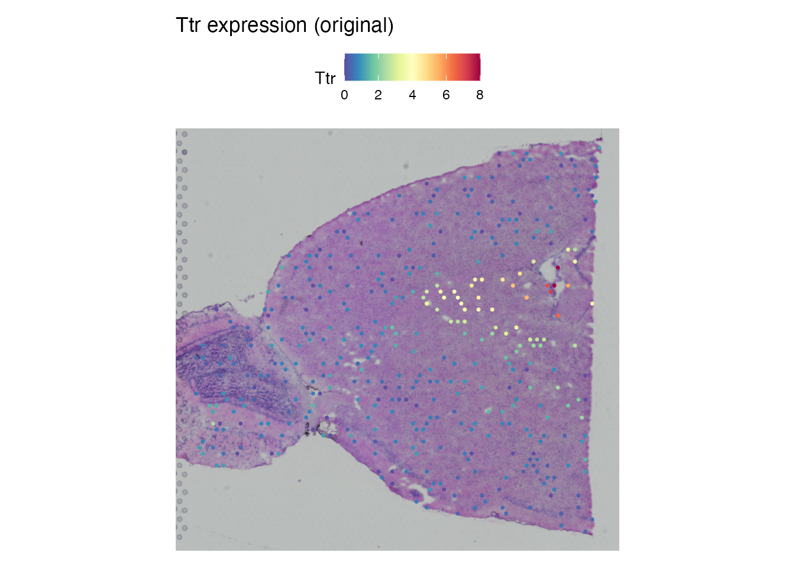
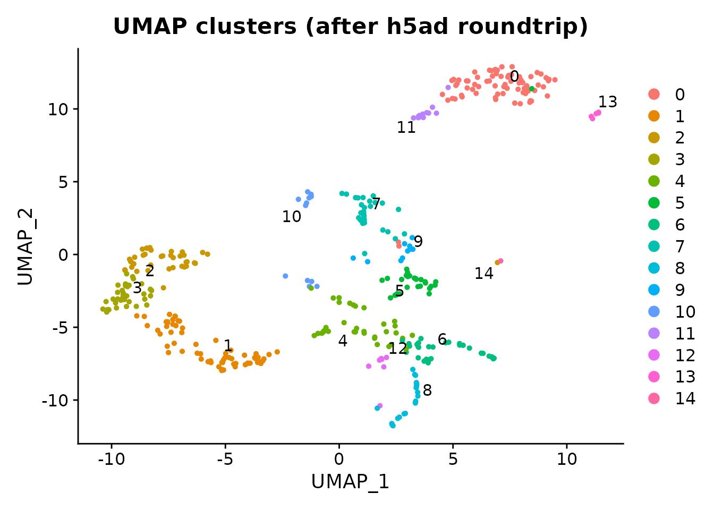
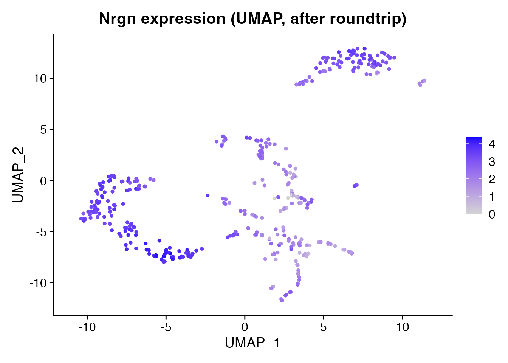

# Spatial Technologies Overview

## Introduction

Spatial transcriptomics spans a range of technologies – from spot-based
platforms like Visium and Slide-seq to subcellular-resolution methods
like Xenium and MERFISH. scConvert handles spatial data from any
platform that produces a Seurat object or h5ad file, preserving
coordinates, images, and metadata through format conversion.

## Supported spatial technologies

| Technology | Resolution | Coordinates | Images | h5ad roundtrip |
|----|----|----|----|----|
| **10x Visium** | ~55 um spots | Gridded | H&E tissue | Full support |
| **10x Visium HD** | 2–8 um bins | Dense grid | H&E tissue | Coordinates + image |
| **Slide-seq v2** | ~10 um beads | Continuous | None | Coordinates |
| **10x Xenium** | Subcellular | Molecule-based | DAPI/IF | Coordinates via FOV |
| **MERFISH (Vizgen)** | Subcellular | Molecule-based | DAPI | Coordinates via FOV |
| **CosMx (NanoString)** | Subcellular | Molecule-based | Morphology | Coordinates via FOV |
| **CODEX (Akoya)** | Cell-level | Centroids | Fluorescence | Coordinates |
| **Stereo-seq (BGI)** | ~0.5 um | Continuous | H&E | Coordinates |

All technologies store spatial coordinates in the h5ad `obsm/spatial`
field. Visium additionally stores tissue images and scale factors in
`uns/spatial`.

## Visium example: mouse brain

We demonstrate a full roundtrip with the shipped Visium demo dataset
(400 mouse brain spots, 1,500 genes, 15 clusters).

``` r

spatial_path <- system.file("extdata", "spatial_demo.rds", package = "scConvert")
brain <- readRDS(spatial_path)

cat("Spots:", ncol(brain), "\n")
#> Spots: 400
cat("Genes:", nrow(brain), "\n")
#> Genes: 1500
cat("Image:", paste(names(brain@images), collapse = ", "), "\n")
#> Image: anterior1
cat("Assay:", paste(names(brain@assays), collapse = ", "), "\n")
#> Assay: Spatial
```

### Spatial gene expression

Ttr (Transthyretin) is expressed in the choroid plexus and shows strong
spatial localization.

``` r

SpatialFeaturePlot(brain, features = "Ttr", pt.size.factor = 1.6) +
  ggplot2::ggtitle("Ttr expression (original)")
```



### Convert and load back

``` r

h5ad_file <- tempfile(fileext = ".h5ad")
writeH5AD(brain, h5ad_file, overwrite = TRUE)
brain_rt <- readH5AD(h5ad_file, verbose = FALSE)

cat("Roundtrip spots:", ncol(brain_rt), "\n")
#> Roundtrip spots: 400
cat("Roundtrip genes:", nrow(brain_rt), "\n")
#> Roundtrip genes: 1500
cat("Image preserved:", length(brain_rt@images) > 0, "\n")
#> Image preserved: TRUE
```

### Verify coordinate preservation

``` r

cat("Barcodes match:", all(colnames(brain) == colnames(brain_rt)), "\n")
#> Barcodes match: TRUE
cat("Features match:", all(rownames(brain) == rownames(brain_rt)), "\n")
#> Features match: TRUE
cat("Clusters match:",
    all(as.character(brain$seurat_clusters) ==
        as.character(brain_rt$seurat_clusters)), "\n")
#> Clusters match: TRUE
```

### Clusters preserved through roundtrip

``` r

DimPlot(brain_rt, reduction = "umap", group.by = "seurat_clusters",
        label = TRUE, repel = TRUE) +
  ggplot2::ggtitle("UMAP clusters (after h5ad roundtrip)")
```



### Another gene: Nrgn

Nrgn (Neurogranin) is a cortical neuron marker with a different spatial
pattern than Ttr.

``` r

# Round-tripped objects may have only the counts layer populated (scConvert
# writes X from counts when no normalised data is present). Ensure a data
# layer exists before plotting. readH5AD() names the default assay "RNA"
# unless assay.name is passed, so look up the actual default rather than
# assuming the input's assay name survives the roundtrip.
rt_assay <- SeuratObject::DefaultAssay(brain_rt)
if (!"data" %in% SeuratObject::Layers(brain_rt[[rt_assay]]) ||
    length(SeuratObject::GetAssayData(brain_rt, layer = "data")) == 0L) {
  brain_rt <- Seurat::NormalizeData(brain_rt, verbose = FALSE)
}
FeaturePlot(brain_rt, features = "Nrgn", reduction = "umap") +
  ggplot2::ggtitle("Nrgn expression (UMAP, after roundtrip)")
```



## Working with other spatial platforms

For any h5ad file with spatial coordinates, the same workflow applies:

``` r

# Load spatial h5ad from any platform
obj <- readH5AD("merfish_data.h5ad")

# Check what was detected
cat("Images:", paste(names(obj@images), collapse = ", "), "\n")

# Convert to another format
scConvert("merfish_data.h5ad", "merfish_data.h5seurat")
```

Technologies without tissue images (Slide-seq, MERFISH, CODEX) store
only coordinates in `obsm/spatial`. scConvert reads these into the
Seurat object and makes them available for plotting and downstream
analysis.

## Python interop

``` python
# Requires Python with scanpy installed
import scanpy as sc

adata = sc.read_h5ad("brain.h5ad")
print(adata)

# Works with any spatial technology
sc.pl.spatial(adata, color="Ttr")  # Visium (with image)
sc.pl.embedding(adata, basis="spatial", color="cluster")  # Generic spatial
```

## Cleanup

## Session Info

``` r

sessionInfo()
#> R version 4.6.0 (2026-04-24)
#> Platform: x86_64-pc-linux-gnu
#> Running under: Ubuntu 24.04.4 LTS
#> 
#> Matrix products: default
#> BLAS:   /usr/lib/x86_64-linux-gnu/openblas-pthread/libblas.so.3 
#> LAPACK: /usr/lib/x86_64-linux-gnu/openblas-pthread/libopenblasp-r0.3.26.so;  LAPACK version 3.12.0
#> 
#> locale:
#>  [1] LC_CTYPE=C.UTF-8       LC_NUMERIC=C           LC_TIME=C.UTF-8       
#>  [4] LC_COLLATE=C.UTF-8     LC_MONETARY=C.UTF-8    LC_MESSAGES=C.UTF-8   
#>  [7] LC_PAPER=C.UTF-8       LC_NAME=C              LC_ADDRESS=C          
#> [10] LC_TELEPHONE=C         LC_MEASUREMENT=C.UTF-8 LC_IDENTIFICATION=C   
#> 
#> time zone: UTC
#> tzcode source: system (glibc)
#> 
#> attached base packages:
#> [1] stats     graphics  grDevices utils     datasets  methods   base     
#> 
#> other attached packages:
#> [1] ggplot2_4.0.3      Seurat_5.5.0       SeuratObject_5.4.0 sp_2.2-1          
#> [5] scConvert_0.2.0   
#> 
#> loaded via a namespace (and not attached):
#>   [1] RColorBrewer_1.1-3     jsonlite_2.0.0         magrittr_2.0.5        
#>   [4] spatstat.utils_3.2-2   farver_2.1.2           rmarkdown_2.31        
#>   [7] fs_2.1.0               ragg_1.5.2             vctrs_0.7.3           
#>  [10] ROCR_1.0-12            spatstat.explore_3.8-0 htmltools_0.5.9       
#>  [13] sass_0.4.10            sctransform_0.4.3      parallelly_1.47.0     
#>  [16] KernSmooth_2.23-26     bslib_0.10.0           htmlwidgets_1.6.4     
#>  [19] desc_1.4.3             ica_1.0-3              plyr_1.8.9            
#>  [22] plotly_4.12.0          zoo_1.8-15             cachem_1.1.0          
#>  [25] igraph_2.3.0           mime_0.13              lifecycle_1.0.5       
#>  [28] pkgconfig_2.0.3        Matrix_1.7-5           R6_2.6.1              
#>  [31] fastmap_1.2.0          MatrixGenerics_1.24.0  fitdistrplus_1.2-6    
#>  [34] future_1.70.0          shiny_1.13.0           digest_0.6.39         
#>  [37] S4Vectors_0.50.0       patchwork_1.3.2        tensor_1.5.1          
#>  [40] RSpectra_0.16-2        irlba_2.3.7            GenomicRanges_1.64.0  
#>  [43] textshaping_1.0.5      labeling_0.4.3         progressr_0.19.0      
#>  [46] spatstat.sparse_3.1-0  httr_1.4.8             polyclip_1.10-7       
#>  [49] abind_1.4-8            compiler_4.6.0         bit64_4.8.0           
#>  [52] withr_3.0.2            S7_0.2.2               fastDummies_1.7.6     
#>  [55] MASS_7.3-65            tools_4.6.0            lmtest_0.9-40         
#>  [58] otel_0.2.0             httpuv_1.6.17          future.apply_1.20.2   
#>  [61] goftest_1.2-3          glue_1.8.1             nlme_3.1-169          
#>  [64] promises_1.5.0         grid_4.6.0             Rtsne_0.17            
#>  [67] cluster_2.1.8.2        reshape2_1.4.5         generics_0.1.4        
#>  [70] hdf5r_1.3.12           gtable_0.3.6           spatstat.data_3.1-9   
#>  [73] tidyr_1.3.2            data.table_1.18.2.1    BiocGenerics_0.58.0   
#>  [76] BPCells_0.3.1          spatstat.geom_3.7-3    RcppAnnoy_0.0.23      
#>  [79] ggrepel_0.9.8          RANN_2.6.2             pillar_1.11.1         
#>  [82] stringr_1.6.0          spam_2.11-3            RcppHNSW_0.6.0        
#>  [85] later_1.4.8            splines_4.6.0          dplyr_1.2.1           
#>  [88] lattice_0.22-9         survival_3.8-6         bit_4.6.0             
#>  [91] deldir_2.0-4           tidyselect_1.2.1       miniUI_0.1.2          
#>  [94] pbapply_1.7-4          knitr_1.51             gridExtra_2.3         
#>  [97] Seqinfo_1.2.0          IRanges_2.46.0         scattermore_1.2       
#> [100] stats4_4.6.0           xfun_0.57              matrixStats_1.5.0     
#> [103] stringi_1.8.7          lazyeval_0.2.3         yaml_2.3.12           
#> [106] evaluate_1.0.5         codetools_0.2-20       tibble_3.3.1          
#> [109] cli_3.6.6              uwot_0.2.4             xtable_1.8-8          
#> [112] reticulate_1.46.0      systemfonts_1.3.2      jquerylib_0.1.4       
#> [115] Rcpp_1.1.1-1.1         globals_0.19.1         spatstat.random_3.4-5 
#> [118] png_0.1-9              spatstat.univar_3.1-7  parallel_4.6.0        
#> [121] pkgdown_2.2.0          dotCall64_1.2          listenv_0.10.1        
#> [124] viridisLite_0.4.3      scales_1.4.0           ggridges_0.5.7        
#> [127] purrr_1.2.2            crayon_1.5.3           rlang_1.2.0           
#> [130] cowplot_1.2.0
```
