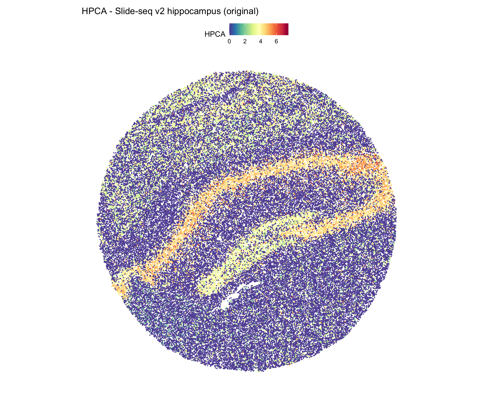
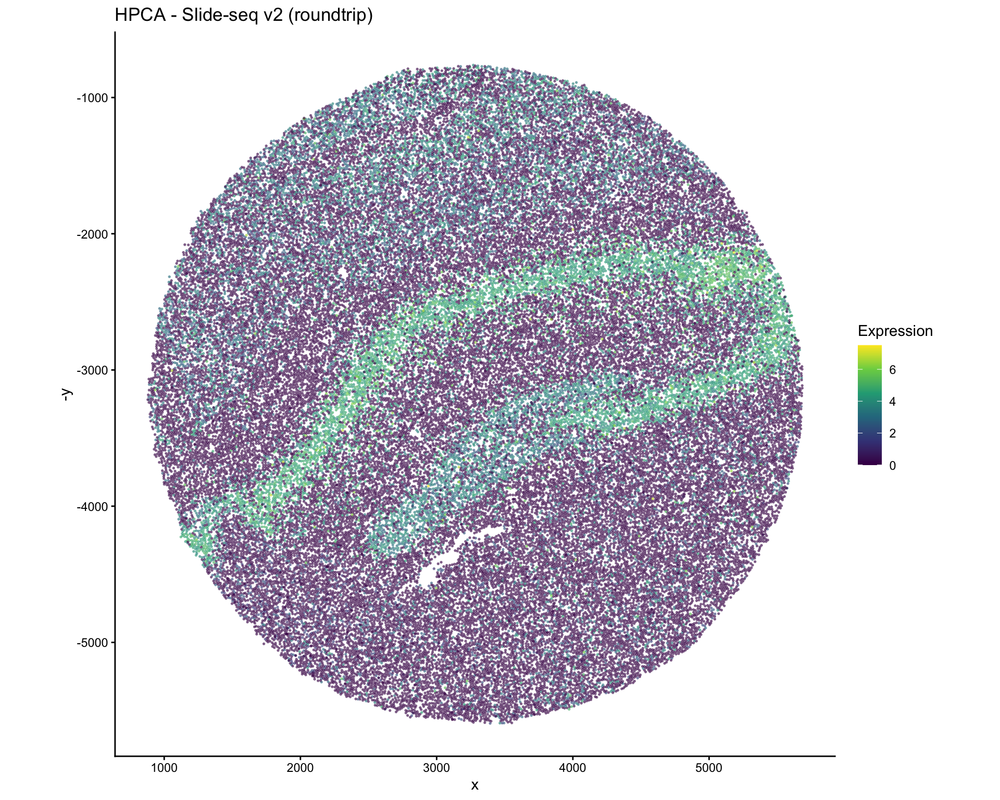
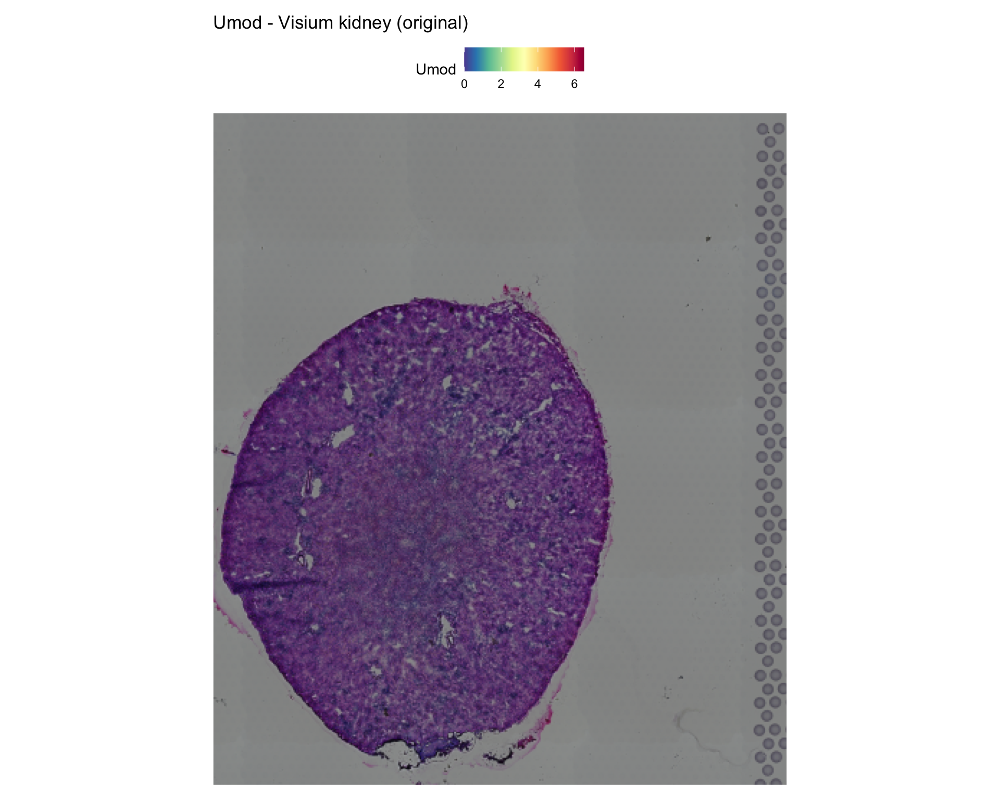

# Spatial Technologies: Slide-seq, Visium HD, and Others

## Overview

Spatial transcriptomics encompasses a diverse set of technologies, each
with distinct coordinate systems, resolutions, and data structures.
scConvert supports conversion of spatial data from all technologies that
produce Seurat objects or h5ad files.

This vignette covers:

1.  **Slide-seq v2** (bead-based, continuous coordinates)
2.  **Visium / Visium HD** (spot-based, gridded coordinates)
3.  **Xenium / MERFISH / CosMx** (subcellular, molecule-based)
4.  **CODEX / Stereo-seq** (imaging-based)

``` r

library(Seurat)
library(scConvert)
library(ggplot2)
```

## Slide-seq v2: Mouse Hippocampus

Slide-seq uses DNA barcoded beads on a surface to capture spatial
transcriptomes with near-cellular resolution (~10 um).

``` r

library(SeuratData)
ss <- UpdateSeuratObject(LoadData("ssHippo"))
ss <- NormalizeData(ss, verbose = FALSE)

cat("Technology: Slide-seq v2\n")
#> Technology: Slide-seq v2
cat("Beads:", ncol(ss), "\n")
#> Beads: 53173
cat("Genes:", nrow(ss), "\n")
#> Genes: 23264
cat("Images:", Images(ss), "\n")
#> Images: image
```

### Visualize original

``` r

SpatialFeaturePlot(ss, features = "HPCA", pt.size.factor = 1) +
  ggtitle("HPCA - Slide-seq v2 hippocampus (original)")
```



### Convert to h5ad and back

``` r

h5ad_path <- tempfile(fileext = ".h5ad")
writeH5AD(ss, h5ad_path, overwrite = TRUE, verbose = FALSE)
ss_rt <- readH5AD(h5ad_path, verbose = FALSE)

cat("Roundtrip beads:", ncol(ss_rt), "/", ncol(ss), "\n")
#> Roundtrip beads: 53173 / 53173
cat("Roundtrip genes:", nrow(ss_rt), "/", nrow(ss), "\n")
#> Roundtrip genes: 23264 / 23264
```

### Verify expression

``` r

common_c <- intersect(colnames(ss), colnames(ss_rt))
common_g <- intersect(rownames(ss), rownames(ss_rt))
set.seed(42)
sc <- sample(common_c, min(200, length(common_c)))
sg <- sample(common_g, min(100, length(common_g)))

corr <- cor(
  as.numeric(GetAssayData(ss, layer = "data")[sg, sc]),
  as.numeric(GetAssayData(ss_rt, layer = "data")[sg, sc])
)
cat("Expression correlation:", corr, "\n")
#> Expression correlation: 1
```

### Visualize roundtripped coordinates

``` r

# Slide-seq coordinates are continuous (not gridded)
tryCatch({
  SpatialFeaturePlot(ss_rt, features = "HPCA", pt.size.factor = 1) +
    ggtitle("HPCA - Slide-seq v2 (roundtrip)")
}, error = function(e) {
  if (!is.null(ss_rt@meta.data$spatial_x)) {
    df <- data.frame(
      x = ss_rt@meta.data$spatial_x,
      y = ss_rt@meta.data$spatial_y,
      expr = as.numeric(GetAssayData(ss_rt, layer = "data")["HPCA", ])
    )
    ggplot(df, aes(x = x, y = -y, color = expr)) +
      geom_point(size = 0.3, alpha = 0.5) +
      scale_color_viridis_c() +
      labs(title = "HPCA - Slide-seq v2 (roundtrip)", color = "Expression") +
      theme_classic() + coord_fixed()
  }
})
```



## Visium: Mouse Kidney

A second Visium example with a different tissue:

``` r

library(SeuratData)

# stxKidney uses the legacy SliceImage class; reconstruct as VisiumV2
data("stxKidney", package = "stxKidney.SeuratData")
counts <- stxKidney@assays[["Spatial"]]@counts
kidney <- CreateSeuratObject(counts = counts, assay = "Spatial")
kidney <- NormalizeData(kidney, verbose = FALSE)

# Reconstruct VisiumV2 from SliceImage
old_img <- stxKidney@images[["image"]]
sf <- old_img@scale.factors
scales <- scalefactors(spot = sf[["spot"]], fiducial = sf[["fiducial"]],
                       hires = sf[["hires"]], lowres = sf[["lowres"]])
coord_df <- data.frame(
  imagerow = old_img@coordinates[, "imagerow"],
  imagecol = old_img@coordinates[, "imagecol"],
  row.names = rownames(old_img@coordinates)
)
fov <- CreateFOV(coords = coord_df, type = "centroids",
                 radius = sf[["spot"]], assay = "Spatial", key = "image_")
v2 <- new(Class = "VisiumV2", image = old_img@image, scale.factors = scales,
          molecules = fov@molecules, boundaries = fov@boundaries,
          coords_x_orientation = "horizontal", assay = "Spatial", key = "image_")
v2 <- v2[colnames(kidney)]
kidney[["image"]] <- v2

cat("Technology: 10x Visium\n")
#> Technology: 10x Visium
cat("Spots:", ncol(kidney), "\n")
#> Spots: 1438
cat("Genes:", nrow(kidney), "\n")
#> Genes: 31053
```

``` r

# Use a kidney marker gene
kidney_markers <- intersect(c("Umod", "Slc12a1", "Nphs2"), rownames(kidney))
if (length(kidney_markers) > 0) {
  SpatialFeaturePlot(kidney, features = kidney_markers[1], pt.size.factor = 1.5) +
    ggtitle(paste0(kidney_markers[1], " - Visium kidney (original)"))
}
```



``` r

h5ad_path <- tempfile(fileext = ".h5ad")
writeH5AD(kidney, h5ad_path, overwrite = TRUE, verbose = FALSE)
kidney_rt <- readH5AD(h5ad_path, verbose = FALSE)

common_c <- intersect(colnames(kidney), colnames(kidney_rt))
common_g <- intersect(rownames(kidney), rownames(kidney_rt))
set.seed(42)
sc <- sample(common_c, min(200, length(common_c)))
sg <- sample(common_g, min(100, length(common_g)))
corr <- cor(
  as.numeric(GetAssayData(kidney, layer = "data")[sg, sc]),
  as.numeric(GetAssayData(kidney_rt, layer = "data")[sg, sc])
)
cat("Expression correlation:", corr, "\n")
#> Expression correlation: 1
cat("Spots preserved:", ncol(kidney_rt), "/", ncol(kidney), "\n")
#> Spots preserved: 1438 / 1438
```

## Spatial technology compatibility matrix

| Technology | Coordinate Type | Image? | scConvert Support | Tested |
|----|----|----|----|----|
| **10x Visium** | Gridded spots | H&E tissue | Full (VisiumV2) | stxBrain, stxKidney |
| **10x Visium HD** | Dense grid | H&E tissue | Coordinates + image | Via h5ad |
| **Slide-seq v2** | Continuous beads | No | Coordinates | ssHippo |
| **10x Xenium** | Subcellular molecules | DAPI/IF | Coordinates via FOV | Via h5ad |
| **MERFISH (Vizgen)** | Subcellular molecules | DAPI | Coordinates via FOV | Via h5ad |
| **CosMx (NanoString)** | Subcellular molecules | Morphology | Coordinates via FOV | Via h5ad |
| **CODEX (Akoya)** | Cell centroids | Fluorescence | Coordinates | Via h5ad |
| **Stereo-seq (BGI)** | Continuous spots | H&E | Coordinates | Via h5ad |
| **MERSCOPE** | Subcellular | DAPI | Coordinates via FOV | Via h5ad |

### How spatial data is stored in h5ad

All spatial technologies store coordinates in `obsm/spatial` as an N x 2
(or N x 3) matrix:

    obsm/
      spatial: float64 array (n_cells x 2)   # [x, y] coordinates
    uns/
      spatial/
        {library_id}/
          scalefactors/                        # Visium only
            spot_diameter_fullres: float
            tissue_hires_scalef: float
            tissue_lowres_scalef: float
          images/                               # Visium only
            hires: uint8 array (H x W x 3)
            lowres: uint8 array (H x W x 3)

**Key difference by technology:**

- **Visium**: Has both `obsm/spatial` AND `uns/spatial` (with images and
  scale factors)
- **Slide-seq**: Has `obsm/spatial` only (no tissue images)
- **Subcellular (Xenium, MERFISH, CosMx)**: Has `obsm/spatial` for cell
  centroids; molecule coordinates may be stored separately

### scConvert’s spatial detection logic

scConvert automatically detects the spatial technology:

1.  If `uns/spatial/{lib}/scalefactors/tissue_hires_scalef` exists -\>
    **Visium**
2.  If coordinates are gridded (many shared X/Y values) -\> **Visium**
    (fallback)
3.  If coordinates are continuous -\> **Slide-seq/Generic**
4.  If molecule-level data exists -\> **FOV** (generic spatial)

## Working with non-standard spatial h5ad files

For h5ad files from technologies not directly tested:

``` r

# Load any h5ad with spatial coordinates
obj <- readH5AD("spatial_data.h5ad")

# Check if spatial data was detected
cat("Images:", Images(obj), "\n")
cat("Has spatial_x:", "spatial_x" %in% colnames(obj[[]]), "\n")

# If spatial coordinates are in metadata, create manual plot
if ("spatial_x" %in% colnames(obj[[]])) {
  library(ggplot2)
  df <- data.frame(
    x = obj@meta.data$spatial_x,
    y = obj@meta.data$spatial_y,
    cluster = obj@meta.data$seurat_clusters
  )
  ggplot(df, aes(x = x, y = -y, color = cluster)) +
    geom_point(size = 0.5) +
    theme_classic() + coord_fixed()
}
```

## Session Info

``` r

sessionInfo()
#> R version 4.5.2 (2025-10-31)
#> Platform: aarch64-apple-darwin20
#> Running under: macOS Tahoe 26.3
#> 
#> Matrix products: default
#> BLAS:   /System/Library/Frameworks/Accelerate.framework/Versions/A/Frameworks/vecLib.framework/Versions/A/libBLAS.dylib 
#> LAPACK: /Library/Frameworks/R.framework/Versions/4.5-arm64/Resources/lib/libRlapack.dylib;  LAPACK version 3.12.1
#> 
#> locale:
#> [1] en_US.UTF-8/en_US.UTF-8/en_US.UTF-8/C/en_US.UTF-8/en_US.UTF-8
#> 
#> time zone: America/Indiana/Indianapolis
#> tzcode source: internal
#> 
#> attached base packages:
#> [1] stats     graphics  grDevices utils     datasets  methods   base     
#> 
#> other attached packages:
#>  [1] ggplot2_4.0.2                 scConvert_0.1.0              
#>  [3] Seurat_5.4.0                  SeuratObject_5.3.0           
#>  [5] sp_2.2-1                      stxKidney.SeuratData_0.1.0   
#>  [7] stxBrain.SeuratData_0.1.2     ssHippo.SeuratData_3.1.4     
#>  [9] pbmcref.SeuratData_1.0.0      pbmcMultiome.SeuratData_0.1.4
#> [11] pbmc3k.SeuratData_3.1.4       panc8.SeuratData_3.0.2       
#> [13] cbmc.SeuratData_3.1.4         SeuratData_0.2.2.9002        
#> 
#> loaded via a namespace (and not attached):
#>   [1] RColorBrewer_1.1-3     jsonlite_2.0.0         magrittr_2.0.4        
#>   [4] spatstat.utils_3.2-1   farver_2.1.2           rmarkdown_2.30        
#>   [7] fs_1.6.6               ragg_1.5.0             vctrs_0.7.1           
#>  [10] ROCR_1.0-12            spatstat.explore_3.7-0 htmltools_0.5.9       
#>  [13] sass_0.4.10            sctransform_0.4.3      parallelly_1.46.1     
#>  [16] KernSmooth_2.23-26     bslib_0.10.0           htmlwidgets_1.6.4     
#>  [19] desc_1.4.3             ica_1.0-3              plyr_1.8.9            
#>  [22] plotly_4.12.0          zoo_1.8-15             cachem_1.1.0          
#>  [25] igraph_2.2.2           mime_0.13              lifecycle_1.0.5       
#>  [28] pkgconfig_2.0.3        Matrix_1.7-4           R6_2.6.1              
#>  [31] fastmap_1.2.0          MatrixGenerics_1.22.0  fitdistrplus_1.2-6    
#>  [34] future_1.69.0          shiny_1.13.0           digest_0.6.39         
#>  [37] S4Vectors_0.48.0       patchwork_1.3.2        tensor_1.5.1          
#>  [40] RSpectra_0.16-2        irlba_2.3.7            GenomicRanges_1.62.1  
#>  [43] textshaping_1.0.4      labeling_0.4.3         progressr_0.18.0      
#>  [46] spatstat.sparse_3.1-0  httr_1.4.8             polyclip_1.10-7       
#>  [49] abind_1.4-8            compiler_4.5.2         withr_3.0.2           
#>  [52] bit64_4.6.0-1          S7_0.2.1               fastDummies_1.7.5     
#>  [55] MASS_7.3-65            rappdirs_0.3.4         tools_4.5.2           
#>  [58] lmtest_0.9-40          otel_0.2.0             httpuv_1.6.16         
#>  [61] future.apply_1.20.2    goftest_1.2-3          glue_1.8.0            
#>  [64] nlme_3.1-168           promises_1.5.0         grid_4.5.2            
#>  [67] Rtsne_0.17             cluster_2.1.8.2        reshape2_1.4.5        
#>  [70] generics_0.1.4         hdf5r_1.3.12           gtable_0.3.6          
#>  [73] spatstat.data_3.1-9    tidyr_1.3.2            data.table_1.18.2.1   
#>  [76] XVector_0.50.0         BiocGenerics_0.56.0    BPCells_0.2.0         
#>  [79] spatstat.geom_3.7-0    RcppAnnoy_0.0.23       ggrepel_0.9.7         
#>  [82] RANN_2.6.2             pillar_1.11.1          stringr_1.6.0         
#>  [85] spam_2.11-3            RcppHNSW_0.6.0         later_1.4.8           
#>  [88] splines_4.5.2          dplyr_1.2.0            lattice_0.22-9        
#>  [91] bit_4.6.0              survival_3.8-6         deldir_2.0-4          
#>  [94] tidyselect_1.2.1       miniUI_0.1.2           pbapply_1.7-4         
#>  [97] knitr_1.51             gridExtra_2.3          Seqinfo_1.0.0         
#> [100] IRanges_2.44.0         scattermore_1.2        stats4_4.5.2          
#> [103] xfun_0.56              matrixStats_1.5.0      UCSC.utils_1.6.1      
#> [106] stringi_1.8.7          lazyeval_0.2.2         yaml_2.3.12           
#> [109] evaluate_1.0.5         codetools_0.2-20       tibble_3.3.1          
#> [112] cli_3.6.5              uwot_0.2.4             xtable_1.8-8          
#> [115] reticulate_1.45.0      systemfonts_1.3.1      jquerylib_0.1.4       
#> [118] GenomeInfoDb_1.46.2    dichromat_2.0-0.1      Rcpp_1.1.1            
#> [121] globals_0.19.0         spatstat.random_3.4-4  png_0.1-8             
#> [124] spatstat.univar_3.1-6  parallel_4.5.2         pkgdown_2.2.0         
#> [127] dotCall64_1.2          listenv_0.10.0         viridisLite_0.4.3     
#> [130] scales_1.4.0           ggridges_0.5.7         purrr_1.2.1           
#> [133] crayon_1.5.3           rlang_1.1.7            cowplot_1.2.0
```
