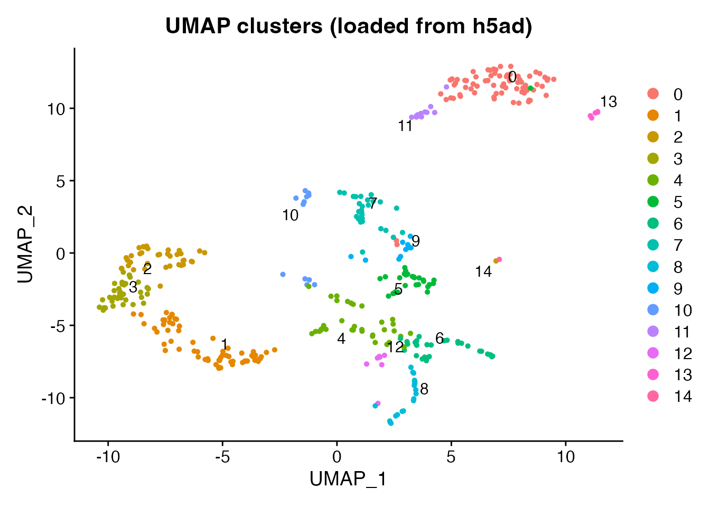
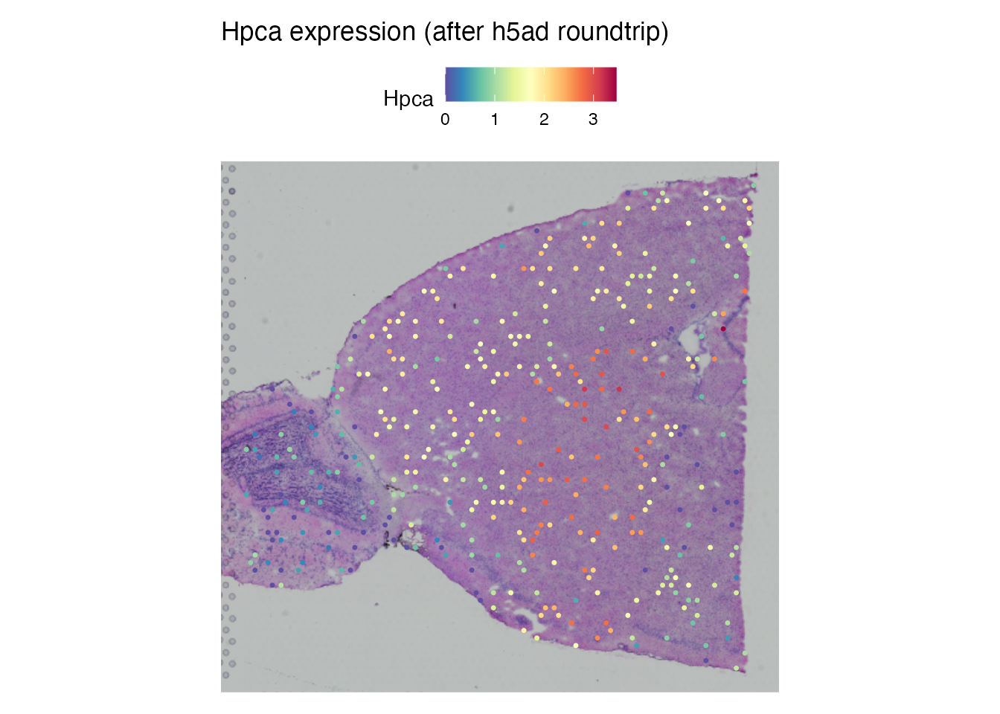

# Visium Spatial Data Conversion

## Introduction

10x Genomics Visium captures spatially-resolved gene expression across
tissue sections. When converting Visium data between Seurat and h5ad,
scConvert preserves spot coordinates, tissue images, scale factors, and
all associated metadata so the data is immediately usable in both R
(Seurat) and Python (scanpy/squidpy) ecosystems.

## Read spatial data from h5ad

The shipped `spatial_demo.h5ad` contains 400 mouse brain Visium spots
with 1,500 genes, PCA/UMAP reductions, and cluster labels.
[`readH5AD()`](https://mianaz.github.io/scConvert/reference/readH5AD.md)
rebuilds the full Seurat spatial object, including the tissue image.

``` r

h5ad_file <- system.file("extdata", "spatial_demo.h5ad", package = "scConvert")
brain <- readH5AD(h5ad_file, verbose = FALSE)

cat("Spots:", ncol(brain), "\n")
#> Spots: 400
cat("Genes:", nrow(brain), "\n")
#> Genes: 1500
cat("Image:", Images(brain), "\n")
#> Image: anterior1
cat("Assay:", Assays(brain), "\n")
#> Assay: RNA
```

### Spatial expression of a brain marker

Hpca (Hippocalcin) marks hippocampal neurons and shows clear regional
expression in the mouse brain.

``` r

SpatialFeaturePlot(brain, features = "Hpca", pt.size.factor = 1.6) +
  ggtitle("Hpca expression (loaded from h5ad)")
```


### Cluster overview

``` r

DimPlot(brain, reduction = "umap", group.by = "seurat_clusters",
        label = TRUE, repel = TRUE) +
  ggtitle("UMAP clusters (loaded from h5ad)")
```



## Write-and-read roundtrip

Write the spatial object to a new h5ad file, read it back, and confirm
that coordinates, images, scale factors, and expression values are all
preserved.

``` r

h5ad_rt <- file.path(tempdir(), "spatial_roundtrip.h5ad")
writeH5AD(brain, h5ad_rt, overwrite = TRUE)
cat("Wrote:", round(file.size(h5ad_rt) / 1024^2, 1), "MB\n")
#> Wrote: 3.2 MB

brain_rt <- readH5AD(h5ad_rt, verbose = FALSE)
cat("Roundtrip spots:", ncol(brain_rt), "\n")
#> Roundtrip spots: 400
cat("Roundtrip genes:", nrow(brain_rt), "\n")
#> Roundtrip genes: 1500
cat("Image:", Images(brain_rt), "\n")
#> Image: anterior1
```

### Compare spatial plots

The spatial expression pattern should be identical after roundtrip.

``` r

SpatialFeaturePlot(brain_rt, features = "Hpca", pt.size.factor = 1.6) +
  ggtitle("Hpca expression (after h5ad roundtrip)")
```



### Verify data integrity

``` r

cat("Dimensions match:",
    ncol(brain) == ncol(brain_rt) && nrow(brain) == nrow(brain_rt), "\n")
#> Dimensions match: TRUE
cat("Barcodes match:", all(colnames(brain) == colnames(brain_rt)), "\n")
#> Barcodes match: TRUE
cat("Clusters match:",
    all(as.character(brain$seurat_clusters) ==
        as.character(brain_rt$seurat_clusters)), "\n")
#> Clusters match: TRUE
```

## What gets preserved

scConvert maintains full fidelity for Visium spatial data during
conversion:

| Component              | h5ad location                | Preserved |
|------------------------|------------------------------|-----------|
| Expression matrix      | `X` / `raw/X`                | Yes       |
| Spot coordinates       | `obsm/spatial`               | Yes       |
| Tissue image           | `uns/spatial/*/images`       | Yes       |
| Scale factors          | `uns/spatial/*/scalefactors` | Yes       |
| Cell metadata          | `obs`                        | Yes       |
| Reductions (PCA, UMAP) | `obsm`                       | Yes       |

## Use in Python (scanpy/squidpy)

The exported h5ad works directly with scanpy and squidpy. Images,
coordinates, and scale factors use standard scanpy conventions.

``` python
# Requires Python with scanpy and squidpy installed
import scanpy as sc

adata = sc.read_h5ad("spatial_demo.h5ad")
print(adata)
print(f"Spatial coords shape: {adata.obsm['spatial'].shape}")

# Spatial scatter plot
sc.pl.spatial(adata, color="seurat_clusters")

# Squidpy spatial analysis
import squidpy as sq
sq.gr.spatial_neighbors(adata, coord_type="generic")
sq.gr.spatial_autocorr(adata, mode="moran", genes=["Hpca", "Ttr"])
```

## Clean up

## Session Info

``` r

sessionInfo()
#> R version 4.5.2 (2025-10-31)
#> Platform: aarch64-apple-darwin20
#> Running under: macOS Tahoe 26.3
#> 
#> Matrix products: default
#> BLAS:   /System/Library/Frameworks/Accelerate.framework/Versions/A/Frameworks/vecLib.framework/Versions/A/libBLAS.dylib 
#> LAPACK: /Library/Frameworks/R.framework/Versions/4.5-arm64/Resources/lib/libRlapack.dylib;  LAPACK version 3.12.1
#> 
#> locale:
#> [1] en_US.UTF-8/en_US.UTF-8/en_US.UTF-8/C/en_US.UTF-8/en_US.UTF-8
#> 
#> time zone: America/Indiana/Indianapolis
#> tzcode source: internal
#> 
#> attached base packages:
#> [1] stats     graphics  grDevices utils     datasets  methods   base     
#> 
#> other attached packages:
#> [1] ggplot2_4.0.2      Seurat_5.4.0       SeuratObject_5.3.0 sp_2.2-1          
#> [5] scConvert_0.1.0   
#> 
#> loaded via a namespace (and not attached):
#>   [1] RColorBrewer_1.1-3     jsonlite_2.0.0         magrittr_2.0.4        
#>   [4] spatstat.utils_3.2-2   farver_2.1.2           rmarkdown_2.30        
#>   [7] fs_1.6.7               ragg_1.5.0             vctrs_0.7.1           
#>  [10] ROCR_1.0-12            spatstat.explore_3.7-0 htmltools_0.5.9       
#>  [13] sass_0.4.10            sctransform_0.4.3      parallelly_1.46.1     
#>  [16] KernSmooth_2.23-26     bslib_0.10.0           htmlwidgets_1.6.4     
#>  [19] desc_1.4.3             ica_1.0-3              plyr_1.8.9            
#>  [22] plotly_4.12.0          zoo_1.8-15             cachem_1.1.0          
#>  [25] igraph_2.2.2           mime_0.13              lifecycle_1.0.5       
#>  [28] pkgconfig_2.0.3        Matrix_1.7-4           R6_2.6.1              
#>  [31] fastmap_1.2.0          MatrixGenerics_1.22.0  fitdistrplus_1.2-6    
#>  [34] future_1.69.0          shiny_1.13.0           digest_0.6.39         
#>  [37] S4Vectors_0.48.0       patchwork_1.3.2        tensor_1.5.1          
#>  [40] RSpectra_0.16-2        irlba_2.3.7            GenomicRanges_1.62.1  
#>  [43] textshaping_1.0.4      labeling_0.4.3         progressr_0.18.0      
#>  [46] spatstat.sparse_3.1-0  httr_1.4.8             polyclip_1.10-7       
#>  [49] abind_1.4-8            compiler_4.5.2         bit64_4.6.0-1         
#>  [52] withr_3.0.2            S7_0.2.1               fastDummies_1.7.5     
#>  [55] MASS_7.3-65            tools_4.5.2            lmtest_0.9-40         
#>  [58] otel_0.2.0             httpuv_1.6.16          future.apply_1.20.2   
#>  [61] goftest_1.2-3          glue_1.8.0             nlme_3.1-168          
#>  [64] promises_1.5.0         grid_4.5.2             Rtsne_0.17            
#>  [67] cluster_2.1.8.2        reshape2_1.4.5         generics_0.1.4        
#>  [70] hdf5r_1.3.12           gtable_0.3.6           spatstat.data_3.1-9   
#>  [73] tidyr_1.3.2            data.table_1.18.2.1    XVector_0.50.0        
#>  [76] BiocGenerics_0.56.0    BPCells_0.2.0          spatstat.geom_3.7-0   
#>  [79] RcppAnnoy_0.0.23       ggrepel_0.9.7          RANN_2.6.2            
#>  [82] pillar_1.11.1          stringr_1.6.0          spam_2.11-3           
#>  [85] RcppHNSW_0.6.0         later_1.4.8            splines_4.5.2         
#>  [88] dplyr_1.2.0            lattice_0.22-9         survival_3.8-6        
#>  [91] bit_4.6.0              deldir_2.0-4           tidyselect_1.2.1      
#>  [94] miniUI_0.1.2           pbapply_1.7-4          knitr_1.51            
#>  [97] gridExtra_2.3          Seqinfo_1.0.0          IRanges_2.44.0        
#> [100] scattermore_1.2        stats4_4.5.2           xfun_0.56             
#> [103] matrixStats_1.5.0      UCSC.utils_1.6.1       stringi_1.8.7         
#> [106] lazyeval_0.2.2         yaml_2.3.12            evaluate_1.0.5        
#> [109] codetools_0.2-20       tibble_3.3.1           cli_3.6.5             
#> [112] uwot_0.2.4             xtable_1.8-8           reticulate_1.45.0     
#> [115] systemfonts_1.3.1      jquerylib_0.1.4        GenomeInfoDb_1.46.2   
#> [118] dichromat_2.0-0.1      Rcpp_1.1.1             globals_0.19.1        
#> [121] spatstat.random_3.4-4  png_0.1-8              spatstat.univar_3.1-6 
#> [124] parallel_4.5.2         pkgdown_2.2.0          dotCall64_1.2         
#> [127] listenv_0.10.1         viridisLite_0.4.3      scales_1.4.0          
#> [130] ggridges_0.5.7         purrr_1.2.1            crayon_1.5.3          
#> [133] rlang_1.1.7            cowplot_1.2.0
```
