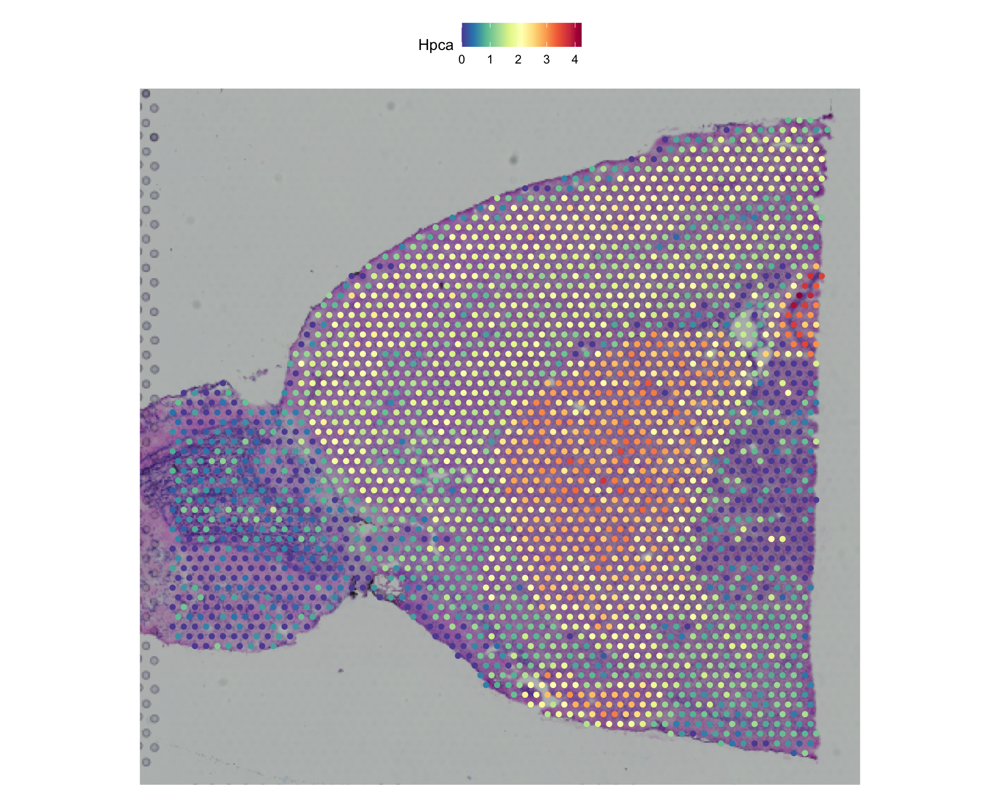
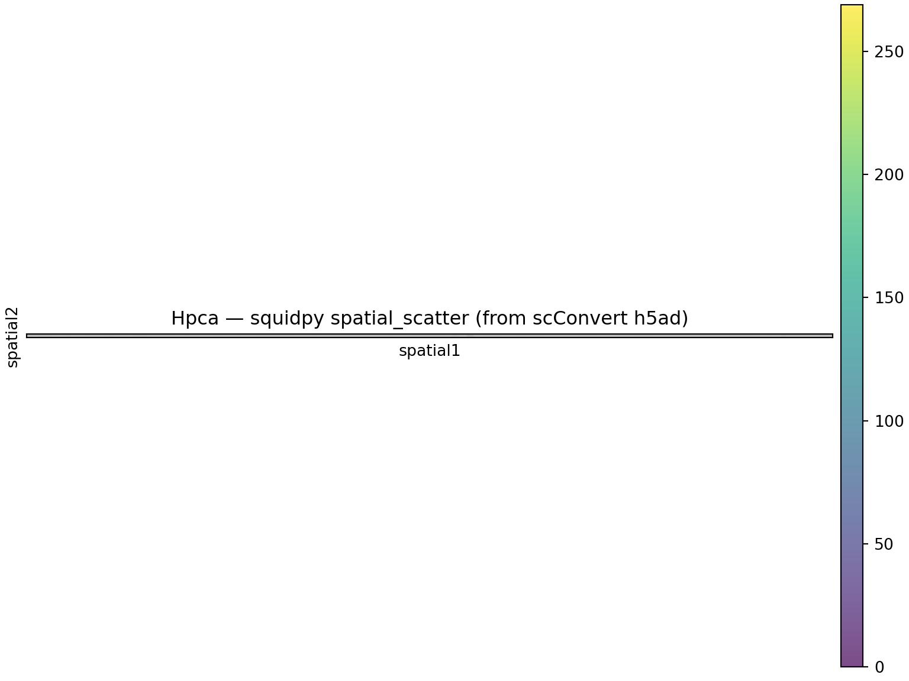
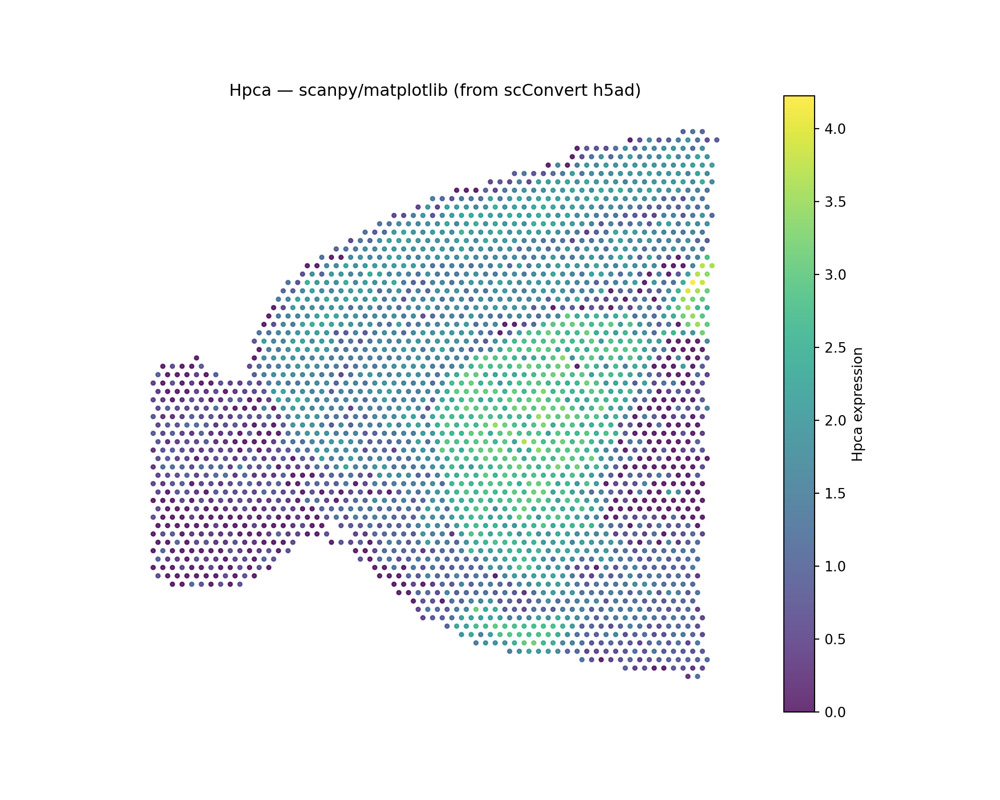

# Spatial Transcriptomics: Visium

## Overview

This vignette demonstrates how scConvert handles **10x Genomics Visium**
spatial transcriptomics data, including tissue images, scale factors,
and spot coordinates. Visium data is stored in h5ad files with
spatial-specific fields (`obsm/spatial`, `uns/spatial`) that scConvert
automatically reconstructs into Seurat `VisiumV2` image objects.

We show that the exported h5ad is **natively usable** in scanpy and
squidpy (spatial scatter plots, Moran’s I), and that all key components
— dimensions, metadata, barcodes, features, spatial coordinates, scale
factors, and dimensionality reductions — are preserved.

``` r

library(Seurat)
library(scConvert)
library(ggplot2)
```

## Load Visium data

We use the **stxBrain** dataset (mouse brain anterior1, ~2,700 spots x
~31,000 genes):

``` r

library(SeuratData)
brain <- UpdateSeuratObject(LoadData("stxBrain", type = "anterior1"))
brain <- NormalizeData(brain)

cat("Cells:", ncol(brain), "\n")
#> Cells: 2696
cat("Genes:", nrow(brain), "\n")
#> Genes: 31053
cat("Images:", Images(brain), "\n")
#> Images: anterior1
cat("Layers:", paste(Layers(brain), collapse = ", "), "\n")
#> Layers: counts, data
cat("Metadata columns:", ncol(brain[[]]), "\n")
#> Metadata columns: 5
```

### Visualize the original spatial data

``` r

SpatialFeaturePlot(brain, features = "Hpca", pt.size.factor = 1.5)
```



Hpca (Hippocalcin) is a marker for hippocampal neurons, showing strong
regional expression.

## Export to h5ad

scConvert writes Visium spatial data to h5ad using scanpy/squidpy
conventions:

| Seurat Component | h5ad Location | Description |
|----|----|----|
| Tissue coordinates | `obsm/spatial` | Spot XY positions |
| Scale factors | `uns/spatial/{lib}/scalefactors` | `spot_diameter_fullres`, `tissue_hires_scalef`, etc. |
| Tissue image (lowres) | `uns/spatial/{lib}/images/lowres` | Low-resolution H&E image |
| Tissue image (hires) | `uns/spatial/{lib}/images/hires` | High-resolution H&E image |

``` r

h5ad_path <- tempfile(fileext = ".h5ad")
writeH5AD(brain, h5ad_path, overwrite = TRUE)
cat("File size:", round(file.size(h5ad_path) / 1024^2, 1), "MB\n")
#> File size: 70 MB
```

## Validate in Python with scanpy

The exported h5ad is immediately usable in the scverse ecosystem — no
extra configuration needed:

``` python
import scanpy as sc
import numpy as np

adata = sc.read_h5ad(r.h5ad_path)
print(adata)
#> AnnData object with n_obs × n_vars = 2696 × 31053
#>     obs: 'orig.ident', 'nCount_Spatial', 'nFeature_Spatial', 'slice', 'region'
#>     uns: 'spatial'
#>     obsm: 'spatial'
print(f"\nobsm keys: {list(adata.obsm.keys())}")
#> 
#> obsm keys: ['spatial']
print(f"Spatial coords shape: {adata.obsm['spatial'].shape}")
#> Spatial coords shape: (2696, 2)
print(f"Spatial coord range X: [{adata.obsm['spatial'][:,0].min():.1f}, {adata.obsm['spatial'][:,0].max():.1f}]")
#> Spatial coord range X: [1480.0, 9533.0]
print(f"Spatial coord range Y: [{adata.obsm['spatial'][:,1].min():.1f}, {adata.obsm['spatial'][:,1].max():.1f}]")
#> Spatial coord range Y: [2685.0, 10469.0]
print(f"No NaN in coords: {not np.isnan(adata.obsm['spatial']).any()}")
#> No NaN in coords: True

# Verify uns/spatial structure matches scanpy convention
if "spatial" in adata.uns:
    lib_ids = list(adata.uns["spatial"].keys())
    print(f"\nSpatial library IDs: {lib_ids}")
    for lib_id in lib_ids:
        lib = adata.uns["spatial"][lib_id]
        if "images" in lib:
            for k, v in lib["images"].items():
                print(f"  Image '{k}': shape {v.shape}, dtype {v.dtype}")
        if "scalefactors" in lib:
            sf = lib["scalefactors"]
            print(f"  Scale factors: {sf}")
            # Verify standard keys exist
            for key in ["spot_diameter_fullres", "tissue_hires_scalef", "tissue_lowres_scalef"]:
                print(f"    {key}: {'present' if key in sf else 'MISSING'}")
#> 
#> Spatial library IDs: ['anterior1']
#>   Image 'lowres': shape (599, 600, 3), dtype float64
#>   Scale factors: {'fiducial_diameter_fullres': np.float64(144.54121946972606), 'spot_diameter_fullres': np.float64(89.47789776697327), 'tissue_hires_scalef': np.float64(0.17211704), 'tissue_lowres_scalef': np.float64(0.051635113)}
#>     spot_diameter_fullres: present
#>     tissue_hires_scalef: present
#>     tissue_lowres_scalef: present
```

### Spatial scatter plot with squidpy

Because scConvert writes scale factors with the correct
scanpy-convention names (`spot_diameter_fullres`, `tissue_hires_scalef`,
etc.), squidpy plotting works out of the box:

``` python
import squidpy as sq

sq.pl.spatial_scatter(adata, color="Hpca", library_id=list(adata.uns["spatial"].keys())[0],
                      img_res_key="lowres", size=1.5, alpha=0.7,
                      title="Hpca — squidpy spatial_scatter (from scConvert h5ad)")
```



### Scanpy spatial plot (coordinate-based)

``` python
import matplotlib.pyplot as plt

coords = adata.obsm["spatial"]
expr = adata[:, "Hpca"].X.toarray().flatten() if hasattr(adata[:, "Hpca"].X, 'toarray') else adata[:, "Hpca"].X.flatten()

fig, ax = plt.subplots(1, 1, figsize=(10, 8))
sc_plot = ax.scatter(coords[:, 0], -coords[:, 1], c=expr, s=8, cmap="viridis", alpha=0.8)
plt.colorbar(sc_plot, ax=ax, label="Hpca expression")
#> <matplotlib.colorbar.Colorbar object at 0x3aeee2600>
ax.set_title("Hpca — scanpy/matplotlib (from scConvert h5ad)")
ax.set_aspect("equal")
ax.axis("off")
#> (np.float64(1077.35), np.float64(9935.65), np.float64(-10858.2), np.float64(-2295.8))
plt.show()
```



### Spatial analysis: Moran’s I

``` python
import squidpy as sq

sq.gr.spatial_neighbors(adata, coord_type="generic")
#> 
[34mINFO    
[0m Creating graph using `generic` coordinates and `
[3;35mNone
[0m` transform and `
[1;36m1
[0m`
#>          libraries.
genes = list(adata.var_names[:5])
sq.gr.spatial_autocorr(adata, mode="moran", genes=genes)
print("Moran's I results:")
#> Moran's I results:
print(adata.uns["moranI"].head())
#>                 I  pval_norm  var_norm  pval_norm_fdr_bh
#> Sox17    0.012438   0.123048  0.000122               NaN
#> Rp1     -0.000371   0.500000  0.000122               NaN
#> Xkr4    -0.009214   0.211632  0.000122               NaN
#> Gm1992        NaN        NaN  0.000122               NaN
#> Gm37381       NaN        NaN  0.000122               NaN
```

## Load h5ad back into Seurat

``` r

brain_rt <- readH5AD(h5ad_path, verbose = FALSE)

cat("Dimensions:", ncol(brain_rt), "cells x", nrow(brain_rt), "genes\n")
#> Dimensions: 2696 cells x 31053 genes
cat("Images:", paste(Images(brain_rt), collapse = ", "), "\n")
#> Images: anterior1
cat("Dims match:", ncol(brain) == ncol(brain_rt) && nrow(brain) == nrow(brain_rt), "\n")
#> Dims match: TRUE
```

## Known limitations

- **Image reconstruction**: Tissue images stored in h5ad may require
  specific Seurat version compatibility for full
  [`SpatialFeaturePlot()`](https://satijalab.org/seurat/reference/SpatialPlot.html)
  support. Coordinates and expression values are always preserved.
- **Non-Visium spatial**: For Slide-seq, MERFISH, Xenium, and other
  technologies, see the [Spatial
  Technologies](https://mianaz.github.io/scConvert/articles/spatial-technologies.md)
  vignette.
- **Large images**: High-resolution images increase file size
  substantially. Consider using `lowres` images for exploratory
  analysis.

## Session Info

``` r

sessionInfo()
#> R version 4.5.2 (2025-10-31)
#> Platform: aarch64-apple-darwin20
#> Running under: macOS Tahoe 26.3
#> 
#> Matrix products: default
#> BLAS:   /System/Library/Frameworks/Accelerate.framework/Versions/A/Frameworks/vecLib.framework/Versions/A/libBLAS.dylib 
#> LAPACK: /Library/Frameworks/R.framework/Versions/4.5-arm64/Resources/lib/libRlapack.dylib;  LAPACK version 3.12.1
#> 
#> locale:
#> [1] en_US.UTF-8/en_US.UTF-8/en_US.UTF-8/C/en_US.UTF-8/en_US.UTF-8
#> 
#> time zone: America/Indiana/Indianapolis
#> tzcode source: internal
#> 
#> attached base packages:
#> [1] stats     graphics  grDevices utils     datasets  methods   base     
#> 
#> other attached packages:
#>  [1] ggplot2_4.0.2                 scConvert_0.1.0              
#>  [3] Seurat_5.4.0                  SeuratObject_5.3.0           
#>  [5] sp_2.2-1                      stxKidney.SeuratData_0.1.0   
#>  [7] stxBrain.SeuratData_0.1.2     ssHippo.SeuratData_3.1.4     
#>  [9] pbmcref.SeuratData_1.0.0      pbmcMultiome.SeuratData_0.1.4
#> [11] pbmc3k.SeuratData_3.1.4       panc8.SeuratData_3.0.2       
#> [13] cbmc.SeuratData_3.1.4         SeuratData_0.2.2.9002        
#> 
#> loaded via a namespace (and not attached):
#>   [1] RColorBrewer_1.1-3     jsonlite_2.0.0         magrittr_2.0.4        
#>   [4] spatstat.utils_3.2-1   farver_2.1.2           rmarkdown_2.30        
#>   [7] fs_1.6.6               ragg_1.5.0             vctrs_0.7.1           
#>  [10] ROCR_1.0-12            spatstat.explore_3.7-0 htmltools_0.5.9       
#>  [13] sass_0.4.10            sctransform_0.4.3      parallelly_1.46.1     
#>  [16] KernSmooth_2.23-26     bslib_0.10.0           htmlwidgets_1.6.4     
#>  [19] desc_1.4.3             ica_1.0-3              plyr_1.8.9            
#>  [22] plotly_4.12.0          zoo_1.8-15             cachem_1.1.0          
#>  [25] igraph_2.2.2           mime_0.13              lifecycle_1.0.5       
#>  [28] pkgconfig_2.0.3        Matrix_1.7-4           R6_2.6.1              
#>  [31] fastmap_1.2.0          MatrixGenerics_1.22.0  fitdistrplus_1.2-6    
#>  [34] future_1.69.0          shiny_1.13.0           digest_0.6.39         
#>  [37] S4Vectors_0.48.0       patchwork_1.3.2        rprojroot_2.1.1       
#>  [40] tensor_1.5.1           RSpectra_0.16-2        irlba_2.3.7           
#>  [43] GenomicRanges_1.62.1   textshaping_1.0.4      labeling_0.4.3        
#>  [46] progressr_0.18.0       spatstat.sparse_3.1-0  httr_1.4.8            
#>  [49] polyclip_1.10-7        abind_1.4-8            compiler_4.5.2        
#>  [52] here_1.0.2             bit64_4.6.0-1          withr_3.0.2           
#>  [55] S7_0.2.1               fastDummies_1.7.5      MASS_7.3-65           
#>  [58] rappdirs_0.3.4         tools_4.5.2            lmtest_0.9-40         
#>  [61] otel_0.2.0             httpuv_1.6.16          future.apply_1.20.2   
#>  [64] goftest_1.2-3          glue_1.8.0             nlme_3.1-168          
#>  [67] promises_1.5.0         grid_4.5.2             Rtsne_0.17            
#>  [70] cluster_2.1.8.2        reshape2_1.4.5         generics_0.1.4        
#>  [73] hdf5r_1.3.12           gtable_0.3.6           spatstat.data_3.1-9   
#>  [76] tidyr_1.3.2            data.table_1.18.2.1    XVector_0.50.0        
#>  [79] BiocGenerics_0.56.0    BPCells_0.2.0          spatstat.geom_3.7-0   
#>  [82] RcppAnnoy_0.0.23       ggrepel_0.9.7          RANN_2.6.2            
#>  [85] pillar_1.11.1          stringr_1.6.0          spam_2.11-3           
#>  [88] RcppHNSW_0.6.0         later_1.4.8            splines_4.5.2         
#>  [91] dplyr_1.2.0            lattice_0.22-9         bit_4.6.0             
#>  [94] survival_3.8-6         deldir_2.0-4           tidyselect_1.2.1      
#>  [97] miniUI_0.1.2           pbapply_1.7-4          knitr_1.51            
#> [100] gridExtra_2.3          Seqinfo_1.0.0          IRanges_2.44.0        
#> [103] scattermore_1.2        stats4_4.5.2           xfun_0.56             
#> [106] matrixStats_1.5.0      UCSC.utils_1.6.1       stringi_1.8.7         
#> [109] lazyeval_0.2.2         yaml_2.3.12            evaluate_1.0.5        
#> [112] codetools_0.2-20       tibble_3.3.1           cli_3.6.5             
#> [115] uwot_0.2.4             xtable_1.8-8           reticulate_1.45.0     
#> [118] systemfonts_1.3.1      jquerylib_0.1.4        GenomeInfoDb_1.46.2   
#> [121] dichromat_2.0-0.1      Rcpp_1.1.1             globals_0.19.0        
#> [124] spatstat.random_3.4-4  png_0.1-8              spatstat.univar_3.1-6 
#> [127] parallel_4.5.2         pkgdown_2.2.0          dotCall64_1.2         
#> [130] listenv_0.10.0         viridisLite_0.4.3      scales_1.4.0          
#> [133] ggridges_0.5.7         purrr_1.2.1            crayon_1.5.3          
#> [136] rlang_1.1.7            cowplot_1.2.0
```
