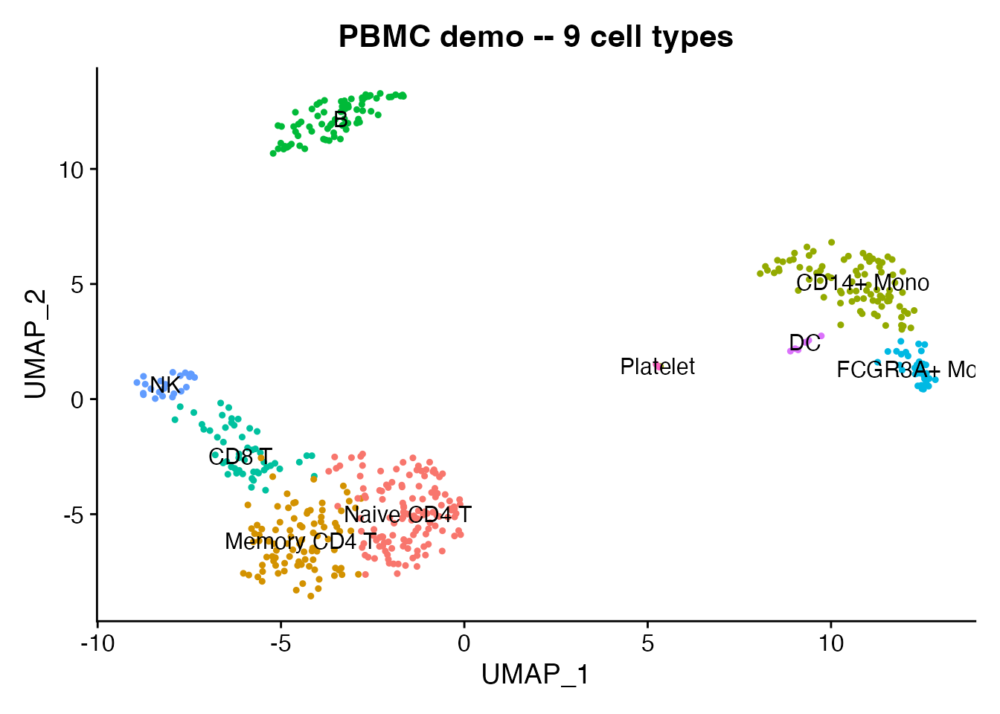

# TileDB-SOMA and CELLxGENE Census

## Introduction

[TileDB-SOMA](https://github.com/single-cell-data/TileDB-SOMA) is a
cloud-native, array-based format for single-cell data. It is the storage
backend behind [CELLxGENE
Census](https://chanzuckerberg.github.io/cellxgene-census/), which hosts
61M+ cells across 900+ datasets. SOMA supports efficient slicing by
cells or features without loading the full dataset, making it ideal for
working with large atlases.

scConvert provides
[`writeSOMA()`](https://mianaz.github.io/scConvert/reference/writeSOMA.md)
and
[`readSOMA()`](https://mianaz.github.io/scConvert/reference/readSOMA.md)
for Seurat interoperability. Both functions require the
[tiledbsoma](https://github.com/single-cell-data/TileDB-SOMA) R package.
SOMA experiments are database-like stores rather than single files, so
they cannot easily be shipped as package demo data. Instead, we start
from the shipped RDS and demonstrate the round-trip.

## Load demo data

We use a 500-cell PBMC dataset that ships with scConvert. It has 9
annotated cell types, PCA/UMAP embeddings, and neighbor graphs.

``` r

pbmc <- readRDS(system.file("extdata", "pbmc_demo.rds", package = "scConvert"))
pbmc
#> An object of class Seurat 
#> 2000 features across 500 samples within 1 assay 
#> Active assay: RNA (2000 features, 2000 variable features)
#>  2 layers present: counts, data
#>  2 dimensional reductions calculated: pca, umap
```

``` r

DimPlot(pbmc, reduction = "umap", group.by = "seurat_annotations",
        label = TRUE, pt.size = 0.8) +
  ggtitle("PBMC demo -- 9 cell types") + NoLegend()
```



## Write to SOMA

Save the Seurat object as a SOMA experiment. If tiledbsoma is not
installed, this section shows the code without running it.

``` r

soma_uri <- file.path(tempdir(), "pbmc_demo.soma")

# Ensure graphs have a valid DefaultAssay (required by tiledbsoma)
for (gn in names(pbmc@graphs)) {
  if (length(DefaultAssay(pbmc@graphs[[gn]])) == 0) {
    DefaultAssay(pbmc@graphs[[gn]]) <- DefaultAssay(pbmc)
  }
}

writeSOMA(pbmc, uri = soma_uri, overwrite = TRUE)
cat("SOMA experiment written to:", soma_uri, "\n")
```

## Read back from SOMA

``` r

pbmc_rt <- readSOMA(soma_uri)
cat("Cells:", ncol(pbmc_rt), "| Genes:", nrow(pbmc_rt), "\n")
cat("Metadata columns:", paste(colnames(pbmc_rt[[]]), collapse = ", "), "\n")
```

## Compare original and round-trip

Side-by-side UMAP plots confirm that cluster labels and coordinates
survive the SOMA round-trip.

``` r

library(patchwork)

p1 <- DimPlot(pbmc, reduction = "umap", group.by = "seurat_annotations",
              label = TRUE, pt.size = 0.8) +
  ggtitle("Original") + NoLegend()

p2 <- DimPlot(pbmc_rt, reduction = "umap", group.by = "seurat_annotations",
              label = TRUE, pt.size = 0.8) +
  ggtitle("After SOMA round-trip") + NoLegend()

p1 + p2
```

### Violin plot

LYZ is a strong monocyte marker – the violin plot below shows its
expression distribution across all 9 cell types loaded from the SOMA
store.

``` r

Idents(pbmc_rt) <- "seurat_annotations"
VlnPlot(pbmc_rt, features = "LYZ", pt.size = 0) +
  ggtitle("LYZ expression by cell type (from SOMA)") + NoLegend()
```

### Fidelity check

``` r

stopifnot(ncol(pbmc_rt) == ncol(pbmc))
stopifnot(nrow(pbmc_rt) == nrow(pbmc))
cat("Dimensions match:", ncol(pbmc_rt), "cells x", nrow(pbmc_rt), "genes\n")

shared_meta <- intersect(colnames(pbmc[[]]), colnames(pbmc_rt[[]]))
cat("Shared metadata columns:", length(shared_meta), "\n")
```

## CELLxGENE Census access

CELLxGENE Census stores the largest public atlas of single-cell data as
a single SOMA experiment. You can query it with
[`readSOMA()`](https://mianaz.github.io/scConvert/reference/readSOMA.md)
and then convert the result to any format.

``` r

library(cellxgene.census)

census <- open_soma(census_version = "stable")
human_uri <- census$get("census_data")$get("homo_sapiens")$uri

# Read a subset directly as a Seurat object
tcells <- readSOMA(
  uri = human_uri,
  measurement = "RNA",
  obs_query = "cell_type == 'T cell' & tissue_general == 'blood'"
)

# Save locally in any format
writeH5AD(tcells, "census_tcells.h5ad")
saveRDS(tcells, "census_tcells.rds")
```

## Pair converters

Direct conversion functions are available for all supported format
pairs:

``` r

# SOMA <-> h5ad
H5ADToSOMA("data.h5ad", "data.soma")
SOMAToH5AD("data.soma", "data.h5ad")

# SOMA <-> Zarr
ZarrToSOMA("data.zarr", "data.soma")
SOMAToZarr("data.soma", "data.zarr")

# Or use the universal dispatcher
scConvert("data.h5ad", dest = "data.soma", overwrite = TRUE)
```

## Session Info

``` r

sessionInfo()
#> R version 4.6.0 (2026-04-24)
#> Platform: aarch64-apple-darwin23
#> Running under: macOS Tahoe 26.3
#> 
#> Matrix products: default
#> BLAS:   /Library/Frameworks/R.framework/Versions/4.6/Resources/lib/libRblas.0.dylib 
#> LAPACK: /Library/Frameworks/R.framework/Versions/4.6/Resources/lib/libRlapack.dylib;  LAPACK version 3.12.1
#> 
#> locale:
#> [1] en_US.UTF-8/en_US.UTF-8/en_US.UTF-8/C/en_US.UTF-8/en_US.UTF-8
#> 
#> time zone: America/Indiana/Indianapolis
#> tzcode source: internal
#> 
#> attached base packages:
#> [1] stats     graphics  grDevices utils     datasets  methods   base     
#> 
#> other attached packages:
#> [1] ggplot2_4.0.3      Seurat_5.5.0       SeuratObject_5.4.0 sp_2.2-1          
#> [5] scConvert_0.2.0   
#> 
#> loaded via a namespace (and not attached):
#>   [1] RColorBrewer_1.1-3     jsonlite_2.0.0         magrittr_2.0.5        
#>   [4] spatstat.utils_3.2-2   farver_2.1.2           rmarkdown_2.31        
#>   [7] fs_2.1.0               ragg_1.5.2             vctrs_0.7.3           
#>  [10] ROCR_1.0-12            spatstat.explore_3.8-0 htmltools_0.5.9       
#>  [13] sass_0.4.10            sctransform_0.4.3      parallelly_1.47.0     
#>  [16] KernSmooth_2.23-26     bslib_0.10.0           htmlwidgets_1.6.4     
#>  [19] desc_1.4.3             ica_1.0-3              plyr_1.8.9            
#>  [22] plotly_4.12.0          zoo_1.8-15             cachem_1.1.0          
#>  [25] igraph_2.3.1           mime_0.13              lifecycle_1.0.5       
#>  [28] pkgconfig_2.0.3        Matrix_1.7-5           R6_2.6.1              
#>  [31] fastmap_1.2.0          fitdistrplus_1.2-6     future_1.70.0         
#>  [34] shiny_1.13.0           digest_0.6.39          patchwork_1.3.2       
#>  [37] tensor_1.5.1           RSpectra_0.16-2        irlba_2.3.7           
#>  [40] textshaping_1.0.5      labeling_0.4.3         progressr_0.19.0      
#>  [43] spatstat.sparse_3.1-0  httr_1.4.8             polyclip_1.10-7       
#>  [46] abind_1.4-8            compiler_4.6.0         bit64_4.8.0           
#>  [49] withr_3.0.2            S7_0.2.2               fastDummies_1.7.6     
#>  [52] MASS_7.3-65            tools_4.6.0            lmtest_0.9-40         
#>  [55] otel_0.2.0             httpuv_1.6.17          future.apply_1.20.2   
#>  [58] goftest_1.2-3          glue_1.8.1             nlme_3.1-169          
#>  [61] promises_1.5.0         grid_4.6.0             Rtsne_0.17            
#>  [64] cluster_2.1.8.2        reshape2_1.4.5         generics_0.1.4        
#>  [67] hdf5r_1.3.12           gtable_0.3.6           spatstat.data_3.1-9   
#>  [70] tidyr_1.3.2            data.table_1.18.4      spatstat.geom_3.7-3   
#>  [73] RcppAnnoy_0.0.23       ggrepel_0.9.8          RANN_2.6.2            
#>  [76] pillar_1.11.1          stringr_1.6.0          spam_2.11-3           
#>  [79] RcppHNSW_0.6.0         later_1.4.8            splines_4.6.0         
#>  [82] dplyr_1.2.1            lattice_0.22-9         survival_3.8-6        
#>  [85] bit_4.6.0              deldir_2.0-4           tidyselect_1.2.1      
#>  [88] miniUI_0.1.2           pbapply_1.7-4          knitr_1.51            
#>  [91] gridExtra_2.3          scattermore_1.2        xfun_0.57             
#>  [94] matrixStats_1.5.0      stringi_1.8.7          lazyeval_0.2.3        
#>  [97] yaml_2.3.12            evaluate_1.0.5         codetools_0.2-20      
#> [100] tibble_3.3.1           cli_3.6.6              uwot_0.2.4            
#> [103] xtable_1.8-8           reticulate_1.46.0      systemfonts_1.3.2     
#> [106] jquerylib_0.1.4        dichromat_2.0-0.1      Rcpp_1.1.1-1.1        
#> [109] globals_0.19.1         spatstat.random_3.4-5  png_0.1-9             
#> [112] spatstat.univar_3.1-7  parallel_4.6.0         pkgdown_2.2.0         
#> [115] dotCall64_1.2          listenv_0.10.1         viridisLite_0.4.3     
#> [118] scales_1.4.0           ggridges_0.5.7         purrr_1.2.2           
#> [121] crayon_1.5.3           rlang_1.2.0            cowplot_1.2.0
```
