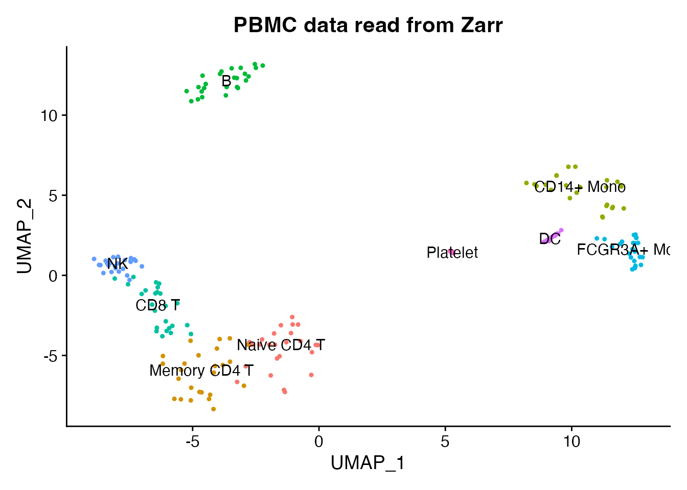
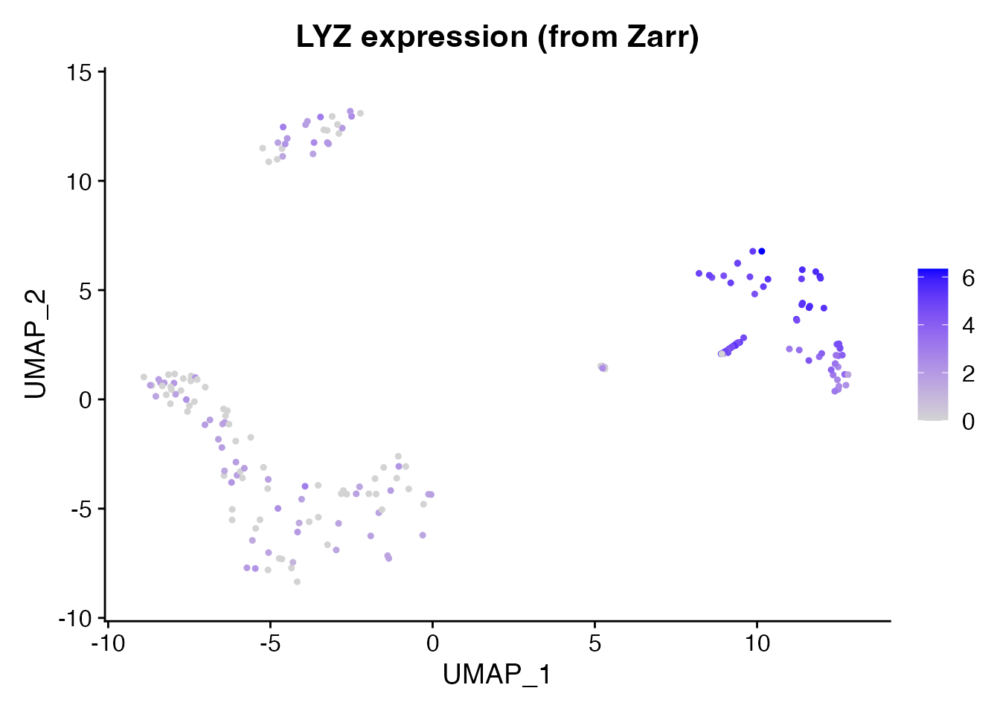

# Convert to Zarr Format

## Introduction

[Zarr](https://zarr.dev/) is a directory-based format for chunked,
compressed arrays. It is widely used in cloud-native single-cell
workflows – including [CELLxGENE
Census](https://chanzuckerberg.github.io/cellxgene-census/) and
[SpatialData](https://spatialdata.scverse.org/) – because each chunk is
an independent file that can be read in parallel from object stores like
S3 or GCS. scConvert reads and writes Zarr v2 stores following the
AnnData on-disk specification, with no Python dependency.

## Read a Zarr store

We start with the shipped PBMC h5ad demo and convert it to Zarr so we
can demonstrate the Zarr read/write workflow. This dataset has 230
cells, 220 genes, PCA/UMAP embeddings, neighbor graphs, and 9 annotated
cell types.

``` r

h5ad_path <- system.file("testdata", "pbmc_small.h5ad", package = "scConvert")
zarr_path <- file.path(tempdir(), "pbmc_demo.zarr")
scConvert(h5ad_path, zarr_path, overwrite = TRUE, verbose = FALSE)
```

``` r

pbmc <- readZarr(zarr_path, verbose = FALSE)
pbmc
#> An object of class Seurat 
#> 2000 features across 214 samples within 1 assay 
#> Active assay: RNA (2000 features, 2000 variable features)
#>  2 layers present: counts, data
#>  2 dimensional reductions calculated: pca, umap
```

``` r

DimPlot(pbmc, reduction = "umap", group.by = "seurat_annotations",
        label = TRUE, pt.size = 0.8) +
  ggtitle("PBMC data read from Zarr") + NoLegend()
```



LYZ is a strong monocyte marker. We can verify that expression values
were loaded correctly from the Zarr store.

``` r

FeaturePlot(pbmc, features = "LYZ", pt.size = 0.8) +
  ggtitle("LYZ expression (from Zarr)")
```



## Write to Zarr and read back

Now we write the Seurat object to a new Zarr store and read it back to
verify round-trip fidelity.

``` r

rt_path <- file.path(tempdir(), "pbmc_roundtrip.zarr")
writeZarr(pbmc, rt_path, overwrite = TRUE, verbose = FALSE)
pbmc_rt <- readZarr(rt_path, verbose = FALSE)
cat("Cells:", ncol(pbmc_rt), "| Genes:", nrow(pbmc_rt), "\n")
#> Cells: 214 | Genes: 2000
cat("Reductions:", paste(names(pbmc_rt@reductions), collapse = ", "), "\n")
#> Reductions: pca, umap
```

### Verify the round-trip

``` r

cat("Barcodes match:", identical(sort(Cells(pbmc)), sort(Cells(pbmc_rt))), "\n")
#> Barcodes match: TRUE
cat("Features match:", identical(sort(rownames(pbmc)), sort(rownames(pbmc_rt))), "\n")
#> Features match: TRUE
cat("Dimensions match:", identical(dim(pbmc), dim(pbmc_rt)), "\n")
#> Dimensions match: TRUE
```

## Streaming converters

For converting between file formats without loading data into R,
scConvert provides streaming converters that copy fields directly
between backends:

``` r

# h5ad <-> Zarr (no Seurat intermediate)
H5ADToZarr("data.h5ad", "data.zarr")
ZarrToH5AD("data.zarr", "data.h5ad")

# h5Seurat <-> Zarr
H5SeuratToZarr("data.h5seurat", "data.zarr")
ZarrToH5Seurat("data.zarr", "data.h5seurat")

# Or use the universal dispatcher
scConvert("data.h5ad", dest = "data.zarr", overwrite = TRUE)
```

These are particularly useful for large datasets where materializing the
full Seurat object would be expensive.

## Python interoperability

Zarr stores produced by
[`writeZarr()`](https://mianaz.github.io/scConvert/reference/writeZarr.md)
are directly readable by Python’s `anndata.read_zarr()` and scanpy.
Requires Python with anndata installed.

``` python
import anndata as ad
import scanpy as sc

adata = ad.read_zarr("pbmc.zarr")
print(adata)
sc.pl.umap(adata, color="seurat_annotations")
```

## Session Info

``` r

sessionInfo()
#> R version 4.6.0 (2026-04-24)
#> Platform: aarch64-apple-darwin23
#> Running under: macOS Tahoe 26.3
#> 
#> Matrix products: default
#> BLAS:   /Library/Frameworks/R.framework/Versions/4.6/Resources/lib/libRblas.0.dylib 
#> LAPACK: /Library/Frameworks/R.framework/Versions/4.6/Resources/lib/libRlapack.dylib;  LAPACK version 3.12.1
#> 
#> locale:
#> [1] en_US.UTF-8/en_US.UTF-8/en_US.UTF-8/C/en_US.UTF-8/en_US.UTF-8
#> 
#> time zone: America/Indiana/Indianapolis
#> tzcode source: internal
#> 
#> attached base packages:
#> [1] stats     graphics  grDevices utils     datasets  methods   base     
#> 
#> other attached packages:
#> [1] ggplot2_4.0.3      Seurat_5.5.0       SeuratObject_5.4.0 sp_2.2-1          
#> [5] scConvert_0.2.0   
#> 
#> loaded via a namespace (and not attached):
#>   [1] RColorBrewer_1.1-3     jsonlite_2.0.0         magrittr_2.0.5        
#>   [4] spatstat.utils_3.2-2   farver_2.1.2           rmarkdown_2.31        
#>   [7] fs_2.1.0               ragg_1.5.2             vctrs_0.7.3           
#>  [10] ROCR_1.0-12            spatstat.explore_3.8-0 htmltools_0.5.9       
#>  [13] sass_0.4.10            sctransform_0.4.3      parallelly_1.47.0     
#>  [16] KernSmooth_2.23-26     bslib_0.10.0           htmlwidgets_1.6.4     
#>  [19] desc_1.4.3             ica_1.0-3              plyr_1.8.9            
#>  [22] plotly_4.12.0          zoo_1.8-15             cachem_1.1.0          
#>  [25] igraph_2.3.1           mime_0.13              lifecycle_1.0.5       
#>  [28] pkgconfig_2.0.3        Matrix_1.7-5           R6_2.6.1              
#>  [31] fastmap_1.2.0          fitdistrplus_1.2-6     future_1.70.0         
#>  [34] shiny_1.13.0           digest_0.6.39          patchwork_1.3.2       
#>  [37] tensor_1.5.1           RSpectra_0.16-2        irlba_2.3.7           
#>  [40] textshaping_1.0.5      labeling_0.4.3         progressr_0.19.0      
#>  [43] spatstat.sparse_3.1-0  httr_1.4.8             polyclip_1.10-7       
#>  [46] abind_1.4-8            compiler_4.6.0         bit64_4.8.0           
#>  [49] withr_3.0.2            S7_0.2.2               fastDummies_1.7.6     
#>  [52] MASS_7.3-65            tools_4.6.0            lmtest_0.9-40         
#>  [55] otel_0.2.0             httpuv_1.6.17          future.apply_1.20.2   
#>  [58] goftest_1.2-3          glue_1.8.1             nlme_3.1-169          
#>  [61] promises_1.5.0         grid_4.6.0             Rtsne_0.17            
#>  [64] cluster_2.1.8.2        reshape2_1.4.5         generics_0.1.4        
#>  [67] hdf5r_1.3.12           gtable_0.3.6           spatstat.data_3.1-9   
#>  [70] tidyr_1.3.2            data.table_1.18.4      spatstat.geom_3.7-3   
#>  [73] RcppAnnoy_0.0.23       ggrepel_0.9.8          RANN_2.6.2            
#>  [76] pillar_1.11.1          stringr_1.6.0          spam_2.11-3           
#>  [79] RcppHNSW_0.6.0         later_1.4.8            splines_4.6.0         
#>  [82] dplyr_1.2.1            lattice_0.22-9         survival_3.8-6        
#>  [85] bit_4.6.0              deldir_2.0-4           tidyselect_1.2.1      
#>  [88] miniUI_0.1.2           pbapply_1.7-4          knitr_1.51            
#>  [91] gridExtra_2.3          scattermore_1.2        xfun_0.57             
#>  [94] matrixStats_1.5.0      stringi_1.8.7          lazyeval_0.2.3        
#>  [97] yaml_2.3.12            evaluate_1.0.5         codetools_0.2-20      
#> [100] tibble_3.3.1           cli_3.6.6              uwot_0.2.4            
#> [103] xtable_1.8-8           reticulate_1.46.0      systemfonts_1.3.2     
#> [106] jquerylib_0.1.4        dichromat_2.0-0.1      Rcpp_1.1.1-1.1        
#> [109] globals_0.19.1         spatstat.random_3.4-5  png_0.1-9             
#> [112] spatstat.univar_3.1-7  parallel_4.6.0         pkgdown_2.2.0         
#> [115] dotCall64_1.2          listenv_0.10.1         viridisLite_0.4.3     
#> [118] scales_1.4.0           ggridges_0.5.7         purrr_1.2.2           
#> [121] crayon_1.5.3           rlang_1.2.0            cowplot_1.2.0
```
