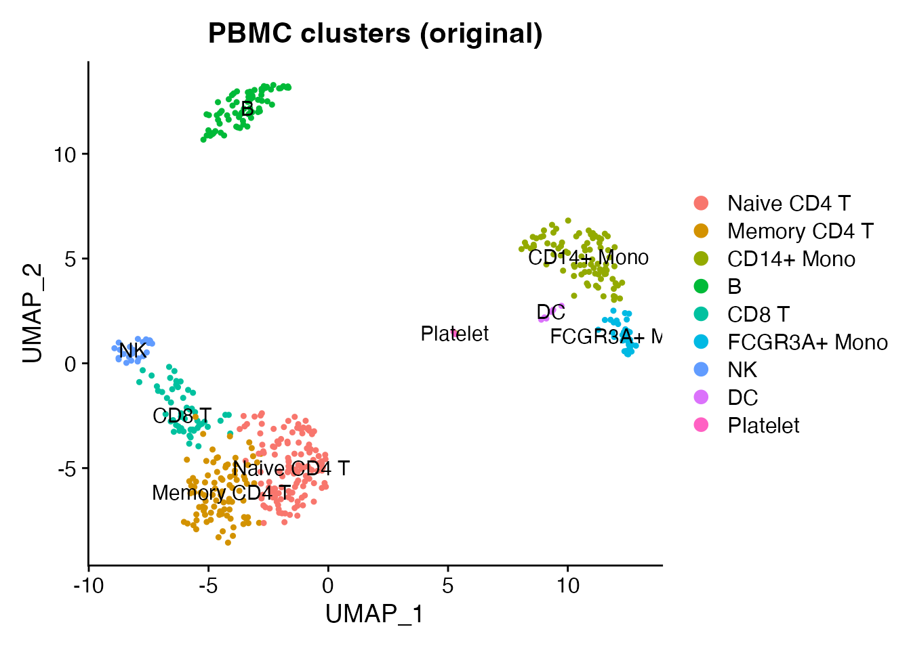
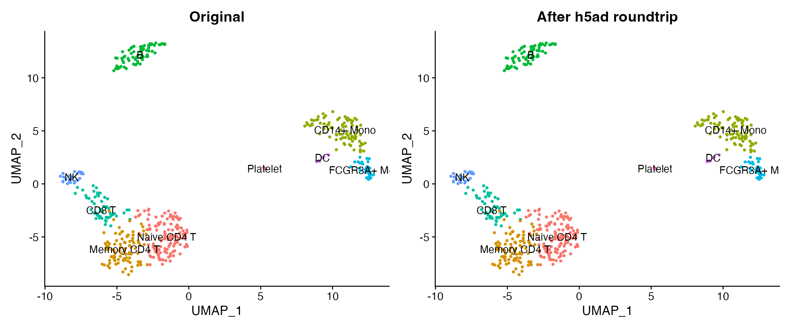

# scATAC-seq Data Conversion

## Introduction

Single-cell ATAC-seq measures chromatin accessibility at single-cell
resolution. The core data structure is a **peak-by-cell count matrix** –
structurally identical to a gene-by-cell RNA matrix. scConvert converts
this matrix along with cell metadata, embeddings, and cluster labels
between formats, enabling interoperability between R (Seurat/Signac) and
Python (scanpy/episcanpy) workflows.

This vignette demonstrates the h5ad roundtrip using the shipped PBMC
demo data as a stand-in. The matrix structure and conversion mechanics
are the same regardless of whether rows represent genes or peaks.

## Load demo data

``` r

obj <- readRDS(system.file("extdata", "pbmc_demo.rds", package = "scConvert"))

cat("Cells:", ncol(obj), "\n")
#> Cells: 500
cat("Features:", nrow(obj), "\n")
#> Features: 2000
cat("Reductions:", paste(names(obj@reductions), collapse = ", "), "\n")
#> Reductions: pca, umap
cat("Metadata columns:", paste(colnames(obj[[]]), collapse = ", "), "\n")
#> Metadata columns: orig.ident, nCount_RNA, nFeature_RNA, seurat_annotations, percent.mt, RNA_snn_res.0.5, seurat_clusters
```

``` r

DimPlot(obj, group.by = "seurat_annotations", label = TRUE, pt.size = 0.8) +
  ggtitle("PBMC clusters (original)")
```



## Roundtrip through h5ad

Write the Seurat object to h5ad and read it back.

``` r

h5ad_path <- file.path(tempdir(), "pbmc_atac_demo.h5ad")

writeH5AD(obj, h5ad_path, overwrite = TRUE)
cat("Wrote:", basename(h5ad_path), "\n")
#> Wrote: pbmc_atac_demo.h5ad
cat("File size:", round(file.size(h5ad_path) / 1024^2, 1), "MB\n")
#> File size: 0.9 MB

loaded <- readH5AD(h5ad_path)
cat("Loaded:", ncol(loaded), "cells x", nrow(loaded), "features\n")
#> Loaded: 500 cells x 2000 features
```

## Verify preservation

### Dimensions and barcodes

``` r

cat("Cells match:", ncol(obj) == ncol(loaded), "\n")
#> Cells match: TRUE
cat("Features match:", nrow(obj) == nrow(loaded), "\n")
#> Features match: TRUE

orig_cells <- sort(colnames(obj))
rt_cells <- sort(colnames(loaded))
cat("Barcodes identical:", identical(orig_cells, rt_cells), "\n")
#> Barcodes identical: TRUE

orig_features <- sort(rownames(obj))
rt_features <- sort(rownames(loaded))
cat("Feature names identical:", identical(orig_features, rt_features), "\n")
#> Feature names identical: TRUE
```

### Count matrix

``` r

common_cells <- intersect(colnames(obj), colnames(loaded))
common_feats <- intersect(rownames(obj), rownames(loaded))

orig_vals <- as.numeric(GetAssayData(obj, layer = "counts")[
  head(common_feats, 200), head(common_cells, 200)])
rt_vals <- as.numeric(GetAssayData(loaded, layer = "counts")[
  head(common_feats, 200), head(common_cells, 200)])
cat("Count values identical:", identical(orig_vals, rt_vals), "\n")
#> Count values identical: TRUE
```

### Metadata

``` r

shared_cols <- intersect(colnames(obj[[]]), colnames(loaded[[]]))
cat("Metadata columns preserved:", length(shared_cols), "/", ncol(obj[[]]), "\n")
#> Metadata columns preserved: 7 / 7
cat("Columns:", paste(shared_cols, collapse = ", "), "\n")
#> Columns: orig.ident, nCount_RNA, nFeature_RNA, seurat_annotations, percent.mt, RNA_snn_res.0.5, seurat_clusters

if ("seurat_annotations" %in% shared_cols) {
  orig_ann <- as.character(obj$seurat_annotations[common_cells])
  rt_ann <- as.character(loaded$seurat_annotations[common_cells])
  cat("Cell annotations match:", identical(orig_ann, rt_ann), "\n")
}
#> Cell annotations match: TRUE
```

### Embeddings

``` r

cat("Original reductions:", paste(names(obj@reductions), collapse = ", "), "\n")
#> Original reductions: pca, umap
cat("Loaded reductions:", paste(names(loaded@reductions), collapse = ", "), "\n")
#> Loaded reductions: pca, umap

if ("umap" %in% names(loaded@reductions)) {
  orig_umap <- Embeddings(obj, "umap")[common_cells, ]
  rt_umap <- Embeddings(loaded, "umap")[common_cells, ]
  max_diff <- max(abs(orig_umap - rt_umap))
  cat("UMAP max absolute difference:", max_diff, "\n")
}
#> UMAP max absolute difference: 0
```

## Compare plots

``` r

library(patchwork)

p1 <- DimPlot(obj, group.by = "seurat_annotations", label = TRUE, pt.size = 0.8) +
  ggtitle("Original") + NoLegend()
p2 <- DimPlot(loaded, group.by = "seurat_annotations", label = TRUE, pt.size = 0.8) +
  ggtitle("After h5ad roundtrip") + NoLegend()
p1 + p2
```



## What is preserved vs. what needs separate handling

For real scATAC-seq data, scConvert preserves the core data but some
Signac-specific components require separate handling:

### Preserved by scConvert

| Component          | Seurat/Signac               | h5ad                     |
|--------------------|-----------------------------|--------------------------|
| Peak count matrix  | `counts` layer              | `X`                      |
| Cell metadata      | `meta.data`                 | `obs`                    |
| Peak metadata      | `meta.features`             | `var`                    |
| LSI/PCA embeddings | `reductions`                | `obsm`                   |
| UMAP coordinates   | `reductions$umap`           | `obsm['X_umap']`         |
| Cluster labels     | `meta.data$seurat_clusters` | `obs['seurat_clusters']` |

### Needs separate handling

| Component | Why | Workaround |
|----|----|----|
| Fragment files | Large tabix files, not part of h5ad | Copy `fragments.tsv.gz` + `.tbi` separately |
| Gene annotations | GRanges object (R-specific) | Reload from EnsDb after import |
| Motif matrices | Signac-specific slot | Recompute with [`AddMotifs()`](https://stuartlab.org/signac/reference/AddMotifs.html) |
| ChromatinAssay class | R S4 class, not in h5ad | Upgrade with [`CreateChromatinAssay()`](https://stuartlab.org/signac/reference/CreateChromatinAssay.html) |

## Upgrading to ChromatinAssay (if Signac is available)

After loading an h5ad file containing peak data, you can upgrade the
standard Seurat assay to a Signac `ChromatinAssay` for peak-aware
analyses.

``` r

library(Signac)

# Load h5ad containing peak-by-cell matrix
atac <- readH5AD("peaks.h5ad")

# Upgrade to ChromatinAssay
peak_counts <- GetAssayData(atac, layer = "counts")
atac[["peaks"]] <- CreateChromatinAssay(
  counts = peak_counts,
  sep = c("-", "-"),
  min.cells = 0,
  min.features = 0
)

# Re-attach annotations if needed
# library(EnsDb.Hsapiens.v86)
# Annotation(atac) <- GetGRangesFromEnsDb(ensdb = EnsDb.Hsapiens.v86)
# Fragments(atac) <- CreateFragmentObject("fragments.tsv.gz")
```

## Python interoperability

The exported h5ad is directly readable by scanpy or episcanpy.

``` python
# Requires Python: pip install scanpy
import scanpy as sc

adata = sc.read_h5ad("peaks.h5ad")
print(adata)
print(f"Peak names: {list(adata.var_names[:5])}")

# Standard scanpy pipeline works on peak matrices
sc.pp.normalize_total(adata)
sc.pp.log1p(adata)
sc.pp.pca(adata)
sc.pp.neighbors(adata)
sc.tl.umap(adata)
sc.pl.umap(adata, color="seurat_clusters")
```

## Clean up

``` r

unlink(h5ad_path)
```

## Session Info

``` r

sessionInfo()
#> R version 4.6.0 (2026-04-24)
#> Platform: aarch64-apple-darwin23
#> Running under: macOS Tahoe 26.3
#> 
#> Matrix products: default
#> BLAS:   /Library/Frameworks/R.framework/Versions/4.6/Resources/lib/libRblas.0.dylib 
#> LAPACK: /Library/Frameworks/R.framework/Versions/4.6/Resources/lib/libRlapack.dylib;  LAPACK version 3.12.1
#> 
#> locale:
#> [1] en_US.UTF-8/en_US.UTF-8/en_US.UTF-8/C/en_US.UTF-8/en_US.UTF-8
#> 
#> time zone: America/Indiana/Indianapolis
#> tzcode source: internal
#> 
#> attached base packages:
#> [1] stats     graphics  grDevices utils     datasets  methods   base     
#> 
#> other attached packages:
#> [1] patchwork_1.3.2    ggplot2_4.0.3      Seurat_5.5.0       SeuratObject_5.4.0
#> [5] sp_2.2-1           scConvert_0.2.0   
#> 
#> loaded via a namespace (and not attached):
#>   [1] RColorBrewer_1.1-3     jsonlite_2.0.0         magrittr_2.0.5        
#>   [4] spatstat.utils_3.2-2   farver_2.1.2           rmarkdown_2.31        
#>   [7] fs_2.1.0               ragg_1.5.2             vctrs_0.7.3           
#>  [10] ROCR_1.0-12            spatstat.explore_3.8-0 htmltools_0.5.9       
#>  [13] sass_0.4.10            sctransform_0.4.3      parallelly_1.47.0     
#>  [16] KernSmooth_2.23-26     bslib_0.10.0           htmlwidgets_1.6.4     
#>  [19] desc_1.4.3             ica_1.0-3              plyr_1.8.9            
#>  [22] plotly_4.12.0          zoo_1.8-15             cachem_1.1.0          
#>  [25] igraph_2.3.1           mime_0.13              lifecycle_1.0.5       
#>  [28] pkgconfig_2.0.3        Matrix_1.7-5           R6_2.6.1              
#>  [31] fastmap_1.2.0          fitdistrplus_1.2-6     future_1.70.0         
#>  [34] shiny_1.13.0           digest_0.6.39          tensor_1.5.1          
#>  [37] RSpectra_0.16-2        irlba_2.3.7            textshaping_1.0.5     
#>  [40] labeling_0.4.3         progressr_0.19.0       spatstat.sparse_3.1-0 
#>  [43] httr_1.4.8             polyclip_1.10-7        abind_1.4-8           
#>  [46] compiler_4.6.0         bit64_4.8.0            withr_3.0.2           
#>  [49] S7_0.2.2               fastDummies_1.7.6      MASS_7.3-65           
#>  [52] tools_4.6.0            lmtest_0.9-40          otel_0.2.0            
#>  [55] httpuv_1.6.17          future.apply_1.20.2    goftest_1.2-3         
#>  [58] glue_1.8.1             nlme_3.1-169           promises_1.5.0        
#>  [61] grid_4.6.0             Rtsne_0.17             cluster_2.1.8.2       
#>  [64] reshape2_1.4.5         generics_0.1.4         hdf5r_1.3.12          
#>  [67] gtable_0.3.6           spatstat.data_3.1-9    tidyr_1.3.2           
#>  [70] data.table_1.18.4      spatstat.geom_3.7-3    RcppAnnoy_0.0.23      
#>  [73] ggrepel_0.9.8          RANN_2.6.2             pillar_1.11.1         
#>  [76] stringr_1.6.0          spam_2.11-3            RcppHNSW_0.6.0        
#>  [79] later_1.4.8            splines_4.6.0          dplyr_1.2.1           
#>  [82] lattice_0.22-9         survival_3.8-6         bit_4.6.0             
#>  [85] deldir_2.0-4           tidyselect_1.2.1       miniUI_0.1.2          
#>  [88] pbapply_1.7-4          knitr_1.51             gridExtra_2.3         
#>  [91] scattermore_1.2        xfun_0.57              matrixStats_1.5.0     
#>  [94] stringi_1.8.7          lazyeval_0.2.3         yaml_2.3.12           
#>  [97] evaluate_1.0.5         codetools_0.2-20       tibble_3.3.1          
#> [100] cli_3.6.6              uwot_0.2.4             xtable_1.8-8          
#> [103] reticulate_1.46.0      systemfonts_1.3.2      jquerylib_0.1.4       
#> [106] dichromat_2.0-0.1      Rcpp_1.1.1-1.1         globals_0.19.1        
#> [109] spatstat.random_3.4-5  png_0.1-9              spatstat.univar_3.1-7 
#> [112] parallel_4.6.0         pkgdown_2.2.0          dotCall64_1.2         
#> [115] listenv_0.10.1         viridisLite_0.4.3      scales_1.4.0          
#> [118] ggridges_0.5.7         purrr_1.2.2            crayon_1.5.3          
#> [121] rlang_1.2.0            cowplot_1.2.0
```
