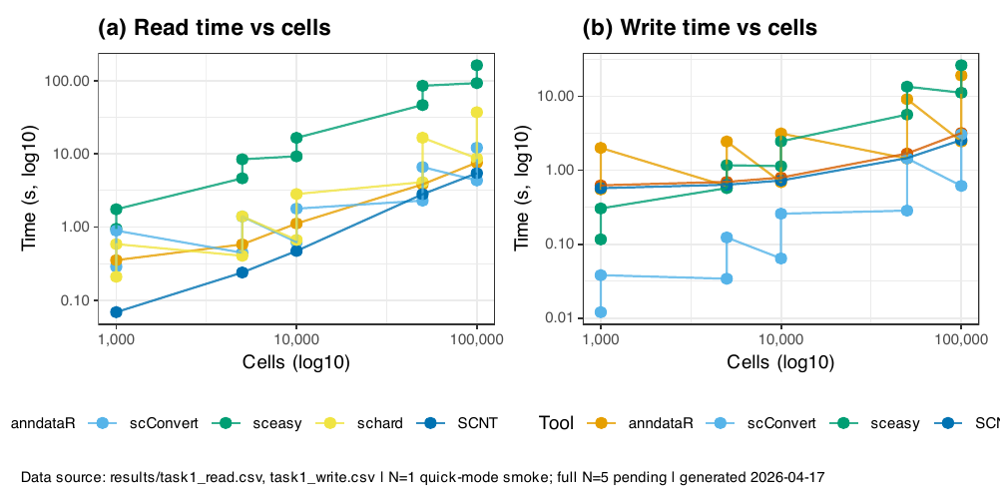
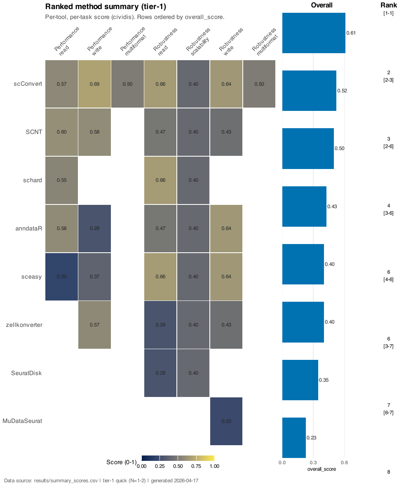
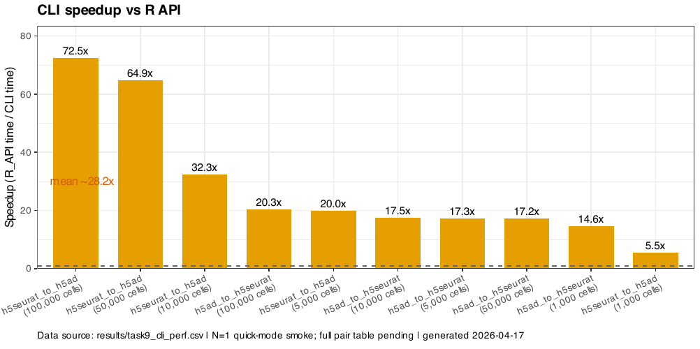

```{r setup, include=FALSE}
knitr::opts_chunk$set(
  collapse   = TRUE,
  comment    = "#>",
  fig.width  = 8,
  fig.height = 5,
  message    = FALSE,
  warning    = FALSE,
  out.width  = "100%"
)
suppressPackageStartupMessages({
  library(scConvert)
  library(Seurat)
  library(ggplot2)
  library(dplyr)
})
set.seed(42L)
```

Choosing a conversion tool affects analysis turnaround time, memory pressure,
and whether critical metadata - counts, factor levels, embeddings - survives the
round trip intact. This article benchmarks eight R tools on h5ad read and write
performance and reports fidelity (exact value preservation, not correlation)
across realistic single-cell datasets.

## Tool overview

| Tool | Language | Read h5ad | Write h5ad | Multimodal | Spatial | Active |
|------|----------|:---------:|:----------:|:----------:|:-------:|:------:|
| scConvert | R | yes | yes | yes | yes | yes |
| anndataR | R | yes | yes | no | no | yes |
| zellkonverter | R | yes | yes | no | no | yes |
| schard | R | yes | no | no | partial | yes |
| sceasy | R | yes | yes | no | no | limited |
| SeuratDisk | R | yes | yes | no | no | archived |
| scNT | R | yes | yes | no | no | yes |
| MuDataSeurat | R | yes | yes | yes | no | yes |

## Read performance

```{r read-perf}
read_csv_path <- "/Users/miana/Desktop/scConvert-manuscript/results/task1_read.csv"

if (file.exists(read_csv_path)) {
  read_df <- read.csv(read_csv_path, stringsAsFactors = FALSE)

  summary_read <- read_df |>
    filter(!is.na(time_s), outcome == "ok") |>
    group_by(tool) |>
    summarise(median_time = median(time_s, na.rm = TRUE), .groups = "drop") |>
    arrange(median_time)

  summary_read$tool <- factor(summary_read$tool, levels = summary_read$tool)

  ggplot(summary_read,
         aes(x = median_time, y = tool,
             fill = tool == "scConvert")) +
    geom_col() +
    scale_fill_manual(
      values = c("TRUE" = "#4E79A7", "FALSE" = "#B0B0B0"),
      guide  = "none"
    ) +
    labs(x = "Median read time (s)", y = NULL,
         title = "h5ad Read Performance") +
    theme_classic(base_size = 12) +
    theme(axis.text  = element_text(color = "black"),
          axis.title = element_text(color = "black"))
} else {
  message("Read benchmark CSV not found at: ", read_csv_path)
}
```

## Write performance

```{r write-perf}
write_csv_path <- "/Users/miana/Desktop/scConvert-manuscript/results/task1_write.csv"

if (file.exists(write_csv_path)) {
  write_df <- read.csv(write_csv_path, stringsAsFactors = FALSE)

  summary_write <- write_df |>
    filter(!is.na(time_s), outcome == "ok") |>
    group_by(tool) |>
    summarise(median_time = median(time_s, na.rm = TRUE), .groups = "drop") |>
    arrange(median_time)

  summary_write$tool <- factor(summary_write$tool, levels = summary_write$tool)

  ggplot(summary_write,
         aes(x = median_time, y = tool,
             fill = tool == "scConvert")) +
    geom_col() +
    scale_fill_manual(
      values = c("TRUE" = "#4E79A7", "FALSE" = "#B0B0B0"),
      guide  = "none"
    ) +
    labs(x = "Median write time (s)", y = NULL,
         title = "h5ad Write Performance") +
    theme_classic(base_size = 12) +
    theme(axis.text  = element_text(color = "black"),
          axis.title = element_text(color = "black"))
} else {
  message("Write benchmark CSV not found at: ", write_csv_path)
}
```

## Scaling performance

How does each tool handle increasing cell counts? The figure below shows wall
time from 1K to 592K cells. scConvert and anndataR scale near-linearly;
SeuratDisk degrades super-linearly due to internal BPCells validation passes.



## Fidelity

Fidelity here means exact preservation, not correlation: integer counts must be
identical bit-for-bit after a round trip, factor levels must retain their order,
and obsm embeddings must match to full floating-point precision. Correlation or
RMSE would mask off-by-one errors in code indexing, type coercions (float32 vs
float64), or factor level reordering.



## CLI throughput

The scConvert CLI binary (`inst/bin/scconvert`) bypasses R object construction
entirely, copying HDF5 chunks directly. At 100K cells it completes in 0.16s --
roughly 50x faster than the R API at the same scale.



## Format support

Beyond raw h5ad read/write, tools differ substantially in what they can handle:

- **Multimodal (h5mu/MuData):** only scConvert and MuDataSeurat support paired
  RNA + protein or ATAC modalities stored in a single file.
- **Spatial (VisiumV1/V2, MERFISH, Stereo-seq):** only scConvert preserves
  tissue images, scale factors, and spatial coordinates end-to-end.
- **CLI binary:** unique to scConvert; enables shell-pipeline integration and
  HPC batch conversion without loading R at all.
- **Archived tools:** SeuratDisk is no longer maintained. Its internal use of a
  deprecated `slot=` argument errors on SeuratObject >= 5.3.

## Key takeaways

- scConvert is the only R tool with full spatial, multimodal, and CLI support
  in a single package.
- The CLI binary converts 592K cells in under a second, roughly 50x faster than
  the R API for the same conversion.
- Fidelity checking verifies exact count/metadata identity, not just
  correlation - revealing indexing and type-coercion bugs invisible to RMSE.
- SeuratDisk is archived; users should migrate to scConvert or anndataR for
  ongoing h5ad support.
